## Canvas基础

早期，为了达到页面绚丽多彩的效果，往往需要借助于图片，这些都是以低性能为代价的。由于图片体积过大、下载速度慢等原因，难以应对日渐复杂的Web应用开发，于是W3C在HTML5标准中引入了Canvas。

H5中新增了Canvas元素，又称画布，用来结合JavaScript来绘制各种图形。

### 作用

* 绘制图形：canvas可以用来绘制基本的图形，例如矩形，曲线，圆等
* 绘制图表：业务数据展示离不开图表，canvas可以用来绘制满足各种需求的图表
* 动画效果：canvas也可以制作出各种华丽的动画效果
* 游戏开发：很多H5游戏都是由Canvas开发的

### 与SVG的区别

H5中有两个主要的2D图形技术：canvas和svg，但是事实上，两者是完全不同的技术，主要区别如下：

* Canvas是使用JavaScript动态生成的，而SVG是通过XML文档静态描述的
* Canvas是基于位图的，适用于像素处理和动态渲染，图形放大会影响质量。而SVG是基于矢量的，不适用于像素处理和静态描述，图形放大不会影响质量。简单来说，Canvas画出来的图是一个位图，而SVG画出来的是一个矢量图
* 每次发生修改，Canvas需要重绘，而SVG不需要重绘

此外，并非Canvas比SVG更有前途，也并非SVG比Canvas更有前途，因为两者适用于不同的场合。在实际开发过程中，我们要灵活适用。

### 调试

在基于webkit的浏览器中，可以通过点击性能分析窗口下方的实心圆圈按钮来启动性能分析。但是以点击按钮的方式来启动性能分析，有时是不够的。例如：如果希望在执行到某几行特定的代码时开始分析，在执行完它们之后停止性能分析。在基于webkit的浏览器中，可以调用`console.profile()`和`console.profileEnd()`方法。

```js
console.profile()
// 绘图逻辑
console.profileEnd()
```

### 性能

多数情况下，蚕蛹canvas实现的应用程序都会有极好的性能。不过如果你是在制作漫画、游戏或是实现基于canvas的手机应用程序，可能需要做一些性能优化。

调试canvas应用的性能往往需要用到如下三个工具：

* 性能分析器（Profiler）
* 时间轴工具（Timeline）
* jsPerf

其中前两个是webkit浏览器自带，具体作用如下：

* 时间轴工作可以将应用程序中发生的重要事件记录下来，同时也一并记录了这些事件中的细节，包括事件的持续时间，以及其所影响的窗口区域等。在基于webkit的浏览器（Safari和Chrome等）中，可以将鼠标悬停在这些事件之上，来获取与之相关的细节信息
* 性能分析器，可以更为详尽地观察程序在函数级别的性能表现。可以显示每个函数被调用的次数，以及这些函数调用所花费的时间。当然你也可以看到每个函数的执行时间再总执行时间中所占的百分比，而且可以精确的看到每个函数被执行一次平均要花费多少毫秒

而jsPerf是一个网站，可以让你创建和分享JavaScript性能测试。

### 绘图的基本步骤

使用canvas来绘制图形，往往需要以下三步：

* 获取canvas对象
* 获取上下文环境对象context
* 开始绘制图形

首先获取canvas对象（DOM对象），然后通过这个DOM对象的`getContext("2d")`获取上下文环境，最后通过这个上下文环境来绘制各种图形。

> 如果浏览器不支持canvas特性，往往需要在canvas标签之间加入后备内容（fallback content），用于提示浏览器的支持情况。
>
> ```html
> <canvas>当前浏览器不支持canvas</canvas>
> ```

### canvas元素

canvas是一个行内块（inline-block）元素，我们一般需要指定其三个属性：id，width，height。其中，width和height分别定义Canvas的宽高。默认情况下，canvas的宽高默认分别是300px，150px。

对于Canvas宽高的定义，既可以在HTML属性中定义，也可以在CSS样式中定义。但是在实际开发过程中，都不会使用CSS来定义，而是应该在HTML元素上定义。

这是因为如果使用css来定义宽高，通过DOM元素来获取canvas元素的宽高不是设置值，而是默认值`300*150`。

```js
let canvas = document.getElementById("canvas")

canvas.width			//300
canvas.height			//150
```

所以，你应该在HTML中定义宽高。

> 使用CSS来设置canvas元素的大小，与直接设置属性相比，其差别是：canvas元素实际上有两套尺寸，一个是元素本身的大小，还有一个是元素绘图表面（drawing surface）的大小。
>
> 当设置元素的width和height属性时，实际上是同时修改了该元素本身的大小与元素绘图表面的大小。然而，如果是通过CSS来设定canvas元素的大小，那么只会改变元素本身的大小，而不会影响到绘图表面。在默认情况下，canvas元素与其绘图表面，都是`300*150`。
>
> 例如你通过CSS来将canvas元素的大小设置成`600*300`，然后绘图表面的大小依然没有改变，还是默认的`300*150`。此时，当canvas元素的大小不符合其绘图表面的大小时，浏览器就会对绘图表面进行缩放，使其符合元素的大小。
>
> 另外，如果使用CSS来修改元素的大小，同时又没有指定canvas元素的width和height属性，那么当元素大小与canvas的绘图表面大小不相符时，浏览器可能会自动缩放后者，使之符合前者的大小，这样的话，很可能会导致奇怪的、无用的效果。

### canvas对象

通过JavaScript获取的canvas对象上有如下属性和方法：

* width：Canvas的宽度
* height：canvas的高度
* getContext()：获取canvas 2d上下文环境对象
* toDataURL()：获取canvas对象产生的位图的字符串，可以直接设置为img元素的src属性值。第一个参数指定了图形的类型，默认为`image/png`。第二个参数是0~1.0之间的小数，表示JPEG图像的显示质量
* toBlob()：创建一个用于表示此canvas元素图像文件的Blob。第一个参数是一个回调函数，浏览器会以一个指向blob的引用为参数，去调用该回调函数。第二个参数以`image/png`这样的形式来指定图像类型。如果不指定，则默认使用`image/png`。最后一个参数是介于0.0~1.0之间的值，表示JPEG图像的质量。将来很可能会加入其它一些用于精确调控图像属性的参数

其中width和height属性是可读写的，也就是说，你既可以获取canvas的宽度，也可以通过JavaScript去控制canvas的宽高。

> H5 Canvas暂时只支持2D绘图API，3D绘图可以使用HTML5中webgl进行开发。它完全符合OpenGL ES2.0的API。
>
> OpenGL ES（OpenGL for Embedded Systems）是OpenGL三维图形API的子集，针对手机、PDA和游戏主机等嵌入式设备而设计。该API由Khronos集团定义推广，Khronos是一个图形软硬件行业协会，主要关注图形和多媒体方面的开放标准。
>
> 目前只有IE9及其以上版本支持canvas，如果你要兼容IE7,8，需要借助explorecanvas这个库来解决。注意：低版本浏览器及时引入excanvas.js这个库来使用canvas，在功能上也会有很多限制，例如fillText()方法不可用等。

### canvas坐标系

在使用canvas绘制图形之前，你需要先了解canvas坐标系。

实际生活中，常见的坐标系是数学坐标系，而canvas使用的坐标系是W3C坐标系，这两种坐标系唯一的区别在于Y轴正方向的不同：

* 数学坐标系中，Y轴正方向向上
* Canvas坐标系中，Y轴正方向向下

> 数学坐标系一般用于数学形式上的应用，而在前端开发中几乎所有涉及坐标系的技术都是使用W3C坐标系，这些技术有CSS3，Canvas，SVg等。

### 绘制直线

通过moveTo()和lineTo()方法来绘制直线，可以是一条，也可以是多条。

```js
ctx.moveTo(x,y)
ctx.lineTo(x1,y1)
ctx.stroke()
```

其中ctx表示上下文环境。

详细步骤解释如下：

* (x,y)表示直线起点的坐标，moveTo的含义是：将画笔移到该点（x，y）位置，然后开始绘图
* （x1,y1）表示直线终点的坐标。lineTo的含义是：将画笔从起点（x1,y1）开始画直线，一直画到终点坐标

事实上，这两个方法仅仅确定了直线的起点坐标和终点坐标这两个状态，画笔还未动，所以需要调用stroke()方法来绘制。

#### 绘制一条直线

```js
ctx.moveTo(x,y)
ctx.lineTo(x1,y1)
ctx.stroke()
```

#### 绘制多条直线

```js
ctx.moveTo(x,y)
ctx.lineTo(x1,y1)
ctx.lineTo(x2,y2)
ctx.stroke()
```

其中lineTo()方法可以多次重复使用，第一次使用时，画笔会自动移到终点位置；第二次使用后，Canvas会以上一次终点坐标作为第二次调用的起点坐标，然后再开始画直线，以此类推。

当然，你也可以改变第二次绘制的起点，这样绘制的直线是两条不相关的直线。

```js
ctx.moveTo(x,y)
ctx.lineTo(x1,y1)
ctx.moveTo(x2,y2)
ctx.lineTo(x3,y3)
ctx.stroke()
```

所以，通过lineTo()和moveTo()方法可以绘制出由直线组成的图形，例如：三角形，四边形，多边形等。

```js
ctx.moveTo(x,y)
ctx.lineTo(x1,y1)
ctx.lineTo(x2,y2)
ctx.lineTo(x3,y3)
ctx.stroke()
```

上述代码是用来绘制三角形的。但是在实际开发中，绘制矩形往往用Canvas自带的一套方法，因为会更加简便。

### 绘制矩形

canvas还提供单独的方法来绘制矩形，其中矩形分为两种：描边矩形和填充矩形。

#### 描边矩形

在canvas中，可以通过strokeStyle属性和strokeRect()方法来绘制描边矩形。

```js
ctx.strokeStyle = 属性值
ctx.strokeRect = (x,y,width,height)
```

strokeStyle属性取值有三种：颜色值，渐变色以及图案。这里先了解取值为颜色值的情况：

```js
ctx.strokeStyle = "#ccc"
ctx.strokeStyle = "red"
ctx.strokeStyle = "rgba(255,0,0,.5)"
ctx.strokeStyle = "rgb(255,0,0)"
```

而strokeRect()方法用于确定矩形的坐标，其中x和y表示矩形左上角的坐标。注意：默认情况下，宽度都是默认以px为单位的。

> strokeStyle属性必须要在strokeRectangle()方法之前定义，否则该属性不会生效。

#### 填充矩形

在canvas中，可以使用fillStyle和fillRect()方法来绘制一个填充矩形。

```js
ctx.fillStyle = 属性值
ctx.fillRect(x,y,width,height)
```

其中fillStyle和strokeStyle属性一样，取值都是三种，这里也先了解取值为颜色的情况。

而fillRect()方法和strokeRect()方法一样，用于确定矩形的坐标。

注意：和上面一样，fillStyle属性必须要在fillRect()方法之前定义，否则该属性不会生效。

#### 总结

当然，你也可以同时使用描边矩形和填充矩形。

```js
ctx.strokeStyle = "red"
ctx.strokeRect(50,50,100,100)
ctx.fillStyle = "green"
ctx.fillRect(50,50,100,100  )
```

#### rect()方法

在canvas中，如果想要绘制一个矩形，除了使用strokeRect()和fillRect()方法之外，还可以使用rect()方法。

```js
ctx.rect(x,y,width,height)
```

该方法和前两个方法的区别是：前两个方法会立即把矩形绘制出来，而rect()方法在调用之后，并不会把矩形绘制出来，只有使用stroke()或fill()方法之后，才会把矩形绘制出来。

```js
//case1
ctx.strokeStyle = "red"
ctx.strokeRect(50,50,100,100)

//等价于
ctx.strokeStyle = "red"
ctx.rect(50,50,100,100)
ctx.stroke()

//case2
ctx.fillStyle = "green"
ctx.fillRect(50,50,100,100  )

//等价于
ctx.fillStyle = "red"
ctx.rect(50,50,100,100)
ctx.fill()
```

#### 清空矩形

在canvas中，我们可以使用clearRect()方法来清空执行矩形区域。

```js
ctx.clearRect(x,y,width,height)
```

x和y分别表示清空矩形区域左上角的坐标，width表示矩形的宽度，height表示矩形的高度。

```js
ctx.fillStyle = 'red'
ctx.fillRect(50,50,100,100)
ctx.clearRect(75,75,50,50)		//清除中间50px的矩形
```

> 利用该方法可以轻松的实现清除整个canvas画布，例如ctx.clearRect(0,0,canvas.width,canvas.height)

### 绘制多边形

前面提到可以使用moveTo()和lineTo()方法来绘制多边形，你需要事先确定好每个顶点的坐标。

但是在实际开发中，我们更需要绘制的正多边形。

```js
function fn(dx, dy, r, n) {
	//圆心角n等分
	let degree = (2 * Math.PI) / n

	for (let i = 0; i < n; i++) {
		let x = dx + r * Math.cos(i * degree)
		let y = dy + r * Math.sin(i * degree)
		ctx.lineTo(x, y)
	}
}
```

举一反三，你可以通过这种方法来绘制正五角星。

```js
function fn(dx, dy, r1, r2) {
    for (let i = 0; i < 5; i++) {
        ctx.lineTo(Math.cos((18 + i * 72) * Math.PI / 180) * r1 + dx, Math.sin((18 + i * 72) * Math.PI / 180) * r1 + dy);
        ctx.lineTo(Math.cos((54 + i * 72) * Math.PI / 180) * r2 + dx, Math.sin((54 + i * 72) * Math.PI / 180) * r2 + dy);
    }
}
fn(200,200,25,50)
```

其中dx是中心点坐标，r1是内接圆坐标，r2是外接圆坐标。

### 曲线图形

在Canvas中，基本图形除了直线图形还包括曲线图形。

曲线图形，一般包括两种情况：曲线和弧线，这是两个不同的概念。弧线是圆周的一部分，上面的每个点的曲率相同，而曲线不一定。或者说曲线包含弧线。

下面就学习曲线图形中圆形、弧线、二次贝塞尔曲线和三次贝塞尔曲线。

#### 圆形

在Canvas中，可以使用arc()方法来画一个圆。

```js
ctx.beginPath()			//开始一个新路径
ctx.arc(x,y,r,开始角度,结束角度,anticlockwise)
ctx.closePath()			//关闭路径
```

首先必须先调用beginPath()来声明开启一个新路径，然后才可以开始画圆。注意：beginPath()和closePath()方法一般都是配合使用。

关于arc()方法的参数说明如下：

* x，y：分别表示圆心点坐标
* r表示圆半径
* 开始角度、结束角度：开始角度和结束角度都是以弧度为单位。例如180度应该写成Math.PI，360度应该写成Math.PI*2。注意：在实际开发中，建议写成`度数×Math.pi/180`，因为这种写法可以一眼看出角度是多少
* anticlockwise：是一个布尔值，如果是true，表示按照逆时针方向绘制；如果是false，则按照顺时针方向绘制。默认值是false。

上面的语法只是对圆的状态描述，我们还需要调用额外的方法对圆进行描边或填充。

##### 描边圆

在上面的基础增加两行代码。

```js
ctx.strokeStyle = "red"
ctx.stroke()
```

如果要绘制多个描边圆，那么每次都要重复开始路径和结束路径这两个步骤。

##### 填充圆

在上面的基础增加两行代码。

```js
ctx.fillStyle = "red"
ctx.fill()
```

#### 弧线

在Canvas中，如果想要画弧线，常见的有两种方法：arc()，arcTo()。

##### arc()

arc()方法不仅可以用来绘制圆，还可以用来绘制弧线。具体参数详见上面。

```js
ctx.beginPath()
ctx.arc(x,y,r,开始角度，结束角度，anticlockwise)

//描边
ctx.strokeStyle = "red"
ctx.stroke()
```

注意：当使用arc()方法绘制弧线和绘制圆的最大区别就是：绘制弧线时不需要使用closePath()来关闭路径，因为弧线不是一个封闭的图形。

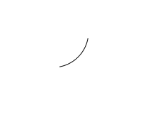

如果调用了closePath()方法来关闭路径，那么效果就会如下：

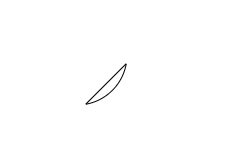

从效果图可以看出，closePath()方法的作用就是关闭路径，连接起点与终点。

注意：stroke()方法和fill()方法都只能绘制当前路径，不能同时绘制多条路径。例如：

```js
ctx.strokeStyle = "#000"

ctx.moveTo(300,300)
ctx.lineTo(300,350)
ctx.stroke()


ctx.beginPath()
ctx.arc(100,100,50,10*Math.PI/180,80*Math.PI/180,false)
ctx.closePath()
        
ctx.stroke()
```

不同的路径分别需要使用stroke()方法绘制，这样才会绘制出两个图形；如果把第一个stroke()去掉，那么只能绘制出第二个图形，第一个图形不会被绘制出来。

##### arcTo()

在canvas中，还可以使用arcTo()方法来画一条弧线。

```js
ctx.arcTo(cx,cy,x2,y2,radius)
```

其中(cx,cy)表示控制点的坐标，(x2,y2)表示结束点的坐标，radius表示圆弧的半径。如果想要画一条弧线，需要提供三个点的坐标：开始点、控制点和结束点。一般用moveTo()或者lineTo()来定义开始点，arcTo()提供控制点和结束点。

该方法就是利用开始点，控制点和结束点这三个点所形成的夹角，然后绘制一段与夹角的两边相切并且半径为radius的圆弧。

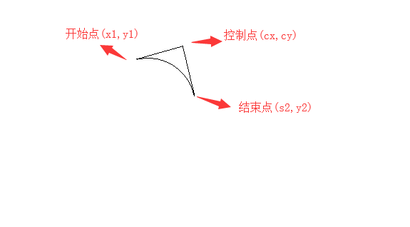

```js
ctx.strokeStyle = "#000"

ctx.moveTo(20,20)
ctx.lineTo(70,20)

ctx.arcTo(120,20,120,70,50)
ctx.lineTo(120,120)
ctx.stroke()
```

效果如下：

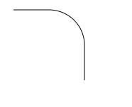

如果你把lineTo(70,20)这样代码去掉，你会发现效果图一样。这是因为如果开始点不是弧线起点时，arcTo()方法还将增加一条当前端点到弧线起点的直线线段。

#### 二次贝塞尔曲线

贝塞尔曲线，是应用于二维图形应用程序的数学曲线，这里不会介绍贝塞尔曲线的原理，主要介绍在Canvas中如何绘制它。

在canvas中，常见贝塞尔曲线有两种：二次贝塞尔曲线、三次贝塞尔曲线。下面呢就详细介绍二次贝塞尔曲线。

通过quadraticCurveTo()方法来绘制二次贝塞尔曲线。

```js
ctx.quadraticCurveTo(cx,cy,x2,y2)
```

其中，(cx,cy)表示控制点的坐标，(x2,y2)表示结束点的坐标。

绘制一条二次贝塞尔曲线，同样也需要3个点的坐标：开始点、控制点、结束点。其中一般由moveTo()或lineTo()提供开始点，而由quadraticCurveTo()提供控制点和结束点。

```js
ctx.moveTo(30,120)
ctx.quadraticCurveTo(100,20,160,120)
ctx.stroke()
```

效果如下：

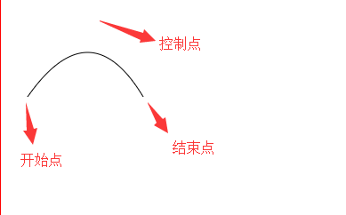

有了二次贝塞尔曲线，你可以轻松的绘制出聊天气泡。

#### 三次贝塞尔曲线

在canvas中，可以使用bezierCurveTo()方法来实现三次贝塞尔曲线。

```js
ctx.bezierCurveTo(cx1,cy1,cx2,cy2,x,y)
```

其中(cx1,cy1)表示控制点1的坐标，(cx2,cy2)表示控制点2的坐标，(x,y)表示结束点坐标。

一般来说，由moveTo()或lineTo()提供开始点，由bezierCurveTo()方法提供控制点1，控制点2，结束点。

注意：三次贝塞尔曲线和二次贝塞尔曲线的唯一区别就是：前者有两个控制点，后者有一个控制点。

有了，三次贝塞尔曲线可以轻松绘制复杂的曲线图形，例如心形，四叶草，扇形等图形。理论上来说，所有复杂的图形都可以用贝塞尔曲线绘制出来，这也是贝塞尔曲线的强大之处。

#### 贝塞尔曲线原理

Bezier曲线是应用于二维图形的曲线。曲线由顶点和控制点组成，通过改变控制点坐标可以改变曲线的形状。

一次Bezier效果图：


一次Bezier曲线是由P0至P1的连续点，描述的一条线段。公式如下：

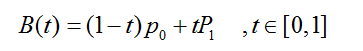

二次Bezier效果图：


二次Bezier曲线是 P0至P1 的连续点Q0和P1至P2 的连续点Q1 组成的线段上的连续点B(t)，描述一条抛物线。公式如下：

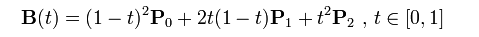

三次Bezier效果图：


三次Bezier公式如下：

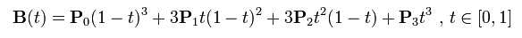

### 线条操作

#### lineWidth属性

在canvas中，通过lineWidth属性可以来定义线条的宽度。该属性取值为整数，默认为1，默认单位是像素。

```js
const canvas = document.querySelector('#canvas')
const ctx = canvas.getContext('2d')

ctx.beginPath()
ctx.moveTo(50,50)
ctx.lineTo(100,100)
ctx.lineWidth = 10
ctx.stroke()

ctx.beginPath()    
ctx.moveTo(150,150)
ctx.lineTo(250,250)
ctx.lineWidth = 20
ctx.stroke()
```

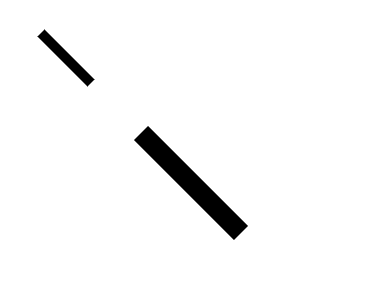

上例如果去掉beginPath()，那么都会按照lineWidth为20来绘制，这是因为Canvas是基于状态来绘制图形的，每一次绘制（stroke()或fill()），Canvas都会检测整个代码定义的所有状态（一般指样式）。在同一个路径中，状态会被一直使用。所以你需要使用beginPath()来开启一个新路径。

另外，lineWidth属性不仅可以绘制直线图形，还可以绘制曲线图形。

注意；假设线条宽度为lineWidth，则strokeRect()方法绘制的矩形实际宽度是width+lineWidth，实际高度是height+lineHeight。对于曲线图形的半径宽度计算也是如此。

#### lineCap属性

在canvas中，可以使用lineCap属性来定义线条开始出和结尾处的线帽样式。属性值如下：

* Butt：默认值，无线帽
* Round：圆形线帽
* Square：正方形线帽

注意：round和square值会使线条稍微变长一点，因为他们给线条增加了线帽部分。

```js
const canvas = document.querySelector('#canvas')
const ctx = canvas.getContext('2d')

ctx.lineWidth = 20

// lineCap默认为'butt'
ctx.moveTo(100,100)
ctx.lineTo(260,100)
ctx.stroke()

ctx.beginPath()
ctx.lineCap = 'round'
ctx.moveTo(100,150)
ctx.lineTo(260,150)
ctx.stroke()

ctx.beginPath()
ctx.lineCap = 'square'
ctx.moveTo(100,200)
ctx.lineTo(260,200)
ctx.stroke()
```

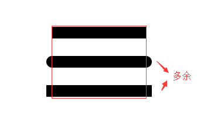

从效果图可以看出：

* 取值为butt：每条线的头端和尾端都是长方形，也就是不做任何的处理
* 取值为round：每条线的头和尾都增加一个半圆，半圆的直径为线宽长度
* 取值为square：每条线的头和尾都增加一个长方形，长方形的长度是线宽的一半，高度保持和线宽一致

> 和在使用lineWidth属性一样，设置不同的lineCap属性值时，也需要开启新路径。

```js
const canvas = document.querySelector('#canvas')
const ctx = canvas.getContext('2d')

ctx.lineWidth = 20
ctx.lineCap = 'round'

ctx.moveTo(100,100)
ctx.lineTo(200,100)
ctx.lineTo(100,200)
ctx.lineTo(200,200)
ctx.stroke()
```

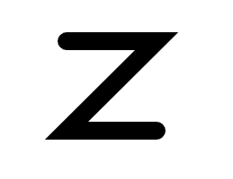

从效果上来看，lineCap属性只对线条的开始出和结尾处这两个地方起作用，而线段与线段交接的地方依然是尖角，如果想要修改此处的样式，应该使用下小节介绍的lineJoin属性。

#### lineJoin属性

在canvas中，可以使用lineJoin属性定义两个线条交接处的样式，属性值如下：

* miter：默认值尖角
* round：圆角
* bevel：斜角

当lineJoin为miter时，会受到miterLimit属性的影响。miterLimit属性在Canvas开发中几乎用不到，此处只需要简单了解就好。

```js
const canvas = document.querySelector('#canvas')
const ctx = canvas.getContext('2d')

ctx.lineWidth = 20

ctx.moveTo(100, 180)
ctx.lineTo(300, 180)
ctx.lineTo(300, 230)
ctx.stroke()

ctx.beginPath()
ctx.lineJoin = 'round'
ctx.moveTo(100, 280)
ctx.lineTo(300, 280)
ctx.lineTo(300, 330)
ctx.stroke()

ctx.beginPath()
ctx.lineJoin = 'bevel'
ctx.moveTo(100, 380)
ctx.lineTo(300, 380)
ctx.lineTo(300, 430)
ctx.stroke()
```

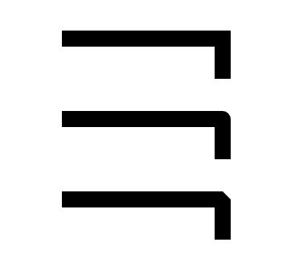

* miter样式：线段在交接处延伸至交于一点，为默认值
* round样式：连接处是一个圆角，圆角所在圆的直径等于线宽长度
* bevel样式：连接处是一个圆角，斜角所在正方形的对角线长等于线宽长度

> ctx.miterLimit属性表示浏览器如何绘制miter形式的线段焦点。

#### setLineDash()

在canvas中，我们可以使用setLineDash()方法来定义线条的虚实样式。

```js
ctx.setLineDash([10,5])			// 10px实线，5px虚线
ctx.setLineDash([10,5,5,5])		// 10px实线，5px虚线；5px虚线，5px虚线
```

Chrome和Firefox浏览器支持该方法，IE浏览器暂不支持该方法。

```js
const canvas = document.querySelector('#canvas')
const ctx = canvas.getContext('2d')

ctx.lineWidth = 2
ctx.setLineDash([10,5])
ctx.rect(50, 50, 200, 200)
ctx.stroke()
```

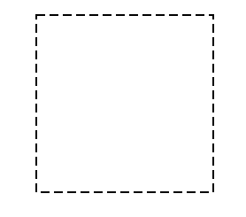

### 文本操作

canvas提供了一些文本操作的属性和方法：

* fillText()：绘制填充文本
* strokeText()：绘制描边文本
* measureText()：用于获取文本的长度
* font：定义文本字体样式（大小、粗细等）
* textAlign：定义文本水平对齐方式
* textBaseline：定义文本垂直对齐方式
* fillStyle：定义画笔填充路径的颜色
* strokeStyle：定义画笔描边路径的颜色

对于文本操作的方法和属性，有下面几点需要注意：

* fillStyle都是与fillText()配合使用，用于绘制填充文本
* strokeStyle属性都是与strokeText()配合使用，用于绘制描边文本
* 真正可以在Canvas中绘制文本的只有fillText()和strokeText()这两个方法，measureText()方法不能绘制文本，它只是用于获取文本的宽度

#### 方法

##### strokeText()

在canvas中，使用strokeText()方法来绘制描边文本，描边文本是指空心的文本。

```js
strokeText(text, x, y, maxWidth)
```

* text：文本字符串
* x：文本最左边的坐标
* y：文本最下边的坐标
* maxWidth：可选参数，表示文本允许的最大总宽度，单位是px。如果超出，文本则会被压缩至maxWidth值的宽度

```js
const canvas = document.querySelector('#canvas')
const ctx = canvas.getContext('2d')

ctx.font = 'bold 30px 微软雅黑'
ctx.strokeStyle = 'red'
ctx.strokeText('ugu', 30, 60)
```

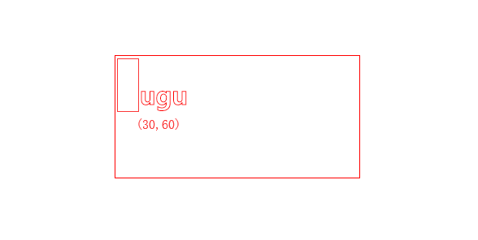

##### fillText()

在canvas中，使用fillText()方法来绘制填充文本。所谓填充文本就是实心的文本。

```js
fillText(text, x, y, maxWidth)
```

* text：文本字符串
* x：文本最左边的坐标
* y：文本最下边的坐标
* maxWidth：可选参数，表示文本允许的最大总宽度，单位是px。如果超出，文本则会被压缩至maxWidth值的宽度，以防止文本超出某个范围

```js
const canvas = document.querySelector('#canvas')
const ctx = canvas.getContext('2d')

ctx.font = 'bold 30px 微软雅黑'
ctx.fillStyle = 'red'
ctx.fillText('ugu', 30, 60)
```

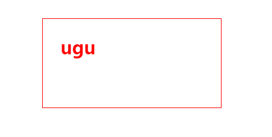

##### measureText()

在canvas中，使用measureText()方法来返回某个文本的宽度。该方法返回一个对象，该对象的width属性就是文本的宽度，不包括单位px。

```js
const length = ctx.measureText(text).width
```

其中参数text表示文本字符串。

> 该方法可以轻松实现文本水平居中。

```js
const canvas = document.querySelector('#canvas')
const ctx = canvas.getContext('2d')

const text = 'ugu'
ctx.font = 'bold 30px 微软雅黑'
ctx.fillStyle = 'red'

const length = ctx.measureText(text).width
const canvasWidth = canvas.width
const x = canvasWidth / 2 - length / 2

ctx.fillText(text, x, 60)
```

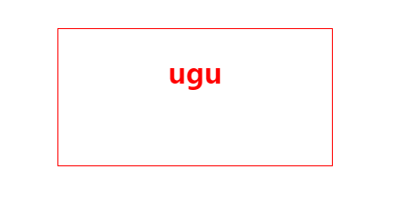

#### 属性

##### font

在canvas中，可以使用font属性定义文本的字体样式，该属性的用法和CSS中font属性用法相同。

```js
ctx.font = 'font-style font-weight font-size/line-height font-family'
```

该属性的默认值是`10px sans-serif`。另外，定义该属性之后，之后的文本都会应用，直到font被重新定义为止。

##### textAlign

在canvas中，可以使用textAlign属性来定义文本水平方向的对齐方式。该属性取值如下：

* start：文本在指定的横坐标开始
* end：文本在指定横坐标结束
* left：文本左对齐（类似start）
* right：文本右对齐（类似end）
* center：文本的中心被放置在指定的横坐标

start和end与文字的阅读方向有关，国内是从左到右阅读的，此时start对应着左边、end对应着右边。不过有些国家是从右到左阅读的，那么此时start对应着右边、end对应着左边。而left和right始终是指文字的左右方向，与阅读方向无关。

```js
const canvas = document.querySelector('#canvas')
const ctx = canvas.getContext('2d')

const text = 'ugu'
ctx.font = '20px Arial'

ctx.textAlign = 'start'
ctx.fillText('ugu-start', 200, 100)

ctx.textAlign = 'end'
ctx.fillText('ugu-end', 200 , 150)

ctx.textAlign = 'left'
ctx.fillText('ugu-left', 200 , 200)

ctx.textAlign = 'right'
ctx.fillText('ugu-right', 200 , 250)

ctx.textAlign = 'center'
ctx.fillText('ugu-center', 200 , 300)
```

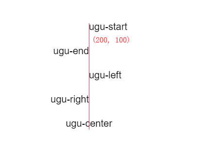

##### textBaseline

在canvas中，使用textBaseline属性来定义文本垂直方向的对齐方式。该属性取值如下：

* alphabetic：文本基线是普通英文字母的基线
* top：文本基线是em方框的顶端
* middle：文本基线是em方框的中心
* bottom：文本基线是em方框的底端

```js
const canvas = document.querySelector('#canvas')
const ctx = canvas.getContext('2d')

const text = 'ugu'
ctx.font = '20px Arial'

ctx.textBaseline = 'alphabetic'
ctx.fillText('alphabetic', 100, 200)

ctx.textBaseline = 'top'
ctx.fillText('top', 200 , 200)

ctx.textBaseline = 'middle'
ctx.fillText('middle', 300 , 200)

ctx.textBaseline = 'bottom'
ctx.fillText('bottom', 400 , 200)
```

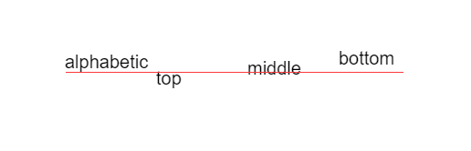

> 其实除了上面列举的常用属性值之外，textBaseline属性还有hanging、ideographic等属性值，但是这些属性值都不常用。

### 图片操作

在canvas中，除了可以绘制各种图形之外，还可以将图片导入到canvas中进行各种操作，例如翻转、切割等。在一般的游戏开发中，地图、背景、人物等元素都不是绘制出来，而是用图片来实现的。

#### 绘制图片

在canvas中，使用drawImage()来绘制图片。所谓绘制图片 ，其实就是将一张图片在canvas中显示出来。

该方法有如下三种调用方式：

* drawImage(image, dx, dy)
* drawImage(image, dx, dy, dw, dh)
* drawImage(image, sx, sy, sw, sh, dx, dy, dw, dh)

**drawImage(image, dx, dy)：**

```js
const canvas = document.querySelector('#canvas')
const ctx = canvas.getContext('2d')

const img = new Image()
img.src = './images/demo.png'

img.onload = function(){
    ctx.drawImage(img, 100, 100)
}
```

上例中的图片是动态创建的，当然你也可以直接获取DOM中已经存在的图片来进行操作。

> 必须等到图片载入完成后才能将图片绘制到Canvas中，否则Canvas不会显示任何图片。

```js
window.onload = function(){
   const canvas = document.querySelector('#canvas')
    const ctx = canvas.getContext('2d')

    const img = document.images[0]
    ctx.drawImage(img, 100, 100) 
}
```

和第一个例子不同的是，该例中的img是DOM中已经存在的图片节点。

**drawImage(image, dx, dy, dw, dh)：**

前三个参数和第一种一样。另外，dw表示图片宽度，dh表示图片高度，这样便可以自定义图片大小。

**drawImage(image, sx, sy, sw, sh, dx, dy, dw, dh)：**

其中image、dx、dy、dw和dh参数和上面一样。另外四个参数含义如下：

* sx：表示源图片被截取部分的横坐标
* sy：表示源图片被截取部分的纵坐标
* sw：表示源图片被截取部分的宽度
* sh：表示源图片被截取部分的高度

这三种方式区别和联系如下：

1. 第一种方法仅仅绘制一个图片
2. 第二种方法可以绘制大小不一样的图片
3. 第三种方法可以实现CSS Sprite类似的技术

#### 平铺图片

在canvas中，可以使用createPattern()方法来定义图片的平铺方式。

```js
const pattern = ctx.createPattern(image, type)
ctx.fillStyle = pattern
ctx.fillRect()
```

其中image参数表示被平铺的图片对象，type参数表示平铺的方式，具体取值如下：

* repeat：默认值，水平垂直方向同时平铺
* repeat-x：只在水平方向平铺
* repeat-y：只在垂直方向平铺
* no-repeat：不平铺，只显示一次

fillStyle取值有三种，即颜色值、渐变色和图案，这里取值为图案，并且配合fillRect()一起使用。

> createPattern()方法不仅可以用于平铺图片，还可以用于平铺其它canvas元素或者平铺video元素，但是都不常用。

```js
const canvas = document.querySelector('#canvas')
const ctx = canvas.getContext('2d')

const img = new Image()
img.src = './images/demo.png'

const pattern = ctx.createPattern(img, 'repeat')
ctx.fillStyle = pattern
ctx.fillRect(100,100, 600,600)
```

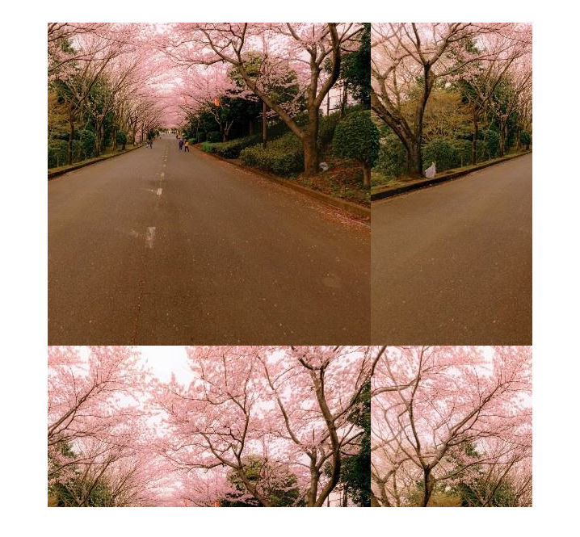

当然，你也可以平铺canvas。

```js
const canvas = document.querySelector('#canvas')
const ctx = canvas.getContext('2d')

const circleCanvas = document.createElement('canvas')
const circleCanvasCtx = circleCanvas.getContext('2d')
circleCanvas.width = 100
circleCanvas.height = 100

circleCanvasCtx.beginPath()
circleCanvasCtx.arc(50,50,50,0,Math.PI*2,true)
circleCanvasCtx.fillStyle = "pink"
circleCanvasCtx.fill()
circleCanvasCtx.closePath()

const pattern = ctx.createPattern(circleCanvas, 'repeat-x')
ctx.fillStyle = pattern
ctx.fillRect(0,0,400,400)
```

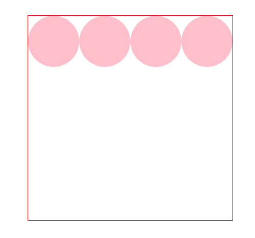

#### 切割图片

在canvas中，可以使用clip()方法来切割Canvas中绘制的图片。

```js
const canvas = document.querySelector('#canvas')
const ctx = canvas.getContext('2d')

ctx.beginPath()
ctx.arc(70,70,50,0,Math.PI*2, true)
ctx.closePath()
ctx.stroke()

ctx.clip()

const img = new Image()
img.src = './images/demo.png'
img.onload = function(){
    ctx.drawImage(img, -200, -300)
}
```

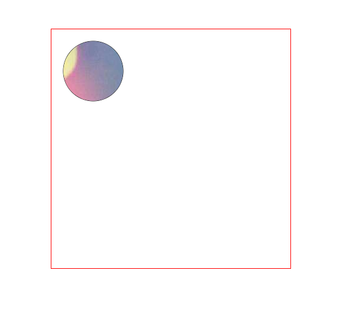

### 变形操作

在canvas中，可以实现文字，图片和图形的各种变形效果，例如位移、缩放、旋转和倾斜等。

* translate()：平移
* scale()：缩放
* rotate()：旋转
* transform()、setTransform()：变换矩阵

这些方法和CSS3的变换操作类似

#### translate()

在canvas中，可以使用translate()来进行平移操作。所谓平移，就是沿着X轴或Y轴做直线运动，平移过程不会改变形状或大小。

```js
ctx.translate(x,y)
```

* x：表示图形在x轴方向移动的距离，默认单位是px。若为正，则向x轴正方向移动；若为负，则向x轴负方向移动
* y：表示图形在y轴方向移动的距离，默认单位是px。若为正，则向y轴正方向移动；若为负，则向y轴负方向移动

```js
const canvas = document.querySelector('#canvas')
const ctx = canvas.getContext('2d')

ctx.fillStyle = 'hotpink'
ctx.fillRect(100,100,100,100)  

const btn = document.querySelector('button')
btn.addEventListener('click', function(){
    ctx.translate(50,50)
    ctx.fillRect(100,100,100,100)  
})
```

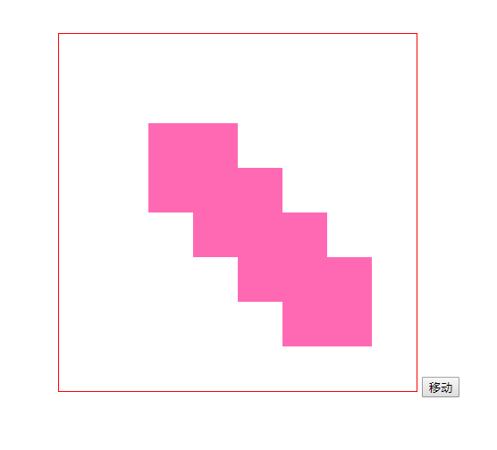

点击移动按钮，你会发现图形是移动了，但是每次平移都会将之前的图形保留下来。这是因为默认情况下，Canvas会把所有绘制的图形都保留下来。如果不希望出现这种情况，可以在绘制之前清空Canvas画布，然后再去绘制。

```js
const canvas = document.querySelector('#canvas')
const ctx = canvas.getContext('2d')

ctx.fillStyle = 'hotpink'
ctx.fillRect(100,100,100,100)  

const btn = document.querySelector('button')
btn.addEventListener('click', function(){
    ctx.clearRect(0, 0, canvas.width, canvas.height)
    ctx.translate(50,50)
    ctx.fillStyle = 'hotpink'
    ctx.fillRect(100,100,100,100)  
})
```

改进一下，这样每次平移就不会将之前的图形保留下来了。

#### scale()

在canvas中，可以使用scale()方法来对图形进行缩放操作。

```js
ctx.scale(x,y)
```

* x：表示X轴方向的缩放倍数
* y：表示Y轴方向的缩放倍数

一般情况下，x、y都是整数。当x或y取值0~1之间，图形会进行缩小；当大于1时，图形会进行放大。

> 虽然，x和y可以取值为负数，但是一般情况下很少使用。

```js
const canvas = document.querySelector('#canvas')
const ctx = canvas.getContext('2d')

ctx.fillStyle = 'hotpink'
ctx.fillRect(100,100,100,100)  

ctx.scale(1.5, 1.5)
ctx.fillStyle = 'blue'
ctx.fillRect(100,100,100,100)
```

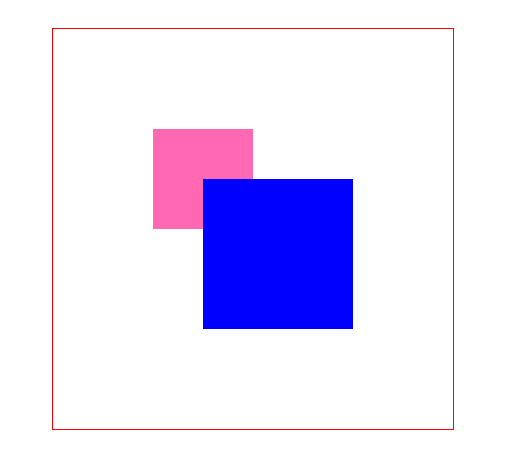

你会发现，缩放后的图形左上角的坐标是原来的1.5倍。

实际上，在使用Canvas中的scale()方法是有一定副作用的。除了会改变图形大小之外，还会改变其他属性，例如线条宽度、左上角坐标和宽高度。

所以在使用该方法时，需要注意这种情况的发生

#### rotate()

在canvas中，可以使用rotate()方法来旋转图形。

```js
ctx.rotate(angle)
```

其中angle参数表示旋转的角度，取值在`-Math.PI*2~Math.PI*2`之间。当`angle<0`时，图形顺时针旋转；当`angle>0`时，图形逆时针旋转。

```js
120*Math.PI/180			// 120度
150*Math.PI/180			// 150度
```

rotate()方法的角度也是用弧度来表示的，例如180度应该写成Math.PI，360度应该写成Math.PI*2，以此类推。因此，在实际开发中，推荐如下写法：

```js
const canvas = document.querySelector('#canvas')
const ctx = canvas.getContext('2d')

ctx.fillStyle = 'hotpink'
ctx.fillRect(100,100,50,50)

ctx.fillStyle = 'red'
ctx.rotate(-20*Math.PI/180)				// 逆时针旋转20度
ctx.fillRect(100,100,50,50)
```

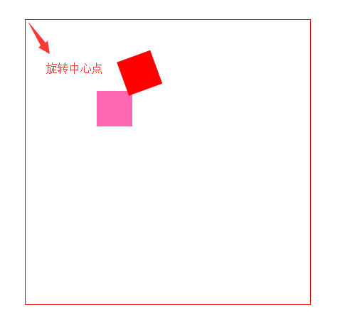


默认情况下，以(0,0)为旋转中心点，当然你也可以修改中心点的坐标。

```js
const canvas = document.querySelector('#canvas')
const ctx = canvas.getContext('2d')

ctx.fillStyle = 'hotpink'
ctx.translate(canvas.width / 2, canvas.height / 2) 
ctx.fillRect(-25,-25,50,50)

ctx.fillStyle = 'red'
ctx.rotate(-20*Math.PI/180)
ctx.fillRect(-25,-25,50,50)
```

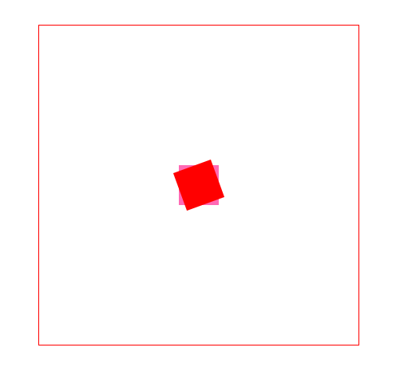

#### 矩阵变换

##### transform

实际上，前面了解的平移、缩放和旋转操作本质上都是通过变换矩阵来实现的。也就是说单单通过transform就可以实现这三种图形操作。

```js
ctx.transform(a,b,c,d,e,f)
```

* a：水平缩放绘图
* b：水平倾斜绘图
* c：垂直倾斜绘图
* d：垂直缩放绘图
* e：水平移动绘图
* f：垂直移动绘图

transform(a,b,c,d,e,f)各个变量对应一下变换矩阵中相应位置的参数：

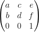

**平移操作：**

假设图形开始坐标是(x,y)，平移后的坐标是(x1,y1)，在x、y轴上分别平移e、f，那么会有如下公式：

```
x1 = x + e
y1 = y + f
```

因此，可以得到以下矩阵公式：

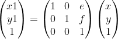

从这个公式可以看出，其实translate(e,f)就等价于transform(1,0,0,1,e,f)。

**缩放操作：**

假设图形开始坐标是(x,y)，缩放后的坐标是(x1,y1)，在x轴和y轴上缩放的倍数分别是a和d，name会有如下公式：

```
x1 = a * x
y1 = d * y
```

因此，可以得到以下矩阵公式：

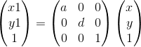

从这个公式可以看出，其实scale(a,d)就等价于transform(a,0,0,d,0,0)。

**旋转：**

假设图形开始坐标为(x,y)，旋转后的坐标为(x1,y1)，图形旋转为θ度，那么就有以下公式：

```
x1 = x*cosθ - y*sinθ
y1 = x*sinθ - y*cosθ
```

因此，可以得到以下矩阵公式：

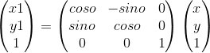

从这个公式可以看出，其实rotate(θ)就等价于transform(cosθ,sinθ,-sinθ,cosθ,0,0)。

尽管可以使用transform实现所有的变形操作，但是在实际开发中，涉及到平移、旋转和缩放操作，推荐使用具有语义化的API。

##### setTransform()

setTransform()和transform()方法非常相似，都可以对图形进行平移、缩放和旋转操作，不过两者有着本质的区别：即每次调用transform()方法，参考的都是上一次变换后的图形状态，然后再进行变换。而setTransform()方法会重置图形的状态，然后再进行变换。

```js
// transform
const canvas = document.querySelector('#canvas')
const ctx = canvas.getContext('2d')

ctx.fillStyle = 'hotpink'
ctx.fillRect(0,0,50,50)

ctx.fillStyle = 'red'
ctx.transform(1,0,0,1,100,100)
ctx.fillRect(0,0,50,50)

ctx.fillStyle = 'blue'
ctx.transform(1,0,0,1,100,100)
ctx.fillRect(0,0,50,50)
```

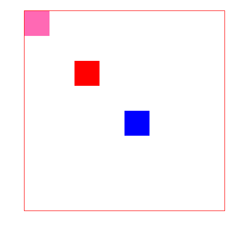

```js
const canvas = document.querySelector('#canvas')
const ctx = canvas.getContext('2d')

ctx.fillStyle = 'hotpink'
ctx.fillRect(0,0,50,50)

ctx.fillStyle = 'red'
ctx.setTransform(1,0,0,1,100,100)
ctx.fillRect(0,0,50,50)

ctx.fillStyle = 'blue'
ctx.setTransform(1,0,0,1,100,100)
ctx.fillRect(0,0,50,50)
```

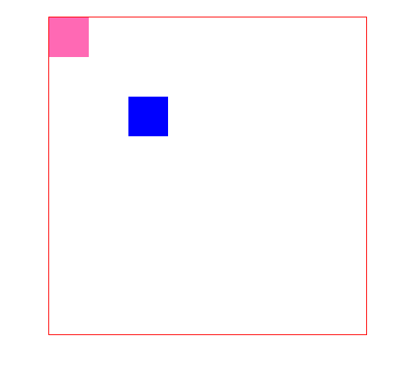

#### 总结

变形操作除了应用在图形上，还可以应用在图片和文字上。

### 像素操作

在canvas中，你可以将getImageData()和putImageData()配合使用，来对图片进行像素级操作。

#### getImageData()

使用getImageData()方法来获取一张图片的像素数据。

```js
const imgData = ctx.getImageData(x, y, width, height)
const data = imgData.data
```

* x：表示所选图片区域的横坐标
* y：表示所选图片区域的纵坐标
* width：表示所选图片区域的宽度
* height：表示所选图片区域的高度

getImageData()方法返回一个canvasPixelArray对象，该对象的data属性保存着图片像素数据的数组，值如[r1,g1,b1,a1,r2,g2,b2,a2,......]。其中每四个数分别是该像素的RGBA。

#### putImageData()

在canvas中，可以使用putImageData()方法输出一张图片的像素数据。简单来说就是使用该方法在canvas中显示一张图片。

```                                                                                                                                                                                                                                                                                                                                                                                                                                                                                                                                                                                                                                                                                    js
ctx.putImageData(image, x, y)
```

* image：表示重新绘制的对象，也就是使用getImageData()方法获取的canvasPixelArray对象
* x：表示重新绘制图形左上角的横坐标
* y：表示重新绘制图形左上角的纵坐标

一般来说，getImageData()和putImageData()这两种方法要配合使用：先通过前者拿到图片的像素数据，然后通过一定的算法得出行的像素数据，最后通过后者绘制到画布上。

#### 反转效果

反转效果就是指图片颜色颠倒，RGB各自取相反值，A不需要进行操作。

```js
const canvas = document.querySelector('#canvas')
const ctx = canvas.getContext('2d')

const img = new Image()
img.src = './demo.jpg'

img.onload = function(){
    ctx.drawImage(img, 50, 50, 100, 100)
    const imgData = ctx.getImageData(50, 50, 100, 100).data

    for (let index = 0; index < imgData.length; index += 4) {
        imgData[index + 0] = imgData[index + 0] ^ 255
        // 或者 imgData[index + 0] = 255 - imgData[index + 0]
        imgData[index + 1] = imgData[index + 1] ^ 255
        imgData[index + 2] = imgData[index + 2] ^ 255
    }

    ctx.putImageData(imgData, 300, 300)
}
```

#### 黑白效果

黑白效果，也叫灰度图（average），是指将彩色图片转换成黑白图片。实现算法是将RGB三个值取平均值，然后分别重新赋予RGB，A不需要进行操作。

```js
const canvas = document.querySelector('#canvas')
const ctx = canvas.getContext('2d')

const img = new Image()
img.src = './demo.jpg'

img.onload = function(){
    ctx.drawImage(img, 50, 50, 100, 100)
    const imgData = ctx.getImageData(50, 50, 100, 100).data

    for (let index = 0; index < imgData.length; index += 4) {
        const average = (imgData[index + 0] 
                         + imgData[index + 1] 
                         + imgData[index + 2]) / 3
        imgData[index + 0] = average
        imgData[index + 1] = average
        imgData[index + 2] = average
    }

    ctx.putImageData(imgData, 300, 300)
}
```

当然这种方式实现出来的黑白效果不是很好，你可以使用加权平均值改进：

```js
const canvas = document.querySelector('#canvas')
const ctx = canvas.getContext('2d')

const img = new Image()
img.src = './demo.jpg'

img.onload = function(){
    ctx.drawImage(img, 50, 50, 100, 100)
    const imgData = ctx.getImageData(50, 50, 100, 100).data

    for (let index = 0; index < imgData.length; index += 4) {
        const average = (imgData[index + 0] * .3 
                         + imgData[index + 1] * .6
                         + imgData[index + 2] * .1) / 3
        imgData[index + 0] = average
        imgData[index + 1] = average
        imgData[index + 2] = average
    }

    ctx.putImageData(imgData, 300, 300)
}
```

这样实现出来的黑白效果会稍微好点，当然你也可以调整一个最佳的权重，以达到一个最佳效果。

#### 亮度效果

亮度效果（brightness）是指你可以将图片的亮度调高或者调暗，实现算法是将RGB同时加上一个正值或负值。

```js
const canvas = document.querySelector('#canvas')
const ctx = canvas.getContext('2d')

const img = new Image()
img.src = './demo.jpg'

img.onload = function(){
    ctx.drawImage(img, 50, 50, 100, 100)
    const imgData = ctx.getImageData(50, 50, 100, 100).data

    for (let index = 0; index < imgData.length; index += 4) {
        const value = 50
        imgData[index + 0] += value
        imgData[index + 1] += value
        imgData[index + 2] += value
    }

    ctx.putImageData(imgData, 300, 300)
}
```

#### 复古效果

复古效果（sepia）是指使得图片有一种古旧效果。实现算法是取RGB的某种加权平均值。

```js
const canvas = document.querySelector('#canvas')
const ctx = canvas.getContext('2d')

const img = new Image()
img.src = './demo.jpg'

img.onload = function(){
    ctx.drawImage(img, 50, 50, 100, 100)
    const imgData = ctx.getImageData(50, 50, 100, 100).data

    for (let index = 0; index < imgData.length; index += 4) {
        const r = imgData[index + 0],
              g = imgData[index + 1],
              b = imgData[index + 2]
        
        imgData[index + 0] = r * .39 + g * .76 + b * .18
        imgData[index + 1] = r * .35 + g * .68 + b * .16
        imgData[index + 2] = r * .27 + g * .53 + b * .13
    }

    ctx.putImageData(imgData, 300, 300)
}
```

#### 红色蒙版

红色蒙版是指让图片呈现一种偏红的效果。实现算法是将红通道R赋值为RGB三个值的平均值，然后将G（绿通道）、B（蓝通道）赋值为0。

```js
const canvas = document.querySelector('#canvas')
const ctx = canvas.getContext('2d')

const img = new Image()
img.src = './demo.jpg'

img.onload = function(){
    ctx.drawImage(img, 50, 50, 100, 100)
    const imgData = ctx.getImageData(50, 50, 100, 100).data

    for (let index = 0; index < imgData.length; index += 4) {
        const r = imgData[index + 0],
              g = imgData[index + 1],
              b = imgData[index + 2]
        
        imgData[index + 0] = (r + g + b) / 3
        imgData[index + 1] = 0
        imgData[index + 2] = 0
    }

    ctx.putImageData(imgData, 300, 300)
}
```

通过这种算法，你也可以实现绿色蒙版或蓝色蒙版。

#### 透明处理

对于透明处理，是指将alpha通道乘以透明度即可，RGB并不需要操作。

```js
const canvas = document.querySelector('#canvas')
const ctx = canvas.getContext('2d')

const img = new Image()
img.src = './demo.jpg'

img.onload = function(){
    ctx.drawImage(img, 50, 50, 100, 100)
    const imgData = ctx.getImageData(50, 50, 100, 100).data

    for (let index = 0; index < imgData.length; index += 4) {
        imgData[index + 3] = imgData[index + 3] * .6
    }

    ctx.putImageData(imgData, 300, 300)
}
```

关于透明处理，你可能会想到使用ctx.globalAlpha属性来设置。其实，这是错误的，该属性会作用于整个Canvas，而不是只是希望图片透明化。

#### createImageData()

在canvas中，可以使用createImageData()方法在画布中创建一个区域，使得这个区域可以进行像素操作。也就是说，如果没有创建像素操作区域，我们是没有办法进行像素操作的。

```js
ctx.createImageData(sw, sh)			// 第一种格式
ctx.createImageData(imageData)		// 第二种格式
```

对于第一种格式来说：

* sw：表示要创建区域的宽度
* sh：表示要创建区域的高度

对于第二种格式来说：

* imageData：表示创建区域的宽高等于接收的imageData的宽高

getImageData()和putImageData()配合使用来对图片进行像素操作，而createImageData()和putImageData()配合使用是对某个区域进行像素操作。

```js
const canvas = document.querySelector('#canvas')
const ctx = canvas.getContext('2d')

const imgData = ctx.createImageData(100,100).data

for (let index = 0; index < 100 * 100 * 4; index += 4) {
    imgData[index + 0] = 0
    imgData[index + 1] = 0
    imgData[index + 2] = 255
    imgData[index + 3] = 255
}

ctx.putImageData(imgData, 20, 20)
```

这样便绘制一个蓝色区域。

### 渐变和阴影

和CSS3相同，Canvas中的渐变也分为线性渐变和径向渐变。

#### 线性渐变

将createLinearGradient()和addColorStop()两个方法配合使用来实现线性渐变。

```js
const gnt = ctx.createLinearGradient(x1, y1, x2, y2)
gnt.addColorStop(value1, color1)
gnt.addColorStop(value2, color2)
ctx.fillStyle = gnt
ctx.fill()
```

在canvas中，实现线性渐变，需要如下三个步骤：

1. 调用createLinearGradient()方法创建linearGradient对象
2. 调用linearGradient对象addColorStop()方法N次。第一次调用表示开始颜色，第二次调用表示结束颜色，第三次调用则以第二次颜色作为开始颜色进行渐变，依次类推
3. 将linearGradient赋值给ctx.fillStyle属性，然后调用ctx.fill()方法进行绘制

```js
const gnt = ctx.createLinearGradient(x1, y1, x2, y2)
```

x1、y1表示渐变色开始点的坐标，x2、y2表示渐变色结束点的坐标。具体含义如下：

* 如果y1、y2相同，则表示水平正方向渐变
* 如果x1、x2相同，则表示垂直正方向渐变

* 如果x轴和y轴都不相同，则表示开始点沿着对象线正方向渐变

```js
gnt.addColorStop(value1, color1)
gnt.addColorStop(value2, color2)
```

* value：表示渐变位置的偏移量，取值0~1。value1表示渐变开始位置，value2表示渐变结束位置
* color：表示渐变颜色，取值为任意颜色值（RGB、十六进制颜色值等）。color1表示渐变开始颜色，color2表示渐变结束颜色

```js
ctx.fillStyle = gnt
ctx.fill()
```

在线性渐变中，fill()可以改为fillRect()或fillText()。其中fillRect()表示矩形渐变，fillText()表示文字渐变。

```js
const canvas = document.querySelector('#canvas')
const ctx = canvas.getContext('2d')

const gnt = ctx.createLinearGradient(50, 50, 200, 200)		// 对角线渐变
gnt.addColorStop(0, 'red')
gnt.addColorStop(1, 'blue')
ctx.fillStyle = gnt
ctx.fillRect(50,50,150,150)
```

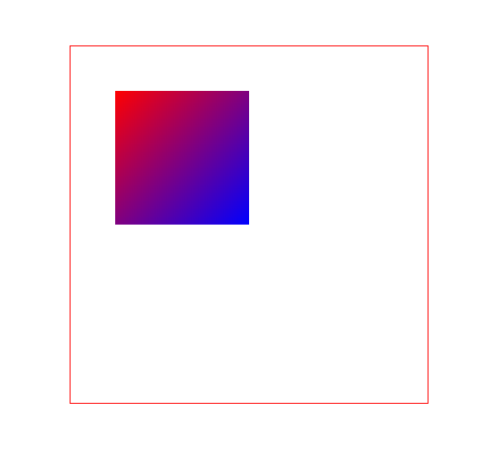

```js
const canvas = document.querySelector('#canvas')
const ctx = canvas.getContext('2d')

const gnt = ctx.createLinearGradient(50, 50, 200, 200);
gnt.addColorStop(0, 'red')
gnt.addColorStop(1, 'blue')
ctx.fillStyle = gnt

ctx.font = '30px 微软雅黑'
ctx.fillText('hello world', 100, 100)
```

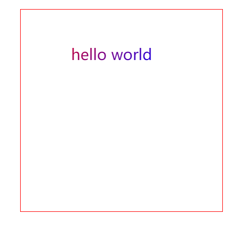

#### 径向渐变

在canvas中，将createRadialGradient()和addColorStop()方法配合使用，可以实现径向渐变。

```js
const gnt = ctx.createRadialGradient(x1, y1, r1, x2, y2, r2)
gnt.addColorStop(value1, color1)
gnt.addColorStop(value2, color2)
ctx.fillStyle = gnt
ctx.fill()
```

对于`const gnt = ctx.createRadialGradient(x1, y1, r1, x2, y2, r2)`来说，(x1,y1)表示渐变开始圆心的坐标，r1表示渐变开始圆心的半径。(x2,y2)表示渐变结束圆心的坐标，r2表示渐变结束圆的半径。

调用createRadialGradient()方法，会从渐变开始的圆心位置(x1,y1)，向渐变结束圆心位置(x2,y2)进行颜色渐变。起点为开始圆心，终点为结束圆心，由起点向终点扩散，直至终点外边框。

也就是说，createRadialGradient(x1,y1,r1,x2,y2,r2)表示圆心为(x1, y1)，半径为r1的圆到圆心(x2,y2)，半径为r2的圆的径向渐变。

```js
const canvas = document.querySelector('#canvas')
const ctx = canvas.getContext('2d')

ctx.beginPath()
ctx.arc(80, 80, 50, 0, Math.PI*2, true)
ctx.closePath()

const gnt = ctx.createRadialGradient(60, 60, 10, 80, 80, 50)
gnt.addColorStop(0, 'red')
gnt.addColorStop(.5, 'green')
gnt.addColorStop(1, 'blue')
ctx.fillStyle = gnt
ctx.fill()
```


#### 阴影

和CSS一样，在Canvas中，你可以为文字和图形添加阴影。具体属性取值如下：

* shadowOffsetX：阴影与图形的水平距离，默认为0。大于0向右偏移，小于0向左偏移
* shadowOffsetY：阴影与图形的垂直距离，默认为0。大于0向下便宜，小于0向上便宜
* shadowColor：阴影的颜色，默认为黑色
* shadowBlur：阴影的模糊值，默认为0。该值越大，阴影越模糊，反之亦反。注意：该值不是指阴影的像素长度，而是代表高斯模糊方程式中的参数值。它必须是一个非负无穷的double（小数）值，默认为0

```js
const canvas = document.querySelector('#canvas')
const ctx = canvas.getContext('2d')

ctx.shadowOffsetX = 10
ctx.shadowOffsetY = 10
ctx.shadowBlur = 10
ctx.shadowColor = 'skyblue'

ctx.fillStyle = 'hotpink'
ctx.fillRect(100,100,200,100)
```

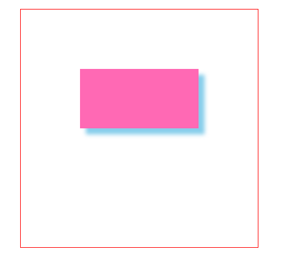

> 高斯模糊（Gaussian blur）是在图像处理软件中广泛使用的处理效果。这种模糊技术生成的图像看起来好像是经过一个半透明的屏幕来观察图像。有空可以研究该算法。

### Canvas路径

在canvas中，除了矩形，其他所有基本图形（包括直线、多边形、圆形、弧线、贝塞尔曲线）都是以路径为基础的。

canvas一共提供如下三种方法操作路径：

* beginPath()：开始一条新的路径
* closePath()：关闭当前路径
* isPointPath()：判断某个点是否存在于当前路径

#### beginPath()

使用beginPath()方法来开始一个新路径。

```js
const canvas = document.querySelector('#canvas')
const ctx = canvas.getContext('2d')

ctx.lineWidth = 5

ctx.moveTo(100,100)
ctx.lineTo(300,100)
ctx.strokeStyle = 'hotpink'
ctx.stroke()

ctx.moveTo(100,200)
ctx.lineTo(300,200)
ctx.strokeStyle = 'blue'
ctx.stroke()
```

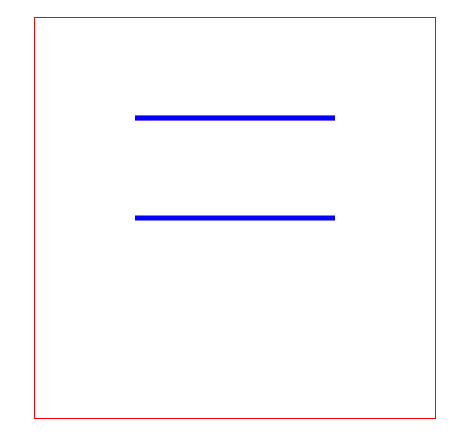

canvas是基于状态绘制的，每次绘制（stroke或fill）都会检测整个程序定义的状态，这些状态包括strokeStyle、fillStyle、lineWidth等。当一个状态值没有发生改变时，canvas就会一直使用这个值。如果一个状态值发生改变了，需要考虑如下两种情况：

* 如果使用beginPath()开启了一条新路径了，则不同路径使用所对应的状态值
* 如果没有开启一条新路径，则相同状态以后面值为准，后来居上原则

```js
const canvas = document.querySelector('#canvas')
const ctx = canvas.getContext('2d')

ctx.lineWidth = 5					// 一直延用lineWidth

ctx.moveTo(100,100)
ctx.lineTo(300,100)
ctx.strokeStyle = 'hotpink'
ctx.stroke()

ctx.beginPath()
ctx.moveTo(100,200)
ctx.lineTo(300,200)
ctx.strokeStyle = 'blue'
ctx.stroke()
ctx.closePath()
```

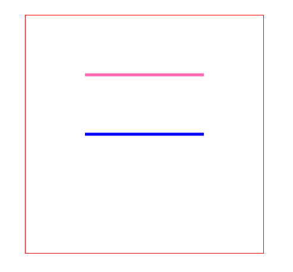

判断是否属于同一路径的标准是是否使用了beginPath()，而不是视觉上的首尾相连。

> 路径是针对Canvas基本图形的绘制而言的，所以beginPath()和closePath()也只是体现在Canvas基本图形绘制中。

#### closePath()

使用closePath()来关闭当前路径。注意：关闭路径不等于结束路径，所谓关闭路径一般是指将同一个路径的起点与终点这两点连接起来，使其成为一个封闭的图形。所谓的结束路径一般是指开始一个新的路径。

```js
const canvas = document.querySelector('#canvas')
const ctx = canvas.getContext('2d')

ctx.arc(50, 50, 50, 10 * Math.PI / 180, true)
ctx.strokeStyle = 'hotpink'
ctx.stroke()
```

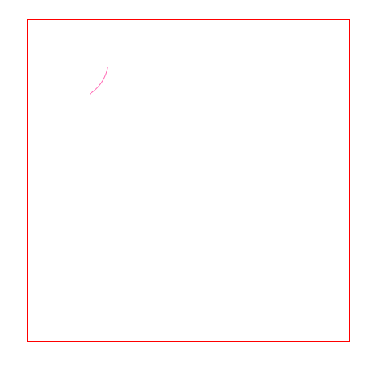

使用closePath()方法关闭路径之后：

```js
const canvas = document.querySelector('#canvas')
const ctx = canvas.getContext('2d')

ctx.arc(50, 50, 50, 10 * Math.PI / 180, true)
ctx.strokeStyle = 'hotpink'
ctx.closePath()
ctx.stroke()
```

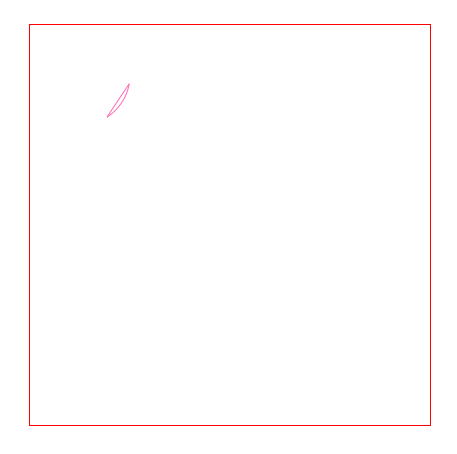

从结果你可以看出，closePath()的作用就是连接起点和终点，使其成为一个封闭的图形。也就是说，如果我们在绘制多边形时，手动封闭图形的最后一个lineTo()方法是可以省略的，从而使用closePath()方法自动连接起点和终点。

> 对于closePath()方法的使用，需要注意如下三点：
>
> * closePath()是关闭路径，不是结束路径。关闭路径，指的是连接起点和终点。而结束路径，指的是开始新的路径
> * 只有使用beginPath()来开启新的路径，这也是判断是否开启一条新路径的唯一标准
> * closePath()主要用于实现封闭的图形绘制
>
> 最后，beginPath()和closePath()不一定要配对使用。如果需要开启新路径，就需要使用beginPath()。如果需要封闭图形（连接起点和终点）时，就应该使用closePath()。

#### isPointInPath()

在canvas中，使用isPointInPath()方法来判断某个点是否存在于当前的路径中。

```js
ctx.isPointInPath(x, y)
```

如果点(x, y)位于当前路径，返回true；如果不位于当前路径中，返回false。

```js
const canvas = document.querySelector('#canvas')
const ctx = canvas.getContext('2d')

ctx.rect(50,50,200,100)
ctx.strokeStyle = 'hotpink'
ctx.stroke()
console.log(ctx.isPointInPath(100, 100))			// true
```

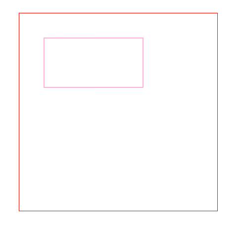

在上例中，如果使用strokeRect()来代替rect()和stroke()方法，那么你会发现isPointInPath()返回false。这是因为isPointInPath()方法不支持strokeRect()和fillRect()方法，只支持rect()方法。

### Canvas状态

前面了解到，canvas是基于状态绘制的。而canvas提供了两个操作状态的方法：save()和restore()，前者用来保存当前状态，然后通过后者来恢复之前保存的状态。一般来说，两者是成对使用。

这两个方法具体说明如下：

- save()：将当前canvas的状态推送到一个保存canvas状态的堆栈顶部。canvas状态包括了当前坐标变换（transformation）信息，剪辑区域（clipping region）以及所有canvas绘图环境对象的属性，包括strokeStyle，fillStyle和globalCompositeOperation等

  canvas状态并不包括当前的路径或位图，调用beginPath()只能用来重置路径。至于位图，它是canvas本身的一个属性，并不属于绘图环境对象。

  另外，尽管位图是canvas对象本身的属性，但是也可以通过绘图环境对象ctx的getImageData()方法来访问它

- restore()：将canvas状态堆栈顶部的条目弹出。原来保存于栈顶的那一组状态，在弹出之后，就被设置成canvas当前的状态了。规范规定：浏览器必须要根据该值来设定canvas的对应属性，因此在调用save()和restore()方法之间，对canvas状态所进行的修改，其效果只会持续至restore()方法被调用之前

> canvas绘制环境对象ctx的另一个关键功能就是可以对绘图表面自身进行保存和恢复。这种绘制表面的保存与恢复功能，可以让开发者在绘图表面上进行一些临时性的绘制动作，诸如绘制辅助线或注解等。
>
> 例如：检测到鼠标按下的事件之后，应用程序就将绘图表面保存起来。在接下来用户拖动鼠标的过程中，应用程序持续地将按下鼠标那一刻的绘图表面恢复到canvas之中，然后再绘制多边形与相关的辅助线。当用户松开鼠标时，应用程序最后一次将绘图表面恢复到canvas，再将最终不含辅助线的多边形绘制在其上。
>
> 注意：getImageData()和putImageData()方法来保存和恢复糊涂环境的绘图表面。与drawImage()方法一样，getImageData()

#### clip()

使用clip()方法之前，必须在canvas中绘制一个基本图形，然后调用clip()方法使得该图形成为剪切区域，超出部分不会显示。

```js
const canvas = document.querySelector('#canvas')
const ctx = canvas.getContext('2d')

ctx.arc(200,200,60, 0, Math.PI * 2, true)
ctx.strokeStyle = 'hotpink'
ctx.stroke()    
// 将描边圆变成剪切区域
ctx.clip()

ctx.beginPath()
ctx.fillStyle = 'blue'
ctx.fillRect(200,200,200,100)
```

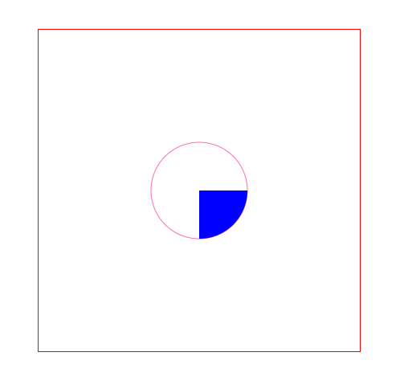

注意：和isPointInPath()方法一样，clip()方法同样不支持strokeRect()和fillRect()方法，需要使用rect()方法来代替。

#### save()和restore()

对于前面切割的例子来说，如果不取消切割区域的话，那么接下来绘制其他图形，都会是圆形。此时就需要使用save()和restore()方法来保存状态。

```js
const canvas = document.querySelector('#canvas')
const ctx = canvas.getContext('2d')

ctx.save()				// 保存状态
ctx.arc(200,200,60, 0, Math.PI * 2, true)
ctx.strokeStyle = 'hotpink'
ctx.stroke()    

ctx.clip()

ctx.beginPath()
ctx.fillStyle = 'blue'
ctx.fillRect(200,200,200,100)

ctx.restore()			// 恢复状态

ctx.beginPath()
ctx.fillRect(40,200,140,70)
```

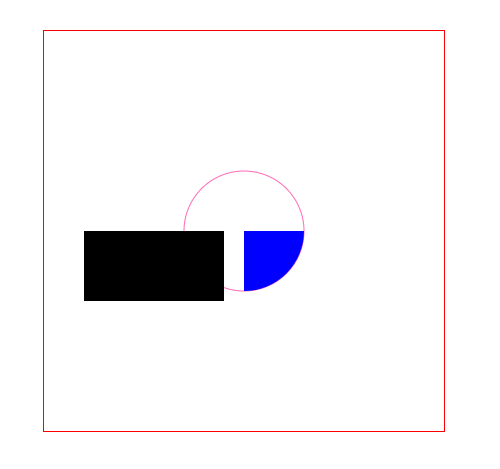

如果没有保存状态，也就是去掉save()和restore()，那么会出现如下结果：

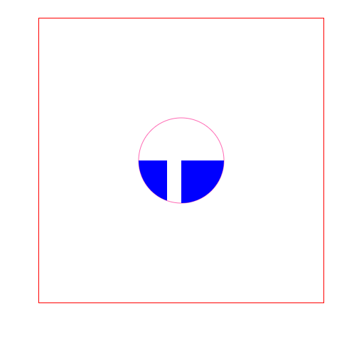

即便你使用clearRect()去清空画布后再去绘制，还是会限制在剪切区域内。

Canvas状态的保存和恢复，主要用于下面三种场合：

* 图形或图片裁切
* 图形或图片变形
* 以下属性改变的时候：fillStyle，font，globalAlpha，globalCompositeOperation、lineCap、lineJoin、lineWidth、miterLimit、shadowBlur、shadowColor、shadowOffsetX、shadowOffsetY、strokeStyle、textAlign、textBaseline

> 实际上，在进行绘图操作时，需要频繁设置这些值，很多时候只是想临时性地改变这些属性，比如说，可能需要在背景中绘制细网格线，然后用粗一些的线条在网格之上进行后续的绘图。在这些情况下，需要临时性的改变lineWidth属性，此时就可以使用save()和restore()方法来保存和恢复当前canvas绘图环境的所有属性。
>
> 另外，ctx.save()方法会将当前的绘图环境压入堆栈顶部。对应的restore()方法则会从堆栈顶部弹出一组状态信息，并据此恢复当前绘图环境的各个状态。这意味着可以嵌套式地调用save()和restore()方法。

#### 图形和图片变换

在canvas中，可以在变形操作之前使用save()来保存状态，变形之后使用restore()来恢复之前保存状态。

```js
const canvas = document.querySelector('#canvas')
const ctx = canvas.getContext('2d')

ctx.strokeRect(50,50,100,50)
ctx.translate(100, 100)
ctx.strokeRect(0,0,100,50)

ctx.translate(50,50)
ctx.strokeRect(0,0,100,50)
```

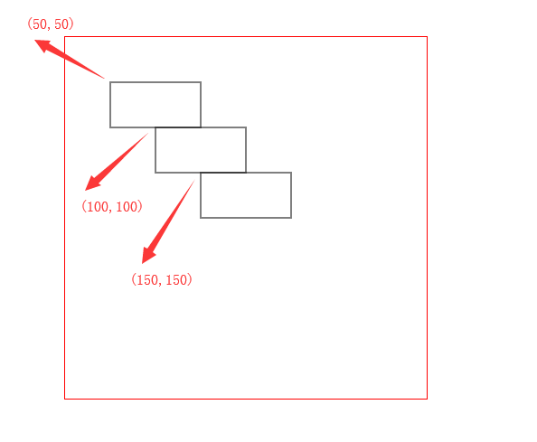

你会发现第二次平移是以第一次平移后为参考的，如果你想要以坐标原点为参考进行移动，此时就需要使用save()和restore()。

```js
const canvas = document.querySelector('#canvas')
const ctx = canvas.getContext('2d')

ctx.save()
ctx.strokeRect(50,50,100,50)
ctx.translate(100, 100)
ctx.strokeRect(0,0,100,50)
ctx.restore()
ctx.translate(50,50)
ctx.strokeRect(0,0,100,50)
```

#### 状态属性改变

当状态属性发生改变的时候，如果需要需要保存改变之前的状态也可以使用save()和restore()方法。这些属性具体如下：

* 填充效果：fillStyle
* 描边效果：strokeStyle
* 线条效果：lineCap、lineJoin、lineWidth、miterLimit
* 文本效果：font、textAlign、textBaseline
* 阴影效果：shadowBlur、shadowColor、shadowOffsetY、shadowOffsetX、
* 全局属性：globalAlpha、globalCompositeOperation

```js
const canvas = document.querySelector('#canvas')
const ctx = canvas.g
ctx.fillStyle = 'red'
ctx.font = '30px 微软雅黑'
ctx.save()
ctx.fillText('ugu', 50, 50)

ctx.fillStyle = 'blue'
ctx.fillText('ugu', 50, 100)

ctx.restore()

ctx.fillText('ugu', 50, 150)
```

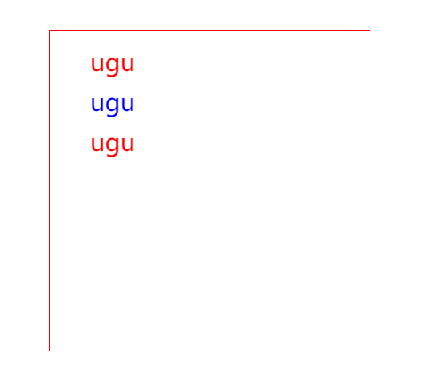

如果没有使用save()和restore()来保存状态。

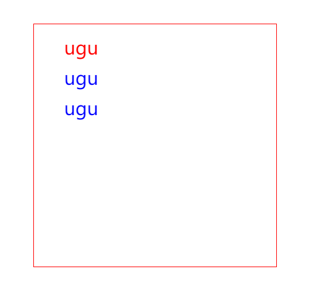

总的来说，save()和restore()不能保存路径状态，如果需要开启新路径，只能使用beginPath()。另外，也不能保存图形，也就是说清空画布就无法恢复之前绘制的内容。

### 其它应用

#### canvas对象

通过JavaScript获取的canvas对象上有一些属性和方法，具体如下：

* width：设置canvas的宽度
* height：设置canvas的高度
* getContext('2d')：获取canvas 2D上下文环境对象
* toDataURL()：获取canvas对象产生的位图的字符串

对于width、height属性，推荐使用这两个来设置canvas的宽高。而toDataURL()方法，常常用来将画布保存为一张图片，它接收一个type参数，用于表示输出的MIME类型，默认是`image/png`类型。

```js
const canvas = document.querySelector('#canvas')
const ctx = canvas.getContext('2d')

ctx.fillRect(50,50,200,100)

const btn = document.querySelector('#btn')
btn.onclick = function(){
    const src =  canvas.toDataURL('image/png')  
    const img = new Image()
    img.src = src
    img.onload = function(){
        document.body.appendChild(img)
    }
}
```

点击按钮会将canvas绘制的内容以图片的形式显示在页面中。

toDataURL()方法返回一个data URL，所谓data URL是指目前大多数浏览器能够识别的一种base64编码的URL，主要用于小型的、可以嵌入网页的、不需要从外部文件嵌入的数据。并且data URL的格式得到了多数浏览器的支持。

> 尽管在Chrome中可以直接右击canvas保存图片，但是不是所有的浏览器都支持这个功能。为了兼容性，一般做一次toDataURL操作。

#### globalAlpha

在canvas中，可以使用globalAlpha属性来定义Canvas环境的透明度。

```js
ctx.globalAlpha = 'value'
```

该属性的默认值为1（完全不透明），取值范围为0~1。注意：globalAlpha属性必须在图形绘制之前定义才有效，并且该属性会作用于整个画布，使用时要小心。

#### globalCompositeOperation

在canvas中，可以使用globalCompositeOperation属性来定义多个图形绘制时的交叉显示情况。对于层叠顺序来说，遵循后来居上的原则，后绘制的会覆盖先绘制的。 

```js
ctx.globalCompositeOperation = 属性值
```

具体属性值取值如下：

* source-over：默认值，新图形覆盖旧图形
* copy：只显示新图形，旧图形作透明处理
* darker：两种图形都显示，在重叠部分，颜色由两个图形的颜色值相减后形成
* destination-atop：只显示新图形与旧图形重叠部分以及新图形的其余部分，其他部分作透明处理
* destination-in：只显示旧图形中与新图形重叠部分，其他部分作透明处理
* destination-out：只显示旧图形中与新图形不重叠部分，其他部分作透明处理
* destination-over：与source-over属性相反，旧图形覆盖新图形
* lighter：两种图形都显示，在图形重叠部分，颜色由两个图形的颜色值相加后形成
* source-atop：只显示旧图形与新图形重叠部分以及旧图形的其余部分，其他部分作透明处理
* source-in：只显示新图形中与旧图形重叠部分，其他部分作透明处理
* source-out：只显示新图形中与旧图形不重叠部分，其余部分作透明处理
* xor：两种图形都绘制，其中重叠部分作透明处理

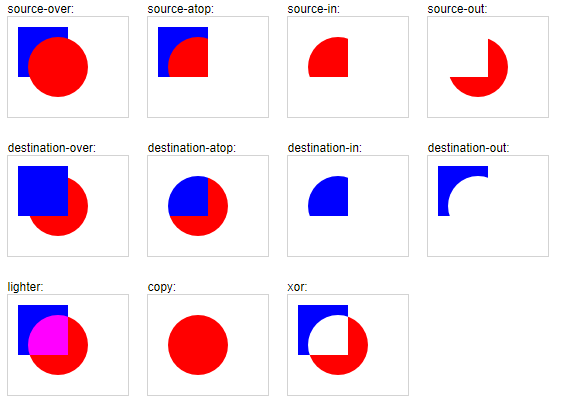

globalCompositeOperation属性定义的是整个画布的全局叠加效果，在使用时需要小心。