### 事件操作

在canvas中，常见的事件共有三种：鼠标事件、键盘事件和循环事件。通过这些事件，就可以开发出交互性更强的动画，并且用户也可以参与到Canvas的动画交互中来。

#### 鼠标事件

在canvas中，鼠标事件有如下三种：

* mousedown：鼠标按下
* mouseup：鼠标松开
* mousemove：鼠标移动

一般来说，mousedown和mouseup都是配合使用，先按下后松开。而mousemove可以配合mousedown和mouseup实现拖动效果。拖动效果实现很简单，先使用mousedown判断按下的元素，然后使用mousemove移动元素，最后使用mouseup停止拖动。

##### 获取鼠标位置

在进行鼠标操作时，往往需要获取鼠标位置。通过事件对象的pageX和pageY属性以及canvas画布相对于文档的偏移距离，就可以确定鼠标在画布上的相对坐标。遗憾的是，并不是所有浏览器都支持这个属性，所以还需要用到clientX和clientY属性。

为了使用方便，你可以封装成一个工具函数，用于兼容性获取鼠标位置。

```js
const tools = {}

tools.getMouse = function(canvas){
    const mouse = {x: 0, y: 0}
    
    canvas.addEventListener('mousemove', function(e){
        const ev = e || window.event
        
        let x,y
        // IE9以上
        if(ev.pageX && ev.pageY){
            x = e.pageX
            y = e.pageY
        }else {
            // IE9以下
            x = e.clientX 
                + document.body.scrollLeft || document.documentElement.scrollLeft
        	y = e.clientY 
                + document.body.scrollTop || document.documentElement.scrollTop
        }
        
        x -= canvas.offsetLeft
        y -= canvas.offsetTop
        
        mouse.x = x
        mouse.y = y
    })
    return mouse
}
export { tools }
```

```js
import { tools } from './tools'		// ES6模块化浏览器不支持，babel编译也不行。需要使用webpack

const canvas = document.querySelector('#canvas')
const text = document.querySelector('#text')

const mouse = tools.getMouse(canvas)

canvas.addEventListener('mousemove',function(){
    text.innerHTML = `鼠标当前位置：x=${mouse.x}，y=${mouse.y}`
})
```

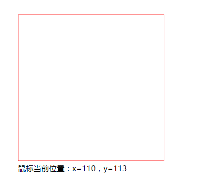

#### 键盘事件

在canvas中，常见的键盘事件有两种：

* 键盘按下：keydown
* 键盘松开：keyup

在实际开发中，keydown和keyup都是配合一起使用的。先是键盘按下，然后是键盘松开。

> canvas元素本身并不支持键盘事件，因此一般情况下都是使用window对象来实现Canvas中键盘事件的监听。

##### 获取移动方向

在进行键盘操作时，往往需要获取键盘按下的键名。通过事件对象的keyCode属性可以判断用户按下的键名。具体如下：

* W：87
* S：83
* A：65
* D：68
* ↑：38
* ↓：40
* ←：37
* →：39

```js
const tools = {}
tools.getKey = function(){
    const key = {}
    window.addEventListener('keydown',function(e){
        if(e.keyCode === 38 || e.keyCode === 87){
            key.direction = 'up'
        }else if(e.keyCode === 39 || e.keyCode === 68){
            key.direction = 'down'
        }else if(e.keyCode === 40 || e.keyCode === 83){
            key.direction = 'left'
        }else if(e.keyCode === 37 || e.keyCode === 65){
            key.direction = 'right'
        }else {
            ket.direction = ''
        }
    })
    return key
}
```

这样便可以获取到按键方向，从而对要操控的图形进行移动，这也是Canvas游戏开发的基础。

#### 循环事件

实现canvas动画，最先想到的应该是使用setInterval()来定时清空画布，然后重绘图形，从而达到动画的效果。但是这种方式的有个缺点：不能控制动画的帧率，并且存在性能问题。

而在canvas中，一般使用requestAnimationFrame()方法来实现循环，从而达到动画效果。和setInterval()不同的是，该方法不需要手动设置间隔时间，因为它会自动根据浏览器绘制的帧率进行调整。

```js
(function frame(){
    window.requestAnimationFrame(frame)
    ctx.clearRect(0,0,canvas.width,canvas.height)
	// ...
})
```

定义一个自执行函数frame，然后通过requestAnimationFrame()不断调用frame，从而实现循环效果

> 对于canvas动画效果来说，必须每次都清空画布然后重绘才可以实现，如果不清空的话，之前绘制的图形就会保存下来。

另外，requestAnimationFrame()方法不是所有浏览器都支持，所以你需要做兼容性处理：

```js
// animation.js
window.requestAnimationFrame = window.webkitRequestAnimationFrame ||
    window.mozRequestAnimationFrame ||
    window.msRequestAnimationFrame ||
    window.oRequestAnimationFrame ||
    function(callback){
    	return window.setTimeout(callback, 1000/60)	
	}
```

```js
const canvas = document.querySelector('#canvas')
const ctx = canvas.getContext('2d')

let x = 0
;(function frame(){
    const timer = requestAnimationFrame(frame)
	
    ctx.beginPath()
    ctx.clearRect(0,0,canvas.width,canvas.height)
    ctx.arc(x,100,50,0,Math.PI*2,true)
    ctx.closePath()
    ctx.fillStyle = 'hotpink'
    ctx.fill()
    
    x += 2
    if(x > canvas.width){
        cancelAnimationFrame(timer)
    }
})()
```

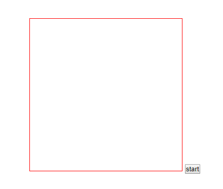

### 物理动画

物理动画，简单来说就是模拟现实世界的一种动画效果。在物理动画中，物体会遵循牛顿运动定律，如射击游戏中发射出去的子弹会随着重力而降落。

事实上，关于物理动画所需的数学和物理知识主要如下：

* 三角函数
* 匀速运动
* 加速运动
* 重力
* 摩擦力

但在学习之前，我们需要明白的是：canvas动画其实就是一个不断清除、重绘、清除、重绘的过程。用代码表示就是：

* clearRect()清除画布
* requestAnimationFrame()重绘

#### 三角函数

三角函数一般用于计算三角形中的边长和角度

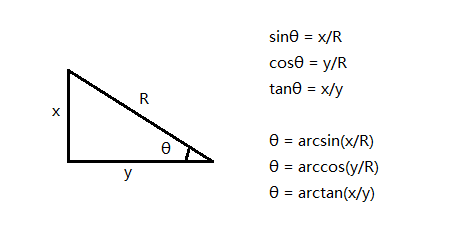

用代码表示如下：

```js
// 角度
sinθ = Math.sin(θ*Math.PI/180)
cosθ = Math.cos(θ*Math.PI/180)
tanθ = Math.tan(θ*Math.PI/180)

// 边长
θ = Math.asin(x/R)*(180/Math.PI)
θ = Math.acos(x/R)*(180/Math.PI)
θ = Math.atan(x/R)*(180/Math.PI)
```

> canvas中的角度都是用弧度来表，180度就写成Math.PI，360度就写成Math.PI*2。

##### Math.atan()和Math.atan2()

在三角函数中，可以使用反正切函数Math.atan()来求出两条直角边之间夹角的度数。不过正切函数Math.atan()，可能会出现一个度数对应两个夹角的情况。也就是说，此时你无法准确判断该度数对应的是哪一个夹角。

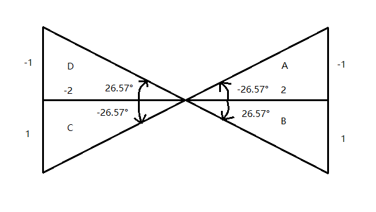

上图中有四个三角形：A、B、C、D。其中A、B的x轴坐标为正值，C、D的x轴坐标为负值，B、C的y轴坐标为正值，A、D的y轴坐标为负值。因此，对于四个内角来说，将会得到以下的正切值：

* tan(A) = -0.5
* tan(B) = 0.5
* tan(C) = -0.5
* tan(D) = 0.5

如果将0.5作为参数传入Math.atan()函数中，得到度数都会是26.57°，但是从图中你会看出度数是26.57°的三角形有两个，此时你就无法判断属于哪个三角形。

这个时候，就需要使用Math.atan2()函数，它不仅能求出两边之间的夹角，还能准确判断该度数对应的是哪一个夹角。

```js
Math.atan2(y ,x)
```

Math.atan2()函数接收两个参数，具体含义如下：

* y：表示对边的边长
* x：表示临边的边长

并且这两个参数都要指定正负。

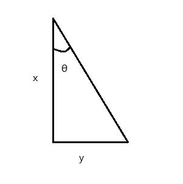

```js
console.log(Math.atan2(-1, -2))		// -2.677945044588987
console.log(Math.atan2(1, 2))		// 0.4636476090008061
```


在实际开发中，Math.atan2()函数用的比较多。例如：实现一个跟随鼠标旋转的箭头。

```js
// 绘制箭头类
function Arrow(x, y, color, angle, ctx){
    this.x = x || 0
    this.y = y || 0
    this.color = color || 'red'
    this.angle = angle || 0
    this.ctx = ctx
}
Arrow.prototype.fill = function(){
    this.ctx.save()
    this.ctx.translate(this.x, this.y)
    this.ctx.rotate(this.angle)
    this.ctx.fillStyle = this.color
    this.ctx.beginPath()
    this.ctx.moveTo(0, 15)
    this.ctx.lineTo(-50, 15)
    this.ctx.lineTo(-50, -15)
    this.ctx.lineTo(0, -15)
    this.ctx.lineTo(0, -35)
    this.ctx.lineTo(50, 0)
    this.ctx.lineTo(0, 35)
    this.ctx.closePath()
    this.ctx.fill()
    this.ctx.restore()
}

const canvas = document.querySelector('#canvas')
const ctx = canvas.getContext('2d')

const arrow = new Arrow(canvas.width / 2, canvas.height / 2, 'hotpink', 0, ctx)
arrow.fill()

canvas.addEventListener('mousemove', function(e){
    ctx.clearRect(0, 0, canvas.width, canvas.height)
    const x = e.pageX - canvas.offsetLeft
    const y = e.pageY - canvas.offsetTop

    const dx = x - canvas.width / 2
    const dy = y - canvas.height / 2

    arrow.angle = Math.atan2(dy, dx)
    arrow.fill()
}, false)
```

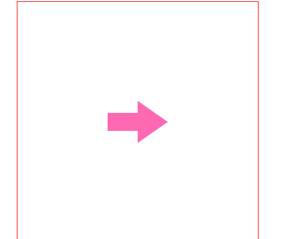

#### 三角函数应用

##### 两点间的距离

在canvas中，有两个任意点(x1, y1)和(x2, y2)，通过三角函数可以轻松计算这两个点之间的距离。

```js
const dx = x2 - x1
const dy = y2 - y1
const distance = Math.sqrt(dx * dx + dy * dy)
```

##### 圆周运动

在canvas中，圆周运动共有两种形式，即正圆运动和椭圆运动。

对于正圆运动来说，利用三角函数可以计算圆上任意点的坐标：

```js
const x = centerX + Math.cos(angle)*radius		
const y = centerY + Math.sin(angle)*radius		
```

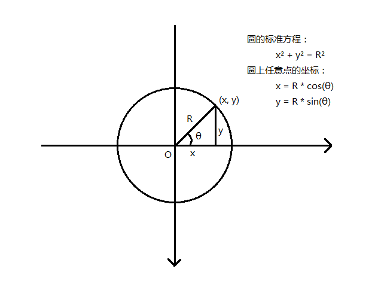

参数具体含义如下：

* centerX，centerY：表示圆心横坐标和纵坐标
* angle：表示角度，以弧度表示
* radius：表示圆的半径

```js
function Ball(x,y,radius,color){
    this.x = x || 0
    this.y = y || 0
    this.radius = radius || 12
    this.color = color || 'hotpink'
}

Ball.prototype.fill = function(ctx){
    ctx.save()
    ctx.translate(this.x, this.y)
    ctx.rotate(this.rotation)
    ctx.fillStyle = this.color
    ctx.beginPath()
    ctx.arc(0,0,this.radius,0,Math.PI*2, false)
    ctx.closePath()
    ctx.fill()
    ctx.restore()
}

const canvas = document.querySelector('#canvas')
const ctx = canvas.getContext('2d')

const ball = new Ball(100, 25)
const centerX = canvas.width / 2
const centerY = canvas.height / 2

const radius = 50
let angle = 0

;(function frame(){
    requestAnimationFrame(frame)
    ctx.clearRect(0,0,canvas.width,canvas.height)

    ctx.beginPath()
    ctx.arc(centerX, centerY, 50,0,Math.PI*2 ,false)
    ctx.closePath()
    ctx.stroke()

    ball.x = centerX + Math.cos(angle)*radius
    ball.y = centerY + Math.sin(angle)*radius

    ball.fill(ctx)
    angle += 0.05
})();
```

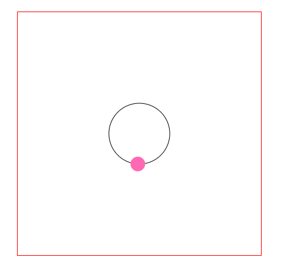

对于椭圆运动来说，半径是不同的，取而代之的是长半径和短半径。从椭圆的标准方程可以计算出，椭圆上任意点的坐标是：

```js
x = centerX + Math.cos(angle)*radiusX
y = centerY + Math.sin(angle)*radiusY
```

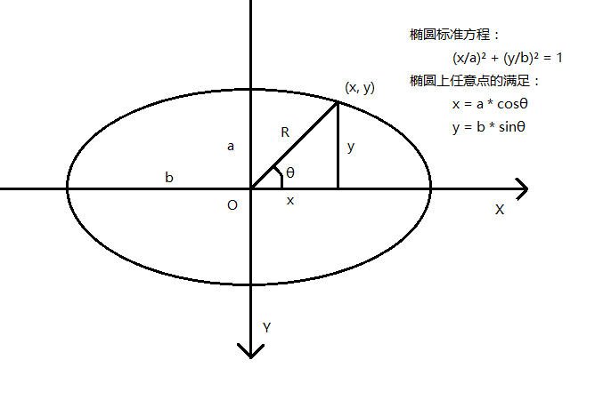

参数含义具体如下：

* centerX，centerY：表示椭圆中心横坐标和纵坐标
* angle：表示角度，以弧度表示
* radiusX，radiusY：表示椭圆长半径和短半径

```js
function BezierEllipse2(ctx, x, y, a, b){
    const k = .5522848,
          ox = a * k
    oy = b * k

    ctx.beginPath()
    ctx.moveTo(x - a, y)
    ctx.bezierCurveTo(x - a, y - oy, x - ox, y - b, x, y - b)
    ctx.bezierCurveTo(x + ox, y - b, x + a, y - oy, x + a, y)
    ctx.bezierCurveTo(x + a, y + oy, x + ox, y + b, x, y + b)
    ctx.bezierCurveTo(x - ox, y + b, x - a, y + oy, x - a, y)
    ctx.closePath()
    ctx.stroke()
}
function Ball(x,y,radius,color){
    this.x = x || 0
    this.y = y || 0
    this.radius = radius || 12
    this.color = color || 'hotpink'
}

Ball.prototype.fill = function(ctx){
    ctx.save()
    ctx.translate(this.x, this.y)
    ctx.rotate(this.rotation)
    ctx.fillStyle = this.color
    ctx.beginPath()
    ctx.arc(0,0,this.radius,0,Math.PI*2, false)
    ctx.closePath()
    ctx.fill()
    ctx.restore()
}

const canvas = document.querySelector('#canvas')
const ctx = canvas.getContext('2d')

const ball = new Ball(100, 25)
const centerX = canvas.width / 2
const centerY = canvas.height / 2

const radiusX = 120
const radiusY = 60
let angle = 0

;(function frame(){
    requestAnimationFrame(frame)
    ctx.clearRect(0,0,canvas.width,canvas.height)

    BezierEllipse2(ctx,centerX,centerY,120,60)

    ball.x = centerX + Math.cos(angle)*radiusX
    ball.y = centerY + Math.sin(angle)*radiusY
    ball.fill(ctx)
    angle += 0.05
})();

ctx.clearRect(0,0,canvas.width,canvas.height)

BezierEllipse2(ctx,centerX,centerY,120,60)

ball.x = centerX + Math.cos(angle)*radiusX
ball.y = centerY + Math.sin(angle)*radiusY
ball.fill(ctx)
```

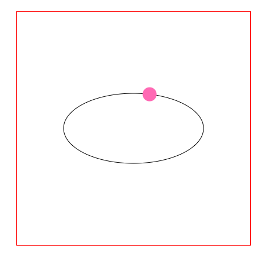

##### 波形运动

在canvas中，根据sin函数作用对象的不同，常见的波形运动可以分为三种：

* 作用于x轴坐标
* 作用于y轴坐标
* 作用于缩放属性（scaleX或scaleY）

当正弦函数sin作用于物体中心的x轴坐标时，物体会进行左右摇摆，类似于水草在水流中运动一样。

```js
const x = centerX + Math.sin(angle) * range
angle += speed
```

具体参数说明如下：

* centerX，centerY：表示物体中心坐标
* angle：表示角度
* range：表示振幅
* speed：表示角度改变的大小

```js
function Ball(x,y,radius,color){
    this.x = x || 0
    this.y = y || 0
    this.radius = radius || 12
    this.color = color || 'hotpink'
}

Ball.prototype.fill = function(ctx){
    ctx.save()
    ctx.translate(this.x, this.y)
    ctx.rotate(this.rotation)
    ctx.fillStyle = this.color
    ctx.beginPath()
    ctx.arc(0,0,this.radius,0,Math.PI*2, false)
    ctx.closePath()
    ctx.fill()
    ctx.restore()
}

const canvas = document.querySelector('#canvas')
const ctx = canvas.getContext('2d')

const ball = new Ball(100, 25)
const centerX = canvas.width / 2
const centerY = canvas.height / 2

let range = 80
let angle = 0

;(function frame(){
    requestAnimationFrame(frame)
    ctx.clearRect(0,0,canvas.width,canvas.height)

    ball.x = centerX + Math.cos(angle)*range
    ball.fill(ctx)

    angle += 0.05
})();
```

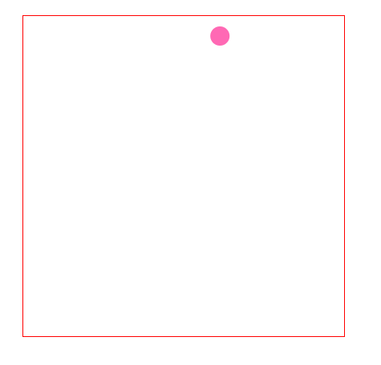

在实际开发中，可以将改变振幅，来改变摆动的幅度。

当正弦函数sin作用于物体中心的y轴坐标时，物体运动的轨迹刚好就是sin函数的波形。

```js
const y = centerY + Math.sin(angle) * range
angle += speed
```

```js
function Ball(x,y,radius,color){
    this.x = x || 0
    this.y = y || 0
    this.radius = radius || 12
    this.color = color || 'hotpink'
}

Ball.prototype.fill = function(ctx){
    ctx.save()
    ctx.translate(this.x, this.y)
    ctx.rotate(this.rotation)
    ctx.fillStyle = this.color
    ctx.beginPath()
    ctx.arc(0,0,this.radius,0,Math.PI*2, false)
    ctx.closePath()
    ctx.fill()
    ctx.restore()
}

const canvas = document.querySelector('#canvas')
const ctx = canvas.getContext('2d')

const ball = new Ball(100, 25)
const centerX = canvas.width / 2
const centerY = canvas.height / 2

let range = 80
let angle = 0

;(function frame(){
    requestAnimationFrame(frame)
    ctx.clearRect(0,0,canvas.width,canvas.height)
	
    ball.x += 1			// 让水平方向也运动
    ball.y = centerY + Math.sin(angle)*range
    ball.fill(ctx)

    angle += 0.05
})();
```


当正弦函数sin作用域物体的缩放属性时，物体会不断地方大然后缩小，从而产生一种脉冲动画的效果。

```js
const scaleX = 1 + Math.sin(angle) * range
const scaleY = 1 + Math.cos(angle) * range
angle += speed
```

具体参数说明如下：

* scaleX：表示元素x轴缩放的倍数
* scaleY：表示元素y轴缩放的倍数
* angle：表示角度，以弧度制表示
* speed：表示角度改变的大小

```js
function Ball(x,y,radius,color){
    this.x = x || 0
    this.y = y || 0
    this.radius = radius || 12
    this.color = color || 'hotpink'

    this.scaleX = 1
    this.scaleY = 1
}

Ball.prototype.fill = function(ctx){
    ctx.save()
    ctx.translate(this.x, this.y)
    ctx.scale(this.scaleX, this.scaleY)
    ctx.rotate(this.rotation)
    ctx.fillStyle = this.color
    ctx.beginPath()
    ctx.arc(0,0,this.radius,0,Math.PI*2, false)
    ctx.closePath()
    ctx.fill()
    ctx.restore()
}

const canvas = document.querySelector('#canvas')
const ctx = canvas.getContext('2d')

const ball = new Ball(200, 200)
const centerX = canvas.width / 2
const centerY = canvas.height / 2

let range = 0.5
let angle = 0

;(function frame(){
    requestAnimationFrame(frame)
    ctx.clearRect(0,0,canvas.width,canvas.height)

    ball.scaleX = 1 + Math.sin(angle) * range
    ball.scaleY = 1 + Math.sin(angle) * range

    ball.fill(ctx)

    angle += 0.05
})();
```

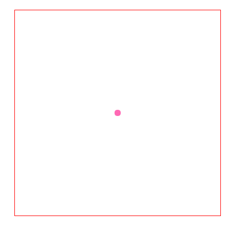

##### 匀速运动

匀速运动又称为匀速直线运动，指的是物体在一条直线上运动，并且物体在任何相等时间间隔内通过的位移是相等的。所以匀速运动要具备两个条件：速度大小和方向都必须相同。

匀速运动是一种加速度为0的运动，匀速运动只有一种，那就是匀速直线运动，匀速圆周运动并不是匀速运动，只能说是匀速率圆周运动或匀角速度运动。它的加速度是不为0的，所以它不属于匀速运动。

```js
object.x += vx
object.y += vy
```

```js
function Ball(x,y,radius,color){
    this.x = x || 0
    this.y = y || 0
    this.radius = radius || 12
    this.color = color || 'hotpink'
}

Ball.prototype.fill = function(ctx){
    ctx.save()
    ctx.translate(this.x, this.y)
    ctx.rotate(this.rotation)
    ctx.fillStyle = this.color
    ctx.beginPath()
    ctx.arc(0,0,this.radius,0,Math.PI*2, false)
    ctx.closePath()
    ctx.fill()
    ctx.restore()
}

const canvas = document.querySelector('#canvas')
const ctx = canvas.getContext('2d')

const ball = new Ball(200, 200)
const centerX = canvas.width / 2
const centerY = canvas.height / 2

const vx = 0.5 		// 定义增量

;(function frame(){
    requestAnimationFrame(frame)
    ctx.clearRect(0,0,canvas.width,canvas.height)

    ball.x += 1

    ball.fill(ctx)

    angle += vx
})();
```

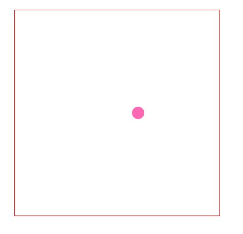

上例只能实现小球在x轴或y轴方向上的匀速运动，如果需要沿着任意方向做匀速运动，就需要使用速度的合成与分解了。

```js
vx = speed * Math.cos(angle * Math.PI / 180)
vy = speed * Math.sin(angle * Math.PI / 180)

object.x += vx
object.y += vy
```

具体参数说明如下：

* vx：分解后的x轴速度
* vy：分解后的y轴速度
* speed：合速度

```js
function Ball(x,y,radius,color){
    this.x = x || 0
    this.y = y || 0
    this.radius = radius || 12
    this.color = color || 'hotpink'
}

Ball.prototype.fill = function(ctx){
    ctx.save()
    ctx.translate(this.x, this.y)
    ctx.rotate(this.rotation)
    ctx.fillStyle = this.color
    ctx.beginPath()
    ctx.arc(0,0,this.radius,0,Math.PI*2, false)
    ctx.closePath()
    ctx.fill()
    ctx.restore()
}

const canvas = document.querySelector('#canvas')
const ctx = canvas.getContext('2d')

const ball = new Ball(200, 200)
const centerX = canvas.width / 2
const centerY = canvas.height / 2

const angle = 30 * Math.PI / 180
const vx = 1 * Math.cos(angle)
const vy = 1 * Math.sin(angle)

;(function frame(){
    requestAnimationFrame(frame)
    ctx.clearRect(0,0,canvas.width,canvas.height)

    ball.x += vx
    ball.y += vy
    ball.fill(ctx)
})();
```

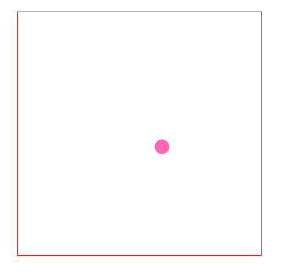

##### 加速运动

加速运动，指的是方向相同、速度大小变化的运动。速度递增的是加速运动，速度递减的减速运动。加速运动分为两种，一种是匀加速运动，另一种是变加速运动。所有加速运动，都有一个加速度。顾名思义，加速度就是指单位时间内速度改变的矢量。

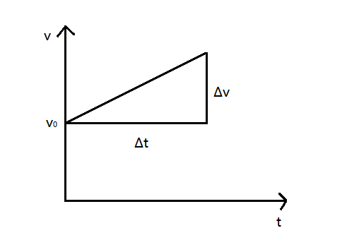

上图展示了一个匀加速运动过程，在Δt时间内，速度增加了Δv。

```js
vx += ax
vy += ay
object.x += vx
object.y += vy
```

具体参数说明如下：

* vx：表示x轴方向速度大小
* vy：表示y轴方向速度大小
* ax：表示x轴方向加速度
* ay：表示y轴方向加速度

其中，当ax大于0时，物体向右做匀加速运动；当ax小于0时，物体向左做匀加速运动；当ax等于0时，物体按原来速度运动。ay和ax同理。

```js
function Ball(x,y,radius,color){
    this.x = x || 0
    this.y = y || 0
    this.radius = radius || 12
    this.color = color || 'hotpink'
}

Ball.prototype.fill = function(ctx){
    ctx.save()
    ctx.translate(this.x, this.y)
    ctx.rotate(this.rotation)
    ctx.fillStyle = this.color
    ctx.beginPath()
    ctx.arc(0,0,this.radius,0,Math.PI*2, false)
    ctx.closePath()
    ctx.fill()
    ctx.restore()
}

const canvas = document.querySelector('#canvas')
const ctx = canvas.getContext('2d')

const ball = new Ball(50, 200)
const centerX = canvas.width / 2
const centerY = canvas.height / 2

const angle = 30 * Math.PI / 180

let vx = 0
let ax = 0.2

;(function frame(){
    requestAnimationFrame(frame)
    ctx.clearRect(0,0,canvas.width,canvas.height)

    ball.x += vx
    ball.fill(ctx)

    vx += ax
})();
```

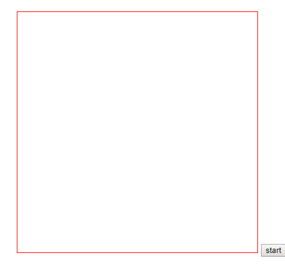

将ax设置为负值，你便可以得到匀减速运动。

上例只是实现在x轴或y轴上的加速运动，如果需要在任意方向上进行加速运动，就需要使用加速度的分解了。

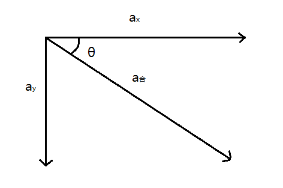

```js
const ax = a * Math.cos(angle * Math.PI / 180)
const ay = a * Math.sin(angle * Math.PI / 180)

vx += ax
vy += ay

object.x += vx
object.y += vy
```

具体参数说明如下：

* ax：表示x轴方向加速度
* ay：表示y轴方向加速度
* vx：表示x轴速度大小
* vy：表示y轴速度大小
* a：表示任意方向的加速度大小
* angle：表示加速度方向与x轴正方向的夹角

```js
function Ball(x,y,radius,color){
    this.x = x || 0
    this.y = y || 0
    this.radius = radius || 12
    this.color = color || 'hotpink'
}

Ball.prototype.fill = function(ctx){
    ctx.save()
    ctx.translate(this.x, this.y)
    ctx.rotate(this.rotation)
    ctx.fillStyle = this.color
    ctx.beginPath()
    ctx.arc(0,0,this.radius,0,Math.PI*2, false)
    ctx.closePath()
    ctx.fill()
    ctx.restore()
}

const canvas = document.querySelector('#canvas')
const ctx = canvas.getContext('2d')

const ball = new Ball(50, 200)
const centerX = canvas.width / 2
const centerY = canvas.height / 2

const angle = 30 * Math.PI / 180

let vx = 0
let vy = 0
let ax = 0.25 * Math.cos(angle)
let ay = 0.25 * Math.sin(angle)

function frame(){
    requestAnimationFrame(frame)
    ctx.clearRect(0,0,canvas.width,canvas.height)

    ball.x += vx
    ball.y += vy
    ball.fill(ctx)

    vx += ax
    vy += ay
}

document.querySelector('button').addEventListener('click', frame, false)
```


##### 重力

说起重力，就不得不说重力加速度。重力加速度是加速度中比较特殊的一种，重力加速度其实是由两个物体间的引力形成的。

在地球上，任何一个物体从空中下落到地面，都会有一个垂直向下的加速度。对于重力引起的运动，可以姑且看做是y轴正方向的加速运动。

```js
vy += gravity
object.y += vy
```

其中gravity是重力加速度。

```js
function Ball(x,y,radius,color){
    this.x = x || 0
    this.y = y || 0
    this.radius = radius || 12
    this.color = color || 'hotpink'
}

Ball.prototype.fill = function(ctx){
    ctx.save()
    ctx.translate(this.x, this.y)
    ctx.rotate(this.rotation)
    ctx.fillStyle = this.color
    ctx.beginPath()
    ctx.arc(0,0,this.radius,0,Math.PI*2, false)
    ctx.closePath()
    ctx.fill()
    ctx.restore()
}

const canvas = document.querySelector('#canvas')
const ctx = canvas.getContext('2d')

const ball = new Ball(50, 200)
const centerX = canvas.width / 2
const centerY = canvas.height / 2

const angle = 30 * Math.PI / 180

let vx = 4
let vy = -3				// 负值，所以会做抛物线运动
let gravity = 0.2

function frame(){
    requestAnimationFrame(frame)
    ctx.clearRect(0,0,canvas.width,canvas.height)

    ball.x += vx
    ball.y += vy
    ball.fill(ctx)

    vy += gravity
}

document.querySelector('button').addEventListener('click', frame, false)
```


了解重力之后，你就可以模拟小球自由降落到地面，然后反弹，循环仿佛，直到它最终速度为0并最终落在地面上。

```js
function Ball(x,y,radius,color){
    this.x = x || 0
    this.y = y || 0
    this.radius = radius || 12
    this.color = color || 'hotpink'
}

Ball.prototype.fill = function(ctx){
    ctx.save()
    ctx.translate(this.x, this.y)
    ctx.rotate(this.rotation)
    ctx.fillStyle = this.color
    ctx.beginPath()
    ctx.arc(0,0,this.radius,0,Math.PI*2, false)
    ctx.closePath()
    ctx.fill()
    ctx.restore()
}

const canvas = document.querySelector('#canvas')
const ctx = canvas.getContext('2d')

const ball = new Ball(100, 200)
const centerX = canvas.width / 2
const centerY = canvas.height / 2

const angle = 30 * Math.PI / 180


let vy = 0
const bounce = -0.8
const gravity =  0.2

function frame(){
    requestAnimationFrame(frame)
    ctx.clearRect(0,0,canvas.width,canvas.height)
    ball.y += vy
	// 边界检测
    if (ball.y > canvas.height - ball.radius) {
        ball.y = canvas.height - ball.radius
        vy *= bounce
    }

    ball.fill(ctx)

    vy += gravity
}

document.querySelector('button').addEventListener('click', frame, false)
```


上例中，小球接触到地面时会反弹，由于反弹会有速度损耗，并且小球y轴方向会变成反方向，因此需要乘以一个反弹系数bounce，这个值一般在-1~0之间。为什么不能是-2，-3呢？因为反弹会有速度损耗。

对于canvas动画循环中来说，有如下两点注意：

* 对于需要不断改变的变量，一般在动画循环之前先定义
* 对于需要不断改变的变量，一般在动画循环中图形绘制之后才递增或递减

对于上面例子，如果加上一个水平匀速运动，就会形成抛物线的运动轨迹。

```js
function Ball(x,y,radius,color){
    this.x = x || 0
    this.y = y || 0
    this.radius = radius || 12
    this.color = color || 'hotpink'
}

Ball.prototype.fill = function(ctx){
    ctx.save()
    ctx.translate(this.x, this.y)
    ctx.rotate(this.rotation)
    ctx.fillStyle = this.color
    ctx.beginPath()
    ctx.arc(0,0,this.radius,0,Math.PI*2, false)
    ctx.closePath()
    ctx.fill()
    ctx.restore()
}

const canvas = document.querySelector('#canvas')
const ctx = canvas.getContext('2d')

const ball = new Ball(50, 300)
const centerX = canvas.width / 2
const centerY = canvas.height / 2

const angle = 30 * Math.PI / 180


let vy = 0
let vx = 2
const bounce = -0.8
const gravity =  0.2

function frame(){
    requestAnimationFrame(frame)
    ctx.clearRect(0,0,canvas.width,canvas.height)
    ball.y += vy
    ball.x += vx

    if (ball.y > canvas.height - ball.radius) {
        ball.y = canvas.height - ball.radius
        vy *= bounce
    }

    ball.fill(ctx)

    vy += gravity
}

document.querySelector('button').addEventListener('click', frame, false)
```

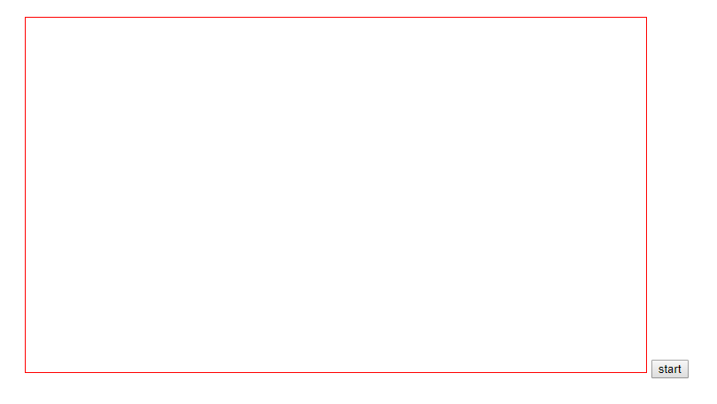

至于为什么y轴停止运动，水平方向还会继续运动。这是因为在x轴没有考虑摩擦力，而是一直匀速运动。

##### 摩擦力

摩擦力是指阻碍物体相对运动的力，其中摩擦力的方向与物体相对运动的方向相反。摩擦力只会改变物体速度大小，而不会改变它的方向。

```js
vx *= friction
vy *= friction

object.x += vx
object.y += vy
```

```js
function Ball(x,y,radius,color){
    this.x = x || 0
    this.y = y || 0
    this.radius = radius || 12
    this.color = color || 'hotpink'
}

Ball.prototype.fill = function(ctx){
    ctx.save()
    ctx.translate(this.x, this.y)
    ctx.rotate(this.rotation)
    ctx.fillStyle = this.color
    ctx.beginPath()
    ctx.arc(0,0,this.radius,0,Math.PI*2, false)
    ctx.closePath()
    ctx.fill()
    ctx.restore()
}

const canvas = document.querySelector('#canvas')
const ctx = canvas.getContext('2d')

const ball = new Ball(50, 388)
const centerX = canvas.width / 2
const centerY = canvas.height / 2

const angle = 30 * Math.PI / 180


let vx = 8
const friction = 0.95

function frame(){
    requestAnimationFrame(frame)
    ctx.clearRect(0,0,canvas.width,canvas.height)

    ball.x += vx

    ball.fill(ctx)

    vx *= friction

}

document.querySelector('button').addEventListener('click', frame, false)
```


上例只是介绍了水平方向的摩擦力，其实在任意方向上都可以加上摩擦力。只需要将速度分解，然后分别乘以摩擦系数即可。

### 边界检测

在前面的canvas动画中，物体一旦运动超过边界就会消失，如果想要再次看到效果只能刷新页面。但是在很多时候，都需要实现类似物体碰到画布边界就反弹的效果，此时就需要使用边界检测。

边界检测，顾名思义就是指物体所处运动环境的范围。在canvas动画中，我们可以为物体设置一个运动范围，这个运动范围可以是整个画布，也可以是画布的一部分。但是多数情况下，就会设置为整个画布。

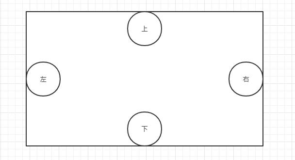

```js
if(ball.x < ball.radius) {
    // left
}else if(ball.x > canvas.width - ball.radius){
    // right
}else if(ball.y < ball.radius){
    // top
}else if(ball.y > canvas.height - ball.radius){
    // bottom
}
```

关于边界检测，主要是下面四个部分：

* 边界限制
* 边界生成
* 边界环绕
* 边界反弹

#### 边界限制

边界限制指的是通过边界检测的方法来限制物体的运动范围，使其无法超出这个运动范围，而只限在范围里面运动。

```js
function Ball(x,y,radius,color){
    this.x = x || 0
    this.y = y || 0
    this.radius = radius || 12
    this.color = color || 'hotpink'
}

Ball.prototype.fill = function(ctx){
    ctx.save()
    ctx.translate(this.x, this.y)
    ctx.rotate(this.rotation)
    ctx.fillStyle = this.color
    ctx.beginPath()
    ctx.arc(0,0,this.radius,0,Math.PI*2, false)
    ctx.closePath()
    ctx.fill()
    ctx.restore()
}
function getDirection(keycode){
    if(keycode === 87 || keycode === 38) {
        return 'up'
    }else if(keycode === 83 || keycode === 40){
        return 'down'
    }else if(keycode === 65 || keycode === 37){
        return 'left'
    }else if(keycode === 39 || keycode === 68){
        return 'right'
    }
}

function checkBorder(ball, canvas){
    if(ball.x < ball.radius) {
        ball.x = ball.radius
    }else if(ball.x > canvas.width - ball.radius){
        ball.x = canvas.width - ball.radius
    }else if(ball.y < ball.radius){
        ball.y = ball.radius
    }else if(ball.y > canvas.height - ball.radius){
        ball.y = canvas.height - ball.radius
    }
}

const canvas = document.querySelector('#canvas')
const ctx = canvas.getContext('2d')

const ball = new Ball(200, 200)
ball.fill(ctx)

window.addEventListener('keydown', function(e){
    ctx.clearRect(0, 0, canvas.width, canvas.height)
    const direction = getDirection(e.keyCode)

    if(direction === 'up') {
        ball.y -= 4
        checkBorder(ball, canvas)
        ball.fill(ctx)
    }else if(direction === 'down'){
        ball.y += 4
        checkBorder(ball, canvas)
        ball.fill(ctx)
    }else if(direction === 'left'){
        ball.x -= 4
        checkBorder(ball, canvas)
        ball.fill(ctx)
    }else if(direction === 'right'){
        ball.x += 4
        checkBorder(ball, canvas)
        ball.fill(ctx)
    }
})
```

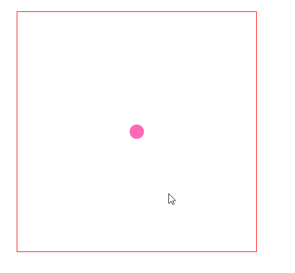

上例中，操作WASD或者上下左右便可以操作小球的运动。

#### 边界环绕

边界环绕是指当物体从一个边界消失后，它就会从对立的边界重新出现，从而形成一种环绕效果。简单来说，就是如果物体从左边界消失，然后就会从右边界出现；如果物体从上边界消失，就会从下边界出现。

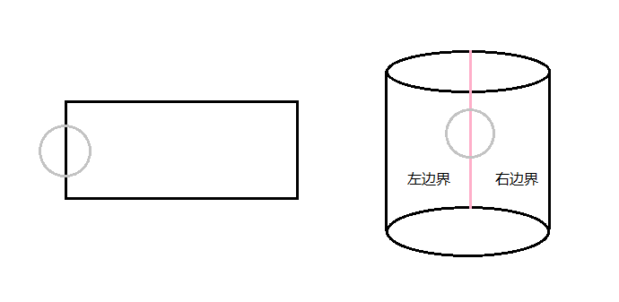

```js
if(ball.x < -ball.radius){
    // 小球完全超出左边界
}else if(ball.x > canvas.width + ball.radius){
    // 小球完全超出右边界
}else if(ball.y < -ball.radius){
    // 小球完全超出上边界
}else if(ball.y > canvas.height + ball.radius){
    // 小球完全超出下边界
}
```

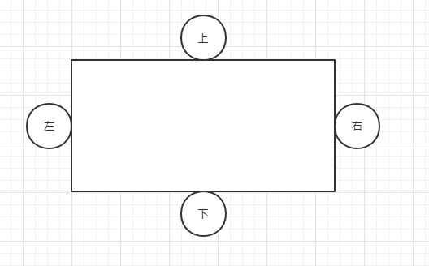

```js
function Ball(x,y,radius,color){
    this.x = x || 0
    this.y = y || 0
    this.radius = radius || 12
    this.color = color || 'hotpink'
}

Ball.prototype.fill = function(ctx){
    ctx.save()
    ctx.translate(this.x, this.y)
    ctx.rotate(this.rotation)
    ctx.fillStyle = this.color
    ctx.beginPath()
    ctx.arc(0,0,this.radius,0,Math.PI*2, false)
    ctx.closePath()
    ctx.fill()
    ctx.restore()
}

function checkBorder(ball, canvas){
    if(ball.x > canvas.width + ball.radius){
        // 小球完全超出右边界
        ball.x = -ball.radius
    }
}

const canvas = document.querySelector('#canvas')
const ctx = canvas.getContext('2d')

const ball = new Ball(50, 388)
ball.fill(ctx)

let vx = 2

function frame(){
    requestAnimationFrame(frame)
    ctx.clearRect(0,0,canvas.width,canvas.height)
    ball.x += vx
    checkBorder(ball, canvas)
    ball.fill(ctx)
}

document.querySelector('button').addEventListener('click', frame, false)
```

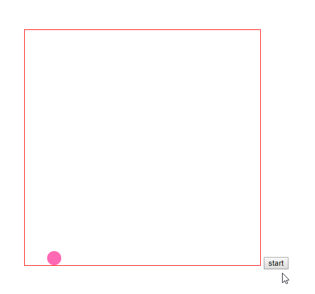

有了上面这个例子，你就可以自己加一些键盘操作，通过上下左右来进行边界环绕。

#### 边界生成

边界生成是指物体完全超出边界之后，会在最开始的位置重新生成。这种技巧可以用来创建喷泉以及各种例子效果，例如在喷泉效果中，水滴不断地飞溅出来，飞出canvas后会重新加入到水流的源头。

边界生成，可以源源不断地为canvas提供运动物体，而又不用担心canvas上的物体过多以至于影响浏览器的性能速度，因为物体的数量是固定不变的。

```js
if(ball.x < -ball.radius 
   || ball.x > canvas.width + ball.radius
	|| ball.y < -ball.radius
   || ball.y > canvas.height + ball.radius){
    // some code
}
```

当物体运动完全超出上下左右任一边界时，都表示物体已经完全超出边界。·

```js
function Ball(x,y,radius,color){
    this.x = x || 0
    this.y = y || 0
    this.radius = radius || 12
    this.color = color || 'hotpink'
}

Ball.prototype.fill = function(ctx){
    ctx.save()
    ctx.translate(this.x, this.y)
    ctx.rotate(this.rotation)
    ctx.fillStyle = this.color
    ctx.beginPath()
    ctx.arc(0,0,this.radius,0,Math.PI*2, false)
    ctx.closePath()
    ctx.fill()
    ctx.restore()
}
// 获取随机数
function getRandomColor(){
    return '#' + (function(color){
        return (color += '0123456789abcdef'[Math.floor(Math.random() * 16)]) 
        && (color.length === 6) ? color : arguments.callee(color)
    })('')
}

const canvas = document.querySelector('#canvas')
const ctx = canvas.getContext('2d')

// 存放小球数据
const balls = []
// 小球数量
const n = 50

for(let i = 0; i < n; i++) {
    const ball = new Ball(canvas.width/2, canvas.height/2, 5, getRandomColor())
    // 取-1~1之间的随机数
    ball.vx = Math.random() * 2 - 1 
    ball.vy = Math.random() * 2 - 1
    balls.push(ball)
}


function frame(){
    requestAnimationFrame(frame)
    ctx.clearRect(0,0,canvas.width,canvas.height)

    balls.forEach(ball => {
        // 当小球完全移出画布时，重新生成
        if(ball.x < -ball.radius 
           || ball.x > canvas.width + ball.radius
           || ball.y < -ball.radius
           || ball.y > canvas.height + ball.radius){
            ball.x = canvas.width / 2
            ball.y = canvas.height / 2
            ball.vx = Math.random() * 2 - 1 
            ball.vy = Math.random() * 2 - 1
        }
        ball.fill(ctx)
        ball.x += ball.vx
        ball.y += ball.vy
    })
}

document.querySelector('button').addEventListener('click', frame, false)
```


在上例的基础上可以加入重力影响：

```js
function Ball(x,y,radius,color){
    this.x = x || 0
    this.y = y || 0
    this.radius = radius || 12
    this.color = color || 'hotpink'
}

Ball.prototype.fill = function(ctx){
    ctx.save()
    ctx.translate(this.x, this.y)
    ctx.rotate(this.rotation)
    ctx.fillStyle = this.color
    ctx.beginPath()
    ctx.arc(0,0,this.radius,0,Math.PI*2, false)
    ctx.closePath()
    ctx.fill()
    ctx.restore()
}
// 获取随机颜色
function getRandomColor(){
    return '#' + (function(color){
        return (color += '0123456789abcdef'[Math.floor(Math.random() * 16)]) 
        && (color.length === 6) ? color : arguments.callee(color)
    })('')
}

const canvas = document.querySelector('#canvas')
const ctx = canvas.getContext('2d')

// 存放小球数据
const balls = []
// 小球数量
const n = 50

for(let i = 0; i < n; i++) {
    const ball = new Ball(canvas.width/2, canvas.height/2, 5, getRandomColor())
    // 取-1~1之间的随机数
    ball.vx = (Math.random() * 2 - 1) * 3  
    ball.vy = (Math.random() * 2 - 1) * 3 
    balls.push(ball)
}

const gravity = 0.15

function frame(){
    requestAnimationFrame(frame)
    ctx.clearRect(0,0,canvas.width,canvas.height)

    balls.forEach(ball => {
        // 当小球完全移出画布时，重新生成
        if(ball.x < -ball.radius 
           || ball.x > canvas.width + ball.radius
           || ball.y < -ball.radius
           || ball.y > canvas.height + ball.radius){
            ball.x = canvas.width / 2
            ball.y = canvas.height / 2
            ball.vx = (Math.random() * 2 - 1) * 3 
            ball.vy = (Math.random() * 2 - 1) * 3
        }
        ball.fill(ctx)
        ball.x += ball.vx
        ball.y += ball.vy

        ball.vy += gravity
    })
}

document.querySelector('button').addEventListener('click', frame, false)
```


#### 边界反弹

边界反弹是指物体触碰到边界之后就会反弹回来，就像现实世界中小球碰到墙壁反弹一样。

物体触碰边界就反弹，说明需要判断物体什么时候碰到边界，也就是需要进行边界检测。在物体碰到边界后，需要做两件事——保持它的位置不变和改变他的速度向量。

也就是说，如果物体碰到左边界或右边界的时候，就对vx（x轴速度）取反，而vy不变；如果物体碰到上边界或下边界的时候，就对vy（y轴速度）取反，而vx不变。

```js
if(ball.x < ball.radius){
   	// 碰到左边界
    ball.x = ball.radius
    vx = -vy
}else if(ball.x > canvas.width - ball.radius){
    // 碰到右边界
    ball.x = canvas.width - ball.radius
	vx = -vx
}else if(ball.y < ball.radius){
    // 碰到上边界
    ball.y = ball.radius
    vy = -vy
}else if(ball.y > canvas.height - ball.radius){
    ball.y = canvas.height - ball.radius
    vy = -vy
}
```

```js
function Ball(x,y,radius,color){
    this.x = x || 0
    this.y = y || 0
    this.radius = radius || 12
    this.color = color || 'hotpink'
}

Ball.prototype.fill = function(ctx){
    ctx.save()
    ctx.translate(this.x, this.y)
    ctx.rotate(this.rotation)
    ctx.fillStyle = this.color
    ctx.beginPath()
    ctx.arc(0,0,this.radius,0,Math.PI*2, false)
    ctx.closePath()
    ctx.fill()
    ctx.restore()
}
// 获取随机数
function getRandomColor(){
    return '#' + (function(color){
        return (color += '0123456789abcdef'[Math.floor(Math.random() * 16)]) 
        && (color.length === 6) ? color : arguments.callee(color)
    })('')
}

const canvas = document.querySelector('#canvas')
const ctx = canvas.getContext('2d')

const ball = new Ball(canvas/2, canvas/2)

let vx = (Math.random() * 2 - 1) * 3
let vy = (Math.random() * 2 - 1) * 3

function frame(){
    requestAnimationFrame(frame)
    ctx.clearRect(0,0,canvas.width,canvas.height)
    ball.x += vx
    ball.y += vy

    if(ball.x < ball.radius){
        // 碰到左边界
        ball.x = ball.radius
        vx = -vx
    }else if(ball.x > canvas.width - ball.radius){
        // 碰到右边界
        ball.x = canvas.width - ball.radius
        vx = -vx
    }else if(ball.y < ball.radius){
        // 碰到上边界
        ball.y = ball.radius
        vy = -vy
    }else if(ball.y > canvas.height - ball.radius){
        ball.y = canvas.height - ball.radius
        vy = -vy
    }
    ball.fill(ctx)
}
```

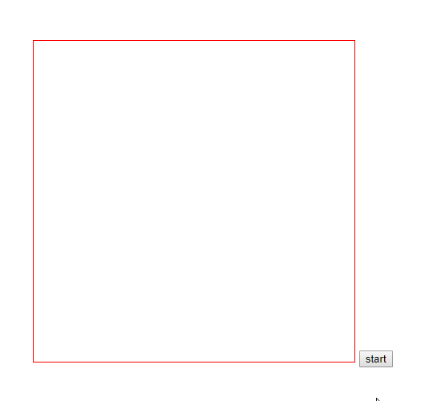

上例是一个单球反弹的例子，你也可以使用for循环来生成一个多球反弹的例子。对于多球反弹，你需要考虑球与球之间的碰撞，也就是下面要学习的碰撞检测。

### 碰撞检测

前面介绍的边界检测，是判断物体与边界之间是否发生碰撞。而在碰撞检测中，是判断物体与物体之间是否发生碰撞。

碰撞检测在动画开发和游戏开发中非常重要，而碰撞检测比较常用的是如下两个方法：

* 外接矩形判定法
* 外接圆判定法

#### 外接矩形判定法

外接矩形判定法是指如果检测物体是一个矩形或者近似矩形，就可以把这个物体抽象成一个矩形，然后用判断两个矩形是否碰撞的方法进行检测。所以这种方法判定通常由两个步骤——先找出物体的外接矩形，然后再对外接矩形进行碰撞检测。

想要找出物体的外接矩形，只需要将这个外接矩形的上边穿过物体的最顶端，下边穿过物体的最低端，左边穿过物体的最左端，右边穿过物体的最右端。

在实际开发中，对于五角星、心形这种不规则图形，如果单纯地从形状判断两个图形是否碰撞是十分困难的，因此一般都是直接根据它们的外接矩形来判断是否碰撞来检测。虽然这种方法存在一定误差，但是却可以大大减少计算的复杂度。

```js
function checkRect(rectA, rectB){
    return !(rectA.x + rectA.width < rectB.x ||
            rectB.x + rectB.width < rectA.x ||
            rectA.y + rectB.height < rectB.y ||
            rectb.y + rectB.height < rectA.y)
}
```

checkRect方法就是判断矩形是否碰撞的函数，如果返回true，表示两个矩形发生了碰撞。

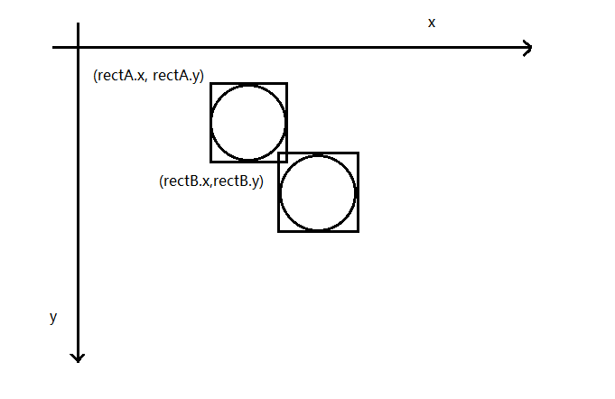

其中(rectA.x, rectA.y)是球A外接矩形的左上角坐标，(rectB.x, rectB.y)是球B外接矩形的左上角坐标。

当然，你还得需要一个获取圆形的外接矩形的函数：

```js
ball.prototype.getRect(){
    return {
        x: this.x - this.radius,
        y: this.y - this.radius,
        width: this.radius * 2,
        height: this.radius * 2
    }
}
```

```js
function Ball(x,y,radius,color){
    this.x = x || 0
    this.y = y || 0
    this.radius = radius || 12
    this.color = color || 'hotpink'
}

Ball.prototype.fill = function(ctx){
    ctx.save()
    ctx.translate(this.x, this.y)
    ctx.rotate(this.rotation)
    ctx.fillStyle = this.color
    ctx.beginPath()
    ctx.arc(0,0,this.radius,0,Math.PI*2, false)
    ctx.closePath()
    ctx.fill()
    ctx.restore()
}
Ball.prototype.getRect = function(){
    return {
        x: this.x - this.radius,
        y: this.y - this.radius,
        width: this.radius * 2,
        height: this.radius * 2
    }
}

function checkRect(rectA, rectB){
    return !(rectA.x + rectA.width < rectB.x || 
             rectB.x + rectB.width < rectA.x ||
             rectA.y + rectB.height < rectB.y ||
             rectB.y + rectB.height < rectA.y)
}

const canvas = document.querySelector('#canvas')
const ctx = canvas.getContext('2d')

const ballA = new Ball(canvas.width/2, canvas.height/2, 30)
const ballB = new Ball(canvas.width/1.5, canvas.height/1.5, 30)

ballA.fill(ctx)

ballB.fill(ctx)

const rectA = ballA.getRect()
const rectB = ballB.getRect()
ctx.strokeRect(rectA.x, rectA.y, rectA.width, rectA.height)
ctx.strokeRect(rectB.x, rectB.y, rectB.width, rectB.height)

canvas.addEventListener('mousemove', function(e){
    const x = e.pageX - canvas.offsetLeft
    const y = e.pageY - canvas.offsetTop

    ctx.clearRect(0, 0, canvas.width, canvas.height)
    ballB.x = x
    ballB.y = y

    const rectB = ballB.getRect()

    ballA.fill(ctx)
    ballB.fill(ctx)

    ctx.strokeRect(rectA.x, rectA.y, rectA.width, rectA.height)
    ctx.strokeRect(rectB.x, rectB.y, rectB.width, rectB.height)

    if(checkRect(rectA, rectB)){
        document.querySelector('p').innerHTML = '碰上了'
    }else {
        document.querySelector('p').innerHTML = '没碰上'
    }
})
```

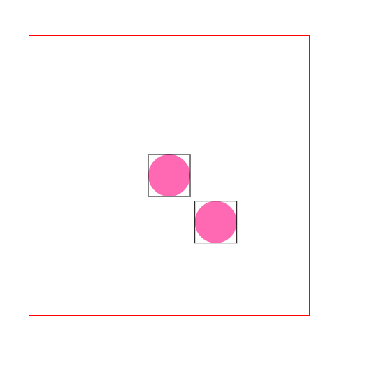

上例只是针对圆形的外接矩形来进行碰撞检测，对于其他不规则图形需要根据图形自身的特点来定义它的外接矩形。实际上，有了外接矩形判定法，你也可以实现一个简易版的俄罗斯方块。

#### 外接圆判定法

外接圆判定法是指如果检测物体是一个圆或者近似圆，就可以把这个物体抽象成一个圆，然后用判断两个圆是否碰撞的方法进行检测。所以这种方法判定通常由两个步骤——先找出物体的外接圆，然后再对外接圆进行碰撞检测。

想要找出物体的外接圆，只需要画一个包裹该图形的最小圆。

在实际开发中，何时使用外接矩形判定法，何时使用外接圆判定法，取决于物体的形状。总的来说，哪种方法误差小，就用哪种方法。

判断两个圆是否发生碰撞，只需要判断两个圆的圆心之间的距离。如果圆心距离大于等于两个圆的半径之和，则未发生碰撞；如果小于，则发生碰撞。

```js
function checkCircle(circleA, circleB){
    const dx = circleB.x - circleA.x
   	const dy = circleB.y - circleA.y
    const distance = Math.sqrt(dx*dx + dy*dy)
    return distance < circleA.radius + circleB.radius ? true : false
}
```

```js
function Ball(x,y,radius,color){
    this.x = x || 0
    this.y = y || 0
    this.radius = radius || 12
    this.color = color || 'hotpink'
}

Ball.prototype.fill = function(ctx){
    ctx.save()
    ctx.translate(this.x, this.y)
    ctx.rotate(this.rotation)
    ctx.fillStyle = this.color
    ctx.beginPath()
    ctx.arc(0,0,this.radius,0,Math.PI*2, false)
    ctx.closePath()
    ctx.fill()
    ctx.restore()
}

function checkCircle(circleA, circleB){
    const dx = circleB.x - circleA.x
    const dy = circleB.y - circleA.y
    const distance = Math.sqrt(dx*dx + dy*dy)
    return distance < circleA.radius + circleB.radius ? true : false
}

const canvas = document.querySelector('#canvas')
const ctx = canvas.getContext('2d')

const ballA = new Ball(canvas.width/2, canvas.height/2, 30)
const ballB = new Ball(canvas.width/1.5, canvas.height/1.5, 30)

ballA.fill(ctx)

ballB.fill(ctx)


canvas.addEventListener('mousemove', function(e){
    const x = e.pageX - canvas.offsetLeft
    const y = e.pageY - canvas.offsetTop

    ctx.clearRect(0, 0, canvas.width, canvas.height)
    ballB.x = x
    ballB.y = y


    ballA.fill(ctx)
    ballB.fill(ctx)

    if(checkCircle(ballA, ballB)){
        document.querySelector('p').innerHTML = '碰上了'
    }else {
        document.querySelector('p').innerHTML = '没碰上'
    }
})
```


#### 多物体碰撞

如果画布中只有少数物体，那么检测它们之间是否碰撞是非常简单的。但是当物体越来越多时，如何进行判断呢？除了保证不能遗漏之外，还需要考虑实现时的性能（避免重复检测）。

例如有三个物体A、B、C，那么需要检测两两之间碰撞情况一共是3种，即A-B，A-C，B-C。当物体为n时，那么需要检测的情况是：(n-1)*n/2。                    

以实际的例子来看，如果有五个小球：分别是ball0，ball1，ball2，ball3，ball4，它们都是运动的。如果想要检测它们之间是否碰撞，需要使用双重循环来两两进行碰撞检测。

```                                                                                                                                                                                                                                    js
balls.forEach(function(ballA,i){
    for(let j = i + 1; j < balls.length; j++){
        let ballB = balls[j]
        if(checkCircle(ballA, ballB)){
            // 如果碰撞
        }
    }
})
```

```js
function Ball(x,y,radius,color){
    this.x = x || 0
    this.y = y || 0
    this.radius = radius || 12
    this.color = color || 'hotpink'
}

Ball.prototype.fill = function(ctx){
    ctx.save()
    ctx.translate(this.x, this.y)
    ctx.rotate(this.rotation)
    ctx.fillStyle = this.color
    ctx.beginPath()
    ctx.arc(0,0,this.radius,0,Math.PI*2, false)
    ctx.closePath()
    ctx.fill()
    ctx.restore()
}
function getRandomColor(){
    return '#' + (function(color){
        return (color += '0123456789abcdef'[Math.floor(Math.random() * 16)]) 
        && (color.length === 6) ? color : arguments.callee(color)
    })('')
}

function checkCircle(circleA, circleB){
    const dx = circleB.x - circleA.x
    const dy = circleB.y - circleA.y
    const distance = Math.sqrt(dx*dx + dy*dy)
    return distance < circleA.radius + circleB.radius ? true : false
}

function checkBorder(ball, canvas){
    if(ball.x < ball.radius){
        // 碰到左边界
        ball.x = ball.radius
        ball.vx = -ball.vx
    }else if(ball.x > canvas.width - ball.radius){
        // 碰到右边界
        ball.x = canvas.width - ball.radius
        ball.vx = -ball.vx
    }else if(ball.y < ball.radius){
        // 碰到上边界
        ball.y = ball.radius
        ball.vy = -ball.vy
    }else if(ball.y > canvas.height - ball.radius){
        ball.y = canvas.height - ball.radius
        ball.vy = -ball.vy
    }
}

//绘制小球
function drawBall(ctx, ball){
    ball.fill(ctx)
    ball.x += ball.vx
    ball.y += ball.vy
}


const canvas = document.querySelector('#canvas')
const ctx = canvas.getContext('2d')

const balls = []
for(let i = 0; i < 20; i++){
    const ball = new Ball()
    ball.x = Math.random() * canvas.width
    ball.y = Math.random() * canvas.height

    ball.radius = 10
    ball.color = getRandomColor()
    ball.vx = Math.random() * 6 - 3
    ball.vy = Math.random() * 6 - 3
    balls.push(ball)
}


function frame(){
    requestAnimationFrame(frame)
    ctx.clearRect(0, 0 , canvas.width, canvas.height)

    balls.forEach(function(ballA, i){
        for(let j = i + 1; j < balls.length; j++){
            const ballB = balls[j]
            if(checkCircle(ballA, ballB)) {
                ballA.vx = -ballA.vx
                ballA.vy = -ballA.vy
                ballB.vx = -ballB.vx
                ballB.vy = -ballB.vy
            }
        }
        checkBorder(ballA, canvas)
        drawBall(ctx, ballA)
    })
}
document.querySelector('button').addEventListener('click', frame)
```


你图中你会发现有一个小bug，就是会出现小球重叠的情况。这种情况下，只需要在两两碰撞检测的时候加入一些偏移量。

```js
function Ball(x,y,radius,color){
    this.x = x || 0
    this.y = y || 0
    this.radius = radius || 12
    this.color = color || 'hotpink'
}

Ball.prototype.fill = function(ctx){
    ctx.save()
    ctx.translate(this.x, this.y)
    ctx.rotate(this.rotation)
    ctx.fillStyle = this.color
    ctx.beginPath()
    ctx.arc(0,0,this.radius,0,Math.PI*2, false)
    ctx.closePath()
    ctx.fill()
    ctx.restore()
}
function getRandomColor(){
    return '#' + (function(color){
        return (color += '0123456789abcdef'[Math.floor(Math.random() * 16)]) 
        && (color.length === 6) ? color : arguments.callee(color)
    })('')
}

function checkCircle(circleA, circleB){
    const dx = circleB.x - circleA.x
    const dy = circleB.y - circleA.y
    const distance = Math.sqrt(dx*dx + dy*dy)
    return distance < circleA.radius + circleB.radius ? true : false
}

function checkBorder(ball, canvas){
    if(ball.x < ball.radius){
        // 碰到左边界
        ball.x = ball.radius
        ball.vx = -ball.vx
    }else if(ball.x > canvas.width - ball.radius){
        // 碰到右边界
        ball.x = canvas.width - ball.radius
        ball.vx = -ball.vx
    }else if(ball.y < ball.radius){
        // 碰到上边界
        ball.y = ball.radius
        ball.vy = -ball.vy
    }else if(ball.y > canvas.height - ball.radius){
        ball.y = canvas.height - ball.radius
        ball.vy = -ball.vy
    }
}

//绘制小球
function drawBall(ctx, ball){
    ball.fill(ctx)
    ball.x += ball.vx
    ball.y += ball.vy
}


const canvas = document.querySelector('#canvas')
const ctx = canvas.getContext('2d')

const balls = []
for(let i = 0; i < 20; i++){
    const ball = new Ball()
    ball.x = Math.random() * canvas.width
    ball.y = Math.random() * canvas.height

    ball.radius = 10
    ball.color = getRandomColor()
    ball.vx = Math.random() * 6 - 3
    ball.vy = Math.random() * 6 - 3
    balls.push(ball)
}


function frame(){
    requestAnimationFrame(frame)
    ctx.clearRect(0, 0 , canvas.width, canvas.height)

    balls.forEach(function(ballA, i){
        for(let j = i + 1; j < balls.length; j++){
            const ballB = balls[j]
            if(checkCircle(ballA, ballB)) {
                ballA.vx = -ballA.vx
                ballA.vy = -ballA.vy
                ballB.vx = -ballB.vx
                ballB.vy = -ballB.vy
				
                // 强制偏移
                if(ballA.vx > 0){
                    ballA.x += 5
                }else {
                    ballA.x -= 5              
                }
                if(ballA.vy > 0){
                    ballA.y += 5
                }else {
                    ballA.y -= 5              
                }
                if(ballB.vx > 0){
                    ballB.x += 5
                }else {
                    ballB.x -= 5              
                }
                if(ballB.vy > 0){
                    ballB.y += 5
                }else {
                    ballB.y -= 5              
                }
            }
        }
        checkBorder(ballA, canvas)
        drawBall(ctx, ballA)
    })
}
document.querySelector('button').addEventListener('click', frame)
```

这样重叠的现象会减少很多。可以看出这样方法不是很优雅，如果想要彻底解决这个问题，需要学习后面的知识。

> 实际上，这种碰撞实现方法比较勉强，如果想要创建更加真实的碰撞效果，需要用到更加高级的动画技术，例如坐标旋转。

### 用户交互

在之前的学习中，大多数动画都是自动执行的，用户并没有太多机会参与到动画的交互中去。但是在实际开发中，有些情况是需要用户参与，以实现一些更加人性化的动画效果。

所谓用户交互，就是用户借助鼠标或键盘参与到Canvas动画中去，以实现一些互动的效果。一般来说，用户交互往往是借助两个事件来实现的——一个是键盘事件，另一个是鼠标事件。

其中键盘事件，前面已经介绍过了。而鼠标事件实现的功能会显得稍微复杂一些。在canvas中，鼠标事件可以用来实现以下三种用户交互的效果。

* 捕获物体
* 拖拽物体
* 投掷物体

#### 捕获物体

如果想要拖拽或投掷一个物体之前，都必须先捕获这个物体，只有捕获之后，才能进行各种操作。canvas图形的捕获和DOM元素的捕获是不同的，对于DOM元素，只需要通过document.getElementById就ok，而对于前者是行不通的。

在canvas中，对于物体的捕获，可以分为如下四种情况考虑：

* 矩形的捕获
* 圆形的捕获
* 多边形的捕获
* 不规则图形的捕获

多边形和不规则图形的捕获十分复杂，采用的方法是分离轴定力（SAT）和最小平移向量（MTV）。这些算法不会着重讲解，想要了解的自行百度。

##### 矩形的捕获

可以通过鼠标点击时的坐标来判断是否捕获了矩形。如果鼠标点击坐标落在矩形上，则说明捕获了这个矩形，反之，则没有捕获。

```js
if(mouse.x > rect.x 
   && mouse.x < rect.x + rect.width 
   && mouse.y > rect.y 
   && mouse.y < rect.y + rect.height){
    // 当捕获矩形时
}
```

具体参数说明如下：

* mouse.x：表示鼠标点击时的横坐标
* mouse.y：表示鼠标点击时的纵坐标
* rect.x：表示矩形左上角的横坐标
* rect.y：表示矩形左上角的纵坐标
* rect.width：表示矩形的宽度
* rect.height：表示矩形的高度

##### 圆形的捕获

可以通过鼠标点击时的坐标距离圆心坐标时的距离来判断是否捕获了圆心。如果距离小于半径，则说明捕获了这个矩形，反之，则没有捕获。

```js
dx = mouse.x - ball.x
dy = mouse.y - ball.y
distance = Math.sqrt(dx*dx + dy*dy)
if(distance < ball.radius){
    // 当捕获圆时
}
```

具体参数如下：

* mouse.x：表示鼠标点击时的横坐标
* mouse.y：表示鼠标点击时的纵坐标
* ball.x：表示小球圆心横坐标
* ball.y：表示小球圆心纵坐标
* distance：表示鼠标点击时坐标距离圆心之间的距离

##### 捕获静止物体

对于捕获物体来说，可以分为捕获静止物体和捕获运动物体。

```js
function Ball(x,y,radius,color){
    this.x = x || 0
    this.y = y || 0
    this.radius = radius || 12
    this.color = color || 'hotpink'
}

Ball.prototype.fill = function(ctx){
    ctx.save()
    ctx.translate(this.x, this.y)
    ctx.rotate(this.rotation)
    ctx.fillStyle = this.color
    ctx.beginPath()
    ctx.arc(0,0,this.radius,0,Math.PI*2, false)
    ctx.closePath()
    ctx.fill()
    ctx.restore()
}

function captureCircle(mouse, circle){
    const dx = mouse.x - circle.x
    const dy = mouse.y - circle.y
    const distance = Math.sqrt(dx*dx + dy*dy)
    return distance < circle.radius ? true : false
}

const canvas = document.querySelector('#canvas')
const ctx = canvas.getContext('2d')

const ball = new Ball(canvas.width / 2, canvas.height / 2, 50)

canvas.addEventListener('mousemove', function(e){
    ctx.clearRect(0, 0, canvas.width, canvas.height)
    ball.fill(ctx)
    const mouse = {}
    mouse.x = e.pageX - canvas.offsetLeft
    mouse.y = e.pageY - canvas.offsetTop

    if(captureCircle(mouse, ball)){
        document.querySelector('p').innerHTML = '进入'
    }else {
        document.querySelector('p').innerHTML = '离开'        
    }
})
```


##### 捕获运动物体

对于捕获运动物体来说，只要判断点击时的坐标是否落在小球上即可。

```js
function Ball(x,y,radius,color){
    this.x = x || 0
    this.y = y || 0
    this.radius = radius || 12
    this.color = color || 'hotpink'
}

Ball.prototype.fill = function(ctx){
    ctx.save()
    ctx.translate(this.x, this.y)
    ctx.rotate(this.rotation)
    ctx.fillStyle = this.color
    ctx.beginPath()
    ctx.arc(0,0,this.radius,0,Math.PI*2, false)
    ctx.closePath()
    ctx.fill()
    ctx.restore()
}

function captureCircle(mouse, circle){
    const dx = mouse.x - circle.x
    const dy = mouse.y - circle.y
    const distance = Math.sqrt(dx*dx + dy*dy)
    return distance < circle.radius ? true : false
}

const canvas = document.querySelector('#canvas')
const ctx = canvas.getContext('2d')

const ball = new Ball(0, canvas.height / 2, 20)
let isMouseDown = false
let vx = 3

canvas.addEventListener('mousedown', function(e){
    // 判断鼠标点击坐标是否位于小球上，如果是，则isMouseDown为true
    const mouse = {}
    mouse.x = e.pageX - canvas.offsetLeft
    mouse.y = e.pageY - canvas.offsetTop

    if(captureCircle(mouse, ball)){
        isMouseDown = true
    }
})

function frame(){
    requestAnimationFrame(frame)
    ctx.clearRect(0, 0, canvas.width, canvas.height)

    if(!isMouseDown) {
        ball.x += vx
    }
    ball.fill(ctx)
}
document.querySelector('button').addEventListener('click', frame)
```

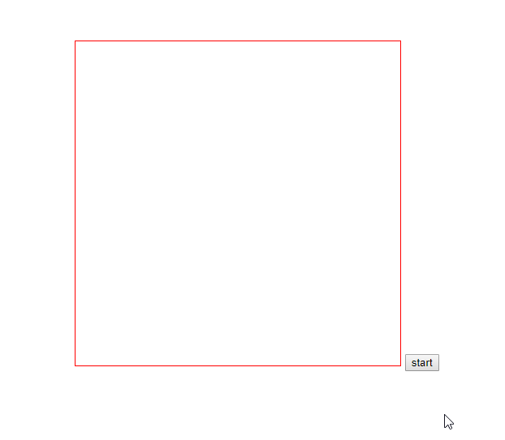

#### 拖拽物体

在canvas中，如果想要拖拽一个物体，一般需要如下三个步骤：

1. 捕获物体：在鼠标按下（mousedown）时，判断鼠标坐标是否落在物体上面，如果落在，就添加两个事件mousemove和mouseup
2. 移动物体：在鼠标移动（mousemove）中，更新物体坐标为鼠标坐标
3. 松开物体：在鼠标松开（mouseup）时，移除mouseup事件（自身事件也得移除）和mousemove事件

```js
canvas.addEvenListener('mousedown', function(e){
    document.addEventListener('mousemove', onMouseMove, false)
    document.addEventListener('mouseup', onMouseUp, false)
})
```

```js
function Ball(x,y,radius,color){
    this.x = x || 0
    this.y = y || 0
    this.radius = radius || 12
    this.color = color || 'hotpink'
}

Ball.prototype.fill = function(ctx){
    ctx.save()
    ctx.translate(this.x, this.y)
    ctx.rotate(this.rotation)
    ctx.fillStyle = this.color
    ctx.beginPath()
    ctx.arc(0,0,this.radius,0,Math.PI*2, false)
    ctx.closePath()
    ctx.fill()
    ctx.restore()
}

function getMouse(ele){
    const mouse = {x: 0, y: 0}
    ele.addEventListener('mousemove', function(e){
        mouse.x = e.pageX - ele.offsetLeft
        mouse.y = e.pageY - ele.offsetTop
    })
    return mouse
}

function checkMouse(mouse){
    const dx = mouse.x - ball.x
    const dy = mouse.y - ball.y
    const distance = Math.sqrt(dx * dx + dy * dy)

    return distance < ball.radius ? true : false
}

const canvas = document.querySelector('#canvas')
const ctx = canvas.getContext('2d')

const ball = new Ball(canvas.width / 2, canvas.height / 2, 30)
ball.fill(ctx)

const mouse = getMouse(canvas)			// 先执行

canvas.addEventListener('mousedown', function(){
    console.log(checkMouse(mouse))
    if (checkMouse(mouse)) {
        document.addEventListener('mousemove', onMouseMove, false)
        document.addEventListener('mouseup', onMouseUp, false)
    }
})

function onMouseMove(){
    ball.x = mouse.x
    ball.y = mouse.y
}

function onMouseUp(){
    document.removeEventListener('mousemove', onMouseMove, false)
    document.removeEventListener('mouseup', onMouseUp, false)
}				

;(function frame(){
    requestAnimationFrame(frame)
    ctx.clearRect(0, 0, canvas.width, canvas.height)
    ball.fill(ctx)
})();
```

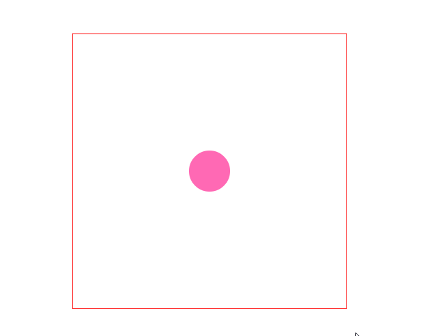

上面的代码虽然实现了拖拽效果，实际上却有一个bug——尽管你不是从小球中心点开始拖拽，拖拽后的鼠标点依然会落在小球的中心，因此我们还需要把鼠标距离小球中心的位置给计算出来，然后在拖拽后还原。

```js
function Ball(x,y,radius,color){
    this.x = x || 0
    this.y = y || 0
    this.radius = radius || 12
    this.color = color || 'hotpink'
}

Ball.prototype.fill = function(ctx){
    ctx.save()
    ctx.translate(this.x, this.y)
    ctx.rotate(this.rotation)
    ctx.fillStyle = this.color
    ctx.beginPath()
    ctx.arc(0,0,this.radius,0,Math.PI*2, false)
    ctx.closePath()
    ctx.fill()
    ctx.restore()
}

function getMouse(ele){
    const mouse = {x: 0, y: 0}
    ele.addEventListener('mousemove', function(e){
        mouse.x = e.pageX - ele.offsetLeft
        mouse.y = e.pageY - ele.offsetTop
    })
    return mouse
}

function checkMouse(mouse){
    const dx = mouse.x - ball.x
    const dy = mouse.y - ball.y
    const distance = Math.sqrt(dx * dx + dy * dy)

    return distance < ball.radius ? true : false
}

const canvas = document.querySelector('#canvas')
const ctx = canvas.getContext('2d')

const ball = new Ball(canvas.width / 2, canvas.height / 2, 30)
ball.fill(ctx)

const mouse = getMouse(canvas)			// 先执行

let dx = 0,				// 计算距离
    dy = 0

canvas.addEventListener('mousedown', function(){
    if (checkMouse(mouse)) {
        dx = mouse.x - ball.x
        dy = mouse.y - ball.y
        document.addEventListener('mousemove', onMouseMove, false)
        document.addEventListener('mouseup', onMouseUp, false)
    }
})

function onMouseMove(){
    ball.x = mouse.x - dx
    ball.y = mouse.y - dy
}

function onMouseUp(){
    document.removeEventListener('mousemove', onMouseMove, false)
    document.removeEventListener('mouseup', onMouseUp, false)
}				

;(function frame(){
    requestAnimationFrame(frame)
    ctx.clearRect(0, 0, canvas.width, canvas.height)
    ball.fill(ctx)
})();
```

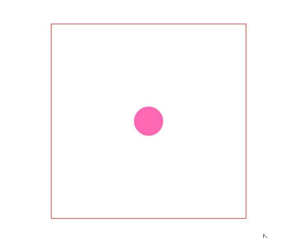

你会看到已经没有那个bug了，当然你还可以在这个例子上加入边界检测等来完善一下。

#### 抛掷物体

抛掷物体就是用鼠标选中一个物体，拖拽它向某个方向移动，松开鼠标后物体会沿着拖拽的方向继续前进。在抛掷物体时，必须在拖拽物体的过程中计算物体的速度向量，并且在释放物体时将这个速度向量赋给物体。

例如：如果你以每帧10px的速度向左拖拽小球，那么在你释放小球时，它的速度向量应该是vx=-10。如果你以每帧10px的速度向下拖拽小球，那么在你释放小球时，它的速度向量应该为vy=10，以此类推。

在拖拽物体时，它会在每一帧中拥有一个新的位置。用新位置减去旧位置就得到每一帧中物体的移动速度。

```js
vx = ball.x - oldX
vy = ball.y - oldY
```

```js
function Ball(x,y,radius,color){
    this.x = x || 0
    this.y = y || 0
    this.radius = radius || 12
    this.color = color || 'hotpink'
}

Ball.prototype.fill = function(ctx){
    ctx.save()
    ctx.translate(this.x, this.y)
    ctx.rotate(this.rotation)
    ctx.fillStyle = this.color
    ctx.beginPath()
    ctx.arc(0,0,this.radius,0,Math.PI*2, false)
    ctx.closePath()
    ctx.fill()
    ctx.restore()
}

function getMouse(ele){
    const mouse = {x: 0, y: 0}
    ele.addEventListener('mousemove', function(e){
        mouse.x = e.pageX - ele.offsetLeft
        mouse.y = e.pageY - ele.offsetTop
    })
    return mouse
}

function checkMouse(mouse){
    const dx = mouse.x - ball.x
    const dy = mouse.y - ball.y
    const distance = Math.sqrt(dx * dx + dy * dy)

    return distance < ball.radius ? true : false
}

const canvas = document.querySelector('#canvas')
const ctx = canvas.getContext('2d')

const ball = new Ball(canvas.width / 2, canvas.height / 2, 30)
ball.fill(ctx)

const mouse = getMouse(canvas)			// 先执行

let dx = 0,					
    dy = 0

let oldX = 0,				// 旧坐标
    oldY = 0

let vx = 0,					// 初始速度
    vy = 0 

let isMouseDown = false			// 是否处于按下鼠标的状态

canvas.addEventListener('mousedown', function(){
    if (checkMouse(mouse)) {
        isMouseDown = true

        oldX = mouse.x
        oldY = mouse.y

        dx = mouse.x - ball.x
        dy = mouse.y - ball.y
        document.addEventListener('mousemove', onMouseMove, false)
        document.addEventListener('mouseup', onMouseUp, false)
    }
})

function onMouseMove(){
    ball.x = mouse.x - dx
    ball.y = mouse.y - dy
}

function onMouseUp(){
    isMouseDown = false
    document.removeEventListener('mousemove', onMouseMove, false)
    document.removeEventListener('mouseup', onMouseUp, false)
}				

;(function frame(){
    requestAnimationFrame(frame)
    ctx.clearRect(0, 0, canvas.width, canvas.height)

    if(isMouseDown){
        vx = ball.x - oldX
        vy = ball.y - oldY

        oldX = ball.x
        oldY = ball.y
    }else {
        ball.x += vx
        ball.y += vy
    }

    ball.fill(ctx)
})();
```

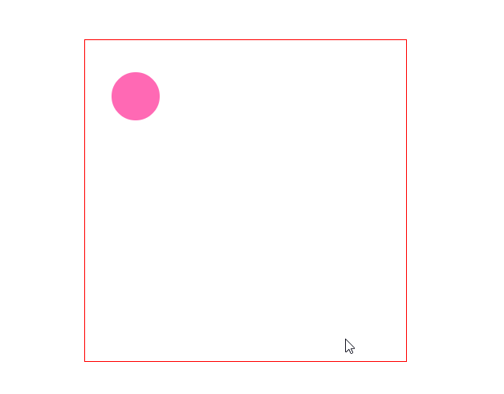

当然你可以在这个例子的基础上加入边界检测，进一步优化投掷功能。

```js
function Ball(x,y,radius,color){
    this.x = x || 0
    this.y = y || 0
    this.radius = radius || 12
    this.color = color || 'hotpink'
}

Ball.prototype.fill = function(ctx){
    ctx.save()
    ctx.translate(this.x, this.y)
    ctx.rotate(this.rotation)
    ctx.fillStyle = this.color
    ctx.beginPath()
    ctx.arc(0,0,this.radius,0,Math.PI*2, false)
    ctx.closePath()
    ctx.fill()
    ctx.restore()
}

function getMouse(ele){
    const mouse = {x: 0, y: 0}
    ele.addEventListener('mousemove', function(e){
        mouse.x = e.pageX - ele.offsetLeft
        mouse.y = e.pageY - ele.offsetTop
    })
    return mouse
}

function checkMouse(mouse){
    const dx = mouse.x - ball.x
    const dy = mouse.y - ball.y
    const distance = Math.sqrt(dx * dx + dy * dy)

    return distance < ball.radius ? true : false
}

const canvas = document.querySelector('#canvas')
const ctx = canvas.getContext('2d')

const ball = new Ball(canvas.width / 2, canvas.height / 2, 30)
ball.fill(ctx)

const mouse = getMouse(canvas)			// 先执行

let dx = 0,					
    dy = 0

let oldX = 0,				// 旧坐标
    oldY = 0

let vx = 0,					// 初始速度
    vy = 0 

let isMouseDown = false			// 是否处于按下鼠标的状态

canvas.addEventListener('mousedown', function(){
    if (checkMouse(mouse)) {
        isMouseDown = true

        oldX = mouse.x
        oldY = mouse.y

        dx = mouse.x - ball.x
        dy = mouse.y - ball.y
        document.addEventListener('mousemove', onMouseMove, false)
        document.addEventListener('mouseup', onMouseUp, false)
    }
})

function onMouseMove(){
    ball.x = mouse.x - dx
    ball.y = mouse.y - dy
}

function onMouseUp(){
    isMouseDown = false
    document.removeEventListener('mousemove', onMouseMove, false)
    document.removeEventListener('mouseup', onMouseUp, false)
}				

;(function frame(){
    requestAnimationFrame(frame)
    ctx.clearRect(0, 0, canvas.width, canvas.height)

    if(isMouseDown){
        vx = ball.x - oldX
        vy = ball.y - oldY

        oldX = ball.x
        oldY = ball.y
    }else {
        ball.x += vx
        ball.y += vy

        // 边界反弹
        if(ball.x > canvas.width - ball.radius){
            ball.x = canvas.width - ball.radius
            vx = -vx
        }else if(ball.x < ball.radius){
            ball.x = ball.radius
            vx = -vx
        }else if(ball.y > canvas.height - ball.radius){
            ball.y = canvas.height - ball.radius
            vy = -vy
        }else if(ball.y < ball.radius){
            ball.y = ball.radius
            vy = -vy
        }
    }

    ball.fill(ctx)
})();
```

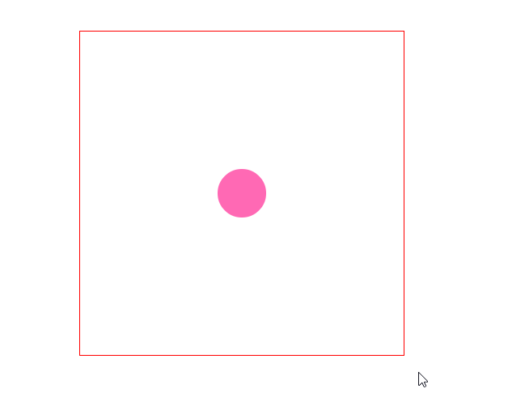

当然你可以在此例的基础上加入重力和反弹消耗来进一步完善。

### 高级动画

缓动动画和弹性动画都是把一个物体从已有位置移动到目标位置的动画，只不过前者是指物体滑动到目标点就停下来，而弹性动画是指物体来回地反弹几下，最终停在目标点。

不止是canvas，JavaScript DOM操作中也有缓动动画和弹性动画，它们在实现思路上基本一致，只不过语法不同。

#### 缓动动画

缓动动画，是指带有一定缓冲效果的动画。在动画过程中，物体在某一段事件会渐进加速或渐进减速，从而让物体运动看起来更加逼真。

缓动动画分为两种——缓入动画和缓出动画。在canvas中，想要实现缓动动画，一般需要以下五个步骤：

1. 定义一个0~1之间的缓动系数
2. 计算出物体与终点之间的距离
3. 计算出当前速度，其中当前速度 = 距离 * 缓动系数
4. 计算新的位置，其中新的位置 = 当前位置 + 当前速度
5. 重复执行第2~4步，直到物体达到目标

```js
const targetX = 任意位置
const targetY = 任意位置

let vx = (targetX - object.x) * easing
let vy = (targetY - object.y) * easing
```

具体参数说明如下：

* targetX：表示目标位置的横坐标
* targetY：表示目标位置的纵坐标
* easing：表示缓动系数
* vx：表示物体在x轴方向上的速度
* vy：表示物体在y轴方向上的速度

```js
function Ball(x,y,radius,color){
    this.x = x || 0
    this.y = y || 0
    this.radius = radius || 12
    this.color = color || 'hotpink'
}

Ball.prototype.fill = function(ctx){
    ctx.save()
    ctx.translate(this.x, this.y)
    ctx.rotate(this.rotation)
    ctx.fillStyle = this.color
    ctx.beginPath()
    ctx.arc(0,0,this.radius,0,Math.PI*2, false)
    ctx.closePath()
    ctx.fill()
    ctx.restore()
}

const canvas = document.querySelector('#canvas')
const ctx = canvas.getContext('2d')

const ball = new Ball(20, canvas.height / 2, 20)
ball.fill(ctx)

const targetX = canvas.width * (3 / 4)
const easing = 0.05

function frame(){
    requestAnimationFrame(frame)
    ctx.clearRect(0, 0, canvas.width, canvas.height)

    const vx = (targetX - ball.x) * easing
    ball.x += vx
    ball.fill(ctx)
}
document.querySelector('button').addEventListener('click', frame)
```

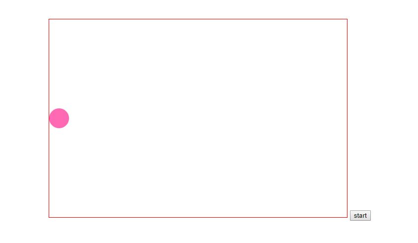

从例子中可以看出，缓动动画（只针对缓出动画）和摩擦力动画非常相似，都是速度逐渐减少直至停止，不过两者有本质区别：在摩擦力动画中，每一帧中当前速度等于上一帧速度乘以摩擦系数，其中速度是按照固定比例改变的；但是在缓冲动画中，每一帧中，当前速度等于距离乘以缓动系数，其中速度并不是按照固定比例改变的。

在实际开发中，一般更倾向于使用缓冲动画，因为相对于摩擦力动画，后者更加自然平滑。

```js
function Ball(x,y,radius,color){
    this.x = x || 0
    this.y = y || 0
    this.radius = radius || 12
    this.color = color || 'hotpink'
}

Ball.prototype.fill = function(ctx){
    ctx.save()
    ctx.translate(this.x, this.y)
    ctx.rotate(this.rotation)
    ctx.fillStyle = this.color
    ctx.beginPath()
    ctx.arc(0,0,this.radius,0,Math.PI*2, false)
    ctx.closePath()
    ctx.fill()
    ctx.restore()
}

const canvas = document.querySelector('#canvas')
const ctx = canvas.getContext('2d')

const ball = new Ball(50, 50, 20)
ball.fill(ctx)

const targetX = canvas.width * (3 / 4)
const targetY = canvas.height * (3 / 4)
const easing = 0.05

function frame(){
    requestAnimationFrame(frame)
    ctx.clearRect(0, 0, canvas.width, canvas.height)

    const vx = (targetX - ball.x) * easing
    const vy = (targetY - ball.y) * easing
    ball.x += vx
    ball.y += vy
    ball.fill(ctx)
}
document.querySelector('button').addEventListener('click', frame)
```

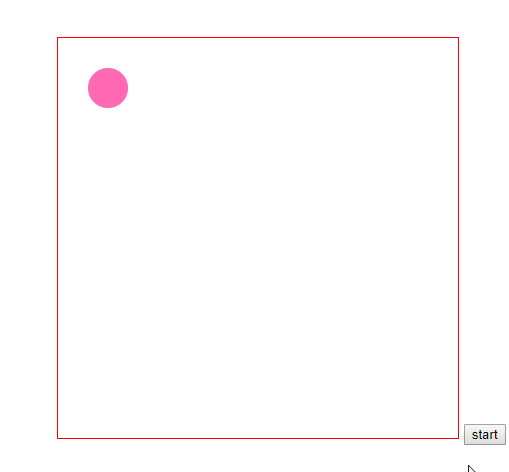

有了缓冲动画，在前面的小球追随鼠标的例子中，你可以加入缓冲动画使得看起来不是那么僵硬。

```js
function Ball(x,y,radius,color){
    this.x = x || 0
    this.y = y || 0
    this.radius = radius || 12
    this.color = color || 'hotpink'
}

Ball.prototype.fill = function(ctx){
    ctx.save()
    ctx.translate(this.x, this.y)
    ctx.rotate(this.rotation)
    ctx.fillStyle = this.color
    ctx.beginPath()
    ctx.arc(0,0,this.radius,0,Math.PI*2, false)
    ctx.closePath()
    ctx.fill()
    ctx.restore()
}

const canvas = document.querySelector('#canvas')
const ctx = canvas.getContext('2d')

const bigBall = new Ball(100, 100, 40, 'red')
const smallBall = new Ball(100, 100, 20, 'blue')

bigBall.fill(ctx)
smallBall.fill(ctx)

let targetX = 0,
    targetY = 0

const easing = 0.05

canvas.addEventListener('mousemove', function(e){
    targetX = e.pageX - canvas.offsetLeft
    targetY = e.pageY - canvas.offsetTop
})

function frame(){
    requestAnimationFrame(frame)
    ctx.clearRect(0, 0, canvas.width, canvas.height)

    const vx = (targetX - bigBall.x) * easing
    const vy = (targetY - bigBall.y) * easing

    const smallBallVx = (bigBall.x - smallBall.x) * easing
    const smallBallVy = (bigBall.y - smallBall.y) * easing

    bigBall.x += vx
    bigBall.y += vy
    bigBall.fill(ctx)
    smallBall.x += smallBallVx
    smallBall.y += smallBallVy
    smallBall.fill(ctx)
}
document.querySelector('button').addEventListener('click', frame)
```

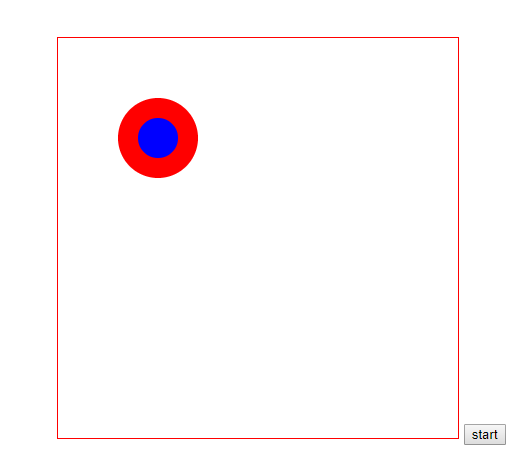

##### 缓冲动画应用

其实缓冲动画不仅应用于物体的运动，还可以应用于物体的其它各种属性，包括大小、颜色、透明度、旋转等。但是不管应用于哪种属性，实现思路都是两个步骤：

* 当前速度 = (最终值 - 当前值) * 缓冲系数
* 新的值 = 当前值 + 当前速度

```js
function Ball(x,y,radius,color){
    this.x = x || 0
    this.y = y || 0
    this.radius = radius || 12
    this.color = color || 'hotpink'
}

Ball.prototype.fill = function(ctx){
    ctx.save()
    ctx.translate(this.x, this.y)
    ctx.rotate(this.rotation)
    ctx.fillStyle = this.color
    ctx.beginPath()
    ctx.arc(0,0,this.radius,0,Math.PI*2, false)
    ctx.closePath()
    ctx.fill()
    ctx.restore()
}

const canvas = document.querySelector('#canvas')
const ctx = canvas.getContext('2d')

const ball = new Ball(canvas.width/2, canvas.height/2, 50, '#f00')

ball.fill(ctx)

const easing = 0.02

const targetR = 0
const targetB = 255 

let red = 255
let blue = 0

function frame(){
    requestAnimationFrame(frame)
    ctx.clearRect(0, 0, canvas.width, canvas.height)

    const vr = (targetR - red) * easing
    const vb = (targetB - blue) * easing

    red += vr
    blue += vb

    ball.color = `rgb(${red}, 0, ${blue})`
    ball.fill(ctx)
}
document.querySelector('button').addEventListener('click', frame)
```

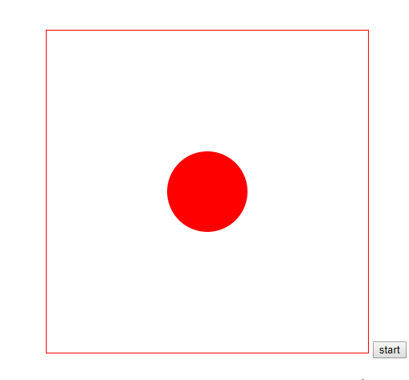

#### 弹性动画

和缓冲动画不同的是，在弹性动画中，物体滑动到终点后还会来回反弹一会，直至终止。

从技术上来说，两者有如下共同点：

* 需要设置一个终点
* 需要确定物体到终点的距离
* 运动和距离是成正比的

两者的不同在于运动和距离成正比的实现方式上不同：

* 在缓冲动画中，跟距离成正比的是速度。物体离终点越远，速度越快
* 在弹性动画中，跟距离成正比的是加速度。物体离终点越远，加速度越大。刚开始时，由于加速度的影响，速度会快速增大。当物体接近终点时，加速度变得很小，但是它还在加速。由于加速度的影响，物体会越过终点。然后随着距离的变大，反向加速度也随之变大，就会把物体拉回来。物体在终点附近来回反弹一会儿，最终再摩擦力的作用下停止

```js
ax = (targetX - object.x) * spring
ay = (targetY - object.y) * spring

vx += ax
vy += ay

vx *= friction
vy *= friction

object.x += vx
object.y += vy
```

从语法上可以看出，弹性动画和缓冲动画类似，只不过前者操作的是加速度，后者操作的是速度。

```js
function Ball(x,y,radius,color){
    this.x = x || 0
    this.y = y || 0
    this.radius = radius || 12
    this.color = color || 'hotpink'
}

Ball.prototype.fill = function(ctx){
    ctx.save()
    ctx.translate(this.x, this.y)
    ctx.rotate(this.rotation)
    ctx.fillStyle = this.color
    ctx.beginPath()
    ctx.arc(0,0,this.radius,0,Math.PI*2, false)
    ctx.closePath()
    ctx.fill()
    ctx.restore()
}

const canvas = document.querySelector('#canvas')
const ctx = canvas.getContext('2d')

const ball = new Ball(50, canvas.height/2, 20)

ball.fill(ctx)

const targetX = canvas.width / 2
const spring = 0.02
let vx = 0


function frame(){
    requestAnimationFrame(frame)
    ctx.clearRect(0, 0, canvas.width, canvas.height)

    const ax = (targetX - ball.x) * spring
    vx += ax
    ball.x += vx
    ball.fill(ctx)					
}
document.querySelector('button').addEventListener('click', frame)
```

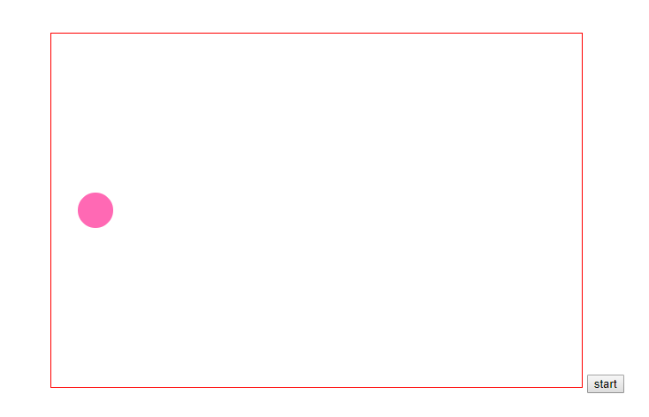

上例中并没有加入摩擦力，所以会一直来回反弹，下面就添加摩擦力进一步完善。

```js
function Ball(x,y,radius,color){
    this.x = x || 0
    this.y = y || 0
    this.radius = radius || 12
    this.color = color || 'hotpink'
}

Ball.prototype.fill = function(ctx){
    ctx.save()
    ctx.translate(this.x, this.y)
    ctx.rotate(this.rotation)
    ctx.fillStyle = this.color
    ctx.beginPath()
    ctx.arc(0,0,this.radius,0,Math.PI*2, false)
    ctx.closePath()
    ctx.fill()
    ctx.restore()
}

const canvas = document.querySelector('#canvas')
const ctx = canvas.getContext('2d')

const ball = new Ball(50, canvas.height/2, 20)

ball.fill(ctx)

const targetX = canvas.width / 2
const spring = 0.02
let vx = 0
const friction = 0.95


function frame(){
    requestAnimationFrame(frame)
    ctx.clearRect(0, 0, canvas.width, canvas.height)

    const ax = (targetX - ball.x) * spring
    vx += ax
    vx *= friction
    ball.x += vx
    ball.fill(ctx)					
}
document.querySelector('button').addEventListener('click', frame)
```

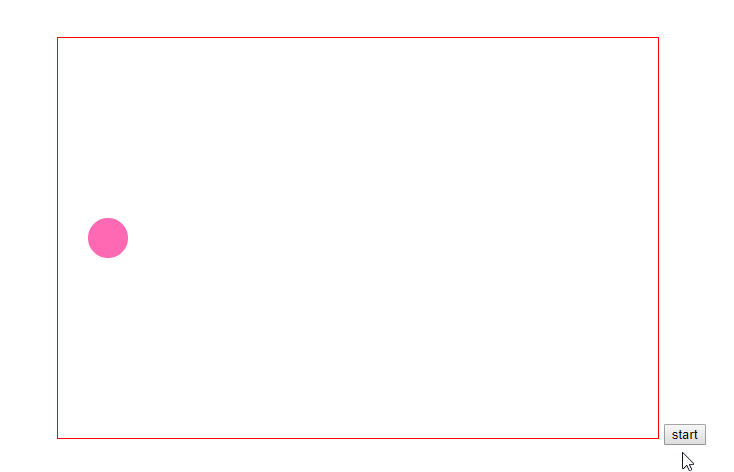

有了弹性动画之后，便可以将小球跟随鼠标的运动改为弹性运动。

```js
function Ball(x,y,radius,color){
    this.x = x || 0
    this.y = y || 0
    this.radius = radius || 12
    this.color = color || 'hotpink'
}

Ball.prototype.fill = function(ctx){
    ctx.save()
    ctx.translate(this.x, this.y)
    ctx.rotate(this.rotation)
    ctx.fillStyle = this.color
    ctx.beginPath()
    ctx.arc(0,0,this.radius,0,Math.PI*2, false)
    ctx.closePath()
    ctx.fill()
    ctx.restore()
}

const canvas = document.querySelector('#canvas')
const ctx = canvas.getContext('2d')

const bigBall = new Ball(100, 100, 40, 'red')

bigBall.fill(ctx)

let targetX = 0,
    targetY = 0

const spring = 0.02
const friction = 0.95

let vx = 0
let vy = 0

canvas.addEventListener('mousemove', function(e){
    targetX = e.pageX - canvas.offsetLeft
    targetY = e.pageY - canvas.offsetTop
})

function frame(){
    requestAnimationFrame(frame)
    ctx.clearRect(0, 0, canvas.width, canvas.height)

    const ax = (targetX - bigBall.x) * spring
    const ay = (targetY - bigBall.y) * spring

    vx += ax
    vy += ay

    vx *= friction
    vy *= friction

    bigBall.x += vx
    bigBall.y += vy
    bigBall.fill(ctx)
}
document.querySelector('button').addEventListener('click', frame)
```

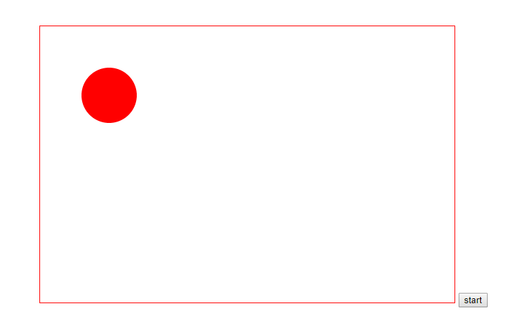

##### 弹性运动应用

弹性运动的一个经典运用就是绳球运动，所谓绳球运动就是指弹性小绳的一端绑着一个小球，通过甩动绳子，由于小球质量的带动，绳子会来回弹动。

```js
function Ball(x,y,radius,color){
    this.x = x || 0
    this.y = y || 0
    this.radius = radius || 12
    this.color = color || 'hotpink'
}

Ball.prototype.fill = function(ctx){
    ctx.save()
    ctx.translate(this.x, this.y)
    ctx.rotate(this.rotation)
    ctx.fillStyle = this.color
    ctx.beginPath()
    ctx.arc(0,0,this.radius,0,Math.PI*2, false)
    ctx.closePath()
    ctx.fill()
    ctx.restore()
}

const canvas = document.querySelector('#canvas')
const ctx = canvas.getContext('2d')

const bigBall = new Ball(100, 100, 40, 'red')

bigBall.fill(ctx)

let targetX = 0,
    targetY = 0

const spring = 0.02
const friction = 0.95

let vx = 0
let vy = 0

canvas.addEventListener('mousemove', function(e){
    targetX = e.pageX - canvas.offsetLeft
    targetY = e.pageY - canvas.offsetTop
})

function frame(){
    requestAnimationFrame(frame)
    ctx.clearRect(0, 0, canvas.width, canvas.height)

    const ax = (targetX - bigBall.x) * spring
    const ay = (targetY - bigBall.y) * spring

    vx += ax
    vy += ay

    vx *= friction
    vy *= friction

    bigBall.x += vx
    bigBall.y += vy
    bigBall.fill(ctx)

    ctx.beginPath()
    ctx.moveTo(bigBall.x, bigBall.y)
    ctx.lineTo(targetX, targetY)
    ctx.stroke()
    ctx.closePath()
}
document.querySelector('button').addEventListener('click', frame)
```


当然你还可以在此例的基础上加入重力影响来进一步完善。

```js
function Ball(x,y,radius,color){
    this.x = x || 0
    this.y = y || 0
    this.radius = radius || 12
    this.color = color || 'hotpink'
}

Ball.prototype.fill = function(ctx){
    ctx.save()
    ctx.translate(this.x, this.y)
    ctx.rotate(this.rotation)
    ctx.fillStyle = this.color
    ctx.beginPath()
    ctx.arc(0,0,this.radius,0,Math.PI*2, false)
    ctx.closePath()
    ctx.fill()
    ctx.restore()
}

const canvas = document.querySelector('#canvas')
const ctx = canvas.getContext('2d')

const bigBall = new Ball(100, 100, 20, 'red')

bigBall.fill(ctx)

let targetX = 0,
    targetY = 0

const spring = 0.02
const friction = 0.95
const gravity = 1

let vx = 0
let vy = 0

canvas.addEventListener('mousemove', function(e){
    targetX = e.pageX - canvas.offsetLeft
    targetY = e.pageY - canvas.offsetTop
})

function frame(){
    requestAnimationFrame(frame)
    ctx.clearRect(0, 0, canvas.width, canvas.height)

    const ax = (targetX - bigBall.x) * spring
    const ay = (targetY - bigBall.y) * spring

    vx += ax
    vy += ay
    vy += gravity

    vx *= friction
    vy *= friction

    bigBall.x += vx
    bigBall.y += vy
    bigBall.fill(ctx)

    ctx.beginPath()
    ctx.moveTo(bigBall.x, bigBall.y)
    ctx.lineTo(targetX, targetY)
    ctx.stroke()
    ctx.closePath()
}
document.querySelector('button').addEventListener('click', frame)
```

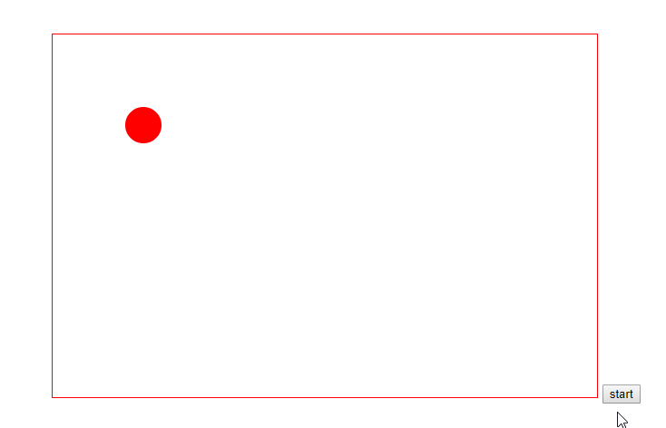

### 游戏开发

随着web技术的发展，使用canvas开发游戏迅速地火爆起来。近年来，很多比较热门的游戏就是使用HTML5 Canvas开发的，例如围住神经猫，愤怒的小鸟等。

#### Box2D简介

Box2D是由暴雪工程师Erin Catto使用C++编写的一款非常优秀的物理引擎。在Box2D这个物理引擎中，可以模拟真实世界的运动情况，其中物体的运动、旋转和碰撞反应等，都会遵循牛顿运动三大定律。

由于Box2D极大提高了游戏开发效率，因此有很多衍生出Java，Flash，Object-c和JavaScript等多语言版本。

使用Box2D之后，我们就不需要自己手动去实现物理力学和运动学中的计算，只需要调用Box2D引擎中对应的函数或对象即可，就可以模拟现实生活中的匀速、减速、摩擦力、碰撞反弹等各种真实的物理运动。

前几年比较火的愤怒的小鸟就是借助Box2D进行开发的。

#### Box2DWeb

由于canvas使用的语言是JavaScript，因此如果想要在Canvas游戏开发中使用到Box2D，就应该选择JavaScript版本的Box2D。

JavaScript版本的Box2D有两个，分别是Box2DJS和Box2DWeb，前者已经停止维护更新，推荐使用后者。

#### 游戏引擎

想要开发一款游戏，那必须会提到游戏引擎。所谓的游戏引擎，就是可以为开发者提供编写游戏所需的各种工具，能够让我们非常容易和快速地开发一款游戏，而不需要从零开始，这样大大减轻了开发的成本和时间。

上面提及的Box2DWeb也是一种游戏引擎，只不过Box2DWeb一般用于物理场景，运用场合相对窄一些。下面介绍一些国内比较流行的HTML5游戏引擎，这些游戏引擎大多数都把Box2D融合进去了，使其运用范围更加广泛，并且它们大多数支持canvas渲染，而且还支持WebGL渲染。

##### Cocos2d-JS

Cocos2d-JS是Cocos2d-x的JavaScript版本，真正跨平台的游戏引擎，采用原生JavaScript语言，可发布到Web平台，Andriod，Windows Phone8，Mac，Windows等平台。Cocos2d-JS具有易于使用，高效，灵活，免费，社区支持等特点。

##### Egret

Egret是国内一个非常流行的基于TypeScript语言开发的HTML5游戏引擎，它遵循HTML5标准的2D、3D引擎，解决了HTML5性能问题及碎片化问题，灵活地满足开发者开发2D或3D游戏的需求，并有着极强的跨平台运行能力。

##### LayaAir

LayaAir相对前面两个而言，性能最佳，号称H5游戏引擎性能之王。LayaAir裸跑性能堪比APP，支持2D、3D、VR游戏开发，支持多语言开发（包括JavaScript，TypeScript，ActionScript），并且它工具链成熟丰富，应用领域广泛。

##### 总结

实际上，对于一款游戏来说，最重要的是算法，例如你写一个象棋小游戏，你得去了解象棋的基本规则。

### canvas图表库

现在的web开发中，可能会经常需要用到各种图标来展示数据，这些图表包括折线图、柱状图、散点图、饼图等，甚至还可能地理数据可视化的地图、散点图、线图等。

虽然我们可以借助canvas手动来绘制，但是为了开发效率的提升，一般都会使用别人封装好的开源图表库，当然更推荐自己平时开发时积累图表库。

下面介绍一些常用的图标库：

* Echarts：百度开发的一个纯JavaScript图表库
* HightCharts：国外开发的一个纯JavaScript图表库

前者图表丰富，后者稍微少点；前者入门偏难，后者入门较易；前者开源免费，后者商业版付费。


