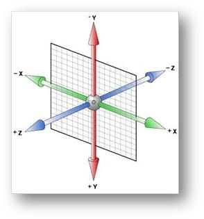

## HTML5

### 新增标签

**结构标签**

* `nav`：表示页面导航区域
* `header`：表示页面头部区域
* `footer`：表示页面底部区域
* `section`：表示页面中内容区块，可以配合标题标签使用
* `article`：表示页面文章区域
* `aside`：表示页面侧边栏区域
* `hgroup`：表示页面标题分组
* `figure`：表示页面媒介内容分组

> 对于不支持`HTML5`新标签的浏览器中，可以使用`DOM`操作创建指定名称的标签来解决，当然更多的是使用`html5shiv`库来解决兼容问题。

**应用程序标签**

* `datalist`：用于定义数据列表，但是需要配合`input`使用

* `progress`：用于定义进度

* `meter`：用于定义度量器

### 新增属性

* `rel`属性：用来描述指定连接与当前文档的关系，便于机器设备理解文档结构

* `tabindex`属性：用于定义`Tab`键在控件中的移动顺序

* `role`属性：用于定义标签的具体功能

### 新增表单类型

* `email`类型：用于输入邮箱
* `tel`类型：用于输入电话
* `url`类型：用于输入`URL`
* `number`类型：用于输入数字
* `search`类型：用于搜索功能
* `range`类型：用于表示范围
* `color`类型：用于表示拾色器
* `time`类型：用于表示时间
* `date`类型：用于表示日期
* `datetime`类型：用于表示时间日期
* `month`类型：用于表示月份
* `week`类型：用于表示星期

部分表单类型在`PC`端上存在一定兼容性，移动端上普遍兼容，并且像`text`，`number`，`email`，`tel`和`url`类型的表单在移动设备上会进行虚拟键盘适配，用户体验很好。

## CSS3

### 概述

目前，大部分主流浏览器都已经支持`CSS3`大部分功能，但是还有一部分属性需要添加浏览器私有前缀。具体如下：

- `Chrome`和`Safari`：`-webkit`
- `FireFox`：`-moz`
- `IE`：`-ms`
- `Opera`：`-o`

### 选择器

`CSS3`新增了许多灵活查找元素的方法，极大地提高查找效率和精准度。

#### 属性选择器

- `a[class]`：选择具有`class`属性的所有`a`元素
- `a[class="demo"]`：选择`class`属性为`demo`的所有`a`元素
- `a[class~="demo"]`：选择具有`class`属性，且值为一用空格分隔的字词列表的所有`a`元素。例如：`<a class="demo-first"></a>`就不会被选中，而`<a class="demo demo1"></a>`会被选中。
- `a[class|="demo"]`：选择具有`class`属性，且值为`demo`或者是以`demo-`开头的所有`a`元素。
- `a[class*="demo"]`：选择具有`class`属性，且值包含`demo`的所有`a`元素 
- `a[class^="demo"]`：选择具有`class`属性，且值以`demo`开头的所有`a`元素 
- `a[class$="demo"]`：选择具有`class`属性，且值以`demo`结尾的所有`a`元素

#### 伪类选择器

除了`CSS2`中的`:link`、`:visited`、`:hover`和`:active`伪类选择器，`CSS3`又新增了如下伪类选择器。

- `E:first-child`：只有当`E`元素是它父元素中第一个子元素时，才会选中`E`

- `E:last-child`：只有当`E`元素是它父元素中最后一个子元素时，才会选中`E`

- `E:only-child`：只有当`E`元素是它父元素中唯一一个子元素时，才会选中`E`

- `E:nth-child(n)`：只有当`E`元素是它父元素中第n个子元素时，才会选中`E`。注意：`n`从`1`开始计算

  ```html
  <style>
    span:nth-child(1){color:red}					/*1文本为红色*/
    span:nth-child(even){font-size: 20px}			/*2,4文本字体变大*/
    span:nth-child(2n+1){background-color:blue}	/*1文本背景色为蓝色*/
    span:nth-child(3){color:purple}				/*未选中任何元素，因为div第三个子元素是p*/
    span:nth-child(4){font-weight: 700}			/*4文本变粗*/
  </style>
  <div>
    <span>1</span>
    <span>2</span>
    <p>3</p>
    <span>4</span>
  </div>
  ```

- `E:nth-last-child(n)`：用法和`E:nth-child(n)`相同，只不过方向相反

- `E:first-of-type`：选中`E`的父元素中的第一个`E`类型元素

- `E:last-of-type`：选中`E`的父元素中的最后一个`E`类型元素

- `E:only-of-type`：选中`E`的父元素中的唯一一个`E`类型元素

- `E:nth-of-type(n)`：用法和`E:nth-child(n)`相同，只不过按照指定元素类型排序

- `E:nth-last-of-type(n)`：用法同上，只不过方法相反 

- `E:empty`： 选择没有子节点(包括文本节点)的`E`元素

- `E:checked`：选择被选中的`E`元素。注意：用于`type`属性为`radio`与`checkbox`的`input`元素

- `E:disabled`：选择处于被禁用状态的`E`元素

- `E:enabled`：选择处于可用状态的`E`元素

- `E:target`： 选择当前文档`URL`指向的`E`元素

  ```html
  <style>
    #demo:target{
        color: red		
        /*假设当前页面URL为demo.html，那么当URL跳转到demo.html#demo时，会选中#demo元素*/
    }
  </style>
  <div id="demo">1</div>
  ```

#### 伪元素选择器

- `::first-letter`： 设置对象内第一个字符的样式。注意：该伪元素只作用于块对象
- `::first-line`：设置对象内第一行样式。注意：该伪元素只作用于块对象 
- `::before`：设置在对象前的内容，必须配合`content`属性一起使用
- `::after`：设置在对象后的内容，必须配合`content`属性一起使用
- `::placeholder`：设置对象内文字占位符的样式，需要添加私有前缀
- `::selection`：设置对象被选中时的样式。例如：设置被选中文字的背景颜色 

另外，在`CSS2`中，`:after`、`:before`、`:first-letter`和`:first-line`都是伪类。但是在`CSS3`中，它们会被自动识别为对应的伪元素来处理。

### 颜色

`CSS3`还新增`RGBA`和`HSLA`设置颜色，具体如下：

- `RGBA`颜色值：其中`RGB`表示三原色，`A`表示透明度通道，即可以设置颜色的透明度。相较于`opacity`属性，`RGBA`颜色值不具有继承性，即不会影响子元素的透明度。
- `HSLA`颜色值：其中`H(Hue)`表示色调，取值范围是`0~360`；`S(Saturation)`和`L(Lightness)`分别表示饱和度和亮度，取值范围都是`0%~100%`；而`A`同样是`Alpha`通道，取值范围是`0~1`。

```css
div{
    color: rgba(0,0,0,.3)
    background-color: hsla(360, 50%, 50%, .5)
}
```

> 当颜色值为`RGBA(0,0,0,0)`时，可以使用关键字`transparent`代替，表示全透明黑色。
>

### 文本

#### 文本阴影

```css
p {
  text-shadow: 5px 4px 3px #ccc;
}
/*具体含义如下：
	5px: 水平偏移量，正值向右，负值向左
	4px: 垂直偏移量，正值向下，负值向上
	3px: 模糊度，不能为负值。值越大，阴影越模糊，反之阴影越清晰。如果不需要阴影可以设置为0
	#ccc: 设置阴影的颜色
*/
```

#### 文本溢出

`text-overflow`属性用于设置是否使用一个省略标记(`...`)标示对象内文本的溢出。该属性有如下两个合法值：

- `clip`：表示剪切
- `ellipsis`：表示显示省略标记

`text-overflow`属性只是用来指定当文字溢出时用何种方式显示，要实现溢出时产生省略号的效果，还须定义强制文本在一行内显示以及溢出内容为隐藏。

同时，`word-wrap`属性也可以用来设置文本行为，当前行超过指定容器的边界时是否断开转换。该属性有如下两个合法值：

- `normal`：表示空值连续文本换行，此值为默认值
- `break-word`：表示内容将在边界内换行，此值设置在长单词或URL地址内部进行换行，不常用。

```css
/*单行文本溢出*/
.demo {
  text-overflow: ellipsis;
  overflow: hidden;		/*溢出内容隐藏*/
  white-space: nowrap;	/*强制文本在一行显示*/
}
/*多行文本溢出*/
p {
  overflow: hidden;
  text-overflow: ellipsis;
  display: -webkit-box;
  -webkit-line-clamp: 2;
  -webkit-box-orient: vertical;
}
```

注意：多行文本溢出兼容性较差，所以完备的多行文本溢出需要`JavaScript`辅助完成。但是上述方案可用于移动端。

### 边框

#### 边框圆角

`border-radius`属性用于为元素设置边框圆角，它提供两个参数，以`/`分隔，分别表示水平(横轴)半径和垂直(纵轴)半径，如果第二个参数省略，则默认等于第一个参数。

另外，水平半径和垂直半径都允许设置`1~4`个值，含义如下：

- 如果提供`4`个值，则按照上左，上右，下右，下左的顺序作用于四个角
- 如果提供`3`个值，则第一个值作用于上左，第二个作用于上右和下左，第三个作用于下右
- 如果提供`2`个值，则第一个值作用于上左和下右，第二个作用域上右和下左


- 如果设置`1`个值，将全部作用于四个角

另外，`border-radius`属性的单位可以是百分比，根据该元素占据的空间(边框+内边距+内容)计算。注意：当圆角半径小于或等于边框宽度时，元素内角是直角。

```css
div {
  width: 100px;
  height: 100px;
  border: 1px solid red;
  border-radius: 10px 20px 30px 40px / 40px 30px 20px 10px; 
}
```

#### 边框图片

`border-image`属性用于设置边框图片，它可以分开表示，具体含义如下：

- `border-image-source`：表示边框图片的地址
- `border-image-slice`：表示裁剪图片的尺寸，默认单位是像素。该属性是复合属性，因此可以像margin，padding那样缩写属性值。切割时，遵从上右下左的切割顺序，将图片切成九宫格形状。其中，九宫格的四个角对应边框的四个角，九宫格四条边的中间部分会通过重复方式进行填充，九宫格最中间部分不参与填充，除非设置关键字`fill`。
- `border-image-width`：表示边框图片的宽度。注意：不需要带单位，因为默认单位是像素
- `border-image-repeat`：表示边框图片的平铺样式，它有如下几个值：
  - `stretch`： 指定用拉伸方式来填充边框背景图。 
  - `repeat`： 指定用平铺方式来填充边框背景图。当图片碰到边界时，如果超过则被截断，可能不会完整显示图片。 
  - `round`： 指定用平铺方式来填充边框背景图。图片会根据边框的尺寸动态调整图片的大小直至正好可以铺满整个边框。
  - `space`： 指定用平铺方式来填充边框背景图。图片会根据边框的尺寸动态调整图片的之间的间距直至正好可以铺满整个边框。 

```css
div{
    border-image: url(demo.png) 20 round
    /*	分开表示如下
    	border-image-source: url(demo.png)
      	border-image-slice: 20 20 20 20
      	border-image-width: 20px
      	border-image-repeat: round
    */
}
```

#### 边框阴影

`box-shadow`属性用来设置边框阴影，如果需要设置多重阴影，只需要将多个样式用逗号隔开即可。另外，设置该属性不会改变盒子大小，即不会影响布局

```css
div {
  box-shadow: inset 5px 4px 3px red,
    		  inset -3px -4px 6px green,
    		  3px 4px 5px 6px outset; 
}
/*具体含义如下：
	3px: 必须，水平偏移量，可以是负值
	4px: 必须，垂直偏移量，可以是负值
	5px: 可选，模糊度，不可以是负值。当模糊度为0时，则表示阴影不具有模糊效果，其值越大阴影的边缘就越模糊
	6px: 可选，阴影外延值，可以是负值。默认为黑色。此值如果为正，则整个阴影都延展扩大；若为负值，则缩小
	outset: 可选，设置阴影类型为外阴影，inset是内阴影。
*/
```

对于`box-shadow`属性还有如下几点补充：

- `inset`和`outset`可以写在参数第一个或最后一个，其它位置无效


- 偏移量和扩展是数学运算，即正负会相互抵消
- 偏移量和模糊度可以进行相加运算，偏移量负号只代表方向

### 背景

#### background-size

在`CSS3`之前，背景图片的大小是由真实图片大小所决定的。但是在`CSS3`中，可以使用`background-size`属性设置背景图片尺寸。该属性可以取值为关键字，具体含义如下：

- `auto`：背景图片的真实大小
- `cover`：将背景图像等比例缩放到完全覆盖容器，背景图像有可能超出容器(以最大边缩放)
- `contain`：将背景图像等比缩放到宽高与容器的宽高相等，背景图像始终被包含在容器内(以最小边缩放)

该属性还可以设置两个具体数值，其中第一个参数用于定义背景图片的宽度，第二个参数用于定义背景图片的高度。如果两个参数其中一个设置auto或者第二个参数省略，则按照已经提供的具体数值按照原图片的比例等比缩放。

```css
div {
  background-size: 300px auto;
  background-size: cover;
}
```

注意：该属性值的单位也可以是百分比，其值相对于背景图所在元素的宽度计算。

```css
div{
  	width:400px;
	height:300px;
	background-size: 50% 40%;
  	/*
  		相当于：background-size: 200px 160px;
  	*/
}
```

#### background-origin

`background-origin`属性用于设置背景图片的位置区域，它有如下几个值：

* `border-box`：元素外边框外的背景图片都会被裁剪掉，此值为默认值
* `padding-box`：元素内边距外的背景图片都会被裁剪掉
* `content-box`：元素内容外的背景图片都会被裁剪

注意：如果背景不是`no-repeat`，这个属性无效，它会从边框开始显示。

#### background-clip

`background-clip`属性用于设置背景背景图片向外裁剪的区域，它有如下几个值：

- `padding-box`：表示从内边距区域(不含内边距)开始向外裁剪背景
- `border-box`：表示从边框区域(不含边框)开始向外裁剪区域
- `content-box`：表示从内容区域开始向外裁剪背景
- `no-clip`: 表示不裁剪

#### 多重背景

将多个背景样式用逗号隔开便可以设置多重背景，语法缩写如下：

```javascript
background:
	[background-color] | 
    [background-image] | 
    [background-position] | 
    [background-size] | 
    [background-repeat] | 
    [background-attachment] | 
    [background-clip] | 
    [background-origin]...
```

当缩写`background`属性时，有如下几点需要注意：

- 如果有`background-size`值，需要紧跟`background-position`属性值，并且用`/`隔开
- 如果有多个背景图片，而其它属性只有一个，表明所有背景图片都应用该属性值
- `background-color`只能设置一个

### 渐变

#### 线性渐变

`linear-gradient`属性用于设置线性渐变，即沿着某条直线朝一个方向产生渐变效果。 

```css
div {
  background: linear-gradient(to right,red,blue,green);
  background: linear-gradient(to right,red,blue,,orange,green);
}
/*具体含义如下：
	to left: 设置渐变方向从右到左。相当于: 270deg 
	to right: 设置渐变方向从左到右。相当于: 90deg 
	to top: 设置渐变方向从下到上。相当于: 0deg 
	to bottom: 设置渐变方向从上到下。相当于: 180deg。如果该参数省略不写，则默认为此值
	to top left: 设置渐变方向从右下角到左上角
	to top right: 设置渐变方向从左下角到右上角

	red:起始颜色
	blue：过渡颜色。注意：过渡颜色可以有多个颜色值
	green：终止颜色
*/
```

#### 径向渐变

`radial-gradient`属性用于设置径向渐变，即从一个中心点开始沿着四周产生渐变效果。

```css
div {
  background: radial-gradient(
  	150px at center,
    yellow,
    green
  );
}
/*具体含义如下：
	150px: 设置渐变半径
	center: 设置圆心位置。可以设置两个参数，第一个表示横坐标，第二个表示纵坐标。如果只设置一个参数，那么			  第二个参数默认为50%，即center。另外，参数可以关键字left，right，center，也可以是具体数值			  (参照盒子左上角)
	yellow: 设置起始渐变色
	green: 设置终止渐变色
*/
```

### 多列布局

类似报纸或杂志中的排版方式

```html
<style>
  div{
    columns: 300px 3;	
    /*等价于
    	column-width: 300px			设置列宽
    	column-count: 3				设置列数
    */
    column-gap:60px;		  	  /*设置列间距*/
    column-rule: 1px dashed red	  /*设置分隔线*/
  }
  div h2{
    column-span: 3				  /*设置标题横跨三列*/
  }
</style>
<div>
  <h2>Title</h2>
  <p>Content</p>	
</div>
```

### Grid布局

`Grid`布局，又称为网格布局。

```html
<style>
    * {
        margin: 0;
        padding: 0;
    }
    .box {
        display: grid;
        grid-template-columns: 2fr 1fr 1fr;
        grid-template-rows: 1fr 3fr;
        grid-column-gap: 1px;
        grid-row-gap: 1px;
    }
    .box-item {
        display: flex;
        align-items: center;
        justify-content: center;
        padding: 20px;
        background-color: #ccc;
        color: #000;
    }
</style>
<div class="box">
    <div class="box-item box-a">
        A
    </div>
    <div class="box-item box-b">
        B
    </div>
    <div class="box-item box-c">
        C
    </div>
    <div class="box-item box-d">
        D
    </div>
</div>
```

具体效果如下：


### 过渡

动画可以分为两种，一种是补间动画，即自动完成从开始到终止状态的过渡，不管中间的状态；另一种是帧动画，即通过一帧一帧的画面按照固定顺序和速度播放。

`CSS3`过渡属性`transition`可以实现元素在不同状态间的平滑过渡。

```css
div {
  height: 200px
  background-color: "red"
  transition: height .5s ease-in .1s,
  background-color .5s ease-in .1s;
  /*或者 transition: all .5s ease-in .1s
  */
}
div:hover{
  height: 100px
  background-color: "blue"
}
```

另外，`transition`还可以分开表示：

- `transition-property`：表示需要过渡的属性，默认值为`all`，即过渡所有发生变化的`CSS`属性。如果指定多个属性，需要使用逗号隔开
- `transition-duration`：表示过渡持续时间。如果提供多个属性值，需要使用逗号隔开
- `transition-timing-function`：表示过渡动画类型，它有如下几个值：
  - `linear`： 线性过渡。等同于贝塞尔曲线`(0.0, 0.0, 1.0, 1.0)` 
  - `ease`： 平滑过渡。等同于贝塞尔曲线`(0.25, 0.1, 0.25, 1.0) `
  - `ease-in`： 由慢到快。等同于贝塞尔曲线`(0.42, 0, 1.0, 1.0) `
  - `ease-out`： 由快到慢。等同于贝塞尔曲线`(0, 0, 0.58, 1.0) `
  - `ease-in-out`： 由慢到快再到慢。等同于贝塞尔曲线`(0.42, 0, 0.58, 1.0) `
  - `step-start`： 等同于`steps(1, start) `
  - `step-end`： 等同于`steps(1, end) `
- `transition-delay`：表示过渡延迟时间

### 动画

在`CSS3`中，可以通过`animation`属性创建动画效果，这样便可以取代许多动画图像，`Flash`动画和`JavaScript`动画。

实现一个`CSS`动画效果，往往需要经历如下步骤：

1. 通过`@keyframes`指定动画序列
2. 通过百分比将动画序列分割成多个节点
3. 在各节点中分别定义各属性
4. 通过`animation`属性将动画应用在相应元素上

另外，`animation`属性还可以分开表示：

- `animation-name`：表示动画序列名称
- `animation-duration`：表示动画持续时间，也就是完成从0%~100%一次动画所需时间。该属性若取值为0，则表示没有动画。若取值为负数，则会被视为0。
- `animation-delay`：表示动画延迟时间
- `animation-timing-function`：表示动画过渡类型，它的值与`transition-timing-function`属性值完全一样。
- `animation-play-state`：表示动画播放状态。注意：`W3C`正考虑是否将该属性移除，因为动画的状态可以通过其它方式实现，比如重置样式。它有如下两个值：
  - `running`：运动
  - `paused`：暂停
- `animation-direction`：表示动画在循环中是否反向运动，它有如下几个值：
  - `normal`：正常方向
  - `reverse`：反方向运行
  - `alternate`：动画先正常运行再反方向运行，并持续交替运行
  - `alternate-reverse`：动画先反运行再正方向运行，并持续交替运行
- `animation-fill-mode`：表示动画执行完毕后状态。它有如下几个值：
  - `none`：不设置对象动画之外的状态，该值是默认值
  - `forwards`：设置对象状态为动画结束时的状态
  - `backwards`：设置对象状态为动画开始时的状态
  - `both`：设置对象状态为动画结束或开始的状态
- `animation-iteration-count`：表示动画循环次数，它有如下两个值：
  - `infinite`：无限循环
  - `number`：指定具体次数
- `steps(60)`：表示动画分为`60`步完成

```css
@keyframes changecolor{
  0%{
    background-color: "red";
  }
  50%{
    background-color: "blue"
  }
  100%{
    background-color: "yellow"
  }
}
/*可以使用from...to代替0%...100%，但是为了兼容性，建议使用后者*/
div:hover{
  animation: changecolor 5s ease-out .2s
}
/*具体含义如下
	changecolor: 表示animation-name
	5s: 表示animation-duration
	ease-out: 表示animation-timing-function
	.2s：表示animation-delay
*/
```

### 转换

#### 2D转换

转换可以实现元素的位移、旋转、变形、缩放，甚至支持矩阵方式。

在`CSS3`中，通过`transform`属性实现`2D`或`3D`转换，并且设置该属性不会影响元素布局。如果需要进行多个转换，只需要将其用逗号隔开即可。

**scale**

`scale(x,y)`可以让元素按照中心原点进行水平和垂直方向的缩放，其中参数的取值可以是小数，但是不能是负值。

```css
div {
  transform: scale(1.5,1.5); 	/*改变元素的宽度和高度*/
  /*等价于
  	transform: scaleX(1.5)  	改变元素的宽度
  	transform: scaleY(1.5)  	改变元素的高度
  */
}
```

缩放元素的特点如下：

- 只能对块元素设置缩放
- 可以设置在元素内任一点进行缩放
- 不会影响兄弟元素的位置
- 如果父元素未设置大小，不会影响父元素的大小

**translate**

`translate(x,y)`可以改变元素的位置，其中参数可以是负值。 

```css
div {
  transform: translate(200px,100px);
  /*等价于
  	transform: translateX(200px)
  	transform: translateY(100px)
  */
}
```

> 移动位置是相对于自身原来位置，单位可以是百分比，即相对于自身的宽高。

**rotate**

`rotate(deg)`可以对元素进行旋转，其中参数是正值，则按照中心原点顺时针旋转；若为负数，则为逆时针旋转。

```css
div {
  transform: rotate(90deg);
}
```

> 当元素旋转后，坐标轴也会跟着发生改变，为了解决这个问题，可以把旋转操作放在最后。

**skew**

`skew(deg,deg)`可以使元素按一定的角度进行倾斜，其中参数可为负值，若其中第二个参数省略，则默认为0。

```css
div{
  transform: skew(10deg,10deg)
  /*等价于
  	transform: skewX(10deg)
    transform: skewY(10deg)
  */
}
```

> 倾斜过程中，形状可能会发生改变。

倾斜变换的特点如下：

* 只能对块元素设置缩放
* 可以设置在元素缩放的中心点
* 不会影响兄弟元素的位置
* 如果父元素未设置大小，不会影响父元素的大小
* 元素倾斜后，其内容及子元素都会发生倾斜，可以对内容或子元素设置方向倾斜解决

**transform-origin**

任何元素都有一个中心原点，默认情况下，这个点居于元素`X`轴和`Y`轴的`50%`交点处。在没有重置这个点之前，`CSS`转换中的旋转、位移、缩放和扭曲等操作，都是按照默认的中心原点进行改变。

`CSS3`中，新增`transform-origin`属性用于调整元素转换的原点，它可以设置关键字，百分比和具体数值。

#### 3D转换

`CSS3`中`3D`坐标系如下：



* `transform-style: flat`：表示开启`2D`空间，默认值
* `transform-style: preserve-3d`：表示开启`3D`空间

当父元素开启`3D`后，子元素设置`3D`变换函数，就可以看到`3D`效果了

```css
#stage{
  prespective: 800px;					/*设置用户与浏览器之间的距离*/
  prespective-origin: 50% 50%;			/*设置设置透视点坐标值*/
  transform-style: preserve-3d;			/*设置某元素的子元素是否位于三维空间内*/
}
#content{
  transform-origin: center bottom		/*设置元素以某个点进行变换，默认是中心原点*/
  transform: rotateZ(100deg)
}
```

### resize

`resize`属性可以指定一个元素是否应该由用户去调整大小，它有如下合法值：

- `vertical`: 用户只能垂直调整
- `horizontal`: 用户只能水平调整


- `both`: 用户可以水平和垂直调整
- `none`: 用户不允许调整

注意：`resize`属性必须搭配`overflow: auto`使用。

### Web字体

通过`@font-face`可以加载服务器端的字体文件，而无需考虑用户电脑中是否安装了该字体。

```css
@font-face {
  font-family: 字体名称
  src: 字体文件在服务器上的相对路径或绝对路径
}
```

常见的字体格式有：

- `.eot`：微软开发的用于嵌入网页的字体，是`IE`专用字体
- `.woff`：`W3C`组织推荐的字体，是`Web`字体最佳格式
- `.ttf`：`Mac OS`和`Windows`中最常见的字体格式
- `.svg`：`W3C`组织制定的开放标准的图形格式

#### 字体图标

对于网页中的小图标，很多人都会想到使用`CSSsprite`结合背景图来实现，但是在实际开发中，应该秉持少用图片的原则，因为图片传输量大，并且会发起一次HTTP请求，所以此时就需要使用字体图标技术。

### 兼容性

通过[can i use](http://caniuse.com)便可查询CSS3各个特性的浏览器支持情况，而一般兼容性处理的方法是为属性添加私有前缀。如果还不能解决，应该避免使用，无需刻意去处理兼容问题。

### 渐进增强和优雅降级

* 渐进增强：针对低版本浏览器进行构建页面，保证最基本的功能，然后再针对高级浏览器进行效果、交互等改进和追加功能，来达到更好的用户体验
* 优雅降级：一开始就构建完整的功能，然后再针对低版本浏览器进行兼容
