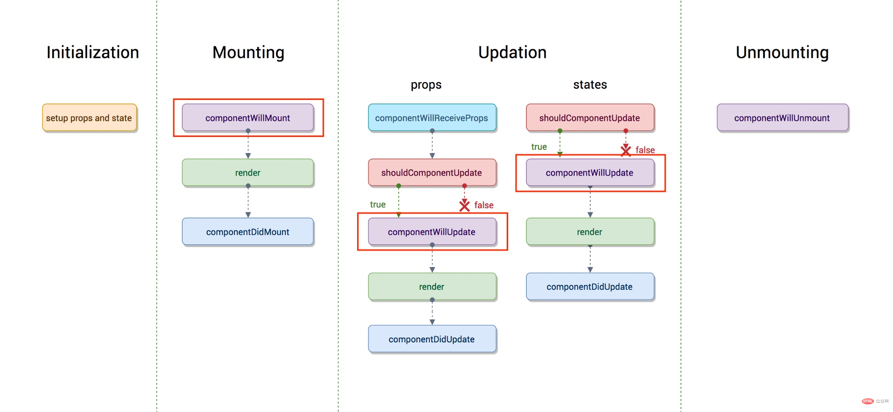
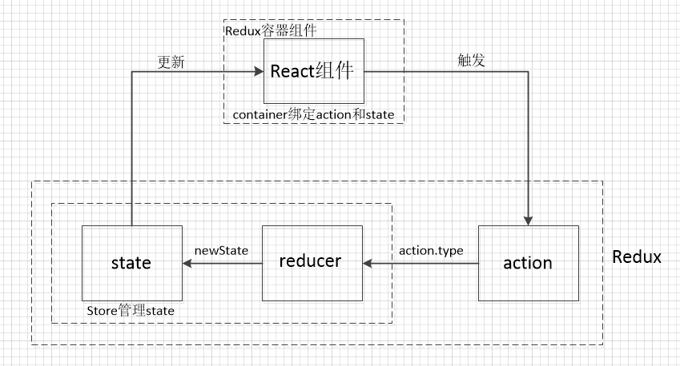

## React 16

`React 16`又称`React Fiber`。至于为什么有`fiber`架构，是因为之前组件的更新过程是同步的，这个过程可能会进行生命周期调用，比对DOM树以及更新DOM树一些纯CPU计算。如果有多个组件同时需要更新，此时浏览器主线程就会一直执行更新操作，无法响应类似于用户操作这种更高级别的任务。由于只能等到更新完成后，才会响应用户操作，在用户看来就是界面卡顿现象，用户体验很差。

而在`Fiber`架构中，会将一个更新过程进行多个分片操作，这样就很小的分片更新操作就可能被优先级高的任务打断，从而实现异步更新。

## 脚手架

通过`create-react-app`脚手架搭建React项目

* `npm run eject`：弹射配置文件
* `npm run test`：执行测试用例

使用脚手架的好处之一就是你不需要手动配置代码分割，否则你就需要手动配置`webpack`的代码分割。

* 异步组件代码分割
* 路由级代码分割

## JSX

`JSX`是`JavaScript`的一种语法扩展，用于描述`UI`，在使用`JSX`之前必须引入`react`库。

本质上，`Babel`最终会将`JSX`转换为`React.createElement`函数。也就是说下面两个等价：

```jsx
const element = (
  <h1 className="greeting">
    Hello, world!
  </h1>
);

const element = React.createElement(
  'h1',
  {className: 'greeting'},
  'Hello, world!'
);
```

> `createElement`本质上会创建一个`JavaScript`版的虚拟`DOM`。通过这个虚拟`DOM`会比对渲染前后差异，只更新实际改变的内容，这也是`React`高性能的原因之一。

### 注释

`JSX`中用`{/**/}`注释语法。

### 事件绑定

不同于`DOM`的`on-event`事件绑定，`JSX`中的事件绑定要采用驼峰命名。

```jsx
const Demo = () => <button onClick={() => console.log(1)}>click</button>
```

一般来说，事件绑定的回调函数中`this`要手动绑定。

**constructor中绑定**

```jsx
class Demo extends Component {
    constructor(props]) {
        super(props)
        this.state = {
            msg: 'hello world'
        }
        
        this.sayMsg = this.sayMsg.bind(this)
    }
    
    sayMsg() {
        console.log(this.state.msg)
    }
    
    render() {
        return <button onClick={this.sayMsg}>click</button>
    }
}
```

**回调函数中绑定**

```jsx
class Demo extends Component {
    constructor(props]) {
        super(props)
        this.state = {
            msg: 'hello world'
        }
    }
    
    sayMsg() {
        console.log(this.state.msg)
    }
    
    render() {
        return <button onClick={this.sayMsg.bind(this)}>click</button>
    }
}
```

**public class fields语法**

```jsx
class Demo extends Component {
    constructor(props]) {
        super(props)
        this.state = {
            msg: 'hello world'
        }
    }
    // public class fields语法，属于实验性质
    sayMsg = () => {
        console.log(this.state.msg)
    }
    
    render() {
        return <button onClick={this.sayMsg}>click</button>
    }
}
```

**使用箭头函数**

```jsx
class Demo extends Component {
    constructor(props]) {
        super(props)
        this.state = {
            msg: 'hello world'
        }
    }
    sayMsg() {
        console.log(this.state.msg)
    }
    
    render() {
        return <button onClick={() => this.sayMsg()}>click</button>
    }
}
```

注意：这种方式会有一个问题，就是每次渲染`Demo`组件都会创建不同的回调函数。在大多数情况下，着没什么问题。但是如果该回调函数作为`prop`传入子组件，就会导致子组件重新渲染。所以建议使用`public class field`语法。

> 在事件中阻止默认行为，必须使用`preventDefault`，不能使用`return false`。

### 条件渲染

你可以通过三元运算符实现条件渲染。

```jsx
class App extends React.Component {
    // ...
    render() {
        return <div>
            {this.state.flag ? <span>hello world</span> : null}
        </div>
    }
}
```

或者通过`if`语句来实现条件渲染。

```jsx
class App extends React.Component {
    // ...
    render() {
        if (this.state.flag) {
        	return <div>hello world</div>
    	}
    	return <div>world hello</div>
    }
}
```

或者通过`&&`运算符。

```jsx
class App extends React.Component {
    // ...
    render() {
        return (
        	<>
            	<div>hello world</div>
            	{this.state.flag && <div>hello</div>}
            </>
        )
    }
}
```

> 当然返回`null`时表示不进行任何渲染。

### 列表渲染

通过`map`语法可以实现列表渲染，但是要注意设置一个唯一的`key`属性。

### render

当`props`或者`state`发生改变的时候，`render`函数都会重新执行。

### 内置标签

* `fragment`：相当于`Vue`的`template`标签
* `dangerouslySetInnterHTML`：相当于`Vue`的`v-html`

```jsx
render() {
  return (
    <React.Fragment>
      <ChildA />
      <ChildB />
      <ChildC />
    </React.Fragment>
  );
}
```

当然更建议使用`<></>`来替代`fragment`标签。

### 受控组件

由`React`控制的表单元素被称为受控组件。

### 动态渲染组件

```jsx
import React from 'react';
import { PhotoStory, VideoStory } from './stories';

const components = {
  photo: PhotoStory,
  video: VideoStory
};

function Story(props) {
  const SpecificStory = components[props.storyType];
  return <SpecificStory story={props.story} />;
}
```

### 传递props

你可以使用`...`运算符来传递整个`props`对象。

```jsx
function App1() {
  return <Greeting firstName="Ben" lastName="Hector" />;
}

function App2() {
  const props = {firstName: 'Ben', lastName: 'Hector'};
  return <Greeting {...props} />;
}
```

上面代码等价。

## props

所有`React`组件都必须像传函数一样保护它们的`props`不被更改。

在`JSX`中，`props`的默认值为`true`。

```jsx
<MyTextBox autocomplete />

<MyTextBox autocomplete={true} />
```

但是不建议这样写。

另外，我们还会通过`prop-types`来对`prop`进行验证：

```jsx
import React from 'react';
import ReactDOM from 'react-dom';
import PropTypes from 'prop-types'
class TodoApp extends React.Component {
  constructor(props) {
    super(props)
    this.state = {
      msg: 'hello world'
    }
  }
  
  render() {
    return (
      <div>
        <TodoItem msg={this.state.msg} />
      </div>
    )
  }
}

class TodoItem extends React.Component {
  static defaultProps = {
    msg: 'hello'
  }

  static propTypes = {
    msg: PropTypes.string.isRequired
  }

  render() {
    return (
      <div>
        {this.props.msg}
      </div>
    )
  }
  
}

ReactDOM.render(<TodoApp />, document.getElementById('root'));
```

当然，你也可以在类上使用。

```jsx
import React from 'react';
import ReactDOM from 'react-dom';
import PropTypes from 'prop-types'
class TodoApp extends React.Component {
  constructor(props) {
    super(props)
    this.state = {
      msg: 'hello world'
    }
  }
  
  render() {
    return (
      <div>
        <TodoItem msg={this.state.msg} />
      </div>
    )
  }
}

class TodoItem extends React.Component {
  render() {
    return (
      <div>
        {this.props.msg}
      </div>
    )
  }
}

TodoItem.defaultProps = {
  msg: 'hello'
}

TodoItem.propTypes = {
  msg: PropTypes.string.isRequired
}

ReactDOM.render(<TodoApp />, document.getElementById('root'));
```

可以检测的类型有：

* 数组：`PropTypes.array`
* 布尔类型：`PropTypes.bool`
* 函数类型：`PropTypes.func`
* 数字类型：`PropTypes.number`
* 对象类型：`PropTypes.object`
* 字符串类型：`PropTypes.string`
* symbol类型：`PropTypes.symbol`

还可以通过`arrayOf`和`objectOf`检测多重嵌套类型。

```jsx
import React from "react";
import ReactDOM from "react-dom";
import PropTypes from "prop-types";
class TodoApp extends React.Component {
  constructor(props) {
    super(props);
    this.state = {
      tasks: ["study", "sleep", "read"]
    };
  }

  render() {
    return (
      <div>
        <TodoItem tasks={this.state.tasks} />
      </div>
    );
  }
}

class TodoItem extends React.Component {
  render() {
    return (
      <div>
        {this.props.tasks.map((item, index) => {
          return <p key={index}>{item}</p>;
        })}
      </div>
    );
  }
}

TodoItem.defaultProps = {
  tasks: ["study"]
};

TodoItem.propTypes = {
  // 数组的元素类型必须全是string类型
  tasks: PropTypes.arrayOf(PropTypes.string)
};

ReactDOM.render(<TodoApp />, document.getElementById("root"));
```

当然还可以通过`shape`来检测对象的不同属性具有不同的类型。

```jsx
import React from "react";
import ReactDOM from "react-dom";
import PropTypes from "prop-types";
class TodoApp extends React.Component {
  constructor(props) {
    super(props);
    this.state = {
      userInfo: {
        name: 'ugu',
        age: 10
      }
    };
  }

  render() {
    return (
      <div>
        <TodoItem userInfo={this.state.userInfo} />
      </div>
    );
  }
}

class TodoItem extends React.Component {
  render() {
    return (
      <div>
        {this.props.userInfo.name}
      </div>
    );
  }
}

TodoItem.propTypes = {
  userInfo: PropTypes.shape({
    name: PropTypes.string,
    age: PropTypes.number
  })
};

ReactDOM.render(<TodoApp />, document.getElementById("root"));
```

> 在大型项目上，更推荐使用`TypeScript`来代替`PropTypes`。

## state

更新`UI`的一种方式是手动调用`ReactDOM.render`方法，另一种就是通过修改`state`。

### 初始化

一般来说，我们会在构造函数中初始化`state`。

### 操作state

`React`禁止直接修改`state`，而是通过`setState`来操作。

```jsx
class TodoApp extends React.Component {
  constructor(props) {
    super(props)
    this.state = {
    	msg: 'hello world'
    }
    
    this.handleClick = this.handleClick.bind(this)
  }
  
  handleClick() {
  	this.setState({
    	msg: 'ugu'
    })
  }
  
  render() {
    return (
   		<div>
   		  <div class="title">{this.state.msg}</div>
        <button onClick={this.handleClick}>click</button>
   		</div>
    )
  }
}

ReactDOM.render(<TodoApp />, document.querySelector("#app"))
```

在16版本中，建议使用`setState`的函数用法来改变`state`。

```jsx
class TodoApp extends React.Component {
  constructor(props) {
    super(props)
    this.state = {
    	msg: 'hello world'
    }
    
    this.handleClick = this.handleClick.bind(this)
  }
  
  handleClick() {
  	this.setState(preState => {
        return {
            msg: 'ugu' + preState.msg
        }
    })
  }
  
  render() {
    return (
   		<div>
   		  <div class="title">{this.state.msg}</div>
        <button onClick={this.handleClick}>click</button>
   		</div>
    )
  }
}

ReactDOM.render(<TodoApp />, document.querySelector("#app"))
```

### state更新

处于对性能考虑，`React`可能会把多个`setState()`调用合并成一个调用，异步进行更新。如果你想要依赖上一个状态，请使用`setState`的函数用法。

## 生命周期

生命周期函数是指在某一时刻组件会自动调用执行的函数，下图是16版本之前的生命周期：



**初始化阶段**

`intialization`：组件初始化工作，例如执行构造函数

**挂载阶段**

* `componentWillMount`：只会调用一次。其中调用`setState`不会引起组件重新渲染，大部分情况下都可以将其中的逻辑写到构造函数中，所以很少被使用
* `render`：`render`是纯函数，执行过程没有副作用，只依赖参数，所以不能在里面执行有副作用的`setState`。`props`或`state`的改变都会导致render重新执行
* `componentDidComponent`：只会调用一次，可以获取到真实`DOM`

**更新阶段**

造成组件更新的三种情况：

* 父组件重新渲染，导致重传`props`使得子组件更新。可以通过`shouldComponentUpdate`或者`ComponentWillReceiveProps`优化

  ```jsx
  // shouldComponentUpdate
  class Child extends Component {
      shouldComponentUpdate(nextProps) {
          if(nextProps.name === this.props.name) {
              return false
          }
          return true
      }
  }
  
  // ComponentWillReceiveProps中使用setState不会引起第二次渲染
  class Child extends Component {
      ComponentWillReceiveProps(nextProps) {
          this.setState({name: nextProps.name})
      }
  }
  ```

* 组件自身调用`setState`，可以通过`shouldComponentUpdate`优化

  ```jsx
  class Child extends Component {
      shouldComponentUpdate(nextState) {
          if(nextState.name === this.nextState.name) {
              return false
          }
          return true
      }
  }
  ```

这个阶段共有如下三个钩子函数：

* `componentWillReceiveProps`：会在组件接收到新的`props`时触发
* `shouldComponentUpdate`：通过比较`nextProps`以及`nextState`和当前组件的`props`和`state`进行比较，以此来减少不必要的渲染
* `componentWillUpdate`：更新之前触发，很少使用
* `render`：这里只是重新调用
* `componentDidUpdate`：更新完成，会有两个参数`prevProps`和`prevState`用于获取更新之前的属性和状态

**卸载阶段**

`componentWillUnmount`：组件卸载之前触发，用于清理一些副作用代码，例如定时器，解绑事件等

> `constructor`是`Class`的特性，虽然也会自动执行，但是不属于生命周期函数。

到了`React 16.4`版本，生命周期图如下：


之所以出现变更的原因是`fiber`开启了异步渲染，在render之前的声明周期可能会被执行多次，所以废弃了带有`will`的声明周期，以及新增了`getDerivedStateFromProps`和`getSnapshotBeforeUpdate`代替废弃的生命周期。新增了`componentDidCatch`来进行错误处理。

**`getDerivedStateFromProps`**

在组件创建时或者更新时的`render`方法之前调用，它应该返回一个对象来更新状态，或者返回`null`来不更新内容。

**`getSnapshotBeforeUpdate`**

在render之后，可以读取但无法使用`DOM`的时候触发。它使组件可以在可能更改之前从`DOM`捕获一些信息，如滚动位置。

## 组件

和`Vue`拆分组件不同，`Vue`会尽可能地将状态封装在组件中，而`React`是尽可能将状态封装在父组件中，子组件仅仅是简单的`UI`组件。之所以这样设计是因为`React`是自上而下的单向数据流。

### 组件分类

根据组件定义，可以将组件分为：

* 函数组件：没有状态和生命周期，只关注`UI`展示
* 类组件：拥有状态和完整的生命周期

另外，根据组件状态还可以将组件分为有状态组件和无状态组件，根据组件职责可以分为`UI`组件和容器组件。其中，无状态组件和`UI`组件可以写成性能消耗更低的函数组件。

在实际开发中，你可以把组件抽离成`UI`组件和容器组件：

```jsx
// UI组件
const ComponentUI = props => {
    return jsx
}

// 容器组件
class Component extends React.Component {
    render() {
        return <ComponentUI />
    }
}
```

### 组件通信

通过`props`可以实现父传子。

```jsx
class TodoApp extends React.Component {
  constructor(props) {
    super(props)
    this.state = {
    	msg: 'hello world'
    }
  }
  // 父传子
  render() {
    return (
   		<div>
   		  <TodoItem msg={this.state.msg} />
   		</div>
    )
  }
}

class TodoItem extends React.Component {
	constructor(props) {
    super(props)
  }
  // 子通过this.props接收
  render() {
  	return <div>{this.props.msg}</div>
  }
  
}

ReactDOM.render(<TodoApp />, document.querySelector("#app"))
```

当然你还可以通过自定义事件来子传父。

```jsx
class TodoApp extends React.Component {
  constructor(props) {
    super(props)
    this.state = {
    	msg: 'hello'
    }
    
    this.handleEmitMsg = this.handleEmitMsg.bind(this)
  }
  
  handleEmitMsg(msg) {
  	this.setState(preState => {
    	return {
      	msg
      }
    })
  }
  // 监听事件
  render() {
    return (
      <div>
        {this.state.msg}
        <TodoItem emitMsg={this.handleEmitMsg} />
      </div>
    )
  }
}

class TodoItem extends React.Component {
	constructor(props) {
    super(props)
    
    this.handleClick = this.handleClick.bind(this)
  }
  
  handleClick() {
    // 发射事件
  	this.props.emitMsg('hello world')
  }
  
  render() {
    return (
      <div>
        <button onClick={this.handleClick}>click</button>
      </div>
    )
  }
}

ReactDOM.render(<TodoApp />, document.querySelector("#app"))
```

### 高阶组件

类似于高阶函数，输入一个函数，输出一个新函数。高阶组件（HOC，Higher Order Component）就是接收一个组件，输出一个新组件。它是复用组件逻辑的高级技术，不是React API的一部分。

```react
import React from "react";
import ReactDOM from "react-dom";

class MyComponent extends React.Component {
  render() {
    return <div>hello world</div>;
  }
}

const HOC = WrappedComponent => {
  // 可以不写类名
  return class extends React.Component {		
    render() {
      return <WrappedComponent />;
    }
  };
};

const NewComponent = HOC(MyComponent);

class App extends React.Component {
  render() {
    return <NewComponent />;
  }
}

ReactDOM.render(<App />, document.getElementById("root"));
```

注意：这里接收的组件可以是一个组件的实例，也可以是一个组件类，还可以是一个无状态组件。

#### 实现方式

React中有两种HOC的实现方式：Props Proxy以及Inheritance Inversion。

* 代理方式
  * 操作prop
  * 访问ref（不推荐）
  * 抽象状态
  * 包装组件
* 继承方式
  * 渲染劫持
  * 操作state

#### 代理方式

##### 操作prop

```react
import React from "react";
import ReactDOM from "react-dom";

class MyComponent extends React.Component {
  render() {
    return <div>hello world {this.props.msg}</div>;
  }
}

const HOC = WrappedComponent => {
  return class extends React.Component {		
    render() {
      return <WrappedComponent {...this.props} />;
      /*
      	等价于
      	React.createElement(WrappedComponent, this.props, null)
      */
    }
  };
};

const NewComponent = HOC(MyComponent);

class App extends React.Component {
  render() {
    return <NewComponent msg="ugu" />;
  }
}

ReactDOM.render(<App />, document.getElementById("root"));
```

##### 访问ref

通过代理方式实现HOC，还可以操作原组件实例。

```react
import React from "react";
import ReactDOM from "react-dom";

class MyComponent extends React.Component {
  sayName() {
    console.log("ugu");
  }
  render() {
    return <div>hello world</div>;
  }
}

const HOC = WrappedComponent => {
  return class extends React.Component {
    proc(instance) {
      // instance就是原组件实例，可以直接调用组件实例上的属性和方法
      instance.sayName();
      // 如果有props值，可以直接获取；对于state也是如此
      console.log(instance.props)
    }
    render() {
      return <WrappedComponent ref={this.proc} />;
    }
  };
};

const NewComponent = HOC(MyComponent);

class App extends React.Component {
  render() {
    return <NewComponent />;
  }
}

ReactDOM.render(<App />, document.getElementById("root"));

```

##### 抽象状态

```react
import React from "react";
import ReactDOM from "react-dom";

class MyInput extends React.Component {
  render() {
    return (
      <input value={this.props.value} onChange={this.props.handleChange} />
    );
  }
}

class MyTextarea extends React.Component {
  render() {
    return (
      <textarea
        value={this.props.value}
        onChange={this.props.handleChange}
      ></textarea>
    );
  }
}

const HOC = WrappedComponent => {
  return class extends React.Component {
    constructor(props) {
      super(props);

      this.state = {
        value: ""
      };

      this.handleChange = this.handleChange.bind(this);
    }

    handleChange(e) {
      this.setState({
        value: e.target.value
      });
    }

    render() {
      const newProps = {
        value: this.state.value,
        handleChange: this.handleChange
      };
      return <WrappedComponent {...this.props} {...newProps} />;
    }
  };
};

const NewInput = HOC(MyInput);
const NewTextarea = HOC(MyTextarea);

class App extends React.Component {
  render() {
    return (
      <div>
        <NewInput />
        <NewTextarea />
      </div>
    );
  }
}

ReactDOM.render(<App />, document.getElementById("root"));
```

在上述代码中，之前需要在原组件中定义的`value`和`handleChange`，被抽离出来。

##### 包装组件

```react
import React from "react";
import ReactDOM from "react-dom";

class MyComponent extends React.Component {
  render() {
    return <div>hello world</div>;
  }
}

const HOC = WrappedComponent => {
  return class extends React.Component {
    render() {
      return (
        <div style={{ color: "red" }}>			
          <WrappedComponent {...this.props} />
        </div>
      );
    }
  };
};

const NewComponent = HOC(MyComponent);

class App extends React.Component {
  render() {
    return <NewComponent />;
  }
}

ReactDOM.render(<App />, document.getElementById("root"));
```

#### 继承方式

##### 渲染劫持

通过渲染劫持你可以：

* 读取，添加，修改和删除任何一个将被渲染的React Element的props

  ```react
  import React from "react";
  import ReactDOM from "react-dom";
  
  class MyComponent extends React.Component {
    render() {
      return <div>hello world</div>;
    }
  }
  
  const HOC = WrappedComponent => {
    return class extends WrappedComponent {
      render() {
        // 修改props
        const elementTree = super.render();
  
        const styleProp = {
          style: { color: "red" }
        };
        const newProps = Object.assign({}, elementTree.props, styleProp);
  
        const newElementTree = React.cloneElement(
          elementTree,
          newProps
        );
  
        return newElementTree;
      }
    };
  };
  
  const NewComponent = HOC(MyComponent);
  
  class App extends React.Component {
    render() {
      return <NewComponent msg="ugu" />;
    }
  }
  
  ReactDOM.render(<App />, document.getElementById("root"));
  ```

* 在render方法中读取或修改React Element Tree

  ```react
  import React from "react";
  import ReactDOM from "react-dom";
  
  class MyComponent extends React.Component {
    render() {
      return (
        <div>
          <span>hello world</span>
        </div>
      );
    }
  }
  
  const HOC = WrappedComponent => {
    return class extends WrappedComponent {
      render() {
        const elementTree = super.render();
  
        const newProps = Object.assign({}, elementTree.props, {
          style: { color: "red" }
        });
  
        const newElementTree = React.cloneElement(elementTree, newProps);
        return newElementTree;
      }
    };
  };
  
  const NewComponent = HOC(MyComponent);
  
  class App extends React.Component {
    render() {
      return <NewComponent msg="ugu" />;
    }
  }
  
  ReactDOM.render(<App />, document.getElementById("root"));
  ```

* 根据条件不同，选择性的渲染子树

  ```react
  import React from "react";
  import ReactDOM from "react-dom";
  
  class MyComponent extends React.Component {
    render() {
      return <div>hello world</div>;
    }
  }
  
  const HOC = WrappedComponent => {
    return class extends WrappedComponent {
      render() {
        // isLogin为true才渲染，否则不渲染
        if (this.props.isLogin) {
          return super.render();
        }
        return null;
      }
    };
  };
  
  const NewComponent = HOC(MyComponent);
  
  class App extends React.Component {
    render() {
      return <NewComponent isLogin={true} />;
    }
  }
  
  ReactDOM.render(<App />, document.getElementById("root"));
  ```

##### 操作state

```react
import React from "react";
import ReactDOM from "react-dom";

class MyComponent extends React.Component {
  constructor(props) {
    super(props);

    this.state = {
      msg: "hello world"
    };
  }

  render() {
    return <div>{this.state.msg}</div>;
  }
}

const HOC = WrappedComponent => {
  return class extends WrappedComponent {
    render() {
      // 因为匿名组件没有重写构造函数，所以this指向WrappedComponent，这样就可以直接获取state
      console.log(JSON.stringify(this.state));
      return super.render();
    }
  };
};

const NewComponent = HOC(MyComponent);

class App extends React.Component {
  render() {
    return <NewComponent isLogin={true} />;
  }
}

ReactDOM.render(<App />, document.getElementById("root"));
```

#### 总结

复用组件逻辑从最初的`mixins`，再到`HOC`，以及现在`hooks`。

* `mixins`：组件耦合
* `HOC`：可能出现嵌套地狱

目前`hooks`是最优解。

另外，还可以通过`ES7`的装饰器语法简化`HOC`的写法。首先安装`npm i -D babel-plugin-transform-decorators-legacy`，然后编写配置文件：

```jsx
const { injectBabelPlugin } = require('react-app-rewired')

module.exports = function override(config) {
    //...
    config = injectBabelPlugin(
    	['@babel/plugin-proposal-decorators', {'legacy': true}],
        config
    )
    return config
}
```

最后你就可以使用装饰器语法了：

```jsx
const withLog = Component => {
	return class extends React.Component {
    	render() {
      		return <Component {...this.props} />    
        }
        componentDidMount() {
            console.log('log info')
        }
    }
}

@withLog
class App extends Component {
    render() {
        return <div>hello App</div>
    }
}
```

### 异步组件

 通过`lazy`和`Suspense`组件我们就可以实现异步组件。

```jsx
const OtherComponent = React.lazy(() => import('/*webpackChunkName: 'otherComponent'*/./OtherComponent'));
const AnotherComponent = React.lazy(() => import('./AnotherComponent'));

function MyComponent() {
  return (
    <div>
      <Suspense fallback={<div>Loading...</div>}>
        <section>
          <OtherComponent />
          <AnotherComponent />
        </section>
      </Suspense>
    </div>
  );
}
```

`React.lazy`目前只支持默认导出的组件，如果不是，你可能需要一个中间模块。

> 注意：`React.lazy`和`Suspense`技术还不支持服务端渲染，如果想要在`SSR`环境下使用异步组件，可以通过`react-loadable`库来实现。

### 子组件

React.Children提供了处理this.props.children的工具，具体如下：

* React.Children.map()遍历
* React.Children.forEach()遍历
* React.Children.count()获取子组件个数
* React.Children.only()验证是否只有唯一的子组件并返回，否则报错
* React.Children.toArray()将子组件集合转换为数组

```jsx
import React from "react";
import ReactDOM from "react-dom";

const List = props => {
  // 克隆子元素，并且都增加class属性
  return (
    <div>
      {React.Children.map(props.children, child => {
        return React.cloneElement(child, {
          className: "list-item"
        });
      })}
    </div>
  );
};

const App = () => {
  return (
    <List>
      <p>study</p>
      <p>sleep</p>
    </List>
  );
};

ReactDOM.render(<App />, document.getElementById("root"));
```

### Memo

`Memo`用来解决`React`运行时效率问题。

```jsx
class Foo extends Component {
  render() {
    console.log('Foo render')
    return null
  }
}

class App extends Component {
  state = {
    count: 0
  }
  render() {
    return (
      <div className="app">
        <button onClick={() => this.setState({count: this.state.count+1})}>change state</button>
        <Foo />
      </div>
    )
  }
}
```

上面代码你会发现，每次改变`App`组件的`state`，`Foo`组件也会重新渲染，而这个显然是不合理的。为了解决这个问题，你可以通过`shouldComponentUpdate`来手动让`Foo`组件不渲染。

```jsx
class Foo extends Component {
  shouldComponentUpdate(nextProps) {
    if(nextProps.name === this.props.name) {
      return false
    }
    return true
  }
  render() {
    console.log('Foo render')
    return null
  }
}

class App extends Component {
  state = {
    count: 0
  }
  render() {
    return (
      <div className="app">
        <button onClick={() => this.setState({count: this.state.count+1})}>change state</button>
        <Foo name="flag" />
      </div>
    )
  }
}
```

通过`shouldComponentUpdate`来判断——如果传入的`name`一直都是`flag`，那么就不会重新渲染。

另外，`react`还提供`pureComponent`来简化这个过程，也就是说我们不必手动来比较这个过程。

```jsx
class Foo extends PureComponent {
  render() {
    console.log('Foo render')
    return null
  }
}

class App extends Component {
  state = {
    count: 0
  }
  render() {
    return (
      <div className="app">
        <button onClick={() => this.setState({count: this.state.count+1})}>change state</button>
        <Foo />
      </div>
    )
  }
}
```

但是`pureComponent`只能做简单的比对，也就是说只能做一级比较，对于多层级比较则无能为力。

```jsx
class Foo extends PureComponent {
  render() {
    return <div>{this.props.info.count}</div>
  }
}

class App extends Component {
  state = {
    info: {
      count: 0
    }
  }
  render() {
    const info = this.state.info
    return (
      <div className="app">
        <button onClick={() => {
          info.count++
          this.setState({info})
        }}>change state</button>
        <Foo info={info} />
      </div>
    )
  }
}
```

对于上述代码，修改`App`中的数据，并且传递给`Foo`组件，`Foo`组件应该重新渲染，但是并没有，因为它检测到`info`这层没有改变，而无法对比出`info.count`是否发生改变。

为了解决这个问题，你可以`hack`解决这个问题。

```jsx
class Foo extends PureComponent {
  render() {
    return <div>{this.props.info.count}</div>
  }
}

class App extends Component {
  state = {
    info: {
      count: 0
    }
  }
  render() {
    const info = this.state.info
    return (
      <div className="app">
        <button onClick={() => {
          info.count++
          this.setState({info})
        }}>change state</button>
        <Foo info={info} cb={()=>{}} />
      </div>
    )
  }
}
```

这样每次都传入`cb`回调函数，并且每次传入的都不是一样的，当然这不是很优雅。

实际上，`Foo`组件是无状态组件，可以写成函数形式。但是这会带来一个问题，就是无法使用`PureComponent`特性。于是`React`提供了和`PureComponent`类似的特性`Memo`。

```jsx
const Foo = memo(function(props) {
    return <div>{props.info.count}</div>
})

/*
	简写
	const Foo = memo(props => <div>{props.info.count}</div>)
*/

class App extends Component {
  state = {
    info: {
      count: 0
    }
  }
  render() {
    const info = this.state.info
    return (
      <div className="app">
        <button onClick={() => {
          info.count++
          this.setState({info})
        }}>change state</button>
        <Foo info={info} cb={()=>{}} />
      </div>
    )
  }
}
```

简单来说，`React.memo`可以让函数式组件也有`pureComponent`的功能。

## 错误边界

在使用组件的时候，可能会因为加载问题导致组件渲染异常，从而发生页面白屏问题。`React`提供如下错误捕获来获得良好的用户体验。

错误边界无法捕获下面场景产生的错误：

* 事件处理
* 异步代码
* 服务端渲染
* 组件自身抛出错误

也就是说错误边界仅仅可以捕获子组件的错误，无法捕获自身的错误。

**`componentDidCatch`**

通过`componentDidCatch`可以捕获异常。

```jsx
class Demo extends Component {
    this.state = {
        hasError: false
    }
	componentDidCatch() {
        this.setState({
            hasError: true
        })
    }	
	
	render() {
        if(this.state.hasError) {
            return <div>error</div>
        }
        return <div>success</div>
    }
}
```

**`getDerivedStateFromError`**

```jsx
class Demo extends Component {
    this.state = {
        hasError: false
    }
	static getDerivedStateFromError(error) {
        // 直接返回state，并与原先的state进行合并
        return {hasError: true}
    }	
	
	render() {
        if(this.state.hasError) {
            return <div>error</div>
        }
        return <div>success</div>
    }
}
```

当然，你也可以混合使用。通过`getDerivedStateFromError`渲染错误`UI`，通过`componentDidCatch`来打印错误信息。

```jsx
class ErrorBoundary extends React.Component {
  constructor(props) {
    super(props);
    this.state = { hasError: false };
  }

  static getDerivedStateFromError(error) {
    // 更新 state 使下一次渲染能够显示降级后的 UI
    return { hasError: true };
  }

  componentDidCatch(error, errorInfo) {
    // 你同样可以将错误日志上报给服务器
    logErrorToMyService(error, errorInfo);
  }

  render() {
    if (this.state.hasError) {
      // 你可以自定义降级后的 UI 并渲染
      return <h1>Something went wrong.</h1>;
    }

    return this.props.children; 
  }
}

<ErrorBoundary>
  <MyWidget />
</ErrorBoundary>
```

## Context

在一个典型的 React 应用中，数据是通过`props`属性自上而下（由父及子）进行传递的。有时候，在多层级数据传递是很繁琐的，而`Context`提供另外一种简单的共享数据的方式。

```jsx
import React, { createContext } from 'react';
import ReactDOM from 'react-dom';

const context = createContext()

const Foo = () => {
  return <context.Consumer>
    {
      val => <h1>{val}</h1>
    }
  </context.Consumer>
}

const App = () => {
  return <context.Provider value={60}>
    <Foo />
  </context.Provider>
}
```

通过`Context`传递的数据也是响应式的。

```jsx
import React, { createContext, useState } from 'react';
import ReactDOM from 'react-dom';

const context = createContext()

const Foo = () => {
  return <context.Consumer>
    {
      val => <h1>{val}</h1>
    }
  </context.Consumer>
}

const App = () => {
  const [count, setCount] = useState(0)

  return <div>
    <button onClick={()=>setCount(count+1)}>change</button>
    <context.Provider value={count}>
      <Foo />
    </context.Provider>
  </div>
}

ReactDOM.render(<App />, document.getElementById('root'));
```

当点击按钮时，传递的`count`发生变化，`Foo`组件消费的`count`数据也会随之变化。

> `Context`可能会让组件复用性变差，谨慎使用。

`ContextType`可以简化`Context`的使用。

```jsx
import React, { createContext, useState, Component } from "react";
import ReactDOM from "react-dom";

const context = createContext();

class Foo extends Component {
  static contextType = context;

  render() {
    const val = this.context;
    return <h1>{val}</h1>;
  }
}

const App = () => {
  const [count, setCount] = useState(0);

  return (
    <div>
      <button onClick={() => setCount(count + 1)}>change</button>
      <context.Provider value={count}>
        <Foo />
      </context.Provider>
    </div>
  );
};

ReactDOM.render(<App />, document.getElementById("root"));
```

> `ContextType`只能在类组件中使用。

## refs转发

通过`ref`属性可以获取`DOM`。

```react
class Demo extends React.Component {
  constructor(props) {
      super(props)
      
   	 	
  }
  handleClick() {
      console.log(this.msgBox)
  }
    
  render() {
      return <div ref="msgBox" onClick={this.handleClick.bind(this)}>hello world</div>;
  }
}

// 第二种方式
class Demo extends React.Component {
  componentDidMount() {
    console.log(this.msgBox);		// 获取DOM
  }
  render() {
      return <div ref={msgBox => this.msgBox = msgBox}>hello world</div>;
  }
}
```

16.3版本提供了`React.createRef()`来获取DOM。

```jsx
class MyComponent extends React.Component {
  constructor(props) {
    super(props);
    this.myRef = React.createRef();
  }
  render() {
    return <div ref={this.myRef} />;
  }
}
```

这样你就可以通过`this.myRef.current`来获取DOM元素，其值根据节点的类型而有所不同：

- 当 `ref` 属性用于 HTML 元素时，构造函数中使用 `React.createRef()` 创建的 `ref` 接收底层 DOM 元素作为其 `current` 属性
- 当 `ref` 属性用于自定义 class 组件时，`ref` 对象接收组件的挂载实例作为其 `current` 属性
- **你不能在函数组件上使用 `ref` 属性**，因为他们没有实例

> `ref`属性还可以获取组件实例。

前面提到可以通过`ref`来直接获取组件实例或者当前组件中的DOM元素。但是有的时候，我们需要获取组件内部的DOM元素，此时就可以通过`refs`转发来实现：

```jsx
const FancyButton = React.forwardRef((props, ref) => (
  <button ref={ref} className="FancyButton">
    {props.children}
  </button>
));

const ref = React.createRef();
<FancyButton ref={ref}>Click me!</FancyButton>;

console.log(ref.current)			// ref.current就是button元素
```

当然还可以应用在类组件中。

> React中的`ref`和`key`一样，不是`props`属性，`React`对其进行了特殊处理。

对于高阶组件，也可以通过`refs`转发来获取组件内部的DOM元素。具体看文档。

> 不建议直接子组件DOM暴露给父组件，因为会破坏组件的封装性。

## render props

通过`render props`可以实现组件逻辑复用。

```jsx
<DataProvider render={data => (
  <h1>Hello {data.target}</h1>
)}/>
```

另外，  任何被用于告知组件需要渲染什么内容的函数`prop`在技术上都可以被称为`render props`。例如使用`children`属性：

```jsx
<Mouse children={mouse => (
  <p>鼠标的位置是 {mouse.x}，{mouse.y}</p>
)}/>
```

注意：`render props`和`pureComponent`一起使用时会抵消后者的优势，因为浅比较`props`的时候总会得到`false`。

## 动画

无关React，你可以通过加载不同的类来实现CSS动画。当然，你还可以使用`react-transition-group`库实现更复杂的JavaScript动画。

## CSS解决方案

**直接在组件中使用style**

```react
import React from "react";
import ReactDOM from "react-dom";

const style = {
  color: 'red',
  fontSize: '20px'
}

class App extends React.Component {
  render() {
    return (
      <div style={style}>hello world</div>
    );
  }
}

ReactDOM.render(<App />, document.getElementById("root"));
```

这种方式只作用于当前组件。

**组件中直接引入[name].css|scss文件**

```css
.msg {
  border: 1px solid red;
}
```

```js
import React from "react";
import ReactDOM from "react-dom";
import './index.css'

class App extends React.Component {
  render() {
    return (
      <div className="msg">
        <h3>ugu</h3>
        <Msg />
      </div>
    );
  }
}
// 有边框
const Msg = () => {
  return <div className="msg">hello world</div>
}

ReactDOM.render(<App />, document.getElementById("root"));
```

这种方式会作用于当前组件以及后代组件。

**在组件中引入[name].module.css|scss文件**

这种方式属于CSS modules解决方案。

```css
.msg {
  border: 1px solid red;
}
```

```js
import React from "react";
import ReactDOM from "react-dom";
import appCss from './index.module.css'

class App extends React.Component {
  render() {
    return (
      <div className={appCss.msg}>
        <h3>ugu</h3>
        <Msg />
      </div>
    );
  }
}
// 没有边框
const Msg = () => {
  return <div className="msg">hello world</div>
}

ReactDOM.render(<App />, document.getElementById("root"));
```

这种方式只作用于当前组件。

**使用styled-components**

这种方式属于CSS-In-JS解决方案。

```react
import React from "react";
import ReactDOM from "react-dom";
import styled from "styled-components";

class App extends React.Component {
  render() {
    return (
      <LoginComponent>
        <PasswordTitle>账号</PasswordTitle>
        <PasswordInput size="1em" />
      </LoginComponent>
    );
  }
}

const LoginComponent = styled.div`
  width: 200px;
  height: 100px;
  padding: 10px;
  border-radius: 5px;
  border: 1px solid #ccc;
`;
// 基于props做样式判断
const PasswordTitle = styled.h3`
  font-weight: normal;
  font-style: normal;
  font-size: 18px;
  color: ${props => props.color || 'blue'}
`;
// 为样式组件添加一些attr属性
const PasswordInput = styled.input.attrs(props => ({
  type: "password",
  mt: props => props.size || "0.5em"
}))`
  border: 1px solid #dedede;
  margin-top: ${props => props.mt};
`;

ReactDOM.render(<App />, document.getElementById("root"));
```

当然你还可以使用extend方法来扩展组件。

```react
const Button = styled.button`
  color: red
  border: 2px solid red;
  border-radius: 3px;
`;
// 继承并扩展
const BlueButton = Button.extend`
  color: blue;
`;

render(
  <div>
    <Button>Normal Button</Button>
    <BlueButton>Blue Button</BlueButton>
  </div>
);
```

当然在极少数情况下，你可能还需要修改样式组件的标签类型，你可以通过withComponent来实现。

```react
const Button = styled.button`
  color: red
  border: 2px solid red;
  border-radius: 3px;
`;
// 用a标签代替button标签
const Link = Button.withComponent('a')

// 继承并扩展
const BlueButton = Link.extend`
  color: blue;
`;

render(
  <div>
    <Button>Normal Button</Button>
    <BlueButton>Blue Button</BlueButton>
  </div>
);
```

另外，styled-components还提供一个keyframes来实现动画效果。

```react
import React from "react";
import ReactDOM from "react-dom";
import styled, {keyframes} from "styled-components";

class App extends React.Component {
  render() {
    return <Box>box</Box>
  }
}

const rotate360 = keyframes`
  from {
    transform: rotate(0deg);
  }

  to {
    transform: rotate(360deg);
  }
`;

const Box = styled.div`
  width: 100px;
  height: 100px;
  background-color: red;
  animation: ${rotate360} 2s linear infinite;
`

ReactDOM.render(<App />, document.getElementById("root"));
```

styled-components还暴露了一个`<ThemeProvider>`容器组件，提供了设置默认主题样式的功能。

```react
import React from "react";
import ReactDOM from "react-dom";
import styled, {ThemeProvider} from "styled-components";

// 定义一个公共的尺寸，颜色等全局配置
const theme = {
  primary: 'red'
}

class App extends React.Component {
  render() {
    return (
      <ThemeProvider theme={theme}>
        <Box>box</Box>
      </ThemeProvider>
    )
  }
}

const Box = styled.div`
  width: 100px;
  height: 100px;
  background-color: ${props => props.theme.primary};
`

ReactDOM.render(<App />, document.getElementById("root"));
```

通过`createGlobalStyle`可以注入全局样式。

```react
import React from "react";
import ReactDOM from "react-dom";
import styled, {createGlobalStyle} from "styled-components";
// 定义全局样式，并以组件的形式引入。一般定义到根组件中
const Globalstyle = createGlobalStyle`
  body {
    background-color: #eee;
  }
`

class App extends React.Component {
  render() {
    return (
      <div>
        <Globalstyle />
        <Box>box</Box>
      </div>
    )
  }
}

const Box = styled.div`
  width: 100px;
  height: 100px;
  background-color: red;
`

ReactDOM.render(<App />, document.getElementById("root"));
```

对于样式组件，你还可以通过ref来获取DOM节点。

```react
import React from "react";
import ReactDOM from "react-dom";
import styled from "styled-components";

class App extends React.Component {
  constructor(props) {
    super(props)

    this.handleClick = this.handleClick.bind(this)
  }
  render() {
    return <Box ref={box => this.box = box} onClick={this.handleClick}>box</Box>;
  }

  handleClick() {
    // 获取DOM
    console.log(this.box)
  }
}

const Box = styled.div`
  width: 100px;
  height: 100px;
  background-color: red;
`;

ReactDOM.render(<App />, document.getElementById("root"));
```

注意：使用图片要通过import来引入。

## 路由

react-router-dom是react的路由解决方案，之前的版本是react-router。

```jsx
import React from "react";
import ReactDOM from "react-dom";
import store from "./store";
import { Provider } from "react-redux";
import { BrowserRouter, Route, Link } from "react-router-dom";
import TodoList from "./todoList";
import Home from "./home";

ReactDOM.render(
  <Provider store={store}>
    <BrowserRouter>
      <header>
        <Link to="/">home</Link>
        <Link to="/todo">TodoList</Link>
        <Link to="/list">list</Link>
      </header>
      <Route path="/" exact component={Home} />
      <Route path="/todo" exact component={TodoList} />
      <Route path="/list" exact render={() => <div>list page</div>} />
    </BrowserRouter>
  </Provider>,
  document.getElementById("root")
);
```

### 路由传参

**params**

```jsx
import React from "react";
import ReactDOM from "react-dom";
import store from "./store";
import { Provider } from "react-redux";
import { BrowserRouter, Route, Link } from "react-router-dom";
import Home from "./home";
import List from "./list";

ReactDOM.render(
  <Provider store={store}>
    <BrowserRouter>
      <header>
        <Link to="/">home</Link>
        <Link to="/list/1">list</Link>
      </header>
      <Route path="/" exact component={Home} />
      <Route path="/list/:id" exact component={List} />
    </BrowserRouter>
  </Provider>,
  document.getElementById("root")
);
```

组件中通过`props.match.params.id`来获取参数。

**query**

```jsx
import React from "react";
import ReactDOM from "react-dom";
import store from "./store";
import { Provider } from "react-redux";
import { BrowserRouter, Route, Link } from "react-router-dom";
import Home from "./home";
import List from "./list";

ReactDOM.render(
  <Provider store={store}>
    <BrowserRouter>
      <header>
        <Link to="/">home</Link>
        <Link to={{ pathname: "/list", query: { id: 1 } }}>list</Link>
      </header>
      <Route path="/" exact component={Home} />
      <Route path="/list" component={List} />
    </BrowserRouter>
  </Provider>,
  document.getElementById("root")
);
```

通过`props.location.query.id`来获取参数。

### 重定向

```jsx
// 登录鉴权
```

### withRouter

### 路由懒加载

第一种通过`@babel/plugin-syntax-dynamic-import`。

```
// .babelrc
{
  "presets": ["@babel/preset-react"],
  "plugins": ["@babel/plugin-syntax-dynamic-import"]
}
```

另一种通过`react-loadable`。

## 数据管理

### 三大原则

* 单一数据源
* State是只读的
* reducer必须是纯函数

> 纯函数就是没有副作用的函数。

### redux

具体工作流程：



```jsx
// index.js
import React from "react";
import ReactDOM from "react-dom";
import store from "./store";

class App extends React.Component {
  constructor(props) {
    super(props);
    this.state = {
      ...store.getState()
    };

    store.subscribe(() => {
      this.setState({
        ...store.getState()
      });
    });

    this.handleClick = this.handleClick.bind(this);
  }

  handleClick() {
    // 建议将action统一写入actionCreator.js中
    const action = {
      type: "changeMsg",
      value: "world hello"
    };
    store.dispatch(action);
  }

  render() {
    return (
      <div>
        {this.state.msg}
        <button onClick={this.handleClick}>change msg</button>
      </div>
    );
  }
}

ReactDOM.render(<App />, document.getElementById("root"));

// store.js
import { createStore } from "redux";
import reducer from "./reducer";

const store = createStore(reducer);

export default store;

// reducer.js
const defaultState = {
  msg: "hello world"
};

export default (state = defaultState, action) => {
  const { type, value } = action;
  switch (type) {
    case "changeMsg":
      // 不能直接修改state
      const newState = JSON.parse(JSON.stringify(state));
      newState.msg = value;
      return newState
    default:
      return state;
  }
};
```

### 异步数据

你可以在`componentDidMount`去获取数据。

```jsx
// index.js
import React from "react";
import ReactDOM from "react-dom";
import store from "./store";
import axios from 'axios'

class App extends React.Component {
  constructor(props) {
    super(props);
    this.state = {
      ...store.getState()
    };

    store.subscribe(() => {
      this.setState({
        ...store.getState()
      });
    });
  }

  componentDidMount() {
    axios.get('https://www.easy-mock.com/mock/5d8a3c44d81756519b445e23/tasks')
      .then(res=>{
        const action = {
          type: 'initTasks',
          value: res.data.data
        }
        store.dispatch(action)
      })

    
  }

  render() {
    return (
      <div>
        {this.state.tasks.length ? this.state.tasks.map((item, index) => {
        return <span key={index}>{item}</span>
        }): <span>暂无数据</span>}
      </div>
    );
  }
}

ReactDOM.render(<App />, document.getElementById("root"));


// store.js
import { createStore } from "redux";
import reducer from "./reducer";

const store = createStore(reducer);

export default store;

// reducer.js
const defaultState = {
  tasks: []
};

export default (state = defaultState, action) => {
  const { type, value } = action;
  switch (type) {
    case "initTasks":
      const newState = JSON.parse(JSON.stringify(state));
      newState.tasks = value;
      return newState
    default:
      return state;
  }
};
```

但是更建议通过中间件来处理异步数据。

### 中间件

redux中间件本质上就是对dispatch的封装。

#### redux-thunk

通过redux-thunk中间件来将获取异步数据抽离到action中统一管理，而不是写在业务组件中。

```jsx
// index.js
import React from "react";
import ReactDOM from "react-dom";
import store from "./store";
import { getTasksAction } from "./action";

class App extends React.Component {
  constructor(props) {
    super(props);
    this.state = {
      ...store.getState()
    };

    store.subscribe(() => {
      this.setState({
        ...store.getState()
      });
    });
  }

  componentDidMount() {
    // redux-thunk中间不但可以dispatch一个对象，还可以dispatch一个函数
    // 并且这个函数会自动执行
    store.dispatch(getTasksAction())
  }

  render() {
    return (
      <div>
        {this.state.tasks.length ? (
          this.state.tasks.map((item, index) => {
            return <span key={index}>{item}</span>;
          })
        ) : (
          <span>暂无数据</span>
        )}
      </div>
    );
  }
}

ReactDOM.render(<App />, document.getElementById("root"));

// store.js
import { createStore, applyMiddleware } from "redux";
import reducer from "./reducer";
import thunk from 'redux-thunk'

const store = createStore(reducer,applyMiddleware(thunk));

export default store;

// action.js
import axios from 'axios'

export const initTaskAction = value => {
  return {
    type: 'initTasks',
    value
  }
}

export const getTasksAction = () => {
  return dispatch => {
    axios.get('https://www.easy-mock.com/mock/5d8a3c44d81756519b445e23/tasks')
      .then(res=>{
        const action = initTaskAction(res.data.data)
        dispatch(action)
      })
  }
}

// reducer.js
const defaultState = {
  tasks: []
};

export default (state = defaultState, action) => {
  const { type, value } = action;
  switch (type) {
    case "initTasks":
      const newState = JSON.parse(JSON.stringify(state));
      newState.tasks = value;
      return newState
    default:
      return state;
  }
};
```

#### redux-saga

```jsx
// index.js
import React from "react";
import ReactDOM from "react-dom";
import store from "./store";

class App extends React.Component {
  constructor(props) {
    super(props);
    this.state = {
      ...store.getState()
    };

    store.subscribe(() => {
      this.setState({
        ...store.getState()
      });
    });
  }

  componentDidMount() {
    store.dispatch({type: 'initTasks'})
  }

  render() {
    return (
      <div>
        {this.state.tasks.length ? (
          this.state.tasks.map((item, index) => {
            return <span key={index}>{item}</span>;
          })
        ) : (
          <span>暂无数据</span>
        )}
      </div>
    );
  }
}

ReactDOM.render(<App />, document.getElementById("root"));

// store.js
import { createStore, applyMiddleware } from "redux";
import reducer from "./reducer";
import createSagaMiddleware from 'redux-saga'
import saga from './saga'

const sagaMiddleware = createSagaMiddleware()

const store = createStore(reducer,applyMiddleware(sagaMiddleware));

sagaMiddleware.run(saga)

export default store;

// action.js
export const getTasksAction = value => ({
  type: "getTasks",
  value
});

// reducer.js
const defaultState = {
  tasks: []
};

export default (state = defaultState, action) => {
  const { type, value } = action;
  switch (type) {
    case "getTasks":
      return {
        ...state,
        tasks: value
      }
    default:
      return state;
  }
};

// saga.js
import { takeEvery, put } from "redux-saga/effects";
import axios from "axios";
import { getTasksAction } from "./action";

function* mySaga() {
  yield takeEvery("initTasks", initTasks);
}

function* initTasks() {
  const res = yield axios.get(
    "https://easy-mock.bookset.io/mock/5dcc4d57bd94c34583b56b19/getTasks"
  );
  const action = getTasksAction(res.data.tasks);
  yield put(action);
}

export default mySaga;
```

#### Redux DevTools

单独使用Redux DevTools。

```js
import { createStore } from "redux";
import reducer from "./reducer";

const store = createStore(reducer,window.__REDUX_DEVTOOLS_EXTENSION__ && window.__REDUX_DEVTOOLS_EXTENSION__());

export default store;
```

当然你也可以配合其它中间件使用。

```js
// redux-saga
import { createStore, applyMiddleware, compose } from "redux";
import reducer from "./reducer";
import createSagaMiddleware from "redux-saga";
import saga from "./saga";

const sagaMiddleware = createSagaMiddleware();

const composeEnhancers = window.__REDUX_DEVTOOLS_EXTENSION_COMPOSE__
  ? window.__REDUX_DEVTOOLS_EXTENSION_COMPOSE__({})
  : compose;

const enhancer = composeEnhancers(applyMiddleware(sagaMiddleware));

const store = createStore(reducer, enhancer);

sagaMiddleware.run(saga);

export default store;

// redux-thunk
import { createStore, applyMiddleware, compose } from "redux";
import reducer from "./reducer";
import thunk from "redux-thunk";

const composeEnhancers = window.__REDUX_DEVTOOLS_EXTENSION_COMPOSE__
  ? window.__REDUX_DEVTOOLS_EXTENSION_COMPOSE__({})
  : compose;

const enhancer = composeEnhancers(applyMiddleware(thunk));

const store = createStore(reducer, enhancer);

export default store;
```

#### 其它中间件

* redux-logger：记录redux日志信息

### react-redux

redux需要手动订阅store的状态变化，而react-redux可以自动帮我们处理。

```jsx
// index.js
import React from "react";
import ReactDOM from "react-dom";
import store from "./store";
import { Provider } from "react-redux";
import TodoList from "./TodoList";

ReactDOM.render(
  <Provider store={store}>
    <TodoList />
  </Provider>,
  document.getElementById("root")
);

// TodoList.js
import React from "react";
import { connect } from "react-redux";

class TodoList extends React.PureComponent {
  render() {
    const { props } = this;
    return (
      <div>
        <p onClick={props.handleClick}>{props.msg}</p>
      </div>
    );
  }
}

const stateToProps = state => ({
  msg: state.msg
});

const dispatchToProps = dispatch => ({
  handleClick() {
    const action = {
      type: 'changeMsg',
      value: 'world hello'
    }
    dispatch(action)
  }
});

export default connect(stateToProps, dispatchToProps)(TodoList);

// store.js
import { createStore } from "redux";
import reducer from "./reducer";

const store = createStore(reducer);

export default store;

// reducer.js
const defaultState = {
  msg: "hello world"
};

export default (state = defaultState, action) => {
  const { type, value } = action;
  switch (type) {
    case "changeMsg":
      return {
        ...state,
        msg: value
      };
    default:
      return state;
  }
};
```

上面的`connect`还可以写成装饰器语法。

```jsx
import React from "react";
import { connect } from "react-redux";

@connect(
	state => ({msg: state.msg}),
    dispatch=>({
        handleClick: () => {
            const action = {
                type: 'changeMsg',
                value: 'world hello'
            }
            dispatch(action)
        }
    })
)
class TodoList extends React.PureComponent {
  render() {
    const { props } = this;
    return (
      <div>
        <p onClick={props.handleClick}>{props.msg}</p>
      </div>
    );
  }
}

export default TodoList
```

> 装饰器语法还可以配合`redux-saga`一起使用。

当然复杂的项目你可能需要对reducer进行拆分。

```jsx
/*
	src/
		store/
			index.js
		todoList/
			store/
				index.js
				reducer.js
			todoList.js
		index.js
*/

// index.js
import React from "react";
import ReactDOM from "react-dom";
import store from "./store";
import { Provider } from "react-redux";
import TodoList from "./todoList/TodoList";

ReactDOM.render(
  <Provider store={store}>
    <TodoList />
  </Provider>,
  document.getElementById("root")
);

// todoList/store/index.js
// 可以暴露出reducer，action以及action-type
import reducer from "./reducer";

export default reducer;

// todoList/store/reducer.js
const defaultState = {
  msg: "hello world"
};

export default (state = defaultState, action) => {
  const { type, value } = action;
  switch (type) {
    case "changeMsg":
      return {
        ...state,
        msg: value
      };
    default:
      return state;
  }
};

// todoList/todoList.js 
import React from "react";
import { connect } from "react-redux";

class TodoList extends React.PureComponent {
  render() {
    const { props } = this;
    return (
      <div>
        <p onClick={props.handleClick}>{props.msg}</p>
      </div>
    );
  }
}

const stateToProps = state => ({
  msg: state.todoList.msg
});

const dispatchToProps = dispatch => ({
  handleClick() {
    const action = {
      type: 'changeMsg',
      value: 'world hello'
    }
    dispatch(action)
  }
});

export default connect(stateToProps, dispatchToProps)(TodoList);

// store/index.js
import { createStore, combineReducers } from "redux";
import todoListReducer from "../todoList/store";

const reducer = combineReducers({
  todoList: todoListReducer
});

const store = createStore(reducer);

export default store;
```

### immutable.js

通过immutable.js来确保reducer返回的是一个新的state。

```jsx
// index.js
import React from "react";
import ReactDOM from "react-dom";
import store from "./store";
import { Provider } from "react-redux";
import TodoList from "./todoList/TodoList";

ReactDOM.render(
  <Provider store={store}>
    <TodoList />
  </Provider>,
  document.getElementById("root")
);

// todoList/store/index.js
// 可以暴露出reducer，action以及action-type
import reducer from "./reducer";

export default reducer;

// todoList/store/reducer.js
import {fromJS} from 'immutable'

const defaultState = fromJS({
  msg: "hello world"		// 转换成不可变对象
})

export default (state = defaultState, action) => {
  const { type, value } = action;
  switch (type) {
    case "changeMsg":
      // 修改state，可以链式调用修改多个
      // 或者通过state.merge({msg: value})同时修改多个
      return state.set('msg', value)		
    default:
      return state;
  }
};

// todoList/todoList.js 
import React from "react";
import { connect } from "react-redux";

class TodoList extends React.PureComponent {
  render() {
    const { props } = this;
    return (
      <div>
        <p onClick={props.handleClick}>{props.msg}</p>
      </div>
    );
  }
}

const stateToProps = state => ({
  // state是不可变对象，获取属性需要使用get方法
  msg: state.get('todoList').get('msg')
  /*
  	等价于：
  	msg: state.getIn(['todoList', 'msg'])
  */
});

const dispatchToProps = dispatch => ({
  handleClick() {
    const action = {
      type: 'changeMsg',
      value: 'world hello'
    }
    dispatch(action)
  }
});

export default connect(stateToProps, dispatchToProps)(TodoList);

// store/index.js
import { createStore } from "redux";
import { combineReducers } from 'redux-immutable'	// 保证组件的中state是不可变对象
import todoListReducer from "../todoList/store";

const reducer = combineReducers({
  todoList: todoListReducer
});

const store = createStore(reducer);

export default store;
```

注意：如果使用redux-thunk或redux-sage来处理异步逻辑，那么也需要通过`fromJS`来将获取到数据转换为不可变对象。

另外：

* immutable数组可以直接map循环，但是不能通过下标获取对应元素，需要通过`toJS()`方法来转换JavaScript数组

## 原理

### 虚拟DOM

在React中，模板+数据=真实DOM，其中模板是JSX，数据是state。每当数据改变，DOM就会重新渲染，性能很差。

实际上，你并不需要全局更新DOM，于是便有了第二种方案，比较数据变化前后的真实DOM，然后替换需要更新的DOM。这种方式虽然有性能提升，但是并不是很明显，因为比对DOM也有性能损耗。

于是出现了虚拟DOM，首次渲染真实DOM的时候，会生成一个与之对应的虚拟DOM。当数据再发生变化时，你只需要比对数据变化前后的虚拟DOM即可，然后将变化映射到真实DOM上。这种方式也是React性能优异的主要原因之一，当然虚拟DOM也使得跨端——例如RN得以实现。

注意：我们写的JSX语法，会先编译成`React.createElement`的形式，然后在渲染真实DOM之前会生成与之对应的虚拟DOM。之所以不直接写`createElement`是因为JSX写起来简单方便。

### Diff算法

当数据发生变化的时候，也就是调用`setState()`的时候，此时就会通过Diff算法来比较前后差异。

具体算法是：先进行DOM树同层比较，如果同一层节点不同，下层的所有节点就不会再进行比较。虽然会带来DOM更新上的开销，但是算法相对简单，复杂度会低很多。

注意：比对的过程中会根据key值比较，所以为了保证比对准确性，不建议使用index作为key值，因为index容易变化。例如：通过splice方法操作数组，这样index和元素就无法进行前后关联，从而带来额外的性能消耗。

### pureComponent

`pureComponent`内置了`shouldComponentUpdate`的实现，采用了浅比较。

```jsx

import React, { Component } from 'react';

function shallowEqual(obj1, obj2) {
  if (obj1 === obj2) {
    return true
  }
  if (typeof obj1 !== 'object' || obj1 === null || typeof obj2 !== 'object' || obj2 === null) {
    return false
  }
  let keys1 = Object.keys(obj1)
  let keys2 = Object.keys(obj2)
  if (keys1.length !== keys2.length) {
    return false
  }
  for (const key of keys1) {
    if (!obj2.hasOwnProperty(key) || obj1[key] !== obj2[key]) {
      return false
    }
  }
  return true
}

class PureComponent extends Component {
  shouldComponentUpdate(nextProps, nextState) {
    return !shallowEqual(this.props, nextProps) || !shallowEqual(this.state, nextState)
  }
  render() {
    return this.props.children;
  }
}

export default PureComponent;
```

函数式组件的`memo`的原理如下：

```jsx
function memo (Func) {
  class Proxy extends React.PureComponent {
    render() {
      return (
        <Func {...this.props} />
      );
    }
  }
  return Proxy
}
```

### redux

```js
export function createStore(reducer, enhancer){    
    if (enhancer) {        
        return enhancer(createStore)(reducer)    
    }    
    let currentState = {}    
    let currentListeners = []
 
    function getState(){        
        return currentState    
    }    
    function subscribe(listener){        
        currentListeners.push(listener)    
    }    
    function dispatch(action){        
        currentState = reducer(currentState, action)        	
        currentListeners.forEach(v=>v())        
        return action    
    }    
    dispatch({type:'@IMOOC/WONIU-REDUX'})    
    return { getState, subscribe, dispatch} }
 
export function applyMiddleware(...middlewares){    
    return createStore=>(...args)=>{        
        const store = createStore(...args)        
        let dispatch = store.dispatch
 
        const midApi = {            
            getState:store.getState,            
            dispatch:(...args)=>dispatch(...args)        
        }        
        const middlewareChain = middlewares.map(middleware=>middleware(midApi))        
        dispatch = compose(...middlewareChain)(store.dispatch)        
        return {            
            ...store,            
            dispatch        
        }
    } 
} 
export function compose(...funcs){    
    if (funcs.length==0) {        
        return arg=>arg    
    }    
    if (funcs.length==1) {        
        return funcs[0]    
    }    
    return funcs.reduce((ret,item)=> (...args)=>ret(item(...args))) 
} 
function bindActionCreator(creator, dispatch){    
    return (...args) => dispatch(creator(...args))
} 
export function bindActionCreators(creators,dispatch){    
    return Object.keys(creators).reduce((ret,item)=>{        
        ret[item] = bindActionCreator(creators[item],dispatch)        
        return ret    
    },{}) 
}
```

### react-redux

```js
import React from 'react' 
import PropTypes from 'prop-types' 
import {bindActionCreators} from './redux'
 
export const connect = (mapStateToProps=state=>state,mapDispatchToProps={})=> (WrapComponent)=>{    
    return class ConnectComponent extends React.Component {        
        static contextTypes = {            
            store:PropTypes.object        
        }        
        constructor(props, context){            
            super(props, context)            
            this.state = {                
                props:{}            
            }        
        }        
        componentDidMount(){            
            const {store} = this.context            
            store.subscribe(()=>this.update())            
            this.update()        
        }        
        update(){            
            const {store} = this.context            
            const stateProps = mapStateToProps(store.getState())            
            const dispatchProps = bindActionCreators(mapDispatchToProps, store.dispatch) 
            this.setState({                
                props:{                    
                    ...this.state.props,                    
                    ...stateProps,                    
                    ...dispatchProps                    
                }            
            })        
        }        
        render(){            
            return <WrapComponent {...this.state.props}></WrapComponent>        
        }    
	} 
}
 
export class Provider extends React.Component{    
    static childContextTypes = {
        store: PropTypes.object    
    }
	getChildContext(){        
        return {store:this.store}    
    }
	constructor(props, context){        
        super(props, context)        
        this.store = props.store    
    }
	render(){        
        return this.props.children    
    } 
}
```

### redux-thunk

```js
const thunk = ({dispatch, getState}) => next => action => {
    if(typeof action === 'function') {
        return action(dispatch, getState)
    }
    return next(action)
}

export default thunk
```

## 性能优化

### Perf

你可以通过`shouldComponentUpdate()`来优化你的DOM diff算法，而Perf工具可以告诉你哪里需要设置`shouldComponentUpdate`。

```js
import Perf from 'react-addons-perf'

window.Perf = Perf
Perf.start()
```

Perf只是用来分析和监测页面性能，所以要用在开发环境。

### 具体优化

* 使用`immutable.js`
* 使用`shouldComponentUpdate`

## 生态

* dva：阿里开源的状态管理解决方案
* umi：react企业级脚手架工具
* antd：阿里开源的React UI组件库
* recharts：第三方React图表库

## Hooks

为什么有`React Hooks`？

* 组件之间复用状态逻辑困难，`HOC`和`render props`并未完全解决逻辑复用问题
* 生命周期难以理解，逻辑分散在不同的生命周期中
* 面向对象难以理解，如`this`指向面体

而`React Hooks`允许你在不编写`class`的情况下使用`state`以及其它特性。

> React是向下兼容的。

### 使用规则

* 只能在函数最外层调用`Hook`，不要在循环，条件判断或者子函数中调用
* 只能在函数组件中调用`Hook`，不要在其它函数中调用，除了自定义`Hook`

`React`官方提供了`linter`来自动执行这些规则。

### useState

`useState`用来替代类组件中的`state`和`setState`。

```jsx
/* Class */
class App extends Component {
  state = {
    count: 0
  }

  render() {
    return <div>
      <button onClick={() => {this.setState({count: this.state.count+1})}}>add</button>
      {this.state.count}
    </div>
  }
}

/* useState改写 */
const App = () => {
  const [count, setCount] = useState(0)

  return <div>
    <button onClick={()=>setCount(count+1)}>add</button>
    {count}
  </div>
}

/* 建议写成 */
const App = () => {
  const [count, setCount] = useState(0)

  return <div>
    <button onClick={()=>setCount(x => x+1)}>add</button>
    {count}
  </div>
}
```

当然，参数默认值还可以是别的组件传入的值。

```jsx
const App = props => {
  const [count, setCount] = useState(() => {
      return props.defaultValue || 0
  })

  return <div>
    <button onClick={()=>setCount(count+1)}>add</button>
    {count}
  </div>
}
```

### useEffect

`useEffect`可以让你在函数组件中执行副作用操作，对应类组件中的生命周期函数。在`render`函数之后调用，并且会根据自身状态决定调用还是不调用。

* 第一次渲染的调用相当于`componentDidMount`
* 之后的渲染的调用相当于`componentDidUpdate`
* 当返回一个回调函数相当于`componentWillUnmount`

```jsx
import React, { useEffect, useState } from "react";
import ReactDOM from "react-dom";

const App = () => {
  const [count, setCount] = useState(0)

  useEffect(() => {
    setTimeout(() => {
      setCount(x => x + 1)
    }, 1000);
  })

  return (
    <div>
      {count}
    </div>
  );
};

ReactDOM.render(<App />, document.getElementById("root"));
```

上面代码中，`useEffect`只被执行一遍，相当于`componentDidMount`。如果需要在`componentDidUpdate`的时候也被执行，那么就需要传入依赖。

```jsx
import React, { useEffect, useState } from "react";
import ReactDOM from "react-dom";

const App = () => {
  const [count, setCount] = useState(0)

  useEffect(() => {
    setTimeout(() => {
      setCount(x => x + 1)
    }, 1000);
  }, [count])	

  return (
    <div>
      {count}
    </div>
  );
};

ReactDOM.render(<App />, document.getElementById("root"));
```

这样依赖的`count`只要发生改变，就会重新执行，相当于`componentDidUpdate`。如果你传入空数组或者不传递依赖，那么就只会在`componentDidMount`的时候执行一次。

我们希望在`componentWillUnmount`的时候移除一些副作用代码，例如解绑事件，移除定时器等。此时你就需要返回一个函数：

```jsx
import React, { useEffect, useState } from "react";
import ReactDOM from "react-dom";

const App = () => {
  const [count, setCount] = useState(0)
  const newCount = Math.min(count, 5)

  useEffect(() => {
    const timer = setTimeout(() => {
      setCount(x => x + 1)
    }, 1000);
	
    return () => {
      console.log('1')
      clearTimeout(timer)
    }
  }, [newCount])

  return (
    <div>
      {count}
    </div>
  );
};

ReactDOM.render(<App />, document.getElementById("root"));
```

你可以通过`useEffect`来模拟一个`componentDidUpdate`：

```js
const mounted = useRef()
useEffect(() => {
    if(!mounted.current) {
        mounted.current = true
    }else {
        // componentDidUpdate
        // ...
    }
})
```

### useRef

通过`useRef`来获取当前`DOM`。

```jsx
import React, { useRef, useEffect } from "react";
import ReactDOM from "react-dom";

const App = () => {
  const app = useRef()

  useEffect(() => {
   console.log(app.current) 
  })

  return <div ref={app}>hello world</div>
};

ReactDOM.render(<App />, document.getElementById("root"));
```

### 自定义Hook

`Hook`本质上就是一个特殊的函数，他可以让你钩入`React`特性。例如：`useState`允许使用`state`。

```jsx
const useBeacon = () => {
    const [renderCount, setRenderCount] = useState(0)
    useEffect(() => {
        sendBeacon()
    })
}
```

这样在别的函数组件中都可以使用上面的函数，轻松实现逻辑复用。

### 其它Hook

* `useContext`允许你不使用组件嵌套就可以订阅`React`的`Context`
* `useReducer`允许你通过`reducer`来管理组件本地的复杂`state`
* `useMemo`允许你简化使用组件的`memo`特性
* `useCallback`
* `useImperativeHandle`
* `useLatoutEffect`
* `useDebugValue`

具体看官方文档。