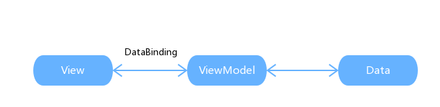

## 简介

* 渐进式
* 轻量级
* 基于`mvvm`
* ...

> Vue不支持`IE8`及以下版本，因为不支持`Object.defineProperty`API，且无法`polyfill`。

## mvvm

`mvvm`的核心思想——当视图层发生改变，会自动更新视图模型层，反之亦然，所以形成双向数据绑定。



之所以基于`mvvm`是因为操作DOM的代价太大，并且可以解耦视图和数据，让你专注业务。

> Vue其实并没有完全遵循`mvvm`规则，只是受它启发。

## Vue实例

通过构造函数`Vue`可以创建`Vue`实例。

```js
const vm = new Vue({			// 创建根实例
    el: '#app',
    data: {
        msg: 'hi',				// 定义初始值
        info: {
            name: 'ugu'
        }
    }
})
```

其中`el`选项必不可少，用于指定页面中已存在的DOM来挂载`Vue`实例，它可以是`HTMLEement`，也可以是`CSS`选择器。当挂载成功后，你就可以通过`vm.$el`来获取被挂载这个DOM。

> 你还可以通过`$mount`来手动挂载。

其中`data`选项中定义的数据会被`Vue`劫持，自动增加Getter和Setter，所以一般存储与视图有关的数据。当这些数据发生变化时，与之有关的视图也会随着更新。如果你仅仅是想要共享数据，可以通过`created`钩子或者直接通过`this`赋值。

> 如果你不想要Data中定义的数据被劫持，你可以通过`Object.freeze()`。

`Vue`实例还代理了`data`中声明的数据。

```js
vm.msg = 'hello world'			// 视图随之刷新
```

注意：直接通过`vm.xxx`定义的属性是不会被劫持的，如果你想要被劫持，可以通过`vm.$set`来定义。

如果你想要一次性添加多个响应式属性，你应该这样做：

```js
vm.info = Object.assign({},vm.info,{
    age: 20,
    sex: "man"
})
```

而不是：

```js
Object.assign(vm.item,{
    age: 20,
    sex: "man"
})
```

### 方法

* `vm.$nextTick`
* `vm.$on`
* `vm.$once`
* `vm.$off`
* `vm.$emit`
* `vm.$set`
* `vm.$forceUpdate`

### 属性

* `vm.$el`
* `vm.$options`
* `vm.$watch`
* `vm.$methods`
* `vm.$data`
* `vm.$root`
* `vm.$slots`
* `vm.$children`
* `vm.$props`

## 生命周期

生命周期函数中的`this`指向Vue实例。

 

* `beforeCreate`：初始化，无法获取到`this.$data`
* `created`：可以获取`this.$data`，但是获取不到`this.$el`
* `beforeMount`：第一次调用render函数
* `mounted`：页面渲染完成，可以获取真实DOM
* `beforeUpdate`：更新前
* `updated`：更新结束，不要操作数据
* `beforeDestory`：可以获取到当前实例，可以用来移除定时器
* `destoryed`：实例上方法监听和子组件被移除。路由切换或者调用`vm.$destory`触发

## 插值表达式

通过`{{}}`语法可以显示数据。

```html
<p>{{msg}}</p>

<p>{{this.msg}}</p>		<!-- 等价，一般省略this -->
```

`{{}}`中，还可以使用一些简单JavaScript表达式。

```html
<div id="app">
    {{ flag ? "显示" : "隐藏" }}
	{{ number / 2 }}
    {{ text.split(",").join() }}
</div>
```

> 只支持简单的表达式，不支持语句。并且不能使用用户定义的全局变量，只能使用Vue白名单中的全局变量，如`Date`和`Math`等。

当使用`template`来定义模板时，必须要有一个外层标签。

```javascript
new Vue({
    // ...
    template: `<div>
			<p>{{msg}}</p>
			<p>{{this.msg}}</p>
		</div>`
})
```

本质上`vue-loader`会自动调用` vue-template-compiler`将`template`转换为`render`函数，之所以引入`template`，是因为`render`不易书写。

## 过滤器

通过管道符`|`进行数据过滤。

```html
<div id="app">
	{{ text | upper | lower }}
</div>
```

```javascript
new Vue({
    el:"#app",
    data:{
        text: "ugu"
    },
    filters:{
        upper(val){
            return val.toUpperCase()
        },
        lower(val) {
            return val.toLowerCase()
        }
    }
})
```

你还可以传值。

```html
<div id="app">
    {{ msg | transform("hi") }}
</div>
```

```javascript
new Vue({
    el:"#app",
    data:{
        msg: "ugu"
    },
    filters:{
        transform(val, param){
            return param + "," + val
        }
    }
})
```

上面都是定义的过滤器都仅在当前实例或组件中生效，你还可以通过`Vue.filter`定义全局过滤器。

```javascript
Vue.filter("myFilter", function(val){
    return "my" + val
})

let app1 = new Vue({
  el:"#app1",
  filters:{
    app1Filter: myFilter
  }
})

let app2 = new Vue({
  el:"#app2",
  filters:{
    app2Filter: myFilter
  }
})
```

> 过滤器仅仅用于简单的文本格式化，更复杂的数据转换建议使用计算属性。

## 指令

Vue中的指令一般带有`v-`前缀，用于将某种行为应用在DOM上。

### v-html

`v-html`用于输出HTML，而不是纯文本。

注意：不建议将用户的内容直接通过`v-html`输出，可能会导致`XSS`攻击。

### v-pre

`v-pre`用于直接显示`{{}}`，而不是进行替换。

### v-cloak

`v-cloak`用于解决网速较慢时，Vue库还未加载完成造成的闪烁，一般配合`display: none`使用。

```html
<div id="app">
  <span v-cloak>{{msg}}</span>
</div>
```

```css
[v-cloak]{
    display:none;
}
```

> 工程化的Vue项目会自动解决闪烁问题，你无需手动设置。

### v-text

不同于`v-cloak`解决块级闪烁，`v-text`用来解决行内闪烁。

```html
<div id="app">
  <span v-text="msg"></span>
</div>
```

> `v-text`中的值是`JavaScript`表达式，所有你可以使用`msg.toUpperCase()`来格式化文本。

### v-once

`v-once`用于定义元素或组件只渲染一次，包括子元素和子组件。渲染之后，就不会随着数据改变而重新渲染。

### v-bind

`v-bind`用于在HTML元素上绑定属性，可以缩写为`:`。

```html
<a :href="aUrl"></a>
```

如果元素属性是布尔类型，那么只要绑定的值为`truthy`就会生效。

```html
<button :disabled="flag"></button>
```

### v-on

`v-on`用于在HTML元素上绑定事件，可以缩写为`@`。

## 计算属性

`{{}}`中复杂运算，建议使用计算属性。

```html
<div id="app">
    <p>{{ getFullName }}</p>
</div>
```

```javascript
new Vue({
    el:"#app",
    data:{
        firstName: "gu"
        lastName: "u"
    },
    computed:{
        getFullName(){
            return this.lastName + this.firstName		// this指向Vue实例
        }
    }
})
```

上面代码中，只有依赖的数据一个发生变化，计算属性就会重新执行，视图随之刷新。

实际上，计算属性包含一个Getter和一个Setter，上面只是默认用法。

```js
new Vue({
    el:"#app",
    data:{
        firstName: "gu"
        lastName: "u"
    },
    computed:{
        getFullName(){
            get() {
                return this.firstName + this.lastName
            },
            set(val) {
                this.firstName = val.split(',')[1]
                this.lastName = val.split(',')[0]
            }
        }
    }
})
```

当在控制台输入`app.getFullName = 'yin,yun'`，便会触发`Setter`，视图随之渲染成`yinyun`。

> 默认使用`Getter`的计算属性一定要有返回值，否则默认返回`undefiend`。

### 缓存

你可能会发现，计算属性能做的事情，在`methods`中定义方法也能实现，甚至还能传参，那为什么还有计算属性呢？这是因为计算属性是基于数据缓存的，简单来说，只要依赖的数据不改变，计算属性就不会重新执行。

### 小技巧

计算属性还可以依赖其它计算属性。

```html
<div id="app">{{getText}}</div>
```

```javascript
new Vue({
    el: "#app",
    data: {
        text: "Hello World",
    },
    computed:{
        getText(){
            return this.upper.toLowerCase()
        },
        upper(){
            return this.text.toUpperCase()
        }
    }
})
```

计算属性不但可以依赖当前`Vue`实例的数据，还可以依赖其他实例的数据

```html
<div id="app1">app1:{{text}}</div>
<div id="app2">app2:{{getText}}</div>
```

```javascript
const app1 = new Vue({
    el:"#app1",
    data:{
      text:"123,456"
    }
})
const app2 = new Vue({
    el:"#app2",
    computed:{
      getText:function(){
        return app1.text.split(",").reverse().join(",")		
      }
    }
})
```

这种用法在多人协作开发中会用到，因为你的数据往往需要别的组件提供。

## watch

`watch`用来监听数据，和计算属性不同，它不要求有返回值。

注意：`watch`默认只能监控一层的数据变化，如果需要深度监控，需要使用对象形式。

```html
<div id="app">
    <button @click="add">+1</button>
</div>
```

```javascript
new Vue({
    el: "#app",
    data: {
        items: {
            count: 1
        }
    },
    methods:{
        add(){
            this.items.count++
        }
    },
    watch:{
        items:{
            handler(){
                // 可以进行异步操作
                console.log(1)
            },
            deep: true				// 深度监听
            // immediate			// 第一次就执行
        }
    }
})
```

虽然计算属性可以应付大多数场景，但是也有局限性，例如不支持异步。而`watch`很好地弥补了这点。

> 和计算属性一样，`watch`也是基于数据缓存的。

## 样式操作

### Class操作

**对象语法**

```html
<div id="app">
    <span :class="{'red': isRed, 'green': isGreen}">{{text}}</span>
</div>
```

```javascript
new Vue({
    el:"#app",
    data:{
        isRed: true,
        isGreen: true
    }
})
```

**数组语法**

```html
<div id="app">
  <span :class="[classOne, classTwo]">{{text}}</span>
</div>
```

```javascript
new Vue({
    el:"#app",
    data:{
        classOne: "red",
        classTwo: "green"
    }
})
```

可以使用三元表达式来切换类。

```html
<div id="app">
  <span :class="[isRed ? classOne : '', classTwo]">hello world</span>
</div>
```

```javascript
new Vue({
    el:"#app",
    data:{
        isRed: true,
        classOne: "red",
        classTwo: "green"
    }
})
```

Vue允许你通过对象语法简化三元运算符。

```html
<div id="app">
  <span :class="[{'red':isRed},classTwo]">hello world</span>
</div>
```

> 当`:class`的逻辑过长时，建议使用计算属性改写。

### Style操作

**对象语法**

```html
<div id="app">
  <!-- CSS属性可以是驼峰命名或短横线命名 -->
  <span :style="{'color':color,'background-color':backgroundColor}">{{text}}</span>
</div>
```

```javascript
new Vue({
    el:"#app",
    data:{
      color:"red",
      backgroundColor:"blue"	
	}
})
```

**数组语法**

```html
<div id="app">
  <span :style="[styleA,styleB]">{{text}}</span>
</div>
```

```javascript
new Vue({
    el:"#app",
    data:{
        styleA:{color: "red"},
        styleB:{background-color: "green"}
	}
})
```

注意：在使用`:style`时，Vue会自动增加CSS前缀。

> 当`:style`逻辑过长时，建议使用计算属性改写。

### 应用组件

`:class`或`:style`若应用在组件上，则会作用于组件的根元素。如果根元素上已经有`class`属性，那么会进行合并。

如果你不希望有这种“继承特性”，可以禁止：

```javascript
Vue.component("component-a",{
    inheritAttrs: false
})
```

## 条件渲染

### v-if

```html
<div id="app">
  <p v-if="status === 1">如果status为1，就显示该行</p>
  <p v-else-if="status === 2">如果status为2，就显示该行</p>
  <p v-else>否则就显示该行</p>
</div>
```

```javascript
new Vue({
    el:"#app",
    data:{
      status: 1
    }
})
```

如果你正在通过`v-if`切换相同的元素渲染时，`Vue`出于效率，会尽可能地复用元素，而不是完全重新渲染。如果你不希望如此，你只需要设置不同的`key`即可。

> `template`标签也可以使用`v-if`指令。

### v-show

不同于`v-if`，`v-show`是通过`display`属性来显示隐藏元素。

> `template`不能使用`v-show`指令。

### 如何选择

* 频繁切换，建议使用`v-show`
* 很少切换，建议使用`v-if`

> `v-for`和`v-if`同时使用时，`v-for`的优先级要高于`v-if`。

## 循环渲染

```html
<div id="app">
  <ul>
    <!-- 或者使用of -->
    <li v-for="(book,index) in books" :key="index">{{book.name}}</li>
  </ul>
</div>
```

```javascript
new Vue({
    el:"#app",
    data:{
      books:[
        {name:"JavaScript权威指南"},
        {name:"JavaScript语言精粹"},
        {name:"JavaScript编程全解"}
      ]
    }
})
```

除了数组，`v-for`还可以遍历对象。

```html
<div id="app">
  <ul>
    <li v-for="(value,key,index) in obj" :key="key">{{value}},{{key}},{{index}}</li>
  </ul>
</div>
```

```javascript
new Vue({
    el:"#app",
    data:{
      obj:{
        name:"youzi",
        age:12,
        sex:"man"
      }
    }
})
```

> 在遍历对象时，是按照`Object.keys()`的结果遍历，所以无法保证遍历顺序在不同`JavaScript`引擎下保持一致。

`v-for`还可以迭代整数。

```html
<div id="app">
  <span v-for="n in 5">{{n}}</span>
</div>
```

```javascript
new Vue({
    el:"#app"
})
```

> `template`标签上也可以应用`v-for`标签。

### 数组更新

对于数组操作来说，以下方法会破坏原数组，所以`Vue`能检测到。

* `push`
* `pop`
* `shift`
* `unshift`
* `splice`
* `sort`

而对于`filter`，`concat`和`slice`这些非破坏性的方法，你需要用返回的数组替换原数组。

Vue的核心就是数据和视图的双向绑定，所以当数组发生改变时，视图也会随之更新。但是对于那些不会破坏原数组的方法，可以用返回的新数组替换原数组来达到改变原数组。

> 你不必担心直接赋值带来的性能问题，`Vue`不会完全重新渲染，而是尽可能地复用元素。
>

另外，下面数组操作，`Vue`也无法检测：

* 直接修改数组长度
* 通过索引修改数组元素

解决这两个问题，可以使用`vm.$set`或者间接通过`splice`来改写。

### 计算属性

如果你不想改变原数组，可以通过计算属性返回处理后的原数组进行循环渲染。

```html
<div id="app">
  <ul>
    <li v-for="i in getList">{{i.name}}</li>
  </ul>
</div>
```

```javascript
new Vue({
    el:"#app",
    data:{
        list:[1,2,3,4,5,6]
    },
    computed:{
        getList(){
            return this.list.filter(val=>val>3)
        }
    }
})
```

当然也可以使用方法来实现。

```html
<div id="app">
  <ul>
    <li v-for="i in getList(list)">{{i.name}}</li>
  </ul>
</div>
```

```javascript
new Vue({
    el:"#app",
    data:{
        list: [1,2,3,4,5,6]
    },
    methods:{
        getList(arg){
            return arg.filter(val=>val>3)
        }
    }
})
```

### 循环渲染组件

组件也可以使用`v-for`循环渲染。

## 事件处理

前面了解到，通过`v-on`来绑定事件，绑定事件的回调函数写在`methods`选项内。

若无需传参，方法名可以省略括号，并且默认会将事件对象传入。

```html
<div id="app">
    <button @click="showInfo">click</button>
</div>
```

```javascript
new Vue({
    el:"#app",
    methods:{
        showInfo(e){
            console.log(e)
        }
    }
})
```

若需要传参，`Vue`提供了一个特殊变量$event，用于访问原生DOM事件对象。

```html
<div id="app">
    <button @click="showInfo('事件对象',$event)">click</button>
</div>
```

```javascript
new Vue({
    el:"#app",
    methods:{
        showInfo(msg,e){
            console.log(msg,e)
        }
    }
})
```
### 事件修饰符

为了书写方便，`Vue`提供了事件修饰符来简化你的DOM操作细节。

具体如下：

* `.stop`：阻止事件继续传播
* `.prevent`：阻止事件默认行为
* `.capture`：只在事件捕获阶段触发事件
* `.self`：只在元素自身触发
* `.once`：只触发一次，同样适用于组件
* `.passive`：对应`addEventListener`中的passive选项

注意：不要将`.passive`和`.prevent`一起使用，因为此时`.prevent`将会被忽略，并且会向浏览器发出警告。

> `.passive`能够提高移动端的性能。

修饰符还可以串联使用。

```html
<button @click.stop.prevent="clickHandle">click</button>
```

> 串联的顺序很重要，例如：`@click.prevent.self`会阻止所有的点击，而`@click.self.prevent`只会阻止对元素自身的点击。

### 按键修饰符

监听表单元素事件时，还可以使用案件修饰符。

```html
<input @keyup.13="info">
```

```javascript
const vm = new Vue({
    el: "#app",
    methods:{
        // 只有keCode为13，才会触发
        info(){
            console.log(1)
        }
    }
})
```

`Vue`还允许你配置具体按键。

```javascript
Vue.config.keyCodes.f1 = 112
```

全局定义之后，你就可以直接使用`@keyup.f1`。

除了具体的`keyCode`之外，`Vue`还提供了一些快捷名称，具体如下：

* `.enter`
* `.tab`
* `.delete`：捕获删除和退格键
* `.esc`
* `.space`
* `.up`
* `.down`
* `.left`
* `.right`
* `.ctrl`：系统修饰键
* `.alt`：系统修饰键
* `.shift`：系统修饰键
* `.meta`：Mac下是Command键，Windows下是窗口键

系统修饰键和常规按键不同，在和`keyup`一起使用时，事件触发时修饰键必须处于按下状态。也就是说，只有在按住`ctrl`的情况下释放其它案件，才会触发`keyup.ctrl`。如果单单释放`ctrl`时不会触发事件，如果你想要这样的行为，可以换用`keyCode:keyup.17`。

通过`.exect`修饰符来精确的控制系统修饰符组合触发的事件。

```html
<!-- 即使 Alt 或 Shift 被一同按下时也会触发 -->
<button @click.ctrl="handleClick">A</button>

<!-- 有且只有 Ctrl 被按下的时候才触发 -->
<button @click.ctrl.exact="handleClick">A</button>

<!-- 没有任何系统修饰符被按下的时候才触发 -->
<button @click.exact="handleClick">A</button>
```

按键修饰符可以组合使用，或者配合鼠标使用。

```html
<!-- 触发条件ctrl+s -->
<input @keyup.ctrl.83="save">

<!-- 触发条件ctrl+click -->
<input @keyup.click.ctrl="doSth">
```

你也可以直接将`KeyboardEvent.key`暴露的任意有效按键名转换为kebab-case来作为修饰符：

```html
<input @keyup.page-down="showInfo">
```

当`$event.key === "PageDown"`时被调用。

> 有一些按键在`IE9`中有不同的`key`值，如果想要支持`IE9`，建议首选内置别名。

另外，`Vue`还支持如下鼠标按钮修饰符：

* `.left`
* `.right`
* `.middle`

## v-model

`v-model`用于在表单元素上双向绑定数据。

表单元素上应用了`v-model`之后，表单控件的值只依赖所绑定的数据，不再关心其`value`，`checked`、`selected`属性的初始值，并且对于`<textarea>`标签之间插入的值也不会生效。

> 对于中文输入法输入中文不会实时更新，如果需要实时更新，可以直接监听`input`事件，而不是使用`v-model`指令。

> `v-model`本质上是`input`事件的语法糖。

### 单选

当单选按钮单独使用时，不需要`v-mode`l，直接使用`v-bind`绑定一个布尔类型的值。为真时选中，为假时是未选中。

```html
<div id="app">
  <input type="radio" :checked="picked" id="man"><label for="man">男</label>
</div>
```

```javascript
new Vue({
    el:"#app",
    data:{
        picked: true
    }
})
```

而如果是组合起来使用来实现互斥效果，就需要`v-model`配合`value`来使用。

```html
<div id="app">
  <input type="radio" id="man" v-model="picked" value="man"><label for="man">男</label>
  <input type="radio" id="woman" v-model="picked" value="woman"><label for="woman">女</label>
  <p>选中的是：{{picked}}</p>
</div>
```

```javascript
new Vue({
    el:"#app",
    data:{
      picked:"man"
    }
})
```

当`v-model`绑定的值和value值一致，就会选中该项。

### 复选框

当复选框单独使用时，需要使用`v-model`绑定一个布尔值。

```html
<div id="app">
  <input type="checkbox" v-model="picked" id="football">
  <label for="football">足球：{{picked}}</label>
</div>
```

```javascript
new Vue({
    el:"#app",
    data:{
        picked: true
    }
})
```

当组合使用时，`v-model`指令会绑定一个由`value``值组成的数组，如果复选框的`value`值在该数组中，则是选中。如果通过视图选中该复选框，复选框的`value`值也会自动`push`到绑定的数组里。

```html
<div id="app">
  <input type="checkbox" v-model="picked" value="football" id="football">
  <label for="football">足球</label>
  <input type="checkbox" v-model="picked" value="baseball" id="baseball">
  <label for="baseball">排球</label>
  <input type="checkbox" v-model="picked" value="basketball" id="basketball">
  <label for="basketball">篮球</label>
</div>
```

```javascript
new Vue({
    el:"#app",
    data:{
        picked:["football","basketball"]
    }
})
```

### 下拉列表

当下拉列表单选时：

```html
<div id="app">
  <select v-model="picked">
    <option>html</option>
    <option value="js">JavaScript</option>
    <option>CSS</option>
  </select>
  <p>选中的项是：{{picked}}</p>
</div>
```

```javascript
new Vue({
    el:"#app",
    data:{
      picked:"html"
    }
})
```

下拉选项如果含有`value`属性，`v-model`就会优先匹配`value`值。如果没有，就会直接匹配下拉选项包裹的文本。

> 如果`v-model`表达式的初始值未能匹配任何选项，`select`元素将被渲染为未选中状态。在`IOS`中，这会使用户无法选择第一个选项，因为这样的情况下，`IOS`不会触发change事件。因此，更推荐提供一个值为空的禁用选项。

当下拉列表多选时：

```html
<div id="app">
  <select v-model="picked" multiple>
    <option>html</option>
    <option value="js">JavaScript</option>
    <option>CSS</option>
  </select>
  <p>选中的项是：{{picked}}</p>
</div>
```

```javascript
new Vue({
    el:"#app",
    data:{
      picked:["html","js"]
    }
})
```

多选时，`v-model`绑定的是一个数组，若`value`值或文本值在数组中就会被选中。注意：优先匹配`value`属性。

### 绑定动态值

对于单选按钮，复选框及下拉选择的选项，v-model绑定的值通常是静态值。

```html
<!-- 当选中时，`picked` 为字符串 "a" -->
<input type="radio" v-model="picked" value="a">

<!-- `toggle` 为 true 或 false -->
<input type="checkbox" v-model="toggle">

<!-- 当选中第一个选项时，`selected` 为字符串 "abc" -->
<select v-model="selected">
  <option value="abc">ABC</option>
</select>
```

而如果你想要动态绑定一个值，需要使用`v-bind`来实现。

**复选框**

```html
<div id="app">
  <input type="checkbox" v-model="picked" true-value="v1" false-value="v2" id="baseball">
  <label for="baseball">baseball</label>
  <p>{{picked}}</p>
  <p>{{v1}}</p>
  <p>{{v2}}</p>
</div>
```

```javascript
new Vue({
    el:"#app",
    data:{
      picked: true,
      v1:"a",
      v2:"b"
    }
  })
```

选中时，`picked`等于`v1`的值；未选中时，`picked`等于`v2`的值。

> `true-value`和`false-value`不会影响控件的`value`属性。

**单选**

```html
<input type="radio" v-model="picked" :value="val" />
```

选中时，`picked`等于`val`的值。

**下拉列表**

```html
<select v-model="selected">
  <option v-bind:value="val">123</option>
</select>
```

选中时，`selected`等于`val`的值。

### 修饰符

`v-model`的修饰符用于控制数据同步的时机，具体如下：

* `.lazy`：`v-model`默认使用`input`同步数据，该修饰符会改为`change`事件，这样不会实时更新，而是在失焦或按下回车时同步
* `.number`：可以将输入的字符串转换为`number`类型，多用于数字输入框
* `.trim`：用于过滤收尾空白字符

### 原理

`v-model`本质上是`input`事件和`:value`的语法糖。