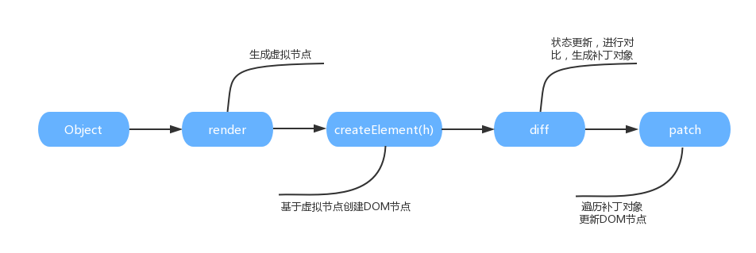

## 组件

组件可以提高代码的复用性。在`Vue`中，组件以自定义标签的形式表现出来。

组件只有通过注册之后，才能使用。

* 全局注册：全局有效
* 局部注册：组件内有效

```js
// 全局注册
Vue.component("component-a",{
    template: "<div>子组件a</div>"		  // 建议使用短横线命名，因为HTML无法识别大写标签
})
Vue.component("ComponentB",{			// 大驼峰在使用的时候需要替换成短横线
    template: "<div>子组件b</div>"		
})

// 局部注册
let child = {
    template:"<div>child组件div>"
}
let component = {
    template:"<div>component组件</div>"
}
new Vue({
    el:"#app",
    components:{
        child: child,					// 可以使用ES6语法简写
        "component-a": component		// 或ComponentA: component
    }
})
```

> * 单文件组件中可以使用自闭合标签来表示组件
> * `<ComponentA>`这种大写标签在`vue-cli`项目中可以使用

注册好之后，就可以在模板中使用了。

```html
<div id="app">
    <child></child>
    <component-a></component-a>
</div>
```

> 组件本质上是一个可复用且拥有预定义选项的`Vue`实例，但是`data`选项必须`return`出去，以保证各个组件之间互不影响，这是它们之间的不同之处。
>

### is属性

某些`html`元素只允许嵌套特定的元素，如果使用组件，需要通过`is`属性。

```html
<div id="app">
  <table>
    <tbody is="componentA"></tbody>
    <!-- 或<tbody is="component-a"></tbody> -->
  </table>
</div>
```

这些限制性的元素有：`ul`，`ol`以及`select`等。

这个限制仅仅存在于原生的`html`元素中，对于模板`template`标签中写`html`元素不适用。

### 组件嵌套

组件之间还可以嵌套使用，从而形成`父-子-孙`类似的组件树。

> 实际上，每个组件都有一个唯一标识`_uid`。

### 组件通信

#### props和emit

**props**

通过`props`可以实现父组件向子组件传递数据。

```html
<div id="app">
	<component-a send-msg="hi,ugu"></component-a>
</div>
```

```javascript
let componentA = {
    template: "<div>{{sendMsg}}</div>",
    props:['sendMsg']		
}
const vm = new Vue({
    el: "#app",
    components:{
        componentA
    }
})
```

> 由于`HTML`对标签大小写不敏感，所以驼峰命名的`props`要写成短横线命名。当然，如果组件是在`template`或单文件组件中，则没有这个限制。

当然传递的值还可以是父组件的动态数据。

```html
<div id="app">
	<component-a :send-msg="msg"></component-a>
</div>
```

```javascript
let componentA = {
    template: "<div>{{sendMsg}}</div>",
    props:['sendMsg']			
}
const vm = new Vue({
    el: "#app",
    components:{
        componentA
    },
    data:{
        msg: "hi,ugu"
    }
})
```

这样你就是传递JavaScript表达式，而不是静态字符串。

另外，通过`props`传递的数据是单向的，这样设计的目的是防止子组件意外改变父组件的状态，从而改变其余组件使用这个父组件的数据，导致数据流向难以理解。

> 如果你通过子组件强制修改父组件传递的数据，控制台会发出警告。如果你非要改变这个数据，可以初始化该数据的一个副本，或者直接使用计算属性依赖该数据。

很多情况下，我们需要对父组件传递过来的数据进行校验，检验不通过会在控制台发出警告来提示开发者。

```javascript
let componentA = {
    template: "<div>{{sendMsg}}</div>",
	props:{
		sendMsg,					// 不检验
        /**
         sendMsg: String		  	// 必须是String类型
         sendMsg: [String,Number]  	// 必须是String或Number类型
         sendMsg: {				  	// 必须是Boolean类型，若未传值，默认值为true
         	type: Boolean,
         	default: true
         }
         sendMsg: {				   	// 必须是Number类型，且必传
         	type: Number,
         	require: true
         }
         sendMsg: {				    // 必须是Array类型，且默认值是函数返回值
         	type: Array,
            default: function(){
            	return [1,2,3]
            }						// 如果默认值是[]，需要写成()=>[]
         }
         sendMsg: {
         	type: Object,
         	default: () => ({})		
         }
         sendMsg: {					// 自定义校验器
         	validator: function(val){
         		return value>10
         	}
         }
         **/
	}
}
const vm = new Vue({
    el: "#app",
    components:{
        componentA
    }
})
```

校验的类型除了JavaScript的基本类型，还可以是自定义类型，通过`instanceof`来进行检查确认。

```javascript
function Person(firstName,lastName){
    this.firstName = firstName
    this.lastName = lastName
}

Vue.component("blog",{
    props:{
        author: Person
    }
})
```

> 验证会在组件实例创建之前进行，你无法在里面获取`this`。

当然，组件接收的属性不一定非要用来进行组件通信。对于那些没有进行组件通信的属性会应用到组件的根元素上。

```html
<component-a class="red"></component-a>
```

`red`类会合并到`component-a`组件的根元素类上。

**$emit**

通过`$emit`发射自定义事件可以实现子组件向父组件传递数据。

```html
<div id="app">
    <component-a @pass="getData"></component-a>
    <p>{{msg}}</p>
</div>
```

```javascript
let componentA = {
    template: "<button @click='delivery'>delivery</button>",
    data(){
        return {
            msg: "hi,ugu"
        }
    },
    methods:{
        delivery(){
            this.$emit('pass',this.msg)		
        }
    }
}
const vm = new Vue({
    el: "#app",
    components:{
        componentA
    },
    data:{
        msg: ""
    },
    methods:{
        getData(val){
            this.msg = val
        }
    }
})
```

`v-on`除了在组件上监听自定义事件，还可以通过`.native`修饰符监听组件根元素的原生DOM事件。但是通过`.native`可能会失败。例如：组件根元素根本不是`input`元素，而你却监听`input`事件。

> 如果不加`.passive`，`@click`只会被当作一个特殊的属性应用到组件根元素上。

#### v-model

子组件通过`v-model`向父组件传递数据

```html
<div id="app">
    <component-a v-model="msg"></component-a>
    <p>{{msg}}</p>
</div>
```

```javascript
let componentA = {
    template: "<button @click='delivery'>delivery</button>",
    data(){
        return {
            msg: "hi,ugu"
        }
    },
    methods:{
        delivery(){
            this.$emit('input', this.msg) 	// 必须是input事件
        }
    }
}
const vm = new Vue({
    el: "#app",
    components:{
        componentA
    },
    data:{
        msg: ""
    }
})
```

#### sync

通过`sync`修饰符可以实现子组件向父组件传递数据。

```html
<div id="app">
    <component-a :val.sync="msg"></component-a>
    <p>{{msg}}</p>
</div>
```

```js
let componentA = {
    template: "<button @click='delivery'>delivery</button>",
    data(){
        return {
            msg: "hi,ugu"
        }
    },
    methods:{
        delivery(){
            this.$emit('update:val', this.msg) 	
        }
    }
}
const vm = new Vue({
    el: "#app",
    components:{
        componentA
    },
    data:{
        msg: ""
    }
})
```

`sync`本质上是`@update:val`事件和`:val`的语法糖。

> `val`不像`v-model`那样是定死成`value`，使用起来更加灵活。

#### $parent

在子组件中，可以通过`$parent`来访问父组件实例，父组件也可以通过`$children`来访问它的所有子组件实例，并且可以递归向上或向下访问，直至根组件或最内层组件。

```html
<div id="app">
  <component-a @getMsg="msg"></component-a>
  {{msg}}
</div>
```

```javascript
const componentASon = {
    template:"<button @click='change'>改变爷爷组件的数据</button>",
	methods: {
        change() {
            // 通过父组件实例`$emit`发射事件
            this.$parent.emit('getMsg', 'hello world')
        }
    }
}

let a = {
    template:"<div><component-a-son /></div>",
    components: {
        ComponentASon
    }
}

const componentASon = {
    template:"<button @click='change'>改变爷爷组件的数据</button>",
	methods: {
        change() {
            this.$parent.emit('getMsg', 'hello world')
        }
    }
}

new Vue({
    el:"#app",
    data:{
        msg: "hi,ugu"
    },
    components:{
        "component-a":a
    }
})
```

如果你需要子组件通过父链一直向上传播数据，你可以封装`$dispatch`方法。

```js
Vue.prototype.$dispatch = function $dispatch(eventName, data) {
  let parent = this.$parent;
  while (parent) {
    parent.$emit(eventName, data);
    parent = parent.$parent;
  }
};
```

如果你需要父组件通过子链一直向下广播数据，你可以封装`$broadcast`方法。

```js
Vue.prototype.$broadcast = function $broadcast(eventName, data) {
  const broadcast = function () {
    this.$children.forEach((child) => {
      child.$emit(eventName, data);
      if (child.$children) {
        $broadcast.call(child, eventName, data);
      }
    });
  };
  broadcast.call(this, eventName, data);
};
```

> 通过`$root`可以快速地访问根实例。

#### $refs

当子组件较多时，通过`$children`遍历出需要的组件是比较困难的，尤其是在组件动态渲染时，它们的序列是不固定的。因此，`Vue`提供了子组件索引的方法，通过`$refs`来获取子组件实例。

```html
<div id="app">
  <component-a ref="a"></component-a>
  <p>{{msg}}</p>
</div>
```

```javascript
let a = {
    template:"<div>{{msg}}</div>",
    data(){
        return {
            msg:"hi,ugu"
        }
    }
}
new Vue({
    el:"#app",
    data:{
        msg: ""
    },
    components:{
        "component-a":a
    },
    mounted(){							//	created拿不到
        this.msg = this.$refs.a.msg
    }
})
```

`$refs`只有在组件渲染完成后才能获取到，并且是非响应式，仅仅作为获取子组件的应急手段，不要应用在模板中或计算属性里。

> `ref`会自动判断是普通标签还是组件。

#### $attrs

子组件通过`$attrs`可以获取父组件传递的所有`props`。

```html
<div id="app">
	<component-a msg="hello"></component-a>
</div>
```

```javascript
let componentA = {
    template: "<div>{{$attrs.msg}}</div>",	
   	inheritAttrs: false						// 父组件传递过来的props不会应用在子组件根元素上	
}
const vm = new Vue({
    el: "#app",
    components:{
        componentA
    }
})
```

> `inheritAttrs`不会影响`style`和`class`的绑定。

子组件通过`$listeners`可以获取父组件传递的所有方法。

```html
<div id="app">
	<component-a @getMsg="getMsg"></component-a>
</div>
```

```javascript
let componentA = {
    template: "<div>子组件</div>",		
   	inheritAttrs: false,
    mounted() {
        this.$listeners.getMsg()			// 1
    }
}
const vm = new Vue({
    el: "#app",
    components:{
        componentA
    },
    methods: {
        getMsg() {
            console.log(1)
        }
    }
})
```

> * `v-bind=$attrs`：绑定所有传递过来的属性
> * `v-bind=$listeners`：绑定所有传递过来的事件

#### Provide和Inject

父组件通过`Provide`向所有子组件注入数据，子组件通过`Inject`消费数据。

```html
<div id="app">
	<component-a></component-a>
</div>
```

```js
let componentA = {
    template: "<div>{{this.parent.msg}}</div>",
    inject: [
        'parent'
    ]
}
const vm = new Vue({
    el: "#app",
    components:{
        componentA
    },
    data() {
        return {
            msg: 'hello'
        }
    },
    provide() {
    	return {
            parent: this				// 将父组件实例注入子组件
        }	
	}
})
```

#### EventBus

在Vue2中，推荐使用一个空的Vue实例作为中央事件总线（发布订阅者模式）来实现非父子组件间通信。

```html
<div id="app">
    <component-a></component-a>
    <component-b></component-b>
</div>
```

```javascript
//创建中央事件总线
let bus = new Vue()
/*
	不过建议使用下面方式
	Vue.prototype.bus = new Vue()
	
	派发事件：
	this.bus.$emit("pass","hi,ugu")
	
	监听事件：
	this.bus.$on("pass")
*/

let a = {
    template:`<button @click="dispatch">pass data</button>`,
    methods:{
        dispatch(){
            //派发pass事件
            bus.$emit("pass","hi,ugu")
        }
    }
}
let b = {
    template:"<div>{{msg}}</div>",
    data(){
        return {
            msg: ""
        }
    },
    created() {
        //监听pass事件
        bus.$on("pass",val=>this.msg = val)
    }
}
new Vue({
    el:"#app",
    components:{
        "component-a":a,
        "component-b":b
    }
})
```

#### 总结

从组件通信可以总结子组件调用父组件的方法：

**获取父组件实例直接调用**

```html
<div id="app">
	<component-a></component-a>
</div>
```

```javascript
let componentA = {
    mounted() {
        this.$parent.sayMsg()
    }		
}
const vm = new Vue({
    el: "#app",
    components:{
        componentA
    },
    methods: {
        sayMsg() {
            console.log('hello world')
        }
    }
})
```

**子组件直接触发父组件绑定的事件**

```html
<div id="app">
	<component-a @getMsg="sayMsg"></component-a>
</div>
```

```javascript
let componentA = {
    mounted() {
        this.$emit('getMsg')
    }		
}
const vm = new Vue({
    el: "#app",
    components:{
        componentA
    },
    methods: {
        sayMsg() {
            console.log('hello world')
        }
    }
})
```

**父组件将方法传递给子组件**

```html
<div id="app">
	<component-a :getMsg="sayMsg"></component-a>
</div>
```

```javascript
let componentA = {
    props: ['getMsg']
    mounted() {
        // 也可以通过$attrs获取传递的属性
        this.getMsg()
    }		
}
const vm = new Vue({
    el: "#app",
    components:{
        componentA
    },
    methods: {
        sayMsg() {
            console.log('hello world')
        }
    }
})
```

**直接获取父组件绑定的事件**

```html
<div id="app">
	<component-a @getMsg="sayMsg"></component-a>
</div>
```

```javascript
let componentA = {
    props: ['getMsg']
    mounted() {
        this.$listeners.getMsg()
    }		
}
const vm = new Vue({
    el: "#app",
    components:{
        componentA
    },
    methods: {
        sayMsg() {
            console.log('hello world')
        }
    }
})
```

### 内容分发

如果父组件需要向子组件传递`html`字符串，你可以通过组件通信来实现。

```html
<div id="app">
    <child content="<p>hello</p>"></child>
</div>
```

```js
Vue.component("child",{
    props;["content"]
    template:`
			<div>
				<div v-html="this.content"></div>
			</div>`
})
```

但是，如果`html`字符串很长，十分影响代码的书写。所以`Vue`提高了内容分发机制。

```html
<div id="app">
	<component-a>{{msg}}</component-a>		<!--msg绑定的是父组件数据-->
</div>
```

```javascript
let a = {
    template:`<p>
				<slot>如果父组件没有内容，就默认显示我</slot>	
			</p>`,								// slot里面绑定的是子组件数据
}
new Vue({
    el:"#app",
    data:{
        msg: "hi,ugu"
    },
    components:{
        "component-a":a
    }
})
```

插入的内容不仅可以是HTML元素，还可以是其他任意的组件。

> 如果组件中没有`slot`元素，则任何写入组件的内容都会被抛弃。

#### 具名Slot

你也可以为slot元素添加name属性，用来分发父组件中对应名称的内容。

```html
<div id="app">
    <component-a>
        <div v-slot:header>header</div>
        <p>hi,ugu</p>
        <p>hi,ugu</p>
        <div v-slot:footer>footer</div>
    </component-a>
</div>
```

```javascript
let a = {
    template: `<div>=
				<slot name="header">
					<div>默认内容1</div>
                  </slot>
				<slot>
					<p>默认内容2</p>
				</slot>
                  <slot name="footer">
					<div>默认内容3</div>
				</slot>
			</div>`,
}

new Vue({
     el: "#app",
     components: {
         "component-a": a
     }
})
```

> `v-slot`用来取代之前的`slot`和`slot-scoped`，`v-slot`可以简写为`#`。

#### 作用域插槽

作用域插槽是一种特殊的slot，使用一个可以复用的模版替换已渲染元素。

```html
<div id="app">
    <component-a>
        <template v-slot="props">
            <p>{{props.msg}}+我是父组件自定义内容</p>
        </template>
    </component-a>
</div>
```

```javascript
let a = {
    template: `<div>=
				<slot msg="子组件数据">
					<p>默认内容</p>
				</slot>
			</div>`,
}

new Vue({
     el: "#app",
     components: {
         "component-a": a
     }
})
```

当然你也可以使用ES6语法解构slot-scope，这会使作用域插槽更干净一些。

```html
<component-a>
  <template v-slot="{ msg }">
    <span>{{msg}}</span>
  </template>
</component-a>
```

#### 访问slot

通过`$slots`访问某个`slot`。

```html
<div id="app">
    <component-a>
        <div v-slot:header>header</div>
        <p>hi,ugu</p>
        <p>hi,ugu</p>
        <div v-slot:footer>footer</div>
    </component-a>
</div>
```

```javascript
let a = {
    template: `<div>=
				<slot name="header">
					<div>top</div>
                  </slot>
				<slot>
					<p>默认内容</p>
				</slot>
                  <slot name="footer">
					<div>bottom</div>
				</slot>
			</div>`,
    mounted(){
        console.log(this.$slots.default,this.$slots.header,this.$slots.footer)
    }
}

new Vue({
     el: "#app",
     components: {
         "component-a": a
     }
})
```

### 组件进阶

#### 递归组件

给组件设置name选项之后，便可以在它的模版内递归地调用自己。

```html
<!-- app.vue -->
<template>
  <div class="app">
    <menu>
      <template v-for="item in treeData">
        <menuitem :key="item.title" v-if="!item.children"
          >{{item.title}}</menuitem
        >
        <SubMenu :key="item.title" :item="item" v-else></SubMenu>
      </template>
    </menu>
  </div>
</template>

<script>
  import Menu from "./component/Menu";
  import MenuItem from "./component/MenuItem";
  import SubMenu from "./component/SubMenu";

  export default {
    components: {
      Menu,
      MenuItem,
      SubMenu
    },
    data() {
      return {
        treeData: [
          {
            title: "标题1",
            children: [
              {
                title: "标题1-1"
              },
              {
                title: "标题1-2"
              },
              {
                title: "标题1-3",
                children: [
                  {
                    title: "标题1-3-1"
                  },
                  {
                    title: "标题1-3-2"
                  },
                  {
                    title: "标题1-3-3"
                  }
                ]
              }
            ]
          },
          {
            title: "标题2"
          },
          {
            title: "标题3"
          }
        ]
      };
    }
  };
</script>

<!-- Menu.vue -->
<template>
  <div class="menu">
    <slot></slot>
  </div>
</template>

<script>
  export default {};
</script>

<!-- MenuItem.vue -->
<template>
  <div class="menu-item">
    <slot></slot>
  </div>
</template>

<script>
  export default {};
</script>
<!-- SubMenu.vue -->
<template>
  <div class="sub-menu">
    <div>{{item.title}}</div>
    <template v-for="item in item.children">
      <menuitem :key="item.title" v-if="!item.children"
        >{{item.title}}</menuitem
      >
      <SubMenu :key="item.title" v-else :item="item" />
    </template>
  </div>
</template>

<script>
  import MenuItem from "./MenuItem";

  export default {
    name: "SubMenu"
    props: {
      item: {
        type: Object,
        default: () => ({})
      }
    },
    components: {
      MenuItem
    }
  };
</script>
```

递归组件常用来开发一些具有未知层级关系的独立组件，比如级联选择器和树形控件等。

> 必须给一个条件来限制递归数量，否则会抛出错误：max stack size exceeded。
>

#### 动态组件

通过`<component>`标签可以动态地挂载组件，其`is`属性用来选择要挂载的组件。

```html
<div id="app">
    <component :is="currentView"></component>
    <button @click="toggle">toggle</button>
</div>
```

```javascript
new Vue({
    el: "#app",
    components: {
        componentA: {
            template: "<p>组件a</p>"
        },
        componentB: {
            template: "<p>组件b</p>"
        }
    },
    data: {
        currentView: "componentA"
    },
    methods: {
        toggle() {
            this.currentView = this.currentView == "componentA" ? "componentB" : "componentA"
        }
    }
})
```

当然，你也可以直接绑定组件对象。

```html
<div id="app">
    <component :is="currentView"></component>
</div>
```

```javascript
let componentA = {
    template: "<p>组件a</p>"
}

new Vue({
    el: "#app",
    data: {
        currentView: componentA
    }
})
```

#### keep-alive

当动态切换组件时，你可以通过`keep-alive`保持这些组件的状态，而不是每次切换都重新渲染。

```html
<keep-alive>
  <component :is="currentView"></component>
</keep-alive>
```

`keep-alive`还有如下属性：

- `include`：字符串或正则表达式。只有名称匹配的组件会被缓存
- `exclude`：字符串或正则表达式。任何名称匹配的组件都不会被缓存
- `max` ：数字。最多可以缓存多少组件实例

当组件在`keep-alive`中进行切换时，它的`activted`和 `deactivated`  两个生命周期钩子会相应执行。

> 使用`keep-alive`时要注意给组件加上`name`属性。

#### 异步组件

当你的组件足够多时，没必要一开始就全部进行加载，而是同步异步组件来优化性能。

```js
export default {
    // ...
    components: {
       Dialog: () => import('./Dialog') 
    }
}
```

异步组件一般是配合`webpack`的代码分割一起使用。

#### $nextTick

`Vue`在观察到数据变化时并不是直接更新DOM，异步更新DOM。也就是说，数据发生改变，下一次`Tick`中才能获取更新好的DOM。

```html
<div id="app">
    <p v-if="flag" ref="text">hi,ugu</p>
    <button @click="getText">click</button>
</div>
```

```javascript
new Vue({
    el:"#app",
    data:{
        flag: false
    },
    methods:{
        getText(){
            this.flag = true
            this.$nextTick(()=>{
                console.log(this.$refs.text)
            })
        }
    }
})
```

## Render

虚拟DOM

下图是虚拟DOM运行的过程：



### render函数

通过`render`函数可以创建虚拟DOM，该函数接收三个参数：

* 第一个参数：必选，可以是HTML标签、组件或函数
* 第二个参数：可选，表示数据对象
* 第三个参数：可选，表示子节点

```js
const Level = {
  props: {
    level: {
      type: Number,
      default: 1
    }
  },
  render(h) {
    return h(
      `h${this.level}`,
      {
        attrs: {
          class: "red"
        }
      },
      this.$slots.default
    );
  }
};
```

> 子节点嵌套过深，建议写成`JSX`语法。

当然你还可以写成`JSX`语法：

```js
export default {
  props: {
    level: {
      type: Number,
      default: 1
    }
  },
  render(h) {
    const tag = `h${this.level}`
    return <tag className="red">{this.$slots.default}</tag>
  }
};
```

如果没有`render`函数，你可能需要在模板中使用`v-if`进行判断实现，不够优雅。

> 实际上，你通过`template`书写的模板最终会渲染成`render`函数形式。

另外，`Vue`提供的指令无法在`render`函数中直接使用，你需要手动实现。

```js
const MyComponent = {
  data() {
      return {
          flag: true
      }
  },
  render(createElement) {
      // 手动实现`v-if`
      this.flag && return createElement('p', '真')
      !this.flag && return createElement('p', '假')
  }
};
```

### 函数式组件

`functional`选项来实现函数式组件，这种组件没有`data`和`this`上下文，使得`render`函数返回的虚拟节点更容易渲染。

使用函数式组件时，`render`函数还提供了第二个参数`context`来临时提供上下文，具体包含：

* `props`
* `children`
* `slots`
* `data`
* `parent`
* `listeners`
* `injections`

所以上面`Level`组件可以改写成函数式组件。

```js
const Level = {
  functional: true,
  render(h, context) {
    console.log(context)
    const tag = `h${context.props.level}`
    return <tag className="red">{context.children}</tag>
  }
};
```

## 混入

`mixins`是一种组件复用功能的一种灵活方式，混入对象可以包含任意组件选项。当组件使用混入对象时，所有混入对象的选项将被混入该组件本身的选项。

```javascript
//定义一个混入对象
var myMixin = {
    created(){
        this.hello()
    },
    methods:{
        hello(){
            console.log("hi,ugu")
        }
    }
}

//定义一个使用混入对象的组件
var Component = Vue.extend({
    mixins: [myMixin]
})

var component = new Component()			
```

### 选项合并

当组件和混入对象含有同名选项时，这些选项将以恰当的方式混入。

比如，数据对象在内部会进行浅合并（一层属性深度），在和组件的数据发生冲突时以组件数据优先。

```javascript
var mixin = {
    data(){
        return {
            msg: "hi,youzi",
            foo: "abc"
        }
    }
}

new Vue({
    mixins: [mixin],
    data(){
        return {
            msg: "hi,ugu",
            bar: "def"
        }
    },
    created(){
        console.log(this.$data)		//{msg: "hi,ugu",foo: "abc",bar: "def"}
    }
})
```

同名钩子函数将混合为一个数组，因此都将被调用。另外，混入对象的钩子将在组件自身钩子之前调用。

```javascript
var mixin = {
    created(){
        console.log("混入对象的钩子被调用")
    }
}

new Vue({
    mixins: [mixin],
    created(){
        console.log("组件钩子被调用")
    }
})
// => "混入对象的钩子被调用"
// => "组件钩子被调用"
```

值为对象的选项，例如methods，components和directives，将被混合为同一个对象。两个对象键名冲突时，取组件对象的键值对。

```javascript
var mixin = {
  methods: {
    foo: function () {
      console.log('foo')
    },
    conflicting: function () {
      console.log('from mixin')
    }
  }
}

var vm = new Vue({
  mixins: [mixin],
  methods: {
    bar: function () {
      console.log('bar')
    },
    conflicting: function () {
      console.log('from self')
    }
  }
})

vm.foo() // => "foo"
vm.bar() // => "bar"
vm.conflicting() // => "from self"
```

> `Vue.extend()`也使用同样的策略进行合并。

当然，你也可以自定义混合策略。

```javascript
Vue.config.optionMergeStrategies.myOption = function (toVal, fromVal) {
  // return mergedVal
}
```

对于大多数对象选项，可以使用methods的合并策略：

```js
var strategies = Vue.config.optionMergeStrategies
strategies.myOption = strategies.methods
```

### 全局混入

你也可以全局注册混入对象。

```javascript
Vue.mixin({
    created(){
        var option = this.$options.myOption
        if(myOption){
            console.log(myOption)
        }
    }
})

new Vue({
	myOption: "hello"
})
```

一旦使用全局混入对象，将会影响所有之后创建的`Vue`实例，使用时要小心谨慎。

## 自定义指令

通过自定义指令来`DOM`操作进行封装，使用之前要进行注册。

```javascript
//全局注册
Vue.directives(name,{
    // 指令选项
})

//局部注册
new Vue({
    directives:{
        name:{
            // 指令选项
        }
    }
})
```

自定义指令的选项是由多个可选的钩子函数组成，这些钩子函数有：

- `bind`：只调用一次，指令第一次绑定到元素时调用
- `inserted`：被绑定元素插入父节点时调用。注意：父节点存在即可调用，不必存在于document中
- `update`：被绑定元素所在的模版更新时调用，而不论绑定值是否变化
- `componentUpdated`：被绑定元素所在模版完成一次更新周期时调用
- `unbind`：只调用一次，指令与元素解绑时调用

```html
<div id="app">
	<input type="text" v-focus />
</div>

```

```javascript
new Vue({
    el:"#app",
    directives:{
        focus:{
            inserted(dom){
                dom.focus()
            }
        }
    }
})
```

> 在多数业务场景中，常常会在bind中绑定事件，然后再unbind里解绑事件
>

每个钩子函数都有如下几个参数：

- `el`：指令所绑定的`DOM`元素
- `binding`：参数集合对象
- `vnode`：编译生成的虚拟节点
- `oldNode`：上一个虚拟节点，仅在`update`和`componentUpdated`钩子函数中可用

> 除了`el`之外，其它参数都应该是只读的。如果需要在钩子之间共享数据，建议通过元素的`dataset`来进行。

你如果需要在`bind`和`update`触发相同的行为，可以写成函数形式。

```javascript
Vue.directive("color-swatch",function(el,binding){
    el.style.backgroundColor = binding.value
})
```

## 插件

在`new Vue`之前通过`Vue.use`来使用插件，当然还可以传入一个可配置参数。

```js
Vue.use(MyPlugin, { someOption: true })
```

`Vue.use` 会自动阻止多次注册相同插件，也就是说即使多次调用也只会注册一次该插件。

> 通过`script`方式引入的插件会自动调用`Vue.use()`，而如果在模块化环境中你需要手动注册使用。

如果你想要开发一个插件，需要暴露一个`install`方法。

```js
MyPlugin.install = function (Vue, options) {
  // 1. 添加全局方法或属性
  Vue.myGlobalMethod = function () {
    // 逻辑...
  }

  // 2. 添加全局资源
  Vue.directive('my-directive', {
    bind (el, binding, vnode, oldVnode) {
      // 逻辑...
    }
    ...
  })

  // 3. 注入组件选项
  Vue.mixin({
    created: function () {
      // 逻辑...
    }
    ...
  })

  // 4. 添加实例方法
  Vue.prototype.$myMethod = function (methodOptions) {
    // 逻辑...
  }
}
```

## TypeScript

具体看官方文档。

## 服务器端渲染

`Vue`的`SPA`应用只是一个简单的页面模板，渲染交由`JavaScript`来完成，具体过程如下：

1. 下载`HTML`文档
2. 下载`JavaScript`文件
3. 运行`JavaScript`文件
4. 通过`Ajax`获取数据
5. 渲染页面

很显然，这种客户端渲染（`CSR`）的优点是：

* 前后端分离
* 减轻服务器端压力
* 增强用户体验

而服务器端渲染的具体过程是：

1. 下载`HTML`文档
2. 渲染页面

很显然，SSR优点是：

* 更好的`SEO`
* 首屏加载速度，因为无需等待JavaScript下载和执行

当然缺点也很明显：

* 开发条件所限，因为浏览器端不存在`DOM`，所以一些第三库可能受限
* 更多的服务器端负载。因为在服务端渲染静态文件会大量占用CPU资源（CPU密集任务），如果流量过大，需要做负载均衡以及缓存策略

> 搜索引擎一般只能认识HTML文档，不能识别JavaScript。但是目前谷歌搜索引擎可以做到抓取Ajax内容。

### 预渲染

如果你只是想要改善少数静态页面的`SEO`，你可以使用预渲染。

你可以通过`prerender-spa-plugin`来实现预渲染。

### 解决方案

`SSR`的原理就是浏览器发送请求，服务器运行`react`或`vue`代码生成页面，然后直接返回生成的页面。

如果你自己从0开始配置一个`SSR`方案十分复杂，所以`Vue`和`React`生态提供了平滑开箱即用的解决方案，即`Nuxt.js`和`Next.js`。

> 如果你想要了解如何从0开始配置，可以查看两个框架的官网。

## 骨架屏

另一种优化`SPA`首页加载体验就是使用骨架屏，你可以通过`vue-skeleton-webpack-plugin`插件来实现骨架屏。

其原理本质就是一个`Loading`，借助`html-webpack-plugin`插件的钩子，具体如下：

```js
function MyPlugin(options) {
  // Configure your plugin with options...
}
 
MyPlugin.prototype.apply = function (compiler) {
  compiler.plugin('compilation', (compilation) => {
    console.log('The compiler is starting a new compilation...');
 
    compilation.plugin(
      // 在处理html模板之前插入对应的骨架屏
      'html-webpack-plugin-before-html-processing',
      (data, cb) => {
        data.html = data.html.replace(`<div id="app"></div>`,`
          <div id="app">
            <div id="home" style="display: none" >首页骨架屏</div>
            <div id="about" style="display: none" >about骨架屏</div>
          </div>
          <script>
            if(window.hash == '#/about' || location.pathname === '/about') {
              document.getElementById('about').style.display = 'block'
            }
            if(window.hash == '#/home' || location.pathname === '/home') {
              document.getElementById('home').style.display = 'block'
            }
          </script>
        `)
 
        cb(null, data)
      }
    )
  })
}
 
module.exports = MyPlugin
```

