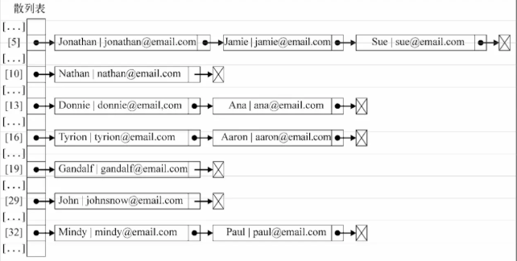
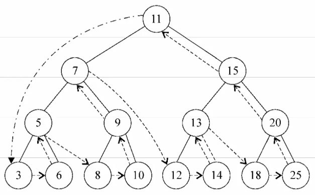

## 数据结构

### 栈

一种遵从先进后出 (LIFO) 原则的有序集合；新添加的或待删除的元素都保存在栈的末尾，称作栈顶，另一端为栈底。在栈里，新元素都靠近栈顶，旧元素都接近栈底。 

```js
class Stack {
  constructor() {
    this.items = [];
  }

  // 入栈
  push(item) {
    this.items.shift(item);
  }

  // 出栈
  pop(item) {
    this.items.pop(item);
  }

  // 末位
  get peek() {
    return this.items[this.items.length - 1];
  }

  // 是否是空栈
  get isEmpty() {
    return !this.items.length;
  }

  // 尺寸
  get size() {
    return this.items.length;
  }

  // 清空栈
  clear() {
    this.items = [];
  }
}

const s = new Stack()

s.push('ugu')
console.log(s.size)			// 1
```

### 队列

一种遵循先进先出 (FIFO / First In First Out) 原则的一组有序的项；队列在尾部添加新元素，并从头部移除元素。最新添加的元素必须排在队列的末尾。 

```js
class Queue {
  constructor() {
    this.items = [];
  }

  // 进队列
  enqueue(item) {
    this.items.push(item);
  }

  // 出队列
  dequeue(item) {
    this.items.shift(item);
  }

  // 清空队列
  clear() {
    this.items = [];
  }

  get size() {
    return this.items.length;
  }

  get isEmpty() {
    return !this.items.length;
  }

  front() {
    return this.items[0];
  }
}

const q = new Queue()
q.enqueue('ugu')
console.log(q.size)			// 1
```

#### 优先队列

实现一个优先队列，有两种选项：设置优先级，然后在正确的位置添加元素；或者用入列操作添加元素，然后按照优先级移除它们。在下面示例中，我们将会在正确的位置添加元素，因此可以对它们使用默认的出列操作。

``` js
class Queue {
  constructor() {
    this.items = [];
  }

  // 进队列
  enqueue(item, priority) {
    const queueItem = { item, priority };
    if (this.isEmpty) {
      this.items.push(queueItem);
    } else {
      const index = this.items.findIndex(
        item => queueItem.priority < item.priority
      );
      if (index > -1) {
        this.items.splice(index, 0, queueItem);
      } else {
        this.items.push(queueItem);
      }
    }
  }

  // 出队列
  dequeue(item) {
    this.items.shift(item);
  }

  // 清空队列
  clear() {
    this.items = [];
  }

  get size() {
    return this.items.length;
  }

  get isEmpty() {
    return !this.items.length;
  }

  front() {
    return this.items[0];
  }

  print() {
    console.log(this.items)
  }
}

const s = new Queue()

s.enqueue('John', 2)
s.enqueue('Jack', 1)
s.enqueue('Camila', 1)
console.log(s.print())
/*
	[
      { item: 'Jack', priority: 1 },
      { item: 'Camila', priority: 1 },
      { item: 'John', priority: 2 }
	]
*/
```

#### 循环队列

为充分利用向量空间，克服"假溢出"现象的方法是：将向量空间想象为一个首尾相接的圆环，并称这种向量为循环向量。存储在其中的队列称为循环队列（Circular Queue）。这种循环队列可以以单链表、队列的方式来在实际编程应用中来实现。

下面我们基于首次实现的队列类，简单实现一个循环引用的示例：

```js
class LoopQueue extends Queue {

    constructor() {
        super()
    }

    getIndex(index) {
        const length = this.items.length
        return index > length ? (index % length) : index
    }

    find(index) {
        return !this.isEmpty ? this.items[this.getIndex(index)] : null
    }
}
```

**访问一个循环队列：**

```js
const loopQueue = new LoopQueue(['Surmon'])
loopQueue.enqueue('SkyRover')
loopQueue.enqueue('Even')
loopQueue.enqueue('Alice')
console.log(loopQueue.size, loopQueue.isEmpty) // 4 false

console.log(loopQueue.find(26)) // 'Evan'
console.log(loopQueue.find(87651)) // 'Alice'
```

### 链表

要存储多个元素，数组（或叫列表）是一种常用的选择，但是这种数据结构有一个缺点：在大多数语言中，数组的大小是固定的，从数组的起点或中间插入或移除项的成本很高，因为需要移动元素。

而链表也可以用来存储有序的元素集合，但不同于数组，链表中的元素在内存中并不是连续放置的；每个元素由一个存储元素本身的节点和一个指向下一个元素的引用（指针/链接）组成。 


相对于传统的数组，链表的一个好处在于，添加或移除元素的时候不需要移动其他元素。然而，链表需要使用指针，因此实现链表时需要额外注意。

数组的另一个细节是可以直接访问任何位置的任何元素，而要想访问链表中间的一个元素，需要从起点(表头)开始迭代列表直到找到所需的元素。

现实中有许多链表的例子：一列火车是由一系列车厢/车皮组成的，每节车厢/车皮都相互连接，你很容易分离一节车皮，改变它的位置，添加或移除它。

```js
// 链表节点
class Node {
    constructor(element) {
        this.element = element
        this.next = null
    }
}

// 链表
class LinkedList {

    constructor() {
        this.head = null
        this.length = 0
    }

    // 追加元素
    append(element) {
        const node = new Node(element)
        let current = null
        if (this.head === null) {
            this.head = node
        } else {
            current = this.head
            while(current.next) {
                current = current.next
            }
            current.next = node
        }
        this.length++
    }

    // 任意位置插入元素
    insert(position, element) {
        if (position >= 0 && position <= this.length) {
            const node = new Node(element)
            let current = this.head
            let previous = null
            let index = 0
            if (position === 0) {
                this.head = node
            } else {
                while (index++ < position) {
                    previous = current
                    current = current.next
                }
                node.next = current
                previous.next = node
            }
            this.length++
            return true
        }
        return false
    }

    // 移除指定位置元素
    removeAt(position) {

        // 检查越界值
        if (position > -1 && position < length) {
            let current = this.head
            let previous = null
            let index = 0
            if (position === 0) {
                this.head = current.next
            } else {
                while (index++ < position) {
                    previous = current
                    current = current.next
                }
                previous.next = current.next
            }
            this.length--
            return current.element
        }
        return null
    }

    // 寻找元素下标
    findIndex(element) {
        let current = this.head
        let index = -1
        while (current) {
            if (element === current.element) {
                return index + 1
            }
            index++
            current = current.next
        }
        return -1
    }

    // 删除指定文档
    remove(element) {
        const index = this.indexOf(element)
        return this.removeAt(index)
    }

    isEmpty() {
        return !this.length
    }

    size() {
        return this.length
    }

    // 转为字符串
    toString() {
        let current = this.head
        let string = ''
        while (current) {
            string += ` ${current.element}`
            current = current.next
        }
        return string
    }
}

const linkedList = new LinkedList()

console.log(linkedList)
linkedList.append(2)
linkedList.append(6)
linkedList.append(24)
linkedList.append(152)

linkedList.insert(3, 18)
console.log(linkedList)
console.log(linkedList.findIndex(24))
```

#### 双向链表

链表有多种不同的类型，双向链表和普通链表的区别在于，在链表中， 一个节点只有链向下一个节点的链接，而在双向链表中，链接是双向的，即一个链向下一个元素， 另一个链向前一个元素，如下图所示:


双向链表提供了两种迭代列表的方法:从头到尾，或者反过来。我们也可以访问一个特定节 点的下一个或前一个元素。在单向链表中，如果迭代列表时错过了要找的元素，就需要回到列表 起点，重新开始迭代。这是双向链表的一个优点。

```js
// 链表节点
class Node {
    constructor(element) {
        this.element = element
        this.prev = null
        this.next = null
    }
}

// 双向链表
class DoublyLinkedList {

    constructor() {
        this.head = null
        this.tail = null
        this.length = 0
    }

    // 任意位置插入元素
    insert(position, element) {
        if (position >= 0 && position <= this.length){
            const node = new Node(element)
            let current = this.head
            let previous = null
            let index = 0
            // 首位
            if (position === 0) {
                if (!head){
                    this.head = node
                    this.tail = node
                } else {
                    node.next = current
                    this.head = node
                    current.prev = node
                }
            // 末位
            } else if (position === this.length) {
                current = this.tail
                current.next = node
                node.prev = current
                this.tail = node
            // 中位
            } else {
                while (index++ < position) {
                    previous = current
                    current = current.next
                }
                node.next = current
                previous.next = node
                current.prev = node
                node.prev = previous
            }
            this.length++
            return true
        }
        return false
    }

    // 移除指定位置元素
    removeAt(position) {
        if (position > -1 && position < this.length) {
            let current = this.head
            let previous = null
            let index = 0

            // 首位
            if (position === 0) {
                this.head = this.head.next
                this.head.prev = null
                if (this.length === 1) {
                    this.tail = null
                }

            // 末位
            } else if (position === this.length - 1) {
                this.tail = this.tail.prev
                this.tail.next = null

            // 中位
            } else {
                while (index++ < position) {
                     previous = current
                     current = current.next
                }
                previous.next = current.next
                current.next.prev = previous
         }
         this.length--
         return current.element
        } else {
            return null
        }
    }

    // 其他方法...
}
```

#### 循环链表

循环链表可以像链表一样只有单向引用，也可以像双向链表一样有双向引用。循环链表和链表之间唯一的区别在于，最后一个元素指向下一个元素的指针(tail.next)不是引用null， 而是指向第一个元素(head)。


双向循环链表有指向head元素的tail.next，和指向tail元素的head.prev。 


链表相比数组最重要的优点，那就是无需移动链表中的元素，就能轻松地添加和移除元素。因此，当你需要添加和移除很多元素 时，最好的选择就是链表，而非数组。 

### 集合

由一组无序且唯一（即不能重复）的项组成；这个数据结构使用了与有限集合相同的数学概念，但应用在计算机科学的数据结构中。 

虽然JavaScript内置了Set的实现，但是我么依旧自己实现一版集合。

```js
class Set {

    constructor() {
        this.items = {}
    }

    has(value) {
        return this.items.hasOwnProperty(value)
    }

    add(value) {
        if (!this.has(value)) {
            this.items[value] = value
            return true
        }     
        return false
    }

    remove(value) {
        if (this.has(value)) {
            delete this.items[value]
            return true
        }
        return false
    }

    get size() {
        return Object.keys(this.items).length
    }

    get values() {
        return Object.keys(this.items)
    }
}

const set = new Set()
set.add(1)
console.log(set.values)  // ["1"] 
console.log(set.has(1))  // true 
console.log(set.size) // 1 
set.add(2) 
console.log(set.values)  // ["1", "2"] 
console.log(set.has(2))  // true 
console.log(set.size) // 2 
set.remove(1) 
console.log(set.values) // ["2"] 
set.remove(2) 
console.log(set.values) // []
```

对集合可以进行如下操作：

* 并集：对于给定的两个集合，返回一个包含两个集合中所有元素的新集合
* 交集：对于给定的两个集合，返回一个包含两个集合中Р有元素的新集合
* 差集：对于给定的两个集合，返回一个包含所有存在于第一个集合且不存在于第二个集合的元素的新集合
* 子集：求证一个给定集合是否是另一集合的子集

```js
// 并集
union(otherSet) {
    const unionSet = new Set()
    this.values.forEach((v, i) => unionSet.add(this.values[i]))
    otherSet.values.forEach((v, i) => unionSet.add(otherSet.values[i]))
    return unionSet
}

// 交集
intersection(otherSet) {
    const intersectionSet = new Set()
    this.values.forEach((v, i) => {
        if (otherSet.has(v)) {
            intersectionSet.add(v)
        }
    })
    return intersectionSet
}

// 差集
difference(otherSet) {
    const differenceSet = new Set()
    this.values.forEach((v, i) => {
        if (!otherSet.has(v)) {
            differenceSet.add(v)
        }
    })
    return differenceSet
}

// 子集
subset(otherSet) {
    if (this.size > otherSet.size) {
        return false
    } else {
        return !this.values.some(v => !otherSet.has(v))
    } 
}
```

### 字典

集合、字典、散列表都可以存储不重复的数据，上面的集合是以`{value:value}`的形式存储数据，而字典是以`{key:value}`的形式存储数据，所以字典也称为映射。

简单来说，`Object`对象便是字典在JavaScript中的实现。

```js
class Dictionary {

    constructor() {
        this.items = {}
    }

    set(key, value) {
        this.items[key] = value
    }

    get(key) {
        return this.items[key]
    }

    remove(key) {
        delete this.items[key]
    }

    get keys() {
        return Object.keys(this.items)
    }

    get values() {

        /*
        也可以使用ES7中的values方法
        return Object.values(this.items)
        */

        // 在这里我们通过循环生成一个数组并输出
        return Object.keys(this.items).reduce((r, c, i) => {
            r.push(this.items[c])
            return r
        }, [])
    }
}

const dictionary = new Dictionary()
dictionary.set('Gandalf', 'gandalf@email.com')
dictionary.set('John', 'johnsnow@email.com')
dictionary.set('Tyrion', 'tyrion@email.com')

console.log(dictionary)
console.log(dictionary.keys)
console.log(dictionary.values)
console.log(dictionary.items)
```

### 散列

HashTable 类，也叫 HashMap 类，是 Dictionary 类的一种散列表实现方式。 

散列算法的作用是尽可能快地在数据结构中找到一个值。在上面的例子中，如果要在数据结构中获得一个值（使用get方法），需要遍历整个数据结构来得到它。如果使用散列函数，就知道值的具体位置，因此能够快速检索到该值，散列函数的作用是给定一个键值，然后返回值在表中的地址。

```js
class HashTable {

    constructor() {
        this.table = []
    }

    // 散列函数
    static loseloseHashCode(key) {
        let hash = 0
        for (let codePoint of key) {
            hash += codePoint.charCodeAt()
        }
        return hash % 37
    }

    // 修改和增加元素
    put(key, value) {
        const position = HashTable.loseloseHashCode(key)
        console.log(`${position} - ${key}`)
        this.table[position] = value
    }

    get(key) {
        return this.table[HashTable.loseloseHashCode(key)]
    }

    remove(key) {
        this.table[HashTable.loseloseHashCode(key)] = undefined
    }
}
```

对于 HashTable 类来说，我们不需要像 ArrayList 类一样从 table 数组中将位置也移除。由 于元素分布于整个数组范围内，一些位置会没有任何元素占据，并默认为undefined值。我们也 不能将位置本身从数组中移除（这会改变其他元素的位置），否则，当下次需要获得或移除一个 元素的时候，这个元素会不在我们用散列函数求出的位置上。

#### 使用HashTable类

```js
const hash = new HashTable()
hash.put('Surmon', 'surmon.me@email.com') // 19 - Surmon
hash.put('John', 'johnsnow@email.com') // 29 - John
hash.put('Tyrion', 'tyrion@email.com') // 16 - Tyrion

// 测试get方法
console.log(hash.get('Surmon')) // surmon.me@email.com
console.log(hash.get('Loiane')) // undefined
console.log(hash)
```

下面的图表展现了包含这三个元素的 HashTable 数据结构:


#### 散列表和散列集合

散列表和散列映射是一样的，上面已经介绍了这种数据结构。

在一些编程语言中，还有一种叫作散列集合的实现。散列集合由一个集合构成，但是插人、 移除或获取元素时，使用的是散列函数。我们可以重用上面实现的所有代码来实现散列集合， 不同之处在于，不再添加键值对，而是只插入值而没有键。例如，可以使用散列集合来存储所有 的英语单词（不包括它们的定义)。和集合相似，散列集合只存储唯一的不重复的值。

#### 处理散列表中的冲突

有时候，一些键会有相同的散列值。不同的值在散列表中对应相同位置的时候，我们称其为冲突。如下代码：

```js
const hash = new HashTable()
hash.put('Gandalf',    'gandalf@email.com')
hash.put('John', 'johnsnow®email.com')
hash.put('Tyrion', 'tyrion@email.com')
hash.put('Aaron',    'aaronOemail.com')
hash.put('Donnie', 'donnie@email.com')
hash.put('Ana', 'ana©email.com')
hash.put('Jonathan', 'jonathan@email.com')    
hash.put('Jamie', 'jamie@email.com')
hash.put('Sue',    'sueOemail.com')
hash.put('Mindy', 'mindy@email.com')
hash.put('Paul', 'paul©email.com')
hash.put('Nathan', 'nathan@email.com')
```

在上面代码中，Tyrion 和 Aaron 有相同的散列值（16)，Donnie 和 Ana 有相同的散列值（13)，Jonathan、Jamie 和 Sue 有相同的散列值（5), Mindy 和 Paul 也有相同的散列值（32)，导致最终的数据对象中，只有最后一次被添加/修改的数据会覆盖原本数据，进而生效。

使用一个数据结构来保存数据的目的显然不是去丢失这些数据，而是通过某种方法将它们全部保存起来；因此，当这种情况发生的时候就要去解决它。

处理冲突有几种方法：分离链接、线性探查和双散列法。下面介绍前两种方法。

**分离链接**

分离链接法包括为散列表的每一个位置创建一个链表并将元素存储在里面。它是解决冲突的 最简单的方法，但是它在 HashTable 实例之外还需要额外的存储空间。

例如，我们在之前的测试代码中使用分离链接的话，输出结果将会是这样：



- 在位置5上，将会有包含三个元素的LinkedList实例
- 在位置13、16和32上，将会有包含两个元素的LinkedList实例
- 在位置10、19和29上，将会有包含单个元素的LinkedList实例

对于分离链接和线性探查来说，只需要重写三个方法：put、get 和 remove 这三个方法，在 每种技术实现中都是不同的。

为了实现一个使用了分离链接的 HashTable 实例，我们需要一个新的辅助类来表示将要加人 LinkedList 实例的元素，在这里我们可以直接使用链表类。

下面我们加入链表类重写三个方法：

```js
put(key, value) {
    const position = HashTable.loseloseHashCode(key)
    if (this.table[position] === undefined) {
        this.table[position] = new LinkedList()
    }
    this.table[position].append({ key, value })
}

get(key) {
    const position = HashTable.loseloseHashCode(key)
    if (this.table[position] === undefined) return undefined
    const getElementValue = node => {
        if (!node && !node.element) return undefined
        if (Object.is(node.element.key, key)) {
            return node.element.value
        } else {
            return getElementValue(node.next)
        }
    }
    return getElementValue(this.table[position].head)
}

remove(key) {
    const position = HashTable.loseloseHashCode(key)
    if (this.table[position] === undefined) return undefined
    const getElementValue = node => {
        if (!node && !node.element) return false
        if (Object.is(node.element.key, key)) {
            this.table[position].remove(node.element)
            if (this.table[position].isEmpty) {
                this.table[position] = undefined
            }
            return true
        } else {
            return getElementValue(node.next)
        }
    }
    return getElementValue(this.table[position].head)
}
```

**线性探察**

当想向表中某个位置加人一个新元素的时候，如果索引为 index 的位置已经被占据了，就尝试 index+1的位置。如果index+1 的位置也被占据了，就尝试 index+2 的位置，以此类推。如下图： 


 下面我们使用线性探查重写三个方法： 

```js
put(key, value) {
    const position = HashTable.loseloseHashCode(key)
    if (this.table[position] === undefined) {
        this.table[position] = { key, value }
    } else {
        let index = ++position
        while (this.table[index] !== undefined) {
            index++
        }
        this.table[index] = { key, value }
    }
    this.table[position].append({ key, value })
}

get(key) {
    const position = HashTable.loseloseHashCode(key)
    const getElementValue = index => {
        if (this.table[index] === undefined) return undefined
        if (Object.is(this.table[index].key, key)) {
            return this.table[index].value
        } else {
            return getElementValue(index + 1)
        }
    }
    return getElementValue(position)
}

remove(key) {
    const position = HashTable.loseloseHashCode(key)
    const removeElementValue = index => {
        if (this.table[index] === undefined) return false
        if (Object.is(this.table[index].key, key)) {
            this.table[index] = undefined
            return true
        } else {
            return removeElementValue(index + 1)
        }
    }
    return removeElementValue(position)
}
```

#### 更多函数

我们实现的"lose lose"散列函数并不是一个表现良好的散列函数，因为它会产生太多的冲 突。如果我们使用这个函数的话，会产生各种各样的冲突。一个表现良好的散列函数是由几个方 面构成的：插人和检索元素的时间（即性能），当然也包括较低的冲突可能性。我们可以在网上 找到一些不同的实现方法。像：djb2、sdbm...，或者也可以实现自己的散列函数。

其中一个可以实现的比“lose lose”更好的散列函数是 djb2：

```js
static djb2HashCode(key) { 
    let hash = 5381
    for (let codePoint of key) {
        hash = hash * 33 + codePoint.charCodeAt()
    }
    return hash % 1013
}
```

使用 djb2 函数后，上面的散列表示例便不再有冲突。

### 树

树是一种非顺序数据结构，一种分层数据的抽象模型，它是由 n（n>=1）个有限节点组成一个具有层次关系的集合，它对于存储需要快速查找的数据非常有用。 

一个树结构包含一系列存在父子关系的节点。每个节点都有一个父节点（除了顶部的第一个 节点）以及零个或多个子节点，所以呈现一对多的关系。当然，树也可以看做是图的特殊形式。 


树大概包含以下几种结构/属性：

- 节点
  - 根节点
  - 内部节点：非根节点、且有子节点的节点
  - 外部节点/页节点：无子节点的节点
- 子树：就是大大小小节点组成的树
- 深度：节点到根节点的节点数量
- 高度：树的高度取决于所有节点深度中的最大值
- 层级：也可以按照节点级别来分层

#### 二叉树和二叉搜索树

二叉树中的节点最多只能有两个子节点：一个是左侧子节点，另一个是右侧子节点。这些定 义有助于我们写出更高效的向/从树中插人、查找和删除节点的算法。二叉树在计算机科学中的 应用非常广泛。

二叉搜索树（BST）是二叉树的一种，但是它只允许你在左侧节点存储（比父节点）小的值， 在右侧节点存储（比父节点）大（或者等于）的值。上图中就展现了一棵二叉搜索树。

注：不同于之前的链表和集合，在树中节点被称为"键"，而不是"项"。

下图展现了二叉搜索树数据结构的组织方式： 


同样的，我们使用 Javascript 实现一个 BinarySearchTree 类。

``` js
class Node {
    constructor(key) {
        this.key = key
        this.left = null
        this.right = null
    }
}

class BinarySearchTree {

    constructor() {
        this.root = null
    }

    insert(key) {
        const newNode = new Node(key)
        const insertNode = (node, newNode) => {
            if (newNode.key < node.key) {
                if (node.left === null) {
                    node.left = newNode
                } else {
                    insertNode(node.left, newNode)
                }
            } else {
                if (node.right === null) {
                    node.right = newNode
                } else {
                    insertNode(node.right, newNode)
                }
            }
        }
        if (!this.root) {
            this.root = newNode
        } else {
            insertNode(this.root, newNode)
        }
    }
}

const tree = new BinarySearchTree()
tree.insert(11)
tree.insert(7)
tree.insert(5)
tree.insert(3)
tree.insert(9)
tree.insert(8)
tree.insert(10)
tree.insert(13)
tree.insert(12)
tree.insert(14)
tree.insert(20)
tree.insert(18)
tree.insert(25)
```

最终构建的树如下：


#### 树的遍历

遍历一棵树是指访问树的每个节点并对它们进行某种操作的过程。但是我们应该怎么去做呢？应该从树的顶端还是底端开始呢？从左开始还是从右开始呢？

访问树的所有节点有三种方式：中序、先序、后序。

##### 中序遍历

中序遍历是一种以上行顺序访问 BST 所有节点的遍历方式，也就是以从最小到最大的顺序访 问所有节点。中序遍历的一种应用就是对树进行排序操作。我们来看它的实现：

```js
inOrderTraverse(callback) {
    const inOrderTraverseNode = (node, callback) => {
        if (node !== null) {
            inOrderTraverseNode(node.left, callback)
            callback(node.key)
            inOrderTraverseNode(node.right, callback)
        }
    }
    inOrderTraverseNode(this.root, callback)
}
```

inOrderTraverse方法接收一个回调函数作为参数，回调函数用来定义我们对遍历到的每个节点进行的操作，这也叫作访问者模式。

在之前展示的树上执行下面的方法：

```
tree.inOrderTraverse(value => { console.log(value) })复制代码
```

下面的结果将会在控制台上输出（每个数字将会输出在不同的行）:

```
3 5 6 7 8 9 10 11 12 13 14 15 18 20 25
```

下面的图描绘了 inOrderTraverse 方法的访问路径：


##### 先序遍历

先序遍历是以优先于后代节点的顺序访问每个节点的。先序遍历的一种应用是打印一个结构化的文档。

我们来看实现：

```
preOrderTraverse(callback) {
    const preOrderTraverseNode = (node, callback) => {
        if (node !== null) {
            callback(node.key)
            preOrderTraverseNode(node.left, callback)
            preOrderTraverseNode(node.right, callback)
        }
    }
    preOrderTraverseNode(this.root, callback)
}复制代码
```

下面的图描绘了 preOrderTraverse 方法的访问路径:


##### 后序遍历

后序遍历则是先访问节点的后代节点，再访问节点本身。后序遍历的一种应用是计算一个目录和它的子目录中所有文件所占空间的大小。

我们来看它的实现：

```
postOrderTraverse(callback) {
    const postOrderTraverseNode = (node, callback) => {
        if (node !== null) {
            postOrderTraverseNode(node.left, callback)
            postOrderTraverseNode(node.right, callback)
            callback(node.key)
        }
    }
    postOrderTraverseNode(this.root, callback)
}复制代码
```

这个例子中，后序遍历会先访问左侧子节点，然后是右侧子节点，最后是父节点本身。

你会发现，中序、先序和后序遍历的实现方式是很相似的，唯一不同的是三行代码的执行顺序。

下面的图描绘了 postOrderTraverse方法的访问路径:



##### 三种遍历访问顺序的不同

- 先序遍历：节点本身 => 左侧子节点 => 右侧子节点
- 中序遍历：左侧子节点 => 节点本身 => 右侧子节点
- 后序遍历：左侧子节点 => 节点本身 => 右侧子节点

#### 搜索树中的值

在树中，有三种经常执行的搜索类型：

- 最小值
- 最大值
- 搜索特定的值

##### 搜索最小值和最大值

我们使用下面的树作为示例： 


实现方法：

```
min(node) {
    const minNode = node => {
        return node ? (node.left ? minNode(node.left) : node) : null
    }
    return minNode(node || this.root)
}

max(node) {
    const maxNode = node => {
        return node ? (node.right ? maxNode(node.right) : node) : null
    }
    return maxNode(node || this.root)
}
```

##### 搜索一个特定的值

```
search(key) {
    const searchNode = (node, key) => {
        if (node === null) return false
        if (node.key === key) return node
        return searchNode((key < node.key) ? node.left : node.right, key)
    }
    return searchNode(root, key)
}
```

#### 更多二叉树知识

BST存在一个问题：取决于你添加的节点数，树的一条边可能会非常深；也就是说，树的一 条分支会有很多层，而其他的分支却只有几层，如下图所示：


##### AVL树

AVL树是一种自平衡二叉搜索树，AVL树本质上是带了平衡功能的二叉查找树（二叉排序树，二叉搜索树），在AVL树中任何节点的两个子树的高度最大差别为一，也就是说这种树会在添加或移除节点时尽量试着成为一棵完全树，所以它也被称为高度平衡树。查找、插入和删除在平均和最坏情况下都是 `O（log n）`，增加和删除可能需要通过一次或多次树旋转来重新平衡这个树。

##### 红黑树

红黑树和AVL树类似，都是在进行插入和删除操作时通过特定操作保持二叉查找树的平衡，从而获得较高的查找性能；它虽然是复杂的，但它的最坏情况运行时间也是非常良好的，并且在实践中是高效的：它可以在`O(log n)`时间内做查找，插入和删除，这里的 n 是树中元素的数目。

红黑树是每个节点都带有颜色属性的二叉查找树，颜色或红色或黑色。在二叉查找树强制一般要求以外，对于任何有效的红黑树我们增加了如下的额外要求：

- 节点是红色或黑色
- 根节点是黑色
- 每个叶节点（NIL节点，空节点）是黑色的
- 每个红色节点的两个子节点都是黑色。(从每个叶子到根的所有路径上不能有两个连续的红色节点)
- 从任一节点到其每个叶子的所有路径都包含相同数目的黑色节点

这些约束强制了红黑树的关键性质：从根到叶子的最长的可能路径不多于最短的可能路径的两倍长。结果是这个树大致上是平衡的。因为操作比如插入、删除和查找某个值的最坏情况时间都要求与树的高度成比例，这个在高度上的理论上限允许红黑树在最坏情况下都是高效的，而不同于普通的二叉查找树。

红黑树和AVL树一样都对插入时间、删除时间和查找时间提供了最好可能的最坏情况担保。这不只是使它们在时间敏感的应用如即时应用(real time application)中有价值，而且使它们有在提供最坏情况担保的其他数据结构中作为建造板块的价值；例如，在计算几何中使用的很多数据结构都可以基于红黑树。
红黑树在函数式编程中也特别有用，在这里它们是最常用的持久数据结构之一，它们用来构造关联数组和集合，在突变之后它们能保持为以前的版本。除了`O(log n)`的时间之外，红黑树的持久版本对每次插入或删除需要`O(log n)`的空间。

### 图

图是网络结构的抽象模型，图是一组由边连接的节点（顶点），任何二元关系都可以用图来表示，常见的比如：道路图、关系图，呈多对多关系。 

一个图`G=(V, E)`由以下兀素组成：

- V: 一组顶点
- E: 一组边，连接V中的顶点

下表是一个图：


由一条边连接在一起的顶点称为相邻顶点。比如，A和B是相邻的，A和D是相邻的，A和C 是相邻的，A和E不是相邻的。

一个顶点的度是其相邻顶点的数量。比如，A和其他三个顶点相连接，因此，A的度为3; E 和其他两个顶点相连，因此，E的度为2。

路径是顶点`v1, v2, ...vk`的一个连续序列，其中 vi 和 vi+1 是相邻的。以上图为例， 其中包含路径A B E I 和 A C D G。

简单路径要求不包含重复的顶点。举个例子，ADG是一条简单路径。除去最后一个顶点（因 为它和第一个顶点是同一个顶点），环也是一个简单路径，比如ADC A(最后一个顶点重新回到A )。

如果图中不存在环，则称该图是无坏的。如果图中每两个顶点间都存在路径，则该图是连通的。

#### 有向图和无向图

图可以是无向的（边没有方向）或是有向的（有向图）。如下图所示，有向图的边有一个方向： 


如果图中每两个顶点间在双向上都存在路径，则该图是强连通的。例如，C和D是强连通的， 而A和B不是强连通的。

图还可以是未加权的（目前为止我们看到的图都是未加权的）或是加权的。如下图所示，加 权图的边被赋予了权值：


我们可以使用图来解决计算机科学世界中的很多问题，比如搜索图中的一个特定顶点或搜索 一条特定边，寻找图中的一条路径（从一个顶点到另一个顶点），寻找两个顶点之间的最短路径， 以及环检测。

从数据结构的角度来说，我们有多种方式来表示图。在所有的表示法中，不存在绝对正确的方式。图的正确表示法取决于待解决的问题和图的类型。

**邻接矩阵**

图最常见的实现是邻接矩阵。每个节点都和一个整数相关联，该整数将作为数组的索引。我 们用一个二维数组来表示顶点之间的连接。如果索引为 i 的节点和索引为 j 的节点相邻，则`array[i][j] ===1`，否则`array[i][j] === 0`,如下图所示：


不是强连通的图（稀疏图）如果用邻接矩阵来表示，则矩阵中将会有很多0,这意味着我们 浪费了计算机存储空间来表示根本不存在的边。例如，找给定顶点的相邻顶点，即使该顶点只有 一个相邻顶点，我们也不得不迭代一整行。邻接矩阵表示法不够好的另一个理由是，图中顶点的 数量可能会改变，而2维数组不太灵活。

**邻接表**

我们也可以使用一种叫作邻接表的动态数据结构来表示图。邻接表由图中每个顶点的相邻顶 点列表所组成。存在好几种方式来表示这种数据结构。我们可以用列表（数组）、链表，甚至是 散列表或是字典来表示相邻顶点列表。下面的示意图展示了邻接表数据结构。 


尽管邻接表可能对大多数问题来说都是更好的选择，但以上两种表示法都很有用，且它们有 着不同的性质（例如，要找出顶点V和W是否相邻，使用邻接矩阵会比较快)。在接下来的示例中， 我们将会使用邻接表表示法。

**关联矩阵**

我们还可以用关联矩阵来表示图。在关联矩阵中，矩阵的行表示顶点，列表示边。如下图所 示，我们使用二维数组来表示两者之间的连通性，如果顶点 v 是边 e 的入射点，则 `array[v][e] === 1`; 否则，`array [v][e] === 0`。 


关联矩阵通常用于边的数量比顶点多的情况下，以节省空间和内存。 

创建图类：

```
class Graph() {

    constructor() {
        this.vertices = []
        this.adjList = new Dictionary()
    }

    // 添加顶点
    addVertex(v) {
        this.vertices.push(v)
        this.adjList.set(v, [])
    }

    // 添加线
    addEdge(v, w) {
        this.adjList.get(v).push(w)
        this.adjList.get(w).push(v)
    }

    toString() {
        return this.vertices.reduce((r, v, i) => {
            return this.adjList.get(v).reduce((r, w, i) => {
                return r + `${w} `
            }, `${r}\n${v} => `)
        }, '')
    }
}
```

使用图类：

```
const graph = new Graph()

;['A', 'B', 'C', 'D', 'E', 'F', 'G', 'H', 'I'].forEach(c => graph.addVertex(c))

graph.addEdge('A', 'B')
graph.addEdge('A', 'C')
graph.addEdge('A', 'D')
graph.addEdge('C', 'D')
graph.addEdge('C', 'G')
graph.addEdge('D', 'G')
graph.addEdge('D', 'H')
graph.addEdge('B', 'E')
graph.addEdge('B', 'F')
graph.addEdge('E', 'I')

console.log(graph.toString())

// 输出
/*
A => B C D 
B => A E F 
C => A D G 
D => A C G H 
E => B I 
F => B 
G => C D 
H => D 
I => E 
*/
```

#### 图的遍历

和树数据结构类似，我们可以访问图的所有节点。有两种算法可以对图进行遍历：

- 广度优先搜索（Breadth-First Search，BFS) 
- 深度优先搜索（Depth-First Search，DFS)

图遍历可以用来寻找特定的顶点或寻找两个顶点之间的路径，检查图是否连通，检查图是否含有环等。

在实现算法之前，让我们来更好地理解一下图遍历的思想方法。

图遍历算法的思想是必须追踪每个第一次访问的节点，并且追踪有哪些节点还没有被完全探 索。对于两种图遍历算法，都需要明确指出第一个被访问的顶点。

完全探索一个顶点要求我们查看该顶点的每一条边。对于每一条边所连接的没有被访问过的 顶点，将其标注为被发现的，并将其加进待访问顶点列表中。

为了保证算法的效率，务必访问每个顶点至多两次。连通图中每条边和顶点都会被访问到。

广度优先搜索算法和深度优先搜索算法基本上是相同的，只有一点不同，那就是待访问顶点 列表的数据结构。

- 深度优先搜索：桟，通过将顶点存入桟中，顶点是沿着路径被探索的，存在新的相邻顶点就去访问
- 广度优先搜索    ：队列，通过将顶点存入队列中，最先入队列的顶点先被探索

##### 广度优先搜索

广度优先搜索算法会从指定的第一个顶点开始遍历图，先访问其所有的相邻点，就像一次访 问图的一层。简单说，就是先宽后深地访问顶点，如下图所示： 


以下是我们的方法实现的。

维护两个队列，分别用于存储已读和待读顶点，两者具有互斥性，即某顶点在访问时只会属于一种类型，本质是通过不断递归将相邻的顶点进行访问和维度标为已读。

让我们来实现广度优先搜索算法：

```
// breadth first search
bfs(v, callback) {
    const read = []
    const adjList = this.adjList
    let pending = [v || this.vertices[0]]
    const readVertices = vertices => {
        vertices.forEach(key => {
            read.push(key)
            pending.shift()
            adjList.get(key).forEach(v => {
                if (!pending.includes(v) && !read.includes(v)) {
                    pending.push(v)
                }
            })
            if (callback) callback(key)
            if (pending.length) readVertices(pending)
        })
    }
    readVertices(pending)
}
```

让我们执行下面这段代码来测试一下这个算法：

```
graph.bfs(graph.vertices[0], value => console.log('Visited vertex: ' + value))
```

输出结果：

```
Visited vertex: A
Visited vertex: B
Visited vertex: C
Visited vertex: D
Visited vertex: E
Visited vertex: F
Visited vertex: G
Visited vertex: H
Visited vertex: I
```

如你所见，顶点被访问的顺序和本节开头的示意图中所展示的一致。

通过BFS你可以用来寻找最短路径。例如：给定一个图G和源顶点v，找出对每个顶点u，u和v之间最短路径的距离（以边的数量计)。

对于给定顶点V，广度优先算法会访问所有与其距离为1的顶点，接着是距离为2的顶点，以此类推。所以，可以用广度优先算法来解这个问题。我们可以修改bfs方法以返回给我们一些信息：

- 从 v 到 u 的距离 d[u]
- 前溯点 pred[u]，用来推导出从v到其他每个顶点u的最短路径

让我们来看看改进过的广度优先方法的实现：

```
bfs(v, callback) {
    const read = []
    const distances = []
    const predecessors = []
    const adjList = this.adjList
    const pending = [v || this.vertices[0]]
    const readVertices = vertices => {
        vertices.forEach(key => {
            read.push(key)
            pending.shift()
            distances[key] = distances[key] || 0
            predecessors[key] = predecessors[key] || null
            adjList.get(key).forEach(v => {
                if (!pending.includes(v) && !read.includes(v)) {
                    pending.push(v)
                    distances[v] = distances[key] + 1
                    predecessors[v] = key
                }
            })
            if (callback) callback(key)
            if (pending.length) readVertices(pending)
        })
    }
    readVertices(pending)
    return { distances, predecessors }
}
```

输出结果：

```
distances: [A: 0, B: 1, C: 1, D: 1, E: 2, F: 2, G: 2, H: 2 ,工：3]
predecessors: [A: null, B: "A", C: "A", D: "A", E: "B", F: " B", G: " C", H: "D", I: "E"]
```

这意味着顶点A与顶点B、C和D的距离为1；与顶点E、F、G和H的距离为2；与顶点I的距离
通过前溯点数组，我们可以用下面这段代码来构建从顶点A到其他顶点的路径:

```
distance(fromVertex) {
    const vertices = this.vertices
    const { distances, predecessors } = this.bfs(fromVertex)
    vertices.forEach(toVertex => {
        if (!!distances[toVertex]) {
            let preVertex = predecessors[toVertex]
            let slug = ''
            while (fromVertex !== preVertex) {
                slug = `${preVertex} - ${slug}`
                preVertex = predecessors[preVertex]
            }
            slug = `${fromVertex} - ${slug}${toVertex}`
            console.log(slug)
        }
    })
}
```

执行该代码段，我们会得到如下输出：

```
graph.distance(graph.vertices[0])
// 输出如下：
// A - B
// A - C
// A - D
// A - B - E
// A - B - F
// A - C - G
// A - D - H
// A - B - E - I
```

这里，我们得到了从顶点A到图中其他顶点的最短路径（衡量标准是边的数量)。

##### 深度优先搜索

深度优先搜索算法将会从第一个指定的顶点开始遍历图，沿着路径直到这条路径最后一个顶 点被访问了，接着原路回退并探索下一条路径。换句话说，它是先深度后广度地访问顶点，如下图所示： 


深度优先搜索算法不需要一个源顶点。在深度优先搜索算法中，若图中顶点V未访问，则访问该顶点V。

深度优先搜索算法核心是递归，普通的对象递归模型即可满足需求，对比已读顶点是否已完全覆盖即可。

深度优先算法的实现：

```
// depth first search
dfs(callback) {
    const read = []
    const adjList = this.adjList
    const readVertices = vertices => {
        vertices.forEach(key => {
            if (read.includes(key)) return false
            read.push(key)
            if (callback) callback(key)
            if (read.length !== this.vertices.length) {
                readVertices(adjList.get(key))
            }
        })
    }
    readVertices(adjList.keys)
}复制代码
```

让我们执行下面的代码段来测试一下df s方法：

```
graph.dfs(value => console.log('Visited vertex: ' + value))

// 输出如下：
// Visited vertex: A 
// Visited vertex: B 
// Visited vertex: E 
// Visited vertex: I
// Visited vertex: F 
// Visited vertex: C 
// Visited vertex: D 
// Visited vertex: G 
// Visited vertex: H
```

下图展示了该算法每一步的执行过程： 


到目前为止，我们只是展示了深度优先搜索算法的工作原理。我们可以用该算法做更多的事 情，而不只是输出被访问顶点的顺序。

对于给定的图G，我们希望深度优先搜索算法遍历图G的所有节点，构建“森林”（有根树的 一个集合）以及一组源顶点（根)，并输出两个数组：发现时间和完成探索时间。我们可以修改 dfs方法来返回给我们一些信息：

- 顶点 u 的发现时间 d[u]
- 当顶点 u 被标注为已读时，u 的完成探索时间
- 顶点 u 的前溯点 p[u]

让我们来看看改进了的 DFS 方法的实现:

```
// depth first search
dfs(callback) {
    let readTimer = 0
    const read = []
    const readTimes = []
    const finishedTimes = []
    const predecessors = []
    const adjList = this.adjList
    const readVertices = (vertices, predecessor) => {
        vertices.forEach(key => {
            readTimer++
            if (adjList.get(key).every(v => read.includes(v)) && !finishedTimes[key]) {
                finishedTimes[key] = readTimer
            }
            if (read.includes(key)) return false
            readTimes[key] = readTimer
            read.push(key)
            if (callback) callback(key)
            predecessors[key] = predecessors[key] || predecessor || null
            if (read.length !== this.vertices.length) {
                readVertices(adjList.get(key), key)
            }
        })
    }
    readVertices(adjList.keys)
    return { readTimes, finishedTimes, predecessors }
}复制代码
```

深度优先算法背后的思想是什么？边是从最近发现的顶点 u 处被向外探索的。只有连接到未发现的顶点的边才会探索。当 u 所有的边都被探索了，该算法回退到 u 被发现的地方去探索其他的边。这个过程持续到我们发现了所有从原始顶点能够触及的顶点。如果还留有任何其他未被发现的顶点，我们对新源顶点重复这个过程，直到图中所有的顶点都被探索了。

对于改进过的深度优先搜索，有两点需要我们注意：

- 时间（time）变量值的范围只可能在图顶点数量的一倍到两倍之间
- 对于所有的顶点 u，d[u] < f[u] 意味着，发现时间的值比完成时间的值小，完成时所有顶点都已经被探索过了

## 算法

### 复杂度

#### 时间复杂度

时间复杂度表示一个算法的时间复杂度反映了程序运行从开始到结束所需要的时间。把算法中基本操作重复执行的次数（频度）作为算法的时间复杂度。 

没有循环语句，记作`O(1)`，也称为常数阶。只有一重循环，则算法的基本操作的执行频度与问题规模n呈线性增大关系，记作`O（n）`，也叫线性阶。

常见的时间复杂度有：

- `O(1)`: Constant Complexity: Constant 常数复杂度
- `O(log n)`: Logarithmic Complexity: 对数复杂度
- `O(n)`: Linear Complexity: 线性时间复杂度
- `O(n^2)`: N square Complexity 平⽅方
- `O(n^3)`: N square Complexity ⽴立⽅方
- `O(2^n)`: Exponential Growth 指数
- `O(n!)`: Factorial 阶乘

##### O(1)

考虑以下函数：

```js
function increment (nurn) {
    return ++nurn
}
```

假设运行increment函数，执行时间等于X。如果再用不同的参数运行一次 increment 函数，执行时间依然是X。和参数无关，increment 函数的性能都一样。因此，我们 说上述函数的复杂度是 0(1)(常数)。

##### O(n)

现在以上文中实现的顺序搜索算法为例：

```
Array.prototype.sequentialSearch = function(item) {
    for (let i = 0; i < this.length; i++) {
        if (item === this[i]) return i
    }
    return -1
}
```

如果将含10个元素的数组`[1, ..., 10]`传递给该函数，假如搜索1这个元素，那么，第一次判断时就能找到想要搜索的元素。在这里我们假设每执行一次循环，开销是1。

现在，假如要搜索元素11。循环会执行10次（遍历数组中所有的值，并且找不到要搜索的 元素，因而结果返回-1)。如果一次循环的开销是1，那么它执行10次的开销就是10, 10倍于第一种假设。

现在，假如该数组有1000个元素（[1, ..., 1000])。搜索1001的结果是循环执行了1000次，然后返回-1。

注意，sequentialSearch 函数执行的总开销取决于数组元素的个数（数组大小），而且也 和搜索的值有关。如果是查找数组中存在的值，循环会执行几次呢？如果查找的是数组中不存 在的值，那么循环就会执行和数组大小一样多次，这就是通常所说的最坏情况。

最坏情况下，如果数组大小是10，开销就是10；如果数组大小是1000，开销就是1000。可以 得出 sequentialSearch 函数的时间复杂度是 O(n)，n是输人数组的大小。

##### O(n²)

用冒泡排序做 O(n²) 的例子：

```
Array.prototype.bubbleSort = function() {
    for (let i = 0; i < this.length; i++) {
        for (let j = 0; j < this.length - 1 - i; j++) {
            if (this[j] > this[j + 1]) {
                let aux = this[j]
                this[j] = this[j + 1]
                this[j + 1] = aux
            }
        }
    }
}
```

如果用大小为10的数组执行 bubbleSort，开销是100(10²)。如果用大小为100的数组执行 bubbleSort,开销就是 10000(100²)。我们每次增加输人的大小，执行都会越来越久。

时间复杂度 O(n) 的代码只有一层循环，而 O(n²) 的代码有双层嵌套循环；如果算法有三层遍历数组的嵌套循环，它的时间复杂度很可能就是 O(n^3)。

下图比较了前述各个大O符号表示的时间复杂度：

##### 总结

下图比较了前述各个大O符号表示的时间复杂度： 


##### 其他

下表是常用的数据结构算法插入、删除和搜索操作的时间复杂度： 


下图是排序算法复杂度：


下图是搜索算法复杂度：


#### 空间复杂度

一个程序的空间复杂度是指运行完一个程序所需内存的大小。利用程序的空间复杂度，可以对程序的运行所需要的内存多少有个预先估计。

一个程序执行时除了需要存储空间和存储本身所使用的指令、常数、变量和输入数据外，还需要一些对数据进行操作的工作单元和存储一些为现实计算所需信息的辅助空间。

### 排序算法

#### 冒泡排序

比较任何两个相邻的项，如果第一个比第二个大，则交换它们；元素项向上移动至正确的顺序，好似气泡上升至表面一般，因此得名。 

```js
Array.prototype.bubbleSort = function() {
    for (let i = 0; i < this.length; i++) {
        for (let j = 0; j < this.length - 1 - i; j++) {
            if (this[j] > this[j + 1]) {
                let aux = this[j]
                this[j] = this[j + 1]
                this[j + 1] = aux
            }
        }
    }
}
```

下图展示了冒泡排序算法的执行过程: 


注：冒泡排序算法的复杂度是 O(n²)，并不推荐此算法。 

#### 选择排序

选择排序算法是一种原址比较排序算法。选择排序算法的思路是：找到数据结构中的最小值并 将其放置在第一位，接着找到第二小的值并将其放在第二位，以此类推。

```js
Array.prototype.selectionSort = function() {
    let indexMin
    for (let i = 0; i < this.length - 1; i++){
        indexMin = i
        for (var j = i; j < this.length; j++){ 
            if(this[indexMin] > this[j]) {
                indexMin = j
            }
        } 
        if (i !== indexMin){
            let aux = this[i]
            this[i] = this[indexMin]
            this[indexMin] = aux
        }
    }
    return this
}
```

下图展示了选择排序算法的执行过程： 


#### 插入排序

插人排序每次排一个数组项，以此方式构建最后的排序数组。假定第一项已经排序了，接着， 它和第二项进行比较，第二项是应该待在原位还是插到第一项之前呢？这样，头两项就已正确排序，接着和第三项比较（它是该插入到第一、第二还是第三的位置呢？），以此类推。 

代码示例：

```
Array.prototype.insertionSort = function() {
    let j
    let temp
    for (let i = 1; i < this.length; i++) {
        j = i
        temp = this[i]
        while (j > 0 && this[j - 1] > temp) {
            this[j] = this[j - 1]
            j--
        } 
        this[j] = temp
        console.log(this.join(', '))
    }
    return this
}
```

下图展示了插人排序算法的执行过程:


排序小型数组时，此算法比选择排序和冒泡排序性能要好。时间复杂度为 O(n^2)。 

#### 归并排序

归并排序是第一个可以被实际使用的排序算法。前三个排序算法性能不好，但归并排序性能不错，其复杂度为O(n log^n)。

JavaScript的Array类定义了一个sort函数`Array.prototype.sort`用以排序JavaScript数组（我们不必自己实现这个算法）。ECMAScript没有定义用哪个排序算法，所以浏览器厂商可以自行去实现算法。例如，Mozilla Firefox 使用归并排序作为`Array.prototype.sort`的实现，而Chrome使用了一个快速排序的变体。

**归并排序是一种分治算法。其思想是将原始数组切分成较小的数组，直到每个小数组只有一 个位置，接着将小数组归并成较大的数组，直到最后只有一个排序完毕的大数组。**

由于是分治法，归并排序也是递归的：

```
Array.prototype.mergeSort = function() {
    const merge = (left, right) => {
        const result = []
        let il = 0
        let ir = 0
        while(il < left.length && ir < right.length) {
            if(left[il] < right[ir]) {
                result.push(left[il++])
            } else {
                result.push(right[ir++])
            }
        }
        while (il < left.length) {
            result.push(left[il++])
        }
        while (ir < right.length) {
            result.push(right[ir++])
        }
        return result
    }
    const mergeSortRec = array => {
        if (array.length === 1) {
            return array
        }
        const mid = Math.floor(array.length / 2)
        const left = array.slice(0, mid)
        const right = array.slice(mid, array.length)
        return merge(mergeSortRec(left), mergeSortRec(right))
    }
    return mergeSortRec(this)
}
```

下图展示了归并排序算法的执行过程:


可以看到，算法首先将原始数组分割直至只有一个元素的子数组，然后开始归并。归并过程也会完成排序，直至原始数组完全合并并完成排序。 

#### 快速排序

快速排序也许是最常用的排序算法了。它的复杂度为`O(nlog^n)`，且它的性能通常比其他的复杂度为`O(nlog^n)`的排序算法要好。和归并排序一样，快速排序也使用分治的方法，将原始数组分为较小的数组（但它没有像归并排序那样将它们分割开)。

快速排序的基本过程：

1. 首先，从数组中选择中间一项作为主元
2. 创建两个指针，左边一个指向数组第一个项，右边一个指向数组最后一个项。移动左指 针直到我们找到一个比主元大的元素，接着，移动右指针直到找到一个比主元小的元素，然后交 换它们，重复这个过程，直到左指针超过了右指针。这个过程将使得比主元小的值都排在主元之 前，而比主元大的值都排在主元之后。这一步叫作划分操作。
3. 接着，算法对划分后的小数组（较主元小的值组成的子数组，以及较主元大的值组成的 子数组）重复之前的两个步骤，直至数组已完全排序。

代码示例：

```js
Array.prototype.quickSort = function() {
    const partition = (array, left, right) => {
        var pivot = array[Math.floor((right + left) / 2)]
        let i = left
        let j = right
        while (i <= j) {
            while (array[i] < pivot) {
                i++
            }
            while (array[j] > pivot) {
                j--
            }
            if (i <= j) {
                let aux = array[i]
                array[i] = array[j]
                array[j] = aux
                i++
                j--
            }
        }
        return i
    }
    const quick = (array, left, right) => {
        let index
        if (array.length > 1) {
            index = partition(array, left, right)
            if (left < index - 1) {
                quick(array, left, index - 1)
            }
            if (index < right) {
                quick(array, index, right)
            }
        }
    }
    quick(this, 0, this.length - 1)
    return this
}
```

### 搜索算法

#### 顺序搜索

顺序或线性搜索是最基本的搜索算法。它的机制是，将每一个数据结构中的元素和我们要找的元素做比较。顺序搜索是最低效的一种搜索算法。

代码示例：

```
Array.prototype.sequentialSearch = function(item) {
    for (let i = 0; i < this.length; i++) {
        if (item === this[i]) return i
    }
    return -1
}
```

假定有数组`[5, 4, 3, 2, 1]`要搜索值`3`，下图展示了顺序搜索算法的执行过程：


#### 二分搜索

二分搜索算法的原理和猜数字游戏类似，就是那个有人说"我正想着一个1到100的数字"的游戏。我们每回应一个数字，那个人就会说这个数字是高了、低了还是对了。

这个算法要求被搜索的数据结构已排序，以下是该算法遵循的步骤：

- 选择数组的中间值
- 如果选中值是待搜索值，算法执行完毕（值找到了）
- 如果待搜索值比选中值要小，则返回步骤1并在选中值左边的子数组中寻找
- 如果待搜索值比选中值要大，则返回步骤1并在选种值右边的子数组中寻找

代码实例：

```
Array.prototype.binarySearch = function(item) {
    this.quickSort()
    let low = 0
    let mid = null
    let element = null
    let high = this.length - 1
    while (low <= high){
        mid = Math.floor((low + high) / 2)
        element = this[mid]
        if (element < item) {
            low = mid + 1
        } else if (element > item) {
            high = mid - 1
        } else {
            return mid
        }
    }
    return -1
}
```

图展示了二分搜索算法的执行过程：


我们实现的BinarySearchTree类有一个search方法，和这个二分搜索完全一样，只不过它是针对树数据结构的。 

###  斐波那契数列

斐波那契数列的定义如下：

- 1和2的斐波那契数是1
- n(n > 2) 的斐波那契数是 (n-1)的斐波那契数 + n(n-2)的斐波那契数 

代码示例：

```
function fibonacci(num) { 
    if (num === 1 || num === 2) { 
        return 1
    }
    return fibonacci(num - 1) + fibonacci(num - 2)
}
```

### 贪心算法

贪心算法遵循一种近似解决问题的技术，期盼通过每个阶段的局部最优选择（当前最好的 解），从而达到全局的最优（全局最优解)。它不像动态规划那样计算更大的格局。

最少硬币找零问题也能用贪心算法解决。大部分情况的结果是最优的，不过对有些面额而言， 结果不会是最优的。

来看看算法：

```
class MinCoinChange {

    constructor(coins) {
        this.coins = coins
    }

    makeChange(amount) {
        const change = []
        let total = 0
        this.coins.sort((a, b) => a < b).forEach(coin => {
            while ((total + coin) <= amount) {
                change.push(coin)
                total += coin
            }
        })
        return change
    }
}
```

贪心算法版本的这个解法很简单。从最大面额的硬币开始，拿尽可能多的这种硬币找零。当无法 再拿更多这种价值的硬币时，开始拿第二大价值的硬币，依次继续。

用和DP方法同样的测试代码测试：

```
const rninCoinChange = new MinCoinChange ( [ 1, 5, 10, 2 5])
console. log (rninCoinChange. rnakeChange (36))
```

结果依然是`[25, 10, 1]`，和用DP得到的一样。下图阐释了算法的执行过程：

然而，如果用`[1, 3, 4]`面额执行贪心算法，会得到结果`[4, 1, 1]`。如果用动态规划的 解法，会得到最优的结果`[3, 3]`。

比起动态规划算法而言，贪心算法更简单、更快。然而，如我们所见，它并不总是得到最优 答案。但是综合来看，它相对执行时间来说，输出了一个可以接受的解。

### 动态规划

动态规划（Dynamic Programming，DP)是一种将复杂问题分解成更小的子问题来解决的优化技术。

上面提到过几次动态规划技术。用动态规划解决的一个问题是图搜索中的深度优先搜索。
要注意动态规划和分而治之（归并排序和快速排序算法中用到的那种）是不同的方法。分而治之方法是把问题分解成相互独立的子问题，然后组合它们的答案，而动态规划则是将问题分解成相互依赖的子问题。
另一个例子是上一节解决的斐波那契问题。我们将斐波那契问题分解成如该节图示的小问题。 

用动态规划解决问题时，要遵循三个重要步骤：

1. 定义子问题
2. 实现要反复执行而解决子问题的部分（可能是递归）
3. 识别并求解出边界条件

能用动态规划解决的一些著名的问题如下：

- 背包问题：给出一组项目，各自有值和容量，目标是找出总值最大的项目的集合。这个 问题的限制是，总容量必须小于等于“背包”的容量
- 最长公共子序列：找出一组序列的最长公共子序列（可由另一序列删除元素但不改变余 下元素的顺序而得到）
- 矩阵链相乘：给出一系列矩阵，目标是找到这些矩阵相乘的最高效办法（计算次数尽可能少)，相乘操作不会进行，解决方案是找到这些矩阵各自相乘的顺序
- 硬币找零：给出面额为 d1...dn 的一定数量的硬币和要找零的钱数，找出有多少种找零的方法
- 图的全源最短路径：对所有顶点对(u, v)，找出从顶点u到顶点v的最短路径。

接下来的例子，涉及硬币找零问题的一个变种。

最少硬币找零问题是硬币找零问题的一个变种。硬币找零问题是给出要找零的钱数，以及可 用的硬币面额 d1...dn 及其数量，找出有多少种找零方法。最少硬币找零问题是给出要找零的钱数， 以及可用的硬币面额 d1...dn 及其数量，找到所需的最少的硬币个数。

例如，美国有以下面额(硬币）：d1=1, d2=5, d3=10, d4=25，如果要找36美分的零钱，我们可以用1个25美分、1个10美分和1个便士（ 1美分)。

如何将这个解答转化成算法？

最少硬币找零的解决方案是找到 n 所需的最小硬币数。但要做到这一点，首先得找到对每个 x < n 的解。然后，我们将解建立在更小的值的解的基础上。

来看看算法：

```
class MinCoinChange {

    constructor(coins) {
        this.coins = coins
        this.cache = {}
    }

    makeChange(amount) {
        if (!amount) return []
        if (this.cache[amount]) return this.cache[amount]
        let min = [], newMin, newAmount
        this.coins.forEach(coin => {
            newAmount = amount - coin
            if (newAmount >= 0) {
                newMin = this.makeChange(newAmount)
            }
            if (newAmount >= 0 && 
                 (newMin.length < min.length - 1 || !min.length) && 
                 (newMin.length || !newAmount)) {
                min = [coin].concat(newMin)
            }
        })
        return (this.cache[amount] = min)
    }
}
```

测试一下算法：

```
const rninCoinChange = new MinCoinChange([1, 5, 10, 25])
console.log(minCoinChange.makeChange(36))
// [1, 10, 25]
const minCoinChange2 = new MinCoinChange([1, 3, 4])
console.log(minCoinChange2.makeChange(6))
// [3, 3]
```

所以，找零钱数为6时，最佳答案是两枚价值为3的硬币