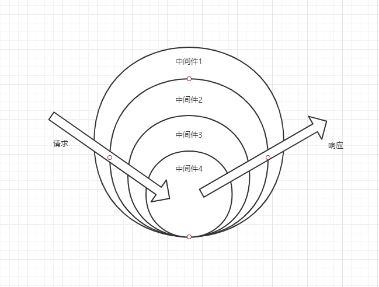

## 历史

* Express：采用传统的回调，可能造成回调地狱
* Koa1：使用Generator函数，配合CO库，解决回调地狱
* Koa2：采用了最新的Async/Await，从语法层面解决异步回调

```js
// express
var express = require('express')		
var app = express()
app.get('/', (req, res) => {
    asyncFunction1(params, function() {
        asyncFunction2(params, function() {
            asyncFunction3(params, function() {
                res.send('hello world')
            })
        })
    })
})

// koa1
var koa = require('koa')
var app = koa()

app.use(function*() {				// 对任意请求进行处理的中间件
    yield asyncFunction1(params)
    yield asyncFunction2(params)
    yield asyncFunction3(params)
    this.body = 'Hello World'
})

app.listen(3000)	

// koa2
const koa = require('koa')
const app = new koa()
app.use(async ctx => {
    await asyncFunction1(params)
    await astncFunction2(params)
    await astncFunction3(params)
	ctx.body = 'hello world'
})
app.listen(3000)
```

* Generator函数的设计初衷并不是为了解决异步编程问题，而是为了实现协程的功能
* Koa2的Async/Await相当于CO+Generator的语法糖，并且可读性更强

> Node 7.x 版本只有在harmony模式下才支持async/await，也是说在最好使用LTS的Node 8版本以上。

## 初体验

```js
const koa = require('koa')
const app = new koa()

// 一个简单的中间件处理所有请求
app.use(async (ctx, next) => {
    await next()
    ctx.response.type = 'text/html'
    ctx.response.body = '<h1>Hello World</h1>'
})

app.listen(3000, () => {
    console.log('server is running')
})
```

## Context对象

Koa将Node.js的Request和Response对象封装到Context对象中，这个对象称为上下文。

这个上下文包含如下属性：

* ctx.state：推荐的命名空间，用于通过中间件传递信息和你的前端视图 
* ctx.app：应用程序实例
* ctx.cookies：操作cookie
* ctx.throw：错误处理
* ctx.request：koa的request对象，ctx会代理这个属性
* ctx.response：koa的response对象，ctx会代理这个属性
* ctx.req：Node的request对象
* ctx.res：Node的response对象。
* ctx.method：指向ctx.request.method
* ctx.url：指向ctx.request.url
* ctx.body：指向ctx.response.body
* ctx.status：指向ctx.response.status
* ctx.type：指向ctx.response.type
* ctx.redirect：指向ctx.response.redirect
* ctx.path：指向ctx.request.path。注意：ctx.req没有这个属性
* ctx.headers：获取请求头
* ctx.set：设置请求头

```js
app.use(async (ctx, next) => {
    console.log(this === ctx)		// true
    console.log(ctx.request.req === ctx.req)	// true
    next()
})
```

绕过koa的response处理是不被支持的，应该避免使用下面属性：

* `res.statusCode`
* `res.writeHead()`
* `res.write()`
* `res.end()`

当然你可以通过设置`ctx.respond`为false，来使用绕过Koa的response处理。但是不建议这样做。

另外，你也可以在Context对象挂载一些自定义属性来让全局调用。

### ctx.request

```js
const koa = require('koa')
const app = new koa()

app.use(async (ctx) => {
    ctx.response.body = {
        url: ctx.request.url,					// 获取请求的url
        query: ctx.request.query,				// 获取解析的查询字符串
        queryString: ctx.request.queryString	// 获取原始查询字符串
    }
})

app.listen(3000)
```

Koa并没有解析Post请求的数据，你只能自己手动实现。

```js
const koa = require('koa')
const app = new koa()

app.use(async (ctx) => {
    let postdata = ''
    ctx.req.on('data', data => {		// 监听data事件
        postdata += data				// 拼装POST请求的参数
    })
    
    ctx.req.on('end', () => {			// 打印POST请求的参数
        console.log(postdata)
    })
})

app.listen(3000)
```

当然处理Post请求体更多的是使用bodyParser中间件。

### ctx.response

```js
const koa = require("koa");
const app = new koa();

app.use(async ctx => {
  ctx.type = 'html'						// 用于设置Content-Type
  ctx.body = '<h1>hello world</h1>'
});

app.listen(3000);
```

### ctx.cookies

```js
ctx.cookies.get(name, [options])			// 获取cookie
ctx.cookies.set(name, value, [options])		// 设置cookie
```

其中options的配置如下表： 

| key       | value                                                       |
| --------- | ----------------------------------------------------------- |
| maxAge    | 一个以毫秒为单位的数字，表示Cookie到期时间                  |
| signed    | Cookie签名值                                                |
| expires   | Cookie过期的Date                                            |
| path      | Cookie路径，默认是/                                         |
| domain    | Cookie域名                                                  |
| secure    | 安全Cookie，只能使用HTTPS访问                               |
| httpOnly  | 如果为true，则Cookie无法被JavaScript获取到                  |
| overwrite | 一个布尔值，表示是否覆盖以前设置的同名Cookie（默认为false） |

### ctx.throw

```js
app.use(async (ctx) => {
    ctx.throw(500)
})
```

## 中间件

相较于express的中间件是顺序执行的，Koa采用的是洋葱模型。



下面通过具体代码来演示中间件的执行过程：

```js
app.use(async function(ctx, next) {
    console.log('one start')
    await next()
    console.log('one end')
})

app.use(async function(ctx, next) {
    console.log('two start')
    await next()
    console.log('two end')
})

app.use(async function(ctx, next) {
    console.log('three start')
    await next()
    console.log('three end')
})

/*
	执行结果如下：
	one start
	two start
	three start
	
	three end
	two end
	one end
*/
```

如果想将多个中间件组合成一个单一的中间件，便于重用或导出，可以使用koa-compose。

```js
const compose = require('koa-compose')

async function middleware1(ctx, next) {
    // do sth
    await next()
}

async function middleware2(ctx, next) {
    // do sth
    await next()
}

async function middleware3(ctx, next) {
    // do sth
    await next()
}

const all = compose([middleware1, middleware2, middleware3])
app.use(all)
```

通过中间件你可以做很多，例如获取程序响应时间，日志操作等等。

### 常见的中间件

Koa并没有内置任何中间件，几乎所有功能都需要通过第三方中间件来实现。而Express默认提供了静态文件服务。

Koa社区产出了很多优秀的中间件，例如：

* koa-bodyparser
* koa-router
* koa-static
* koa-views
* koa-session

### 自定义中间件

**generator中间件开发**

```js
// app.js
const logGen = require('./log')

const Koa = require('koa')
const app = new Koa()

app.use(logGen())

app.use(function * (){
  this.body = 'hello world'
})

app.listen(3000)

// log.js
function log(ctx) {
  console.log(ctx.method)
}

module.exports = function() {
  return function * (next) {
    log(this)

    if(next) {
      yield next()
    }
  }
}
```

generator中间件在Koa@2中，需要用koa-convert包装一下。

**async中间件开发**

```js
const logger = async function(ctx, next) {
    console.log(ctx.method, ctx.host + ctx.url)
    await next()
}

app.use(logger)			// 加载中间件

app.use(async function(ctx, next) {
    ctx.body = 'Hello World'
})
```

## 路由

我们可以通过`ctx.url`和`ctx.url`实现简单的路由控制。

```js
const koa = require('koa')
const app = new koa()

app.use(async (ctx, next) => {						// 使用中间件来实现
    const {url, method} = ctx						// 获取请求的URL和Method
    if(url === '/404' && method === 'GET') {		// 匹配URL和Method
        ctx.body = 'Page Not Found'					// 输出响应
        ctx.status = 404
    }else {
        ctx.body = 'Default Content'
    }
    await next()
})

app.listen(3000)
```

但是更多情况下，我们是通过成熟的第三方库——koa-router来实现路由功能。

### koa-router

koa-router有丰富的API，你可以实现命名参数，命令路由，嵌套路由等功能。

```js
const koa = require('koa')					
const Router = require('koa-router')		
const app =  new Koa()						
const router = new Router()					

router.get('/users/:id', async (ctx, next) => {
	ctx.body = `${ctx.params.id}`
})

app.use(router.routes())					
```

关于命名路由，动态路由，嵌套路由，路由前缀的时候看koa-router官网。

### 路由鉴权

常见的路由鉴权有：

* 基于cookie/session
* 基于JWT
* 基于oauth

```js
// 单个路由权限控制
const auth = async (ctx, next) => {
    if(!ctx.session.userinfo) {
        ctx.body = {
            ok: 0,
            message: '用户未登录'
        }
    }else {
        await next()
    }
}

router.get('/users', auth, async ctx => {		
    // ...
})

```

## MVC

MVC模式在概念上强调Model、View和Controller的分离，具体表现如下：

* Model：负责数据访问
* Controller：负责处理消息
* View：负责显示数据

在Koa中实现MVC架构。

### 分离Router

```js
// router/users.js
const router = require('koa-router')()
const {barController} = require('../controller/users.js')

router.prefix('/users')

router.get('/bar', barController)

module.exports = router
```

### 分离Controller

```js
const barController = async ctx => {
    // 如果逻辑复杂，还可以抽离成service
    ctx.body = 'hello world'
}

module.exports = {
    barController
}
```

### 分离View

通过`koa-views`模块，然后配合模板引擎来实现。

另外，分离View最重要的一个步骤是实现静态资源服务器。

```js
// index.js
const Koa = require('koa')
const path = require('path')
const content = require('./util/content')
const mimes = require('./util/mimes')

const app = new Koa()

// 静态资源目录对于相对入口文件index.js的路径
const staticPath = './static'

// 解析资源类型
function parseMime( url ) {
  let extName = path.extname( url )
  extName = extName ?  extName.slice(1) : 'unknown'
  return  mimes[ extName ]
}

app.use( async ( ctx ) => {
  // 静态资源目录在本地的绝对路径
  let fullStaticPath = path.join(__dirname, staticPath)

  // 获取静态资源内容，有可能是文件内容，目录，或404
  let _content = await content( ctx, fullStaticPath )

  // 解析请求内容的类型
  let _mime = parseMime( ctx.url )

  // 如果有对应的文件类型，就配置上下文的类型
  if ( _mime ) {
    ctx.type = _mime
  }

  // 输出静态资源内容
  if ( _mime && _mime.indexOf('image/') >= 0 ) {
    // 如果是图片，则用node原生res，输出二进制数据
    ctx.res.writeHead(200)
    ctx.res.write(_content, 'binary')
    ctx.res.end()
  } else {
    // 其他则输出文本
    ctx.body = _content
  }
})

app.listen(3000)

// content.js 读取请求内容
const path = require('path')
const fs = require('fs')

// 封装读取目录内容方法
const dir = require('./dir')

// 封装读取文件内容方法
const file = require('./file')


/**
 * 获取静态资源内容
 * @param  {object} ctx koa上下文
 * @param  {string} 静态资源目录在本地的绝对路径
 * @return  {string} 请求获取到的本地内容
 */
async function content( ctx, fullStaticPath ) {

  // 封装请求资源的完绝对径
  let reqPath = path.join(fullStaticPath, ctx.url)

  // 判断请求路径是否为存在目录或者文件
  let exist = fs.existsSync( reqPath )

  // 返回请求内容， 默认为空
  let content = ''

  if( !exist ) {
    //如果请求路径不存在，返回404
    content = '404 Not Found! o(╯□╰)o！'
  } else {
    //判断访问地址是文件夹还是文件
    let stat = fs.statSync( reqPath )

    if( stat.isDirectory() ) {
      //如果为目录，则渲读取目录内容
      content = dir( ctx.url, reqPath )

    } else {
      // 如果请求为文件，则读取文件内容
      content = await file( reqPath )
    }
  }

  return content
}

module.exports = content

// dir.js 读取目录内容
const url = require('url')
const fs = require('fs')
const path = require('path')

// 遍历读取目录内容方法
const walk = require('./walk')

/**
 * 封装目录内容
 * @param  {string} url 当前请求的上下文中的url，即ctx.url
 * @param  {string} reqPath 请求静态资源的完整本地路径
 * @return {string} 返回目录内容，封装成HTML
 */
function dir ( url, reqPath ) {

  // 遍历读取当前目录下的文件、子目录
  let contentList = walk( reqPath )

  let html = `<ul>`
  for ( let [ index, item ] of contentList.entries() ) {
    html = `${html}<li><a href="${url === '/' ? '' : url}/${item}">${item}</a>` 
  }
  html = `${html}</ul>`

  return html
}

module.exports = dir
// file.js 读取文件内容
const fs = require('fs')

/**
 * 读取文件方法
 * @param  {string} 文件本地的绝对路径
 * @return {string|binary} 
 */
function file ( filePath ) {

 let content = fs.readFileSync(filePath, 'binary' )
 return content
}

module.exports = file
// mimes.js 文件类型列表
const fs = require('fs')
const mimes = require('./mimes')

/**
 * 遍历读取目录内容（子目录，文件名）
 * @param  {string} reqPath 请求资源的绝对路径
 * @return {array} 目录内容列表
 */
function walk( reqPath ){

  let files = fs.readdirSync( reqPath );

  let dirList = [], fileList = [];
  for( let i=0, len=files.length; i<len; i++ ) {
    let item = files[i];
    let itemArr = item.split("\.");
    let itemMime = ( itemArr.length > 1 ) ? itemArr[ itemArr.length - 1 ] : "undefined";

    if( typeof mimes[ itemMime ] === "undefined" ) {
      dirList.push( files[i] );
    } else {
      fileList.push( files[i] );
    }
  }


  let result = dirList.concat( fileList );

  return result;
};

module.exports = walk;
// walk.js 	遍历目录内容
let mimes = {
  'css': 'text/css',
  'less': 'text/css',
  'gif': 'image/gif',
  'html': 'text/html',
  'ico': 'image/x-icon',
  'jpeg': 'image/jpeg',
  'jpg': 'image/jpeg',
  'js': 'text/javascript',
  'json': 'application/json',
  'pdf': 'application/pdf',
  'png': 'image/png',
  'svg': 'image/svg+xml',
  'swf': 'application/x-shockwave-flash',
  'tiff': 'image/tiff',
  'txt': 'text/plain',
  'wav': 'audio/x-wav',
  'wma': 'audio/x-ms-wma',
  'wmv': 'video/x-ms-wmv',
  'xml': 'text/xml'
}

module.exports = mimes
```

当然建议使用第三方模块`koa-static`来实现，具体用法可以查看相关文档。

## 文件上传

* koa-multer
* busboy
* koa-body

这个模块都可以实现文件上传。

其中，koa-body支持图片上传，并且包含koa-bodyparser解析post数据的功能。

## 登录注册

* cookie/session
* jwt
* oAuth2

## 数据库

### MySQL

```js
const mysql      = require('mysql')
const connection = mysql.createConnection({
  host     : '127.0.0.1',   	// 数据库地址
  user     : 'root',    		// 数据库用户
  password : '123456'   		// 数据库密码
  database : 'my_database'  	// 选中数据库
})

// 执行sql脚本对数据库进行读写 
connection.query('SELECT * FROM my_table',  (error, results, fields) => {
  if (error) throw error
  // connected! 

  // 结束会话
  connection.end() 
});
```

注意：一个事件就有一个从开始到结束的过程，数据库会话操作执行完后，就需要关闭掉，以免占用连接资源。

下面使用`Promise`进行封装一下。

```js
const mysql      = require('mysql')
const connection = mysql.createConnection({
  host     : '127.0.0.1',   	// 数据库地址
  user     : 'root',    		// 数据库用户
  password : '123456'   		// 数据库密码
  database : 'my_database'  	// 选中数据库
})

connection.connect()

const execSql = sql => {
    return new Promise((resolve, reject) => {
        connection.query(sql, (err, result, fields) => {
            if(err) {
                reject(err)
            }else {
                resolve(result)
            }
        })
        connection.end()
    })
}

module.exports = execSql
```

一般情况下，操作数据库是很复杂的读写过程，不只是一个会话，如果直接用会话操作，就需要每次会话都要配置连接参数。所以这时候就需要连接池管理会话。

```js
const mysql = require('mysql')

// 创建数据池
const pool  = mysql.createPool({
  host     : '127.0.0.1',   // 数据库地址
  user     : 'root',    // 数据库用户
  password : '123456'   // 数据库密码
  database : 'my_database'  // 选中数据库
})

// 在数据池中进行会话操作
pool.getConnection(function(err, connection) {

  connection.query('SELECT * FROM my_table',  (error, results, fields) => {

    // 结束会话
    connection.release();

    // 如果有错误就抛出
    if (error) throw error;
  })
})
```

为了配合Koa2使用，我们还需要使用`async/await`来封装一下。

```js
// query.js
const mysql = require('mysql')
const pool = mysql.createPool({
  host     :  '127.0.0.1',
  user     :  'root',
  password :  '123456',
  database :  'my_database'
})

let query = function( sql, values ) {
  return new Promise(( resolve, reject ) => {
    pool.getConnection(function(err, connection) {
      if (err) {
        reject( err )
      } else {
        connection.query(sql, values, ( err, rows) => {
          if ( err ) {
            reject( err )
          } else {
            resolve( rows )
          }
          connection.release()
        })
      }
    })
  })
}

module.exports = { query }

// app.js
const { query } = require('./async-db')
async function selectAllData( ) {
  let sql = 'SELECT * FROM my_table'
  let dataList = await query( sql )
  return dataList
}

async function getData() {
  let dataList = await selectAllData()
  console.log( dataList )
}

getData()
```

使用原生SQL语句进行查询操作一定要注意SQL注入攻击。

#### sequelize

我们还可以通过sequelize这个ORM库来操作数据库，支持的数据库包括MySQL，SQLite等。

```js
const Sequelize = require('sequelize')
const sequelize = new Sequelize('databaseName', 'userName', 'password', {
    host: 'localhost',			// 数据库服务地址
    dialet: 'mysql'				// SQL语言类型
})
sequelize.authenticate().then(() => {			// 检验数据库连接
    console.log('Connected')
}).catch(e => {
    console.error('Connect failed')
})
```

注意：Sequelize默认支持连接池。

### MongoDB

我们一般很少直接操作MongoDB，而是通过`Mongoose`这类的ORM工具来操作。

```js
const mongoose = require('mongoose')
mongoose.connect('mongodb://localhost/test', {
    user: 'username',					// 数据库用户名
    pass: 'password',					// 数据库密码
    poolSize: 10						// 数据库连接池大小
})

const db = mongoose.connection			// 获取连接对象
db.on('error', err => {					// 连接失败
    console.log(err)
})

db.on('open', () => {					// 连接成功
    // we are connected
})
```

和Sequelize类似，为了提升连接效率，Mongoose也支持连接池，需要通过参数来配置。

```js
// db.js
const mongoose = require('mongoose')

async function connect () {					//封装连接方法
	await mongoose.connect('mongodb://localhost/course',{
        user: 'username',
        pass: 'password'
    })
}

aswync function close() {					// 封装关闭连接方法
    await mongoose.connection.close()
}

// 定义数据类型
const mongoose = require('mongoose')

const timeRangeSchema = new mongoose.Schema({		// 定义子模型
    hour: {
        type: Number,
        max: 24,					// 课程表一般是白天
        min: 8
    },
    minute: {
        type: Number,
        max: 59,
        min: 0
    },
    time: {							// 为便于查询，定义了一个计算类型
        type: Number,
        get() {
            return this.get('hour')*100 + this.get('minute')
        }
    }
})

const courseSchema = new mongoose.Schema({			// 定义课程模型
    name: String,
    startTime: timeRangeSchema,			// 开始时间，采用子模型描述
    endTime: timeRangeSchema			// 结束时间，采用子模型描述
})

// 操作数据
const Course = require('./model/course')	

async function getCourseList() {				// 获取所有课程列表
    return await Course.find().sort({
        'startTime.time': 1						// 按照开始时间排序
    })
}

async function getCourseById(id) {				// 根据ID查询课程数据
    return await Course.findById(id)
}

async function getCourseByName(name) {				// 根据Name模糊查询课程数据
    return await Course.find({name: new RegExp(name)})
}

async function getCourseByTime(start, end, weekday) {	// 根据时间查询课程数据
    return await Course.find({
        weekday: weekday
    }).where('startTime.time').gte(start.hour*100 + start.minute)	// 按计算属性查询数据
	.where('endTime.time').lte(end.hour * 100 + end.minute)
}

async function addCourse() {					// 添加课程数据
    const {name, weekday, startTime, endTime} = course
    const item = await getCourseByTime(startTime, endTime, weekday)

	if(item) {
        throw new Error('当前时间段已经安排了课程')
    }	
    return await Course.create(course)
}

async function updateCourse(id, course) {		// 更新课程数据
    return await Course.update({
        _id: id
    }, course)
}

async function removeCourse(id) {				// 删除课程数据
    return await Course.remove({
        _id: id
    })
}

// 路由
const JSON_MIME = 'application/json';
router.get('/course', async (context) => {				// 查询所有数据
    context.type = JSON_MIME
    context.body = {
        status: 0,
        data: await getCourseList()
    }
})

router.get('/course/:id', async context => {			// 通过ID查询数据
    context.type = JSON_MIME
    context.body = {
        status: 0,
        data: await getCourseById(context.params.id)
    }
})

router.post('/course', async context => {			// 通过ID查询数据
    context.type = JSON_MIME
    await addCourse(context.body)
    context.body = {
        status: 0
    }
})

router.put('/course/:id', async context => {				// 更新数据
    await updateCourse(context.params.id, context.body)
    context.body = {
        status: 0
    }
})

router.delete('/course/:id', async context => {			// 删除数据
    await deleteCustomer(context.params.id)
    context.body = {
        status: 0
    }
})
```

最后在`app.js`进行数据库连接。

```js
app.use(async (context, next) => {
    await connect()			// 处理请求前
    await next()			// 处理请求
    await close()			// 处理请求后，关闭连接
})
```

这里使用了中间件，在请求的开始和结束时分别调用建立连接和关闭连接的方法。

### Redis

在Koa中，可以使用`redis`模块来操作Redis。

```js
const redis = require('redis')
const client = redis.createClient(6379, '127.0.0.1')
client.on('error', function(err) {
    console.log(err)					
})

client.set('name', 'ugu', redis.print)			
client.get('name', function(err, value) {
    if(err) throw err;
    console.log('Name' + value)
})
```

Redis常见的应用场景就是持久化session。


```js
const Koa = require('koa')
const app = new Koa()
const session = require('koa-session')
const redis = require('redis')
const client = redis.createClient(6379, '127.0.0.1')		// 链接本地Redis服务
const {promiseify} = require('util')

const hgetallAsync = promisify(client.hgetall).bind(client)
app.keys = ['some secret hurr']
const store = {								// 配置Redis如何存取Session
    get: async(key, maxAge) => {			// 从Redis获取session
        return await hgtallAsync(key)
    },
    set: (key, sess, maxAge) => {			// 在Redis中存储Session
        client.hmset(key, sess)
    },
    destory: (key) => {						// 销毁Redis中的Session
        client.hdel()key
    }
}

const CONFIG = {
    key: 'koa:sess',				
    maxAge: 86400000,					
    overwrite: true,					
    httpOnly: true,						
    signed: true,
    store						// 添加store配置，支持Redis
}

app.use(session(CONFIG, app))
app.use(ctx => {
    if(ctx.path === '/favicon.ico') return	
    let n = ctx.session.views || 0			
    ctx.session.views = ++n;				
    ctx.body = n + 'views'					
})

app.listen(3000)
```

## 日志

通过第三方模块`log4js`来实现日志分析。

## 错误处理

Koa会自动处理404错误，以及一些运行时错误会返回500。但是更多情况下，需要我们自己手动去处理。

```js
const error = async (ctx, next) => {
  try {
    await next();
  } catch (err) {
    ctx.status = err.status || err.statusCode || 500;
    ctx.body = {
      message: err.message
    };
  }
};

module.exports = {
  error
};
```

当然，你还可以使用第三方中间件`koa-json-error`来进行错误处理。

## 参数校验

有的时候，我们需要对客户端传递过来的参数进行校验，你可以通过`koa-bouncer`或者`koa-parameter`来进行参数校验。

## 源码介绍

```js
// index.js
const http = require("http");
const context = require("./context");
const request = require("./request");
const response = require("./response");

class Koa {
  constructor() {
    this.middlewares = [];

    this.context = context;
    this.request = request;
    this.response = response;
  }

  use(cb) {
    this.middlewares.push(cb);
  }

  listen(...args) {
    const server = http.createServer(this.handleRequest.bind(this));
    server.listen(...args);
  }

  handleRequest(req, res) {
    const ctx = this.createContext(req, res);

    const composeMiddleware = this.compose(ctx, this.middlewares);

    composeMiddleware.then(() => {
      if (ctx.body) {
        res.statusCode = 200;
        res.end(body);
      } else {
        res.statusCode = 404;
        res.end("Not Found");
      }
    });
  }

  compose(ctx, middlewares) {
    const dispatch = index => {
      if (index === middlewares.length) {
        return Promise.resolve();
      }
      const middleware = middlewares[index];
      // 递归创建嵌套promise
      return Promise.resolve(middleware(ctx, () => dispatch(index + 1)));
    };

    return dispatch(0);
  }

  createContext(req, res) {
    const ctx = Object.create(this.context);
    ctx.request = Object.create(this.request);
    ctx.response = Object.create(this.response);
    ctx.req = ctx.request.req = req;
    ctx.res = ctx.response.res = res;

    return ctx;
  }
}

module.exports = Koa;

// context.js
const proto = {
  get path() {
    return this.request.path;
  },
  get body() {
    return this.response.body;
  },
  set body(value) {
    this.response.body = value;
  }
};

module.exports = proto;

// request.js
const url = require("url");

const request = {
  get url() {
    return this.req.url;
  },
  get path() {
    return url.parse(this.req.url).pathname;
  }
};

module.exports = request;

// response.js
const response = {
  get body() {
    return this._body;
  },
  set body(value) {
    this._body = value;
    
  }
};

module.exports = response;
```


