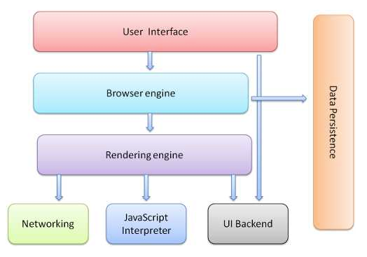
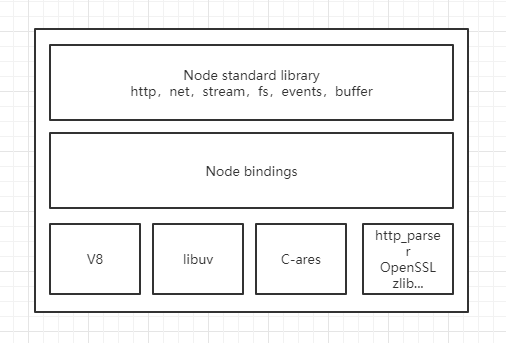
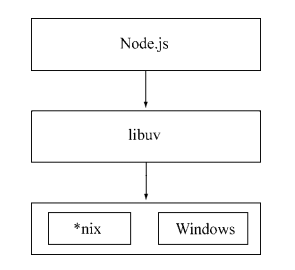
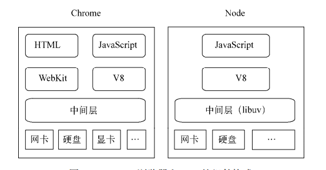
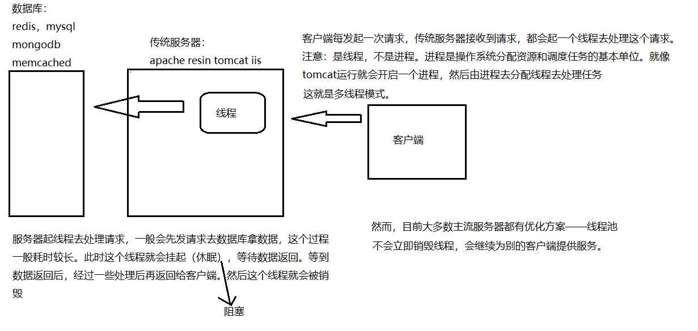
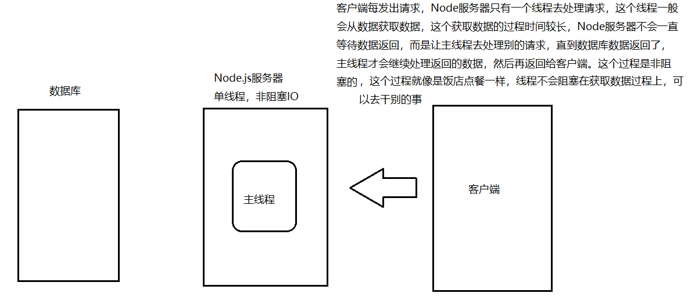

## 事件循环

### 浏览器模型

* 用户界面：包括地址栏、前进/后退按钮等
* 浏览器引擎：在用户界面和渲染引擎之间传送指令
* 渲染引擎：也被称为浏览器内核，在线程方面又称为UI线程
* 网络：用于网络调用
* 用户界面后端：用于绘制基本的窗口小部件
* JavaScript引擎：用于解释执行JavaScript代码
* 数据存储：需要在硬盘上保存的数据，例如cookie



UI和JavaScript共用一个线程，除此之外，还有如下线程：

* 浏览器事件触发线程
* 定时器触发线程
* 异步HTTP请求线程

### 任务队列

实际上，浏览器中的异步任务分为宏任务（慢）和微任务（快），其中setTimeout，setImmediate（IE下特有），PostMessage和MessageChannel以及Node的I/O任务都是宏任务，而原生的Promise.then()的实现和MutationObserver是微任务。

**mutationObserver**

mutationObserver用来监听DOM节点的变化，只有监听的DOM配置全部变化后，就会执行传入的回调函数。

```js
const mu = new MutationObserver(function() {
    console.log('变化完毕')
})

const app = document.getElementById('app')

mu.observe(app, {
    childList: true			// 监控app的子节点列表
})

for(let i = 0; i<10; i++) {
    app.appendChild(document.createElement('p'))
}
```

**messageChannel**

```js
const mes = new MessageChannel()

mes.port1.postMessage('hello world')

mes.port2.onMessage = function(e) {		
    console.log(e.data)			// 'hello world'
}

console.log('同步代码')			// 先打印通过代码

// postMessage和onMessage都是宏任务
```

所有同步任务都在主线程上执行，形成一个执行栈。而异步任务会进入任务队列中。一旦执行栈中的所有同步任务执行完毕，会读取任务队列，判断哪些异步任务完成，对于完成的异步任务会放到执行栈中执行。

注意：并不是所有的回调都是异步的，只有异步回调才会放到任务队列中。

```js
function demo(filename ,cb){
    cb(filename)			
}
```

在浏览器端常见的异步任务有：

* 定时器
* 事件处理
* AJAX

### 浏览器端事件循环

`JavaScript`在执行的过程会产生执行环境，这些执行环境会被顺序的加入执行栈中。如果遇到异步代码，会挂起并放入任务队列中。执行栈在执行完**同步任务**后，查看**执行栈**是否为空，如果执行栈为空，就会去检查**微任务**(microTask)队列是否为空，如果为空的话，就执行Task（宏任务），否则就一次性执行完所有微任务。
每次单个**宏任务**执行完毕后，检查**微任务**(microTask)队列是否为空，如果不为空的话，会按照**先入先**出的规则全部执行完**微任务**(microTask)后，设置**微任务**(microTask)队列为null，然后再执行**宏任务**，如此循环。

这个不断读取任务队列中异步任务的机制，称为Event Loop。

例如：

```js
console.log("script start");

async function async1() {
  await async2();

  console.log("async1 end");
}

async function async2() {
  console.log("async2 end");
}

async1();

setTimeout(function() {
  console.log("setTimeout");
}, 0);

new Promise(resolve => {
  console.log("Promise");

  resolve();
})

  .then(function() {
    console.log("promise1");
  })

  .then(function() {
    console.log("promise2");
  });

console.log("script end");
```

会打印出`script start`，`async2 end`，`Promise`，`script end`，`async1 end`，`promise1`，`promise2`

以及`setTimeout`。
你可以简单地将`await`理解为：

```js
async function f() {

  await p

  console.log('ok')

}

// 约等于
function f() {

  return RESOLVE(p).then(() => {

    console.log('ok')

  })

}
```

### Node端事件循环

Node中的`Event Loop`是基于`libuv`实现的，`libuv`是`node`的跨平台抽象层，它使用异步，事件驱动的编程方式，核心是提供`I/O`的事件循环和异步回调。

和浏览器的事件环不同，浏览器只有宏任务和微任务两个队列，而在Node中，有如下六个队列，它们会按照顺序反复运行。每当进入某一个阶段的时候，都会从对应的回调队列中取出函数去执行。当队列为空或者执行的回调函数数量到达系统设定的阈值，就会进入下一个阶段：

- `timers`: 执行`setTimeout`和`setInterval`中到期的`callback`，并且是由poll阶段控制
- `pending callback`: 会处理一些上一轮轮询中的少数未执行的`I/O`回调
- `idle, prepare`: 仅在内部使用
- `poll`: 最重要的阶段，会做两件事：回到timer阶段执行回调和执行`I/O`回调
- `check`: 执行`setImmediate`
- `close callbacks`: 执行`close`事件的`callback`，例如`socket.on('close'[,fn])`或者`http.server.on('close, fn)`

执行代码时，会讲任务分配给相应的队列，默认会从上到下执行这些队列。

> 具体细节看` https://juejin.im/post/5c3d8956e51d4511dc72c200#heading-25 `。

 `process.nextTick()`虽然它是异步API的一部分，但是并没有出现在上面的队列中。这是因为`process.nextTick`从技术上讲，不是事件循环的一部分。

实际上，`process.nextTick`方法会将`callback`添加到`next tick`队列。一旦当前事件轮询队列的任务全部完成，在`next tick`队列中所有的`callback`会被依次调用。简单来说，当每个阶段完成后，如果存在`next tick`队列，就会清空队列中的所有回调函数，并且优先于其它微任务的执行。

## I/O操作

对于计算机来说，除了一般的IO设备，如打印机，键盘等，IO操作一般是磁盘读取，网络操作等。

> 数据库中的数据也是存储在磁盘上的，所以数据库操作也就是磁盘读取操作。

一般来说，计算机语句都是逐条执行的（不考虑goto等跳转语句），当某条语句下发IO指令，进程就会等待计算机操作系统去进行IO操作，当拿到结果之后才会继续向下执行语句，这就称为IO阻塞进程的执行。

而非阻塞IO就是进程不等待IO完成。实际上，所有的计算机指令都是阻塞的，也就是说上一条指令完成之后，下一条指令才能执行。但是，目前CPU的计算能力十分强悍，1s能执行30亿条指令，所以这些非IO指令你感觉不到阻塞。而IO指令大部分属于磁盘读写操作，这个速度相对来说并不是很快（远不如cpu的执行快）。而Node.js采用的非阻塞IO模型会在IO指令完成后，以事件驱动的方式通知主线程，从而不阻塞线程的继续执行（观察者模式实现）。

正是这种非阻塞IO模型，所以Node在处理高并发，IO密集场景性能优势明显。

一般来说，解决高并发的途径有如下两种：

- 增加机器数：相同并发流量的情况下，可以通过负载均衡，让并发请求在不同的机器上去处理。缺点：成本太高
- 提高当前机器的CPU核心：当然这只针对CPU密集型的任务。如果是IO密集，只需要提高当前机器的IO能力。缺点：成本略高，硬件有瓶颈

这两种方式适合所有语言：Node，PHP，Python，Java等。

而为什么Node.js自诩是高性能web服务器呢？是因为针对单台机器单核心时，相较于传统语言有优势，得益于它的非阻塞IO模型。不仅能降低成本，性能还高。

## Node简介

### 定义

Node.js是一个基于Chrome v8引擎的JavaScript运行时环境，至于什么是运行时，为什么要基于Chrome V8呢？

运行时环境或运行时 ，更确切的称谓是Managed Runtime Environment，即托管运行时环境。JavaScript引擎则是对同一个概念的更通俗叫法。运行时是一个平台，它把运行在底层的操作系统和体系结构的特点抽象出来，承担了解释与编译、堆管理（Heap Management）、垃圾回收机制（Garbage Collection）、内存分配（Memory Allocation）、安全机制（Security）等功能。在这些运行时环境中开发应用的开发者可以不用关心底层的计算机处理器指令，而把更多的精力投入到更为关键的业务逻辑中去。

许多高级程序语言都带有配套的运行时环境，如Java和C++。这些运行时环境提供了以往由计算机处理器和操作系统所提供的功能，即为存在于各种各样的设备上的不同操作系统解释并运行由不同编程语言编写的应用。若没有这些运行时环境的介入，特定的操作系统所能识别的编程语言是极其有限的，因此能够在该操作系统上运行的应用也将非常有限。运行时环境使开发者能够以成本最小的方式创建应用。

由于运行时环境和操作系统及计算机的体系结构有着密切的联系，因此它常常被称为虚拟机（Virtual Machine，即VM）。 在JavaScript的开发语境下，因为缺少指令集，所以Machine的概念被弱化了。但不管是虚拟机、引擎，还是运行时环境，其实都被用来指代向一种东西：JavaScript的托管运行时环境。

简而言之，JavaScript运行时环境就是一个能够执行JavaScript语句的运行环境，它提供一系列以往由处理器和操作系统才能提供的功能，使得开发者能够脱离底层指令，从而专注于业务逻辑开发。

在Node.js出现以前，JavaScript主要运行在浏览器环境中，这是因为只有浏览器才具有能够解释JavaScript的机制，而Node.js使得JavaScript突破了浏览器的限制，开启了JavaScript的后端开发之路。

Chrome v8引擎是一个高性能的JavaScript解释引擎。Chrome浏览器内核是鼎鼎大名的WebKit的一个分支（Webkit分为渲染引擎WebCore和JavaScript解释引擎JavaScriptCore两部分）。Google认为运行现代Web应用需要一个强劲的JavaScript 引擎，然而JavaScriptCore的运行效率并不让人满意。于是Google开发了一个高性能的JavaScript引擎，这个引擎就是Chrome v8。

因此，基于Chrome v8引擎的Node.js是一个能够轻而易举编写高性能Web服务的运行时环境。

### 安装

可以在Node.js官网下载安装。安装完成后，就可以通过`node`命令去执行JavaScript文件。

### 结构

Node.js结构分为如下：

* Node.js标准库，这部分由JavaScript编写，即在使用过程中直接能调用的API，在源码的lib目录下可以看到
* Node bindings：这部分由C/C++编写，是JavaScript与底层C/C++相互调用的关键，前者通过bindings调用后者，相互交换数据
* 支撑Node.js运行的基础构建：这部分由C/C++编写 

而对于支撑Node.js运行的基础构建具体如下：

* V8：Google推出的JavaScript VM，它为JavaScript提供了再非浏览器端运行的环境
* libuv：为Node.js提供了跨平台、线程池、事件池、异步I/O等能力
* C-ares：提供了异步处理DNS相关的能力
* http_parser、OpenSSL、zlib等：提供包括HTTP解析、SSL、数据压缩等能力

整个结构如下图：



### 特点

#### 异步、非阻塞I/O

一个异步I/O的大致流程如下：

1. 用户通过 JavaScript 代码调用 Node 核心模块，将参数和回调函数传入核心模块 
2. Node 核心模块会将传入的参数和回调函数封装成 一个请求对象 
3. 将这个请求对象推入 I/O 线程池等待执行
4. JavaScript 发起的异步调用结束，JavaScript 线程继续执行后续操作
5. I/O 操作完成后会将结果储存到请求对象的 result 属性上，并发出操作完成的通知
6. 每次事件循环时会检查是否有完成的 I/O 操作，如果有就将请求对象加入 I/O 观察者队列中，之后当作事件处理
7. 处理 I/O 观察者事件时会取出之前封装在请求对象中的回调函数，执行这个回调函数， 并将 result 当作参数，以完成 JavaScript 回调的目的

##### 阻塞和非阻塞

* 阻塞：I/O时进程休眠等待I/O完成返回结果后，再进行下一步
* 非阻塞：I/O时函数立即返回，进程不等待I/O完成，并通过事件通过主程序I/O结束

阻塞和非阻塞关注的是程序在等待调用结果（消息，返回值）时的状态，而同步和异步关注的是消息通知机制。

##### 同步和异步

* 同步：每个调用之间必必须等待之前的I/O调用结束
* 异步：每个调用之间无需等待之前的I/O调用结束，也就是说调用者不会立即得到结果

```js
fs.readFileSync('path1', (err, res) => {
    console.log(res)
})

fs.readFileSync('path2', (err, res) => {
    console.log(res)
})
```

同步I/O耗时等于各个任务耗时之和，效率较低。所以在Node中，绝大多数的操作都是以异步的方式进行调用。

#### 事件驱动

事件驱动的优势在于充分利用了系统资源，执行代码无须阻塞等待某种操作完成，有限的资源可以用于其他的任务。

```js
const server = http.createServer((req, res) => {
    let data = ''
    
    req.on('data', chunk => {
        data += chunk.toString()
    })
    
    req.on('end', () => {
        res.end(data)
    })
})

server.listen(3000)
```

#### 单线程

在Node中，JavaScript与其余线程是无法共享任何状态的。单线程的优势在于没有像多线程那样存在状态同步和死锁的问题，也没有线程上下文切换带来的性能开销。

这里的单线程是指主线程为单线程，所有阻塞的部分交给一个线程池处理，然后这个主线程通过一个队列跟线程池协作。我们写的代码部分不用再关心线程问题，代码也主要由一堆 callback 回调构成，然后主线程在循环过程中适时调用这些代码。

但是，单线程也有缺点：

* 无法利用多核CPU
* 一个错误会导致整个应用崩溃，程序健壮性有待考究
* 大量计算占用CPU导致无法继续调用异步I/O

像浏览器中JavaScript和UI共用一个线程一样，JavaScript长时间执行会导致UI的渲染和响应被中断。在Node中，长时间的CPU执行占用也会导致后续的异步I/O无法调用，已完成的异步I/O的回调函数同样得不到执行。

在浏览器端，可以通过Web Worker创建工作线程来进行大量计算，以解决计算阻塞UI渲染的问题。工作线程通过消息传递的方式来传递运行结果，当然它也访问不了主线程中的UI。

类似地，在Node中，可以通过child_process来创建子进程，这意味着Node可以从容的解决单线程在程序健壮性以及无法利用多核CPU方面的问题。将计算分发到各个子进程，然后通过进程之间的事件消息来传递结果。通过Master-Worker的管理方式，也可以很好地管理各个工作进程，达到更强的健壮性。

#### 跨平台

通过在操作系统和Node上层模块之间构建了一层libuv，从而实现跨平台。



### 应用场景

从单线程的角度来说，Node十分擅长I/O密集型的任务。主要在于Node利用事件循环的处理能力，而不是启动每一个线程为每一个请求服务，资源占用率极低。

虽然V8的执行效率很高，但是由于JavaScript单线程的原因，如果有长时间运行的计算任务，将会导致CPU时间片不能释放，使得后续I/O无法发起。但是适当调整和分解大型运算任务为多个小任务，使得运算能够适时释放，不阻塞I/O调用的发起，这样既能享受到并行异步I/O的好处，又能充分利用CPU。

对于长时间运行的计算，如果它的耗时超过普通阻塞I/O的耗时，那么应用场景就需要重新评估，因为I/O阻塞造成的性能浪费远比CPU影响小，甚至说就是一个纯计算的场景，根本没有I/O，应该优先选择多线程的方式进行计算。

Node虽然没有提供多线程用于计算支持，但是还是可以用以下两个方式来充分利用CPU：

* 编写C/C++扩展来更高效地利用CPU
* 通过子进程的方式，解构计算和I/O，以便充分利用多核CPU

### 和浏览器端区别



在Node中没有WebKit布局引擎。

## 模块机制

### CommonJS

CommonJS对规范的定义十分简单，主要分为模块引用、模块定义和模块标识。

#### 模块引用

通过require方法来引入外部模块，该方法接收一个模块标识参数。

#### 模块定义

通过module.exports导出模块。在Node中，一个文件就是一个模块。

#### 模块标识

模块标识必须符合小驼峰命名的字符串，或者是相对路径和绝对路径。

```js
// a.js
module.exports = {
    a: 1
}

// b.js
const { a } = require('./a')

console.log(a)			// 1
```

### Node实现

Node并非完全按照CommonJS规范实现模块机制，而是在其基本上进行取舍，增加了一些额外的特性。

在Node中，模块分为三类：一类是Node提供的模块，称为核心模块；另一类是用户编写的模块，称为自定义模块（文件模块）；还有一类是通过npm安装的第三方模块。

* 核心模块在Node源代码的编译过程中，编译进了二进制执行文件。在Node进程启动时，部分核心模块就被直接加载到内存中，所以这部分核心模块引入时，文件定位和编译执行这两个步骤可以省略掉，并且在路径分析中优先判断，所以它的加载速度最快
* 自定义模块则是在运行时动态加载，需要完整的路径分析、文件定位、编译执行过程，速度比核心模块慢

在Node中引入模块，需要经历下面步骤：

1. 路径分析
2. 文件定位
3. 编译执行

下面就详细介绍这一过程。

#### 路径分析

Node是通过模块标识进行查找的，模块标识分为如下几类：

* 核心模块
* 相对路径或绝对路径形式的自定义模块
* 第三方模块

**核心模块**

对于核心模块来说，优先级仅次于缓存加载，在Node的源代码编译过程中已经编译为二进制代码，所以加载速度最快。

如果试图加载一个与核心模块标识符相同的自定义模块，是不会成功的。如果想要加载成功，必须选择一个不同的标识符或者使用路径写法。

**自定义模块**

对于路径形式的自定义模块，require方法会将路径转换为真实路径，并以真实路径作为索引，将编译执行后的结果存放到缓存中，以便二次加载更快。

由于文件模块给Node指明了确切的文件位置，所以在查找过程中可以节约大量时间，加载速度慢于核心模块。

**第三方模块**

通过npm安装的第三方模块是路径分析最慢的一个，在介绍自定义模块的查找方式之前，需要先了解一下模块路径的概念。

模块路径是Node在定位自定义模块时制定的查找策略，具体表现为一个路径组成的数组。你可以通过`module.paths`属性查看，大概是这样：`["C:\\nodejs\\node_modules", "C:\\node_modules"]`。

可以看出，模块路径的生成规则如下：

* 当前文件目录下的node_modules
* 父目录下的node_modules
* 父目录的父目录下的node_modules
* 逐级递归，直到根目录下的node_modules

如果一直没找到，则会报错。但是随着深入查找的层级越深，查找耗时也就越大，这也就是第三方模块加载慢的主要原因。

#### 文件定位

CommonJS规范允许在模块标识时不加后缀名，这种情况下，Node会按照`.js`、`.json`和`.node`的顺序补充扩展名，依次尝试。

在尝试的过程中，需要调用fs模块同步阻塞式地判断文件是否存在，因此这里可能会有一点性能开销。所以，一般情况下，对于`.node`和`.json`文件建议带上扩展名。

在尝试后缀名的过程中，可能没有查找到对应文件，可能得到的确实一个目录，此时Node会将目录当做一个包来处理。

具体处理过程是：首先，Node在当前目录下查找package.json文件，通过`JSON.parse`解析main属性指定的文件名，如果文件名缺少扩展名，那么会进行扩展名分析的阶段。

如果main属性指定的文件名错误，或者压根没有找到package.json文件，会默认以index作为默认文件名，依次查找`index.js`、`index.json`和`index.node`。

#### 编译执行

当定位到具体的模块之后，Node会新建一个模块对象，然后根据路径载入并编译。对于不同的文件扩展名，载入方法也有所不同：

* `.js`文件：通过fs模块同步读取文件后编译执行
* `.node`文件：这是通过C/C++编写的扩展文件，通过dlopen()方法加载最后编译生成的文件
* `.json`文件：通过fs模块同步读取文件后，用`JSON.parse()`解析返回的结果
* 其余扩展名文件：都会作为`.js`文件载入

每一个编译成功的模块都会将其文件路径作为索引缓存到Module._cache对象上，以提高二次引入的性能。

**JavaScript模块的编译**

对于`.js`文件，会先通过fs模块同步读取文件内容，并进行一些包装。如下：

```js
(function (exports, require, module, __filename, __dirname) {
    const a = 1
    module.exports = exports = this = {}
    module.exports = {
        a
    }
    
    return module.exports
})()
```

包装之后的代码会通过vm.runInThisContext()方法执行（类似eval，只是具有明确上下文，不污染全局），返回一个具体的function对象。最后，将当前模块对象的exports、require、module、`__filename`和`__dirname`作为参数传递给这个function执行。

这样就是为什么为什么没有定义这五个参数，却能够再`.js`文件中使用的原因了。

**C/C++模块的编译**

Node调用process.dlopen()方法进行加载和执行。在Node的架构下，dlopen方法在Windows和*nix平台下有不同的实现，通过libuv兼容层进行了封装。

实际上，`.node`的模块文件并不需要编译，因为它是C/C++代码编写后编译生成的，所以只有加载和执行的过程。

C/C++模块给Node带来的优势是执行效率高，劣势是成本高。

**JSON文件的编译**

`.json`文件的编译时最快的，通过fs模块同步读取之后，直接通过`JSON.parse`即可。

#### 缓存优先

二次引入时不需要再次进行路径分析、文件定位和编译执行的过程，很大程度上提高了再次加载模块的效率。

```js
// a.js
console.log('a')

// b.js
require('./a')
require('./a')
require('./a')
/*
	只输出一次'a'
*/
```

## NPM和包

包和NPM是将模块联系起来的一种机制。

### 包结构

包实际上是一个存档文件，完全符合CommonJS规范的包目录应该包含如下文件：

* package.json：包描述文件
* bin：用于存放可执行二进制文件的目录
* lib：用于存放JavaScript代码的目录
* doc：用于存放文件
* test：用于存放测试

### package.json

规范约定package.json定义如下一些必要的字段：

* name：包名，必须由数字和小写字母组成，可以包含`.`、`_`和`-`，但是不允许空格，并且包名必须唯一。注意：最新的Node版本允许大写字符，它会自动转换为小写
* description：描述
* version：版本，一个语义化的序列号，在`http://semver.org`上有详细定义，通常为`major.minor.revision`格式
* keywords：关键字，便于检索
* maintainers：维护者列表，也没个维护者包含name、email和web三个属性组成。例如：`[{"name": "ugu", "email": "11@qq.com", "web": "11.com"}]`
* contributors：贡献者列表，格式和维护者列表相同
* bugs：一个可以反馈bug的地址或邮件地址
* licenses：许可证协议，格式如：`"licenses": [{"type": "GPLv2", "url": "http://www.example/licenses/gpl.html"}]`
* repositories：托管源代码的仓库地址
* dependencies：依赖包

还有一些可选字段：

* homepage：主页

* os：操作系统支持列表，为空则不对操作系统做任何假设

* cpu：CPU架构支持列表，为空则不对CPU做任何假设

* engine：支持的JavaScript引擎

* builtin：标志当前包是否内建在底层系统的标准组件

* directories：包目录说明

* implements：实现CommonJS那些规范

* scripts：脚本说明对象，主要被包管理器用来安装、编译、测试和卸载包。例如：

  ```json
  "scripts": {
      "install": "uninstall.js",
      "build": "build.js",
      "doc": "make-doc.js",
      "test": "test.js",		// test是自带命令，可以直接使用npm test跑脚本
      "start": "start.js"		// start也是自带命令
  }
  ```

NPM正是基于上述规范进行实现，不同的是NPM实际必须的字段有name、version、description、keywords、repositories、author、bin、main、scripts、engines、dependencies、devDependencies。具体如下：

* author：包作者
* bin：一些包作者希望包可以作为命令行工具使用。配置好bin字段后，通过npm install package_name -g命令可以将脚本添加到执行路径中，之后可以在命令行中直接执行
* main：模块入口
* devDependencies：开发依赖

### npm scripts

npm run运行脚本的时候可以传递参数，例如`npm run build -- --config webpack.dev.js`。你的scripts只配置了`"build": "webpack"`，但是又想在webpack后传递参数，就可以这样来使用。

### package-lock.json

理论上，对于相同的package.json文件，输入安装命令，输出的模块包应该是一致的。然而事实并非如此，得到和预想一致的模块包在NPM 5.0版本之前是个让用户头疼的问题。原因可能如下：

- NPM采用的安装算法稍有不同
- 在最近一次安装之后，模块进行了版本更新，于是会自动采用最新版本（而非预先设定的版本） 
- 即使锁定了版本信息，如果模块的依赖包进行了更新，模块也会自动更新
- 更换了新的下载源

这些都是因为NPM的版本兼容机制非常宽松造成的。NPM定义的版本是向后兼容的，例如：

```json
"dependencies": {
    "koa": "^2.5.0"		// json文件中是不能有注释的
}
```

从上述代码中看出，NPM包的版本组成如下：

* `aa`：表示大版本号，API可能会改变
* `bb`：表示修复了大的bug
* `cc`：表示一些细微修改

* `^`：安装当前大版本下的最新版本

也就是上述可能安装的是Koa的`2.5.2`版本。虽然NPM的模块开发原则是大版本相同的接口必须保持兼容，然而这个原则并非强制执行，因此用户下载的最新版本也许会导致依赖包的行为完全不兼容，从而导致模块不可用。package-lock.json锁定了依赖版本号，只要保存了源文件，就能够确保得到完全一致的依赖包，从而提高了模块的稳定性和可用性。

因此，package-lock.json就是NPM为了防止模块包的不一致而进行的功能加强，这也是在Yarn冲击下的必然结果。这个文件在运行命令npm install的时候为了锁定依赖版本和来源而由NPM自动创建，实际上记录了当前状态下安装的所有模块信息，确保了在下载时间、开发者、机器和下载源都不相同的情况下也能够得到完全一样的模块包。

### 全局安装

全局安装并不是将一个模块包安装为一个全局包的意思，并不意味着可以从任何地方导入这个包。而是将一个包安装为全局可用的可执行命令。它根据bin字段配置，将实际脚本软链接到与Node可执行文件相同的路径下。

事实上，通过全局模式安装的所有模块宝都被安装进了一个统一的目录下，这个目录可以通过如下方式推算出来：

```js
path.resolve(process.execPath, '..', '..', 'lib', 'node_modules')
```

另外，可以通过`npm root -g`查看默认全局安装路径。

### 发布包

发布一个NPM包需要如下步骤：

* 模块编写

* 初始化package.json文件

* 注册包仓库账号

  通过`npm adduser`来注册账号：

  ```shell
  npm adduser
  ```

* 通过`npm publish <folder>`上传包

注意：发布包的时候需要把源地址换成官方源。

另外，如果需要多人进行发布，还可以通过`npm owner`管理包权限：

```bash
npm owner ls <package name>
npm owner add <user> <package name>
npm owner rm <user> <package name>
```

还可以通过`npm ls`分析包，并生成依赖树。

当然，你也可以通过`npm unpublish package --force`来撤销发布包

### NPM质量

考察一个模块的质量可以从下面四个方面来评判：

* 良好的测试
* 良好文档
* 良好的测试覆盖率
* 良好的编码规范

### npx

npx的目的就是不用全局安装就可以直接使用本地安装的命令。

### npm link

npm link命令可以将bin字段配置的命令链接到全局。

```json
{
    "bin": {
        "my-cli": "./bin/www"
    }
}
```

```js
#!/usr/bin/env node
require('../dist/index.js')
```

这样就可以直接使用`my-cli`命令了。

### 常用模块

* chalk：命令行输出高亮
* pre-commit：git commit之前提供钩子。例如：不lint代码就不能commit
* supervisor：类似pm2
* yargs：做命令行cli工具
* benchmark：对代码进行基准测试
* cross-env：使用cross-env设置环境变量，兼容mac linux和windows。先通过`cross-env NODE_ENV=dev`设置dev环境，然后通过`process.env.NODE_ENV`查看 
* nodemon：使用nodemon检测文件变化，自动重启node
* http-server：提供http-server服务
* morgan：express日志插件
* xss：防止XSS攻击
* express-session：express的session插件
* connect-redis：express的redis插件
* koa-generic-seesion：koa的session插件
* koa-redis：koa的redis插件
* koa-morgan：koa的morgan日志插件
* live-server：类似于http-server
* nvm：node版本管理工具
* nrm：node源管理工具
* idoc：文档生成器
* dayjs：处理日期和时间的JS库
*  svg-captcha：express的图片验证码
*  nodemailer：发送邮件模块
*  json-server：用于mock数据

## 全局变量

在`REPL`环境中可以通过`this`获取`global`对象，直接在模块中获取`this`并不是指向`global`，因为外层套了一层函数。

```js
var b = 2
console.log(global.b)			// undefined

global.a = 1
console.log(global.a)			// 1

console.log(this)				// {}
```

## 异步I/O

事实上，异步早就存在操作系统的底层。在底层系统中，异步通过信号量、消息等方式有了广泛的应用。但是大部分语言并不常见，因为程序员擅长同步方式编写代码。例如：PHP语言从头到脚都是以同步阻塞的方式来执行，它对调用层不仅屏蔽了异步，甚至连多线程都不提供。

与Node的事件驱动、异步I/O设计理念比较相近的一个知名产品是Nginx。它采用纯C编写，性能十分优异。

### 为什么要异步

如今，web应用已经不再是单台服务器就能胜任的时代了，在跨网络的结构下，并发已经是现代编程的标准配备了。这种情况下，异步比起同步优势的方面有：用户体验和资源分配。

**用户体验**

随着网站或应用不断膨胀，数据将会分布到多台服务器上，分布式将会是常态。但是前面了解到，同步I/O的耗时是每个I/O任务的耗时总和，所以I/O是昂贵的，分布式I/O是更昂贵的。因此只有后端能够快速响应资源，才能让前端体验更加友好。

**资源分配**

假设业务中有一组互不相关的任务需要完成，现行的主流方法有以下两种：

* 单线程串行依次执行
* 多线程并行完成

如果创建多线程的开销小于并行执行，那么后者是首选。多线程的代价在于创建线程和执行期线程上下文切换的开销较大。另外，复杂的业务中，多线程编程还面临锁、状态同步问题，这也是多线程被诟病的主要原因。但是多线程在多核CPU上能够有效提供CPU的利用率，这个优势毋庸置疑。

单线程串行执行比较符合开发者的思考模式，但是一个略慢的任务会影响后续代码的执行。在计算机资源中，通过I/O与CPU计算是可以并行进行的，但是同步的编程模型导致的问题是——I/O会让后续任务等待，造成资源不能被更好地利用。

操作系统会将CPU的时间片段分配给其余进程，以公平而有效地利用资源，基于这点，有的服务器为了提升响应能力，会通过启动多个工作进程来为更多的用户服务。但是对于这一组任务而言，它无法分发任务到多个进程上，所以依然无法高效利用资源，结束所有任务所需的事件将会较长。这种模式类似于加三倍服务器，达到占用更多资源来提升服务速度，它并没能真正改善问题。

添加硬件资源是解决服务质量的一种方式，但是不是唯一方式。

单线程同步编程模型会因为阻塞I/O导致硬件资源无法得到充分利用，而多线程编程模型又有死锁、状态同步问题。

而Node中给出了它的方案，利用异步I/O，让单线程远离阻塞，以更好地利用CPU。另外，为了弥补单线程无法利用多核CPU的缺点，Node提供了子进程以更好地利用CPU资源。

具体理解如下图：





### 异步I/O和非阻塞I/O

从实际效果而言，异步和非阻塞都达到了并行I/O的目的。但是从计算机内核I/O而言，同步/异步和阻塞/非阻塞实际上是两回事。

操作系统内核对于I/O只有两种方式：阻塞和非阻塞。在调用阻塞I/O时，应用程序需要等待I/O才返回结果。

阻塞I/O的一个特点是调用之后一定要等到系统内核层面完成所有操作后，调用才结束。以读取磁盘上的一段文件为例，系统内核在完成磁盘寻道、读取数据、复制数据到内存中之后，这个调用才结束。

阻塞I/O造成CPU等待I/O，CPU的处理能力不能得到充分利用。为了提高性能，内核提供了非阻塞I/O。非阻塞I/O会在调用之后立即返回，CPU的时间片可以用来处理其他事务，此时的性能提升是明显的。

> 操作系统对计算机进行了抽象，将所有输入输出设备抽象为文件。内核在进行文件I/O操作时，通过文件描述符进行管理，而文件描述符类似于应用程序与系统内核之间的凭证。应用程序如果需要进行I/O调用，需要先打开文件描述符，然后再根据文件描述符去实现文件的数据读写。此处非阻塞I/O与阻塞I/O的区别在于阻塞I/O完成整个获取数据的过 程，而非阻塞I/O则不带数据直接返回，要获取数据，还需要通过文件描述符再次读取。

但非阻塞I/O也存在一些问题。由于完整的I/O并没有完成，立即返回的并不是业务层期望的数据，而仅仅是当前调用的状态。为了获取完整的数据，应用程序需要重复调用I/O操作来确认是否完成。这种重复调用判断操作是否完成的技术叫做轮询。

任意技术都并非完美的。阻塞I/O造成CPU等待浪费，非阻塞带来的麻烦却是需要轮询去确认是否完全完成数据获取，它会让CPU处理状态判断，是对CPU资源的浪费。下面会介绍轮询技术是如何演进的，以减小I/O状态判断的CPU损耗。

现存的轮询技术主要有以下这些。

- read：它是最原始、性能最低的一种，通过重复调用来检查I/O的状态来完成完整数据的读取。在得到最终数据前，CPU一直耗用在等待上。如下图：

   

- select：它是在read的基础上改进的一种方案，通过对文件描述符上的事件状态来进行判 断。如下图：

  

  select轮询具有一个较弱的限制，那就是由于它采用一个1024长度的数组来存储状态， 所以它最多可以同时检查1024个文件描述符。

- poll：该方案较select有所改进，采用链表的方式避免数组长度的限制，其次它能避免不需要的检查。但是当文件描述符较多的时候，它的性能还是十分低下的。如下图，它与select相似，但性能限制有所改善。

  

- epoll。该方案是Linux下效率最高的I/O事件通知机制，在进入轮询的时候如果没有检查到I/O事件，将会进行休眠，直到事件发生将它唤醒。它是真实利用了事件通知、执行回调的方式，而不是遍历查询，所以不会浪费CPU，执行效率最高。如下图：

  

- kqueue。该方案的实现方式与epoll类似，不过它仅在FreeBSD系统下存在。

轮询技术满足了非阻塞I/O确保获取完整数据的需求，但是对于应用程序而言，它仍然只能算是一种同步，因为应用程序仍然需要等待I/O完全返回，依旧花费了很多时间来等待。等待期间，CPU要么用于遍历文件描述符的状态，要么用于休眠等待事件发生。结论是它不够好。

#### 理想的非阻塞异步I/O

尽管epoll已经利用了事件来降低CPU的耗用，但是休眠期间CPU几乎是闲置的，对于当前线程而言利用率不够。那么，是否有一种理想的异步I/O呢？

我们期望的完美的异步I/O应该是应用程序发起非阻塞调用，无须通过遍历或者事件唤醒等方式轮询，可以直接处理下一个任务，只需在I/O完成后通过信号或回调将数据传递给应用程序即可。下图为理想中的异步I/O示意图。


幸运的是，在Linux下存在这样一种方式，它原生提供的一种异步I/O方式（AIO）就是通过信号或回调来传递数据的。

但不幸的是，只有Linux下有，而且它还有缺陷一一AIO仅支持内核I/O中的O_DIRECT方式读取，导致无法利用系统缓存。 

#### 现实的异步I/O

现实比理想要骨感一些，但是要达到异步I/O的目标，并非难事。前面将场景限定在了单线程的状况下，多线程的方式会是另一番风景。通过让部分线程进行阻塞I/O或者非阻塞I/O加轮询技术来完成数据获取，让一个线程进行计算处理，通过线程之间的通信将I/O得到的数据进行传递，这就轻松实现了异步I/O（尽管它是模拟的），如下图：


glibc的AIO便是典型的线程池模拟异步I/O。然而遗憾的是，它存在一些难以忍受的缺陷和bug，不推荐采用。libev的作者Marc Alexander Lehmann重新实现了一个异步I/O的库：libeio。libeio实质上依然是采用线程池与阻塞I/O模拟异步I/O。最初，Node在*nix平台下采用了libeio配合libev 实现I/O部分，实现了异步I/O。在Node v0.9.3中，自行实现了线程池来完成异步I/O。

另一种我迟迟没有透露的异步I/O方案则是Windows下的IOCP，它在某种程度上提供了理想的异步I/O：调用异步方法，等待I/O完成之后的通知，执行回调，用户无需考虑循环。但是它的内部其实仍然是线程池原理，不同之处在于这些线程池由系统内核接手管理。

IOCP的异步I/O模型与Node的异步调用模型十分近似。在Windows平台下采用了IOCP实现异步I/O。

由于Windows平台和*nix平台的差异，Node提供了libuv作为抽象封装层，使得所有平台兼容性的判断都由这一层来完成，并保证上层的Node与下层的自定义线程池及IOCP之间各自独立。 Node在编译期间会判断平台条件，选择性编译unix目录或是win目录下的源文件到目标程序中， 其架构下图所示：


需要强调一点的是，这里的I/O不仅仅只限于磁盘文件的读写。*nix将计算机抽象了一番，磁盘文件、硬件、套接字等几乎所有计算机资源都被抽象为了文件，因此这里描述的阻塞和非阻塞的情况同样能适合于套接字等。

另一个需要强调的地方在于我们时常提到Node是单线程的，这里的单线程仅仅只是JavaScript执行在单线程中罢了。在Node中，无论是*nix还是Windows平台，内部完成I/O任务的另有线程池。

### Node的异步I/O

上面介绍了系统对异步I/O的支持后，下面介绍Node是如何实现异步I/O的。

#### 事件循环

首先，需要着重强调一下Node自身的执行模型——事件循环，正是它使得回调函数十分普遍。

在进程启动时，Node便会创建一个类似于while(true)的循环，每执行一次循环体的过程称为Tick。每个Tick的过程就是查看是否有事件待处理，如果有，就取出事件及其相关的回调函数。如果存在关联的回调函数，就执行它们。然后进入下个循环，如果不再有事件处理，就退出进程。流程图下图所示：


#### 观察者

在每个Tick的过程中，如何判断是否有事件需要处理呢？这里必须要引入的概念是观察者。每个事件循环中有一个或者多个观察者，而判断是否有事件要处理的过程就是向这些观察者询问是否有要处理的事件。

浏览器采用了类似的机制。事件可能来自用户的点击或者加载某些文件时产生，而这些产生的事件都有对应的观察者。在Node中，事件主要来源于网络请求、文件I/O等，这些事件对应的观察者有文件I/O观察者、网络I/O观察者等。观察者将事件进行了分类。

事件循环是一个典型的生产者/消费者模型。异步I/O、网络请求等则是事件的生产者，源源不断为Node提供不同类型的事件，这些事件被传递到对应的观察者那里，事件循环则从观察者那里取出事件并处理。

在Windows下，这个循环基于IOCP创建，在*nix下则基于多线程创建。

#### 请求对象

对于一般的（非异步）回调函数，函数由我们自行调用。

```js
var forEach = function(list, callback) {
    for(var i = 0; i < list.length; i++) {
        callback(list[i], i, list)
    }
}
```

对于Node中的异步I/O调用而言，回调函数却不由开发者来调用。那么从我们发出调用后， 到回调函数被执行，中间发生了什么呢？事实上，从JavaScript发起调用到内核执行完I/O操作的过渡过程中，存在一种中间产物，它叫做请求对象。

下面以最简单的fs.open()方法来作为例子

```js
fs.open = function(path, flags, mode, callback) {
	// ...
	binding.open(pathModule._makeLong(path), stringToFlags(flags), mode, callback)
}
```

fs.open()的作用是根据指定路径和参数去打开一个文件，从而得到一个文件描述符，这是后续所有I/O操作的初始操作。从前面的代码中可以看到，JavaScript层面的代码通过调用C++核心模块进行下层的操作。如下图：


从JavaScript调用Node的核心模块，核心模块调用C++内建模块，内建模块通过libuv进行系统调用，这是Node里最经典的调用方式。这里的libuv作为封装层，有两个平台的实现，实质上是调用了uv_fs_open()方法。在uv_fs_open()的调用过程中，我们创建了一个FSReqWrap请求对象。从JavaScript层传入的参数和当前方法都被封装在这个请求对象中，其中我们最为关注的回调函数则被设置在这个对象的oncomplete_sym属性上：

```
req_wrap->object_->Set(oncomplete_sym, callback);
```

对象包装完毕后，在Windows下，则调用QueueUserWorkItem()方法将这个FSReqWrap对象推入线程池中等待执行，该方法的代码如下所示：

```
QueueUserWorkItem(&uv_fs_thread_proc,	
					req,	
					WT_EXECUTEDEFAULT)
```

QueueUserWorkItem()方法接受3个参数：第一个参数是将要执行的方法的引用，这里引用的 是uv_fs_thread_proc，第二个参数是uv_fs_thread_proc方法运行时所需要的参数；第三个参数是执行的标志。当线程池中有可用线程时，我们会调用uv_fs_thread_proc()方法。uv_fs_thread_ proc()方法会根据传入参数的类型调用相应的底层函数。以uv_fs_open()为例，实际上调用fs.open()方法。

至此，JavaScript调用立即返回，由JavaScript层面发起的异步调用的第一阶段就此结束。 JavaScript线程可以继续执行当前任务的后续操作。当前的I/O操作在线程池中等待执行，不管它是否阻塞I/O，都不会影响到JavaScript线程的后续执行，如此就达到了异步的目的。

请求对象是异步I/O过程中的重要中间产物，所有的状态都保存在这个对象中，包括送入线程池等待执行以及I/O操作完毕后的回调处理。

#### 执行回调

组装好请求对象、送入I/O线程池等待执行，实际上完成了异步I/O的第一部分，回调通知是第二部分。

线程池中的I/O操作调用完毕之后，会将获取的结果储存在req->result属性上，然后调用PostQueuedCompletionStatus()通知IOCP，告知当前对象操作已经完成：

```
PostQueuedCompletionStatus((loop)->iocp, 0, 0, &((req)->overlapped))
```

PostQueuedCompletionStatus()方法的作用是向IOCP提交执行状态，并将线程归还线程池。通 过PostQueuedCompletionStatus()方法提交的状态，可以通过GetQueuedCompletionStatus()提取。

在这个过程中，我们其实还动用了事件循环的I/O观察者。在每次Tick的执行中，它会调用IOCP相关的GetQueuedCompletionStatus()方法检查线程池中是否有执行完的请求，如果存在，会 将请求对象加入到I/O观察者的队列中，然后将其当做事件处理。

I/O观察者回调函数的行为就是取出请求对象的result属性作为参数，取出oncomplete_sym属性作为方法，然后调用执行，以此达到调用JavaScript中传入的回调函数的目的。

至此，整个异步I/O的流程完全结束，如下图：


事件循环、观察者、请求对象、I/O线程池这四者共同构成了Node异步I/O模型的基本要素。

Windows下主要通过IOCP来向系统内核发送I/O调用和从内核获取已完成的I/O操作，配以事件循环，以此完成异步I/O的过程。在Linux下通过epoll实现这个过程，FreeBSD下通过kqueue实现，Solaris下通过Event ports实现。不同的是线程池在Windows下由内核（IOCP）直接提供，*nix系列下由libuv自行实现。

### 非I/O的异步 API

另外，Node中其实还存在一些与I/O无关的异步API，它们分别是setTimeout()、setInterval()、setImmediate()和process.nextTick()。

#### 定时器

setTimeout()和setInterval()与浏览器中的API是一致的，分别用于单次和多次定时执行任 务。它们的实现原理与异步I/O比较类似，只是不需要I/O线程池的参与。调用setTimeout()或者setInterval()创建的定时器会被插入到定时器观察者内部的一个红黑树中。每次Tick执行时，会从该红黑树中迭代取出定时器对象，检查是否超过定时时间，如果超过，就形成一个事件，它的回调函数将立即执行。

提到的主要是setTimeout()的行为。setInterval()与之相同，区别在于后者是重复性的检测和执行。

定时器的问题在于，它并非精确的（在容忍范围内）。尽管事件循环十分快，但是如果某一次循环占用的时间较多，那么下次循环时，它也许已经超时很久了。譬如通过setTimeout()设定 一个任务在10毫秒后执行，但是在9毫秒后，有一个任务占用了5毫秒的CPU时间片，再次轮到定时器执行时，时间就已经过期4毫秒。


#### process.nextTick()

由于事件循环自身的特点，定时器的精确度不够。而事实上，采用定时器需要动用红黑树， 创建定时器对象和迭代等操作，而 setTimeout(fn, 0) 的方式较为浪费性能 。实际上，process.nextTick()方法的操作相对较为轻量，具体代码如下：

```js
process.nextTick = function(callback) {
    // on the way out, dont bother
    // it wont get fired anyway
    
    if(process._exiting) return
    if(tickDepth >= process.maxTickDepth) 
        maxTickWran()
   
    var tock = {callback: callback}
    if(process.domian) tock.domain = process.domain
    
    nextTickQueue.push(tock)
    if(nextTickQueue.length) {
        process._needTickCallback()
    }
}
```

每次调用process.nextTick()方法，只会将回调函数放入队列中，在下一轮Tick时取出执行。 定时器中采用红黑树的操作时间复杂度为O(lg(n))，nextTick()的时间复杂度为O(1)。相较之下， process.nextTick()更高效。

#### setImmediate()

setImmediate()方法与process.nextTick()方法十分类似，都是将回调函数延迟执行。在Node v0.9.1之前，setImmediate()还没有实现，那时候实现类似的功能主要是通过process.nextTick() 来完成，该方法的代码如下所示：

```js
process.nextTick(function() {
    console.log('延迟执行1')
})

setImmediate(function() {
    console.log('延迟执行2')
})

console.log('正常执行')
// 正常执行
// 延迟执行1
// 延迟执行2
```

从结果里可以看到，process.nextTick()中的回调函数执行的优先级要高于setImmediate()。 这里的原因在于事件循环对观察者的检查是有先后顺序的，process.nextTick()属于idle观察者， setImmediate()属于check观察者。在每一个轮循环检查中，idle观察者先于I/O观察者，I/O观察者先于check观察者。

在具体实现上，process.nextTick()的回调函数保存在一个数组中，setImmediate()的结果则是保存在链表中。在行为上，process.nextTick()在每轮循环中会将数组中的回调函数全部执行完，而setImmediate()在每轮循环中执行链表中的一个回调函数。如下的示例代码可以佐证：

```js
process.nextTick(function() {
    console.log('nextTick延迟执行1')
})
process.nextTick(function() {
    console.log('nextTick延迟执行2')
})

setImmediate(function() {
    console.log('setImmediate延迟执行1')
    process.nextTick(function() {
   		console.log('强势插入')
	})
})
setImmediate(function() {
    console.log('setImmediate延迟执行2')
})
// 输出结果
// nextTick延迟执行1
// nextTick延迟执行2
// setImmediate延迟执行1
// 强势插入
// setImmediate延迟执行2
```

从执行结果上可以看出，当第一个setImmediate()的回调函数执行后，并没有立即执行第二个，而是进入了下一轮循环，再次按process.nextTick()优先、setImmediate()次后的顺序执行。 之所以这样设计，是为了保证每轮循环能够较快地执行结束，防止CPU占用过多而阻塞后续I/O调用的情况。

### 事件驱动与高性能服务器

上面介绍了异步的实现原理，也基本勾勒出了事件驱动的实质，即通过主循环加事件触发的方式来运行程序。

尽管前面用了fs.open()方法作为例子阐述Node是如何实现异步I/O，但是实际上，异步I/O不仅仅应用在文件操作中，对于网络套接字的处理，Node也应用到了异步I/O，网络套接字上侦听到的请求都会形成事件交给I/O观察者。事件循环会不停地处理这些网络I/O事件。如果 JavaScript有传入回调函数，这些事件将会最终传递到业务逻辑层进行处理。利用Node构建Web 服务器，正是在这样一个基础上实现的，其流程图如下图所示：


下面为几种经典的服务器模型，这里对比下它们的优缺点：

- 同步式。对于同步式的服务，一次只能处理一个请求，并且其余请求都处于等待状态
- 每进程/每请求。为每个请求启动一个进程，这样可以处理多个请求，但是它不具备扩展性，因为系统资源只有那么多
- 每线程/每请求。为每个请求启动一个线程来处理。尽管线程比进程要轻量，但是由于每个线程都占用一定内存，当大并发请求到来时，内存将会很快用光，导致服务器缓慢。每线程/每请求的扩展性比每进程/每请求的方式要好，但对于大型站点而言依然不够

每线程/每请求的方式目前还被Apache所采用。Node通过事件驱动的方式处理请求，无须为每一个请求创建额外的对应线程，同时操作系统在调度任务时因为线程较少，上下文切换的代价很低。这使得服务器能够有条不紊地处理请求，即使在大 量连接的情况下，也不受线程上下文切换开销的影响，这是Node高性能的一个原因。

事件驱动带来的高效已经渐渐开始为业界所重视。知名服务器Nginx，也摒弃了多线程的方式，采用了和Node相同的事件驱动。如今，Nginx大有取代Apache之势。Node具有与Nginx相同的特性，不同之处在于Nginx采用纯C写成，性能更高，但是它仅仅适合于做Web服务器，用于反向代理或负载均衡等业务，在处理具体业务方面较为欠缺。Node则是一套高性能的平台，可以利用它构建与Nginx相同的功能，也可以处理各种具体业务，而且与背后的网络保持异步畅通。两者相比，Node没有Nginx在Web服务器方面那么专业，但场景更大，自身性能也不错。在实际项目 中，我们可以结合它们各自优点，以达到应用的最优性能。

事实上，Node的异步I/O并非首创，但却是第一个成功的平台。在那之前，也有一些知名的基于事件驱动的实现，具体如下所示。

- Ruby的Event Machine
- Perl的AnyEvent
- Python的Twisted

这些库没能成功的原因。则是同步I/O库的存在。本章描述的异步I/O实现，其主旨是使I/O操作与CPU操作分离。奈何这些语言平台上的标准I/O库都是阻塞式的，一旦事件循环中存在阻塞I/O，将导致其余I/O无法立即进行，性能会急剧下降，其效果类似于同步式服务，其他请求将不能立即处理。

因为在这些成熟的语言平台上，异步不是主流，尽管有这些事件驱动的实现库，但开发者总会习惯性地采用同步I/O库，这导致预想的高性能直接落空。Ryan Dahl在评估他最早的选型时， Lua一度是最贴近他选型的语言，但是由于标准I/O库是同步I/O，他知道即使完成这样一个事 驱动的实现，也将不会得到较大范围的使用。目前，在Node广泛流行之后，社区的Tim Caswell将Node 、的这套思想重新移植到了Lua平台，该项目叫luavit。

而JavaScript在服务器端近乎空白，使得Node没有任何历史包袱，而Node在性能上的表现使得它一下子就在社区中流行起来了。

## 内存控制

### V8垃圾回收

#### 内存限制

在一般的后端语言中，在基本的内存使用上没有限制，然而在Node中通过JavaScript使用内存时只能使用部分内存。具体表现为64位系统下约为1.4GB，32位约为0.7GB。这就导致Node无法直接操作大内存对象，即使物理内存有32GB。

造成这种现象的主要原因是Node是基于V8构建，而V8的内存管理机制在浏览器的应用场景下绰绰有余，但是在后端场景却可能成为一种限制，尽管在服务器操作大内存的需求场景并不常见。

#### 对象分配

在V8中，所有的JavaScript对象都是通过堆来进行分配的。可以通过下面命令查看内存使用情况：

```bash
process.memoryUsage()

# {
#	rss: 1444
#   heapTotal: 12321
#   heapUsed: 1232
# }
```

其中heapTotal和heapUsed属性是V8的堆内存使用情况，前者是已经申请到的内存，后者是当前使用的量。

当在代码中中声明变量并赋值时，所使用对象的内存就分配到堆中。如果已经申请的堆空闲内存不够分配新的对象，将会继续申请，直到超过V8的限制。

至于V8为何要限制堆的大小，表层原因是它最初为浏览器设计，不太可能用到大内存场景，对于网页来说绰绰有余。如果没有这个限制，以1.5GB为例，官方测试V8做一次小的垃圾回收需要50ms以上，做一次非增量式的垃圾回收甚至大于1s。这时垃圾回收会引起JavaScript线程暂停执行的时间，在这样的时间花销下，性能和响应能力在前端都无法接受，更别说是在后端了。因此，一个好的选择就是限制内存大小。

当然，你也可以通过`--max-old-space-size`或`--max-new-space-size`来调整内存限制的大小。

```bash
node --max-ikd-space-size=1700 test.js			# 单位为MB

node --max-new-space-size=1024 test.js			# 单位为KB
```

> 关于更细节的回收机制请看深入浅出Node.js。

### 高效使用内存

尽量少使用全局变量和闭包。

### 内存指标

当内存达到V8的内存限制，将会得到内存溢出错误，进而导致进程退出。

除了通过前面提到的`process.memoryUsage()`查看内存使用情况，还可以通过`os.totalmem()`和`os.freemem()`方法查看。

通过第一种方式返回的结果中还有rss（resident set size）属性，即进程的常驻内存部分。进程的内存总共有几部分，一部分是rss，其余部分在交换区（swap）或者文件系统（filesystem）。还有heapTotal和heapUsed属性，这三个属性的单位都是字节。

而第二种和第三种返回的是系统的总内存和闲置内存，单位是字节。

### 堆外内存

通过`process.memoryUsage()`的结果可以看到，堆中的内存用量总是把小于进程的常驻内存用量，这意味着Node中的内存使用并非都是通过V8进行分配的，这些不是通过V8进行分配的内存称为堆外内存。

> 为何Buffer对象不是通过V8分配，这是因为Node需要处理网络流和文件I/O流，操作字符串不能满足传输的性能要求。而在浏览器端，操作字符串可以满足绝大部分业务需求。

### 内存泄漏

通常造成内存泄漏的原因有如下几个：

* 缓存
* 队列消费不及时
* 作用域未释放

> 具体看深入浅出Node.js。

## 核心模块

关于核心模块的原理与实现看深入浅出Node.js这本书。

### http模块

下面创建一个简单的服务器：

```js
const http = require('http')

const server = http.createServer((req, res) => {
    res.writeHead(200, {
        'content-type': 'text/plain'
    })
    
    res.end('hello world')
})
server.listen(3000, () => {
    console.log('server is running')
})
```

其中server是http.Server的实例，http.Server的事件主要有：

* request：当客户端请求到来时，该事件被触发，并提供req和res两个参数
* connection：当TCP连接建立时，该事件被触发，提供一个socket参数，是net.Socket的实例
* close：当服务器关闭时，触发事件。注意：不是在用户断开连接时

实际上，http.createServer()方法就是添加了一个request事件监听，等同如下代码：

```js
const http = require('http')

const server = new http.Server()

server.on('request', (req, res) => {
     res.writeHead(200, {
        'content-type': 'application/json'			// 返回的字符串是JSON形式
    })
    
    res.end(JSON.stringify({msg: 'hello node'}))
})

server.listen(3000, () => {
    console.log('server is running')
})
```

req是http.IncomingMessage的实例，是关于HTTP请求的信息，有如下三个事件：

* data：当请求体数据到来时该事件被触发。该事件接受一个chunk参数，表示接受的数据
* end：当请求体数据传输完毕时，该事件触发
* close：当用户当前请求结束时，该事件触发

另外还有如下属性：

* method：请求方法
* headers：请求头
* url：请求路径
* httpVersion：HTTP协议的版本

res是http.ServerResponse的实例，是返回给客户端的信息，常用的方法如下：

- writeHead(statusCode, [headers])：响应头
- write(data, [encoding])：请求体
- end([data], [encoding])：结束请求

另外，http模块还可以发送请求，具体如下：

* http.request(options[, callback])：option为json对象，主要字段有host、port（默认80）、method（默认为GET）、path（请求相对于根的路径，默认为`/`）、headers等，该方法返回一个httpClientRequest实例
* http.get(option[, callback])：http.request()使用HTTP请求方式GET的简便方法

当通过http模块发送请求时，会返回一个http.ClientRequest实例，有如下事件和方法：

* response：当接收到响应时触发
* `request.write(chunk[, encoding][, callback])`：发送请求数据
* `res.end([data][, encoding][, callback])`：发送请求完毕，应该始终指定这个方法

### url模块

url模块主要用来解析url，有如下三种方法：

* `url.parse(urlStr[, parseQueryString][, slashesDenoteHost])`：解析一个url地址，返回一个url对象
* url.formate(urlObj)：接受一个url对象为参数，返回一个完整的url地址
* url.resolve(from, to)：接受一个base url对象和一个href url对象，像浏览器那样解析，返回一个完整地址

```js
const url = require('url')
const urlStr = 'http://www.baidu.com/list?id=1'

console.log(url.parse(urlStr))
/*
	{
	  protocol: 'http:',
      slashes: true,
      auth: null,
      host: 'www.baidu.com',
      port: null,
      hostname: 'www.baidu.com',
      hash: null,
      search: '?id=1',
      query: 'id=1',
      pathname: '/list',
      path: '/list?id=1',
      href: 'http://www.baidu.com/list?id=1'
	}
*/


const urlObj = {
    protocol: 'http:',
    slashes: true,
    auth: null,
    host: 'www.baidu.com',
    port: null,
    hostname: 'www.baidu.com',
    hash: null,
    search: '?id=1',
    query: 'id=1',
    pathname: '/list',
    path: '/list?id=1',
    href: 'http://www.baidu.com/list?id=1'
}

console.log(url.formate(urlObj))
/*
	http://www.baidu.com/list?id=1
*/

const baseUrl = 'http://www.baidu.com/'
const extendUrl = '/home'

console.log(url.resolve(baseUrl, extendUrl))

/*
	http://www.baidu.com/home
*/
```

注意：url模块常常用来解析`req.url`。

### querystring模块 

querystring模块主要用于处理查询字符串的模块，方法如下：

* parse：将查询字符串反序列化为一个对象，类似JSON.parse()
* stringify：将一个对象序列化为一个字符串，类似JSON.stringify()

```js
const queryString = require('querystring')
const queryUrl = 'name=ugu&age=12'
const queryObj = {
    name: 'ugu',
    age: 12
}

console.log(queryString.parse(queryUrl))
console.log(queryString.stringify(queryUrl))
/*
	{
		name: 'ugu',
		age: 12
	}
	
	'name=ugu&age=12'
*/
```

### util模块

util模块是一个工具模块，有如下方法：

* inspect：返回一个对象反序列化形成的字符串
* format：返回一个使用占位符格式化的字符串，类似于C中的printf
* log：类似于console.log()，但是额外带有时间戳
* isArray：判断是否为数据
* isRegExp：判断是否为正则
* isDate：判断是否为日期
* inherts：继承，不建议使用。因为ES6在语法层面上支持了extends关键字
* promisify：promise版本的函数

```js
const util = require('util')

const obj = {
  name: 'ugu',
  age: 12
}

console.log(util.inspect(obj))
/*
	{ name: 'ugu', age: 12 }
*/
```

### path模块

path模块提供了一些处理文件路径的方法，具体如下：

* join：将所有的参数链接起来，返回一个路径
* resolve：将相对路径转换为绝对路径
*  ：获取路径中的文件名
* dirname：获取所在的文件夹
* extname：返回路径参数的扩展名，没有则返回空字符串
* parse：将路径解析为路径对象
* format：接受一个路径对象为参数，返回一个完整的路径地址
* normalize：来规范化路径字符串，避免引用错误
* relative：用来判断两个路径之间的相对关系
* delimiter：环境变量分割符号，Windows下是分号，Mac下是冒号
* sep：路径分隔符，获取类Unix系统下的路径分隔符，Mac下是`/`，通过`path.win32.sep`可以获取windows下的路径分隔符，通过`path.posix.sep`可以获取posix系统下的路径分隔符

注意：`__filename`和`__dirname`总是返回文件所在的绝对路径，而`process.cwd`总是返回执行node命令所在的文件夹路径。另外，当使用`./`等相对路径时，如果时在require方法中使用时，它总是相对当前文件所在文件夹；若在其他地方使用则和process.cwd()一样。

> 尽量使用绝对路径，require的时候可以使用相对路径。

### dns模块

dns模块的功能是域名处理和域名解析，有如下方法：

* resolve：将一个域名解析为一个指定类型的数组
* lookup：返回第一个被发现的Ipv4或IPv6的地址
* reverse：通过IP解析域名

```js
const dns = require('dns')

const domain = 'baidu.com'

dns.resolve(domain, (err, address) => {
  if(err) return console.log(err)
  console.log(address)
})
/*
	[ '123.125.114.144', '220.181.38.148' ]
*/
```

### assert模块

assert模块有如下方法：

* assert.equal()
* assert.notEqual()
* assert.fail()
* assert.deepEqual()
* assert.notDeepEqual()

## buffer模块

在Node中，应用需要处理网络协议、操作数据库、处理图片接收上传文件等，在网络流和文件的操作中，还要处理大量二进制数据，而JavaScript自有的字符串远远不能满足这些需求，于是Buffer对象应运而生。

### Buffer结构

Buffer是一个像Array的对象，主要用来操作字节。它是一个典型的JavaScript和C++结合的模块，它将性能相关部分用C++实现，将非性能相关的部分用JavaScript实现。

> 由于Buffer太过常见，Node在进程启动时就已经加载了它，并将其放在全局对象（global）上。所以在使用Buffer时，无需通过require()即可直接使用。

```js
const str = 'hello world'
const buffer = Buffer.from(str)
console.log(buffer)
/*
	<Buffer 68 65 6c 6c 6f 20 77 6f 72 6c 64>
	Buffer对象类似于数组，元素是16进制的两位数，即0~255之间的数值
*/
```

> 计算机中，0或1称为1位（bit），1字节（byte）等于8位。在utf-8编码下，一个英文字母占用一个字节，一个汉字占用三个字节。在GBK编码下，一个汉字占用两个字节。

### 创建Buffer

推荐使用`Buffer.alloc()`来创建buffer。

```js
const buffer = Buffer.alloc(10)			// 创建10字节的buffer，每个值默认为0

const buffer = Buffer.alloc(10, 1)		// 每个值设置为1

buffer = Buffer.allocUnsafe(6)
```

相对来说，`Buffer.alloc()`方法比较耗费性能，因为它创建的内存空间都是新的，而`Buffer.allocUnsafe()`创建的内存空间是不安全的，也就是说可能存在一些刚被释放的空间就被再申请过来使用，其中的内容还未得到清空，但是效率会高一点。

当然还可以使用`Buffer.from()`来创建buffer。

```js
const buffer = Buffer.from([1, 2, 3])

const buffer1 = Buffer.from('hello world')
console.log(buffer1[0])				// 104，对应16进制68
```

如果`from`方法传入的数组，那么数组中的元素不能超过255。如果数组中有字符串，那么会当做16进制`00`。

另外，通过from创建buffer还可以指定编码，默认是utf-8。

```js
const b = Buffer.from('ugu', 'base64')
```

### 查看buffer内存

通过`buffer.length`来查看buffer占用内存大小。

```js
let buffer1 = Buffer.from('hi,ugu')				
console.log(buffer1.length)				// 6

let buffer2 = Buffer.from('你好')				 
console.log(buffer2.length)				// 6
```

> Buffer中的内存分配是通过C++向操作系统申请的。

### 操作buffer

和数组类似，buffer也可以通过下标来操作。

```js
const buffer = Buffer.alloc(10)

buffer[0] = 20

console.log(buffer[0])			// 20，单个元素在控制台会以10进制转换

buffer[10] = 20					// 越界
console.log(buffer,length, buffer[10])	// 10 undefined，说明buffer大小确定就无法改变
```

`Buffer.alloc()`方法分配的内存空间是连续的，如果能够像数组那样超出索引赋值，那么就会导致原来已占据的内存不连续，从而带来性能问题。也就是JavaScript中的数组性能低的原因了。

如果单个buffer元素赋值超过255，那么只会保存后面8位。

```js
buffer[0] = 556

console.log(buffer[0])		// 44
/*
	556转换为二进制1000101100，实际存储后八位00101100
	转换为10进制为44，16进制2c
*/
```

### 转换为Base64

```js
let buffer = Buffer.from('好')

console.log(buffer.toString('base64'))			// 5aW9
```

原理如下：

```js
const buffer = Buffer.from('好')

console.log(buffer)			// e5 a5 bd
/*
	先转换为二进制表示，因为Base64的原理就是将汉字转换为四个字节表示，不足的补0
	
	(0xe5).toString(2)
	'11100101'

	(0xa5).toString(2)
	'10100101'

	(0xbd).toString(2)
	'10111101'

	拼接一下：111001011010010110111101
	每六位平分：111001 011010 010110 111101
	不足的补0：00111001 00011010 00010110 00111101
	
	最终值转换为10进制。
	parseInt('00111001',2)  =>57			
    parseInt('00011010',2)  =>26
    parseInt('00010110',2)  =>22
    parseInt('00111101',2)  =>61
*/

const str = 'ABCDEFGHIJKLMNOPQRSTUVWXYZabcdefghijklmnopqrstuvwxyz0123456789+/'
console.log(str[57]+str[26]+str[22]+str[61])		// '5aw9'
```

### 其他方法

- buffer.fill()：填充buffer中的内容
- buffer.toString()：将buffer转换成字符串
- buffer.slice()：截取想要的buffer，浅拷贝
- buffer.copy()：拷贝buffer
- Buffer.concat()：buffer的拼接方法
- Buffer.isBuffer()：判断是否是buffer类型
- Buffer.write()：向buffer中写入内容
- Buffer.byteLength：获取占用的字节数
- Buffer.equals()：比较两个Buffer的内容是否一样，不是判断是不是同一块内存

```js
// slice方法
var buffer = Buffer.from([1,2,3,4])

var newBuffer = Buffer.slice(0,1)

newBuffer[0] = 100

console.log(buffer)							// 原buffer也被修改，属于浅拷贝

// copy方法
var buf1 = Buffer.from('你好')
var buf2 = Buffer.from('谷优')

var buffer = Buffer.alloc(12)

buf1.copy(buffer,0)
buf2.copy(buffer,6)

console.log(buffer.toString())				// 你好谷优

// concat方法（简化copy方法）
var buf1 = Buffer.from('你好')
var buf2 = Buffer.from('谷优')

var buffer = Buffer.concat([buf1,buf2])		// 默认两个buffer的长度

console.log(buffer.toString())				// 你好谷优

// write方法
var buffer = Buffer.alloc(6)
buffer.write('谷优', 0, 3, 'utf8')
buffer.toString()							// '谷'

buffer.write('优', 3, 3, 'utf8')
buffer.toString()							// '谷优'


// 乱码问题
const StringDecoder = require('string_decoder').StringDecoder
const decoder = new StringDecoder()
const b = Buffer.from('中文字符串')

for(let i = 0; i < b.length; i+=5) {
    const b = Buffer.alloc(5)
    buf.copy(b, 0, i)
    console.log(b.toString(), decoder.write(b))	// 前者乱码，后者不乱码
}
```

## fs模块

因为文件模块十分重要，所以单独拿出来。Node通过流的方式来处理文件，操作起来十分便利。

Node的API基本上都有同步和异步两个版本，如果异步API调用失败，则会暴露给err参数。如果同步API，则需要使用try/catch来捕获错误。

> 推荐使用异步API，同步API将会导致进程被锁死，异步方法性能更高。

fs模块有四个类，分为是fs.FSWatcher、fs.ReadStream、fs.Stats和fs.WriteStream。其中，fs.ReadStream和fs.writeStream分别是读取流和写入流，而剩下两个可以用来获取文件的相关信息。

其中stats类中的方法有：

* isFile：如果是标准文件就返回true，如果是目录、套接字、符号连接或设备等就返回false
* isDirectory：如果是目录就返回true
* isBlockDevice：如果是块设备就返回true，多数情况下类UNIX系统的块设备都位于/dev目录下
* isCharacterDevice：如果是字符设备就返回true
* isSymbolicLink：如果是符号连接就返回true。注意：只有fs.lstat()方法返回的stats对象才有此方法
* isFIFO：如果是FIFO就返回true，FIFO是UNIX中的一种特殊类型的命令管道
* isSocket：如果是UNIX套接字就返回true

使用fs.stat()、fs.lstat()和fs.fstat()方法都将返回文件的一些特征信息，如文件的大小、创建时间或权限。

```js
const fs = require('fs')
const path = require('path')

const pathname = path.join(__dirname, 'a.txt')

fs.stat(pathname, (err, stats) => {
  if(!err) {
    console.log(stats)
  }
})
```

### 打开关闭文件

任何进行文件处理之前都需要使用fs.open()来打开文件，具体参数说明如下：

* path：文件路径
* Flags：文件打开的方式
* Mode：设置文件模式（权限），文件创建默认权限是可读写
* cb：回调函数，有两个参数

对于文件打开方式如下表：

| flag | 说明                                       |
| ---- | ------------------------------------------ |
| r    | 读取模式打开，文件不存在就抛出异常         |
| r+   | 读写模式打开，文件不存在就抛出异常         |
| rs   | 以同步的方式读取文件                       |
| rs+  | 以同步的方式读写文件                       |
| w    | 以写入模式打开文件，文件不存在就创建       |
| wx   | 以写入模式打开文件，文件存在则文件写入失败 |
| w+   | 以读写模式打开文件，文件不存在则创建       |
| wx+  | 以读写模式打开文件，文件存在则文件读写失败 |
| a    | 以追加模式打开文件，文件不存在则创建       |
| ax   | 以追加模式打开文件，文件存在则文件追加失败 |

```js
const fs = require('fs')
const path = require('path')

const pathname = path.join(__dirname, 'a.txt')

fs.open(pathname, 'r+', (err, result) => {
  if(!err) {
    console.log(result)			// 返回文件描述符
  }
})

```

通过open方法返回的文件描述符，可以用来关闭文件。使用fs.close()或fs.closeSync()方法来关闭。

```js
fs.open(pathname, 'r+', (err, result) => {
  if(!err) {
    console.log(result)			// 返回文件描述符
    fs.close(result, err => {
        if(err) {
   			console.log(err) 
        }
    })
  }
})
```

实际上，Node.js在进程退出之后会自动把所有文件关闭，这是因为在使用fs.readFile、fs.writeFile或fs.append之后，它们并不返回任何文件描述符，Node.js将在文件操作之后进行判断并自动关闭。

> 在使用一些方法的时候，例如fs.createReadStream，在option中参数中将autoClose选项设置为true时，才会在文件操作之后自动关闭。

### 读取文件

Node.js目前支持utf-8、ucs2、ascii、binary、base64、hex编码的文件，不支持中文GBK或GB2312编码。如果想要读取这类编码的文件，需要使用第三方模块支持，例如iconv或者iconv-lite模块，其中iconv仅仅支持Linux，不支持windows。

使用fs.read()方法来读取文件，语法格式如下：

```
fs.read(fd, buffer, offset, length, position, callback)
```

具体含义如下：

* fd：文件描述符

  * 0：标准输入，对应键盘
  * 1：标准输出
  * 2：错误输出，对应error

  ```js
  process.stdin.on('data',function(data){
      console.log(data)
  })
  /*
  	process.stdin表示标准输入，会监听控制台输入
  */
  ```

* buffer：数据写入的缓冲区

* offset：缓冲区写入的写入偏移量

* length：要从文件中读取的字节数

* position：文件读取的其实位置，如果值为null，就会从当前文件指针的位置读取

* callback：回调函数，有err、bytesRead和buffer参数，其中err表示错误信息，bytesRead表示读取的字节数，buffer为缓冲区对象

读取文件也可以使用readFile()方法，语法格式如下：

```
fs.readFile(filename[, options], callback)
```

参数具体含义如下：

* filename：要读取的文件
* options：一个包含可选值的对象
  * encoding：string或null，默认为null
  * flag：string，默认为`'r'`
* callback：回调函数

fs.readFile()是在fs.read()的基础上进一步封装，区别是前者只能读取文件的全部内容。

```js
const fs = require('fs')
const path = require('path')

const pathname = path.join(__dirname, 'a.txt')

fs.readFile(pathname, (err, res) => {
  if(!err) {
    console.log(res.toString())
  }
}
```

### 写入文件

写入文件一般使用fs.writeFile和fs.appendFile这两个方法，两者都可以将字符串或者缓冲区的内容直接写入文件中，如果检测到文件不存在将创建新的文件。

两者语法十分相似，前者是：

```
fs.writeFile(filename, data[, options], callback)
```

参数含义如下：

* path：文件路径
* data：写入文件的数据，可以是字符串或流（Buffer）对象
* options：一个包含可选值的对象
  * encoding：编码，默认为utf-8
  * mode：默认为0666
  * flag：默认为`'w'`
* callback：回调函数，只有err参数

后者语法是：

```js
fs.appendFile(file, data[, options], callback)
```

参数含义如下：

* file：文件名或文件描述符
* data：可以是字符串或流（Buffer）对象
* options：一个包含可选值的对象
  - encoding：编码，默认为utf-8
  - mode：默认为0666
  - flag：默认为`'w'`
* callback：回调函数，只有err参数

注意：如果想要在已存在文件尾部写入内容，则需要设置flag为a。否则writeFile方法默认会覆盖已有的内容，而appendFile不会。

```js
const fs = require('fs')
const path = require('path')

const pathname = path.join(__dirname, 'a.txt')

fs.writeFile(pathname, '456', {
  flag: 'a'
}, (err) => {
  if(err) return console.log(err)
})
```

### 文件流

文件流可以用来读写大文件。

#### 可写流

```js
const ws = fs.createWriteStream("./b.js")	// 创建可写流，触发open事件

ws.on('open', () => {
    console.log('流打开了')						
})

ws.write('第一次写入')						
/* 
	write()方法是异步方法，只是第二个参数回调函数很少使用。
	实际上write()方法有返回值，如果返回true，表示内部的缓冲
	小于创建流时配置highWatermark。返回false，则应该停止向流
	写入数据，直到drain事件触发
*/
ws.write('第二次写入')

ws.end()	
/*
	关闭流，触发close事件。并且之后再也不能调用write()写入内容。
	实际上end()方法也是异步的，调用完该方法之后，会将write中的内容
	以最快速度写入文件，所以不用担心end方法在write之前执行
*/

ws.on('close', () => {
    console.log('流关闭了')
})
```

监听open和close事件，可以监听流打开和关闭。建议使用once来绑定这两个事件，因为流只打开和关闭一次，因为once绑定的事件触发一次后会自动移除。

另外，`createWriteStream()`方法第二个参数表示highWaterMark，表示每次能写入多少，默认16kb。

注意：一定要手动关闭流，否则会一直占用内存。

#### 可读流

```js
const fs = require('fs')

const rs = fs.createReadStream('../files/a.txt')			// 创建可读流，触发open事件

rs.on('open', () => {
  console.log('可读流打开了')
})

rs.on('close', () => {
  console.log('可读流关闭了')
})

rs.on('error', err => {
    console.log(err)						// 监听error事件
})

rs.on('data', data => {
  console.log(data.toString())				// 自动触发rs.emit('data')	
})
```

可读流不需要关闭，因为data事件的回调函数会在全部读取完毕后，自动关闭可读流，并触发close事件。

另外，`createReadStream()`方法第二个参数表示highWaterMark，表示每次能读取多少，默认64k。

当然，可读流还可以暂停读取和恢复读取。

```js
rs.pause()			// 暂停，不会继续触发data

rs.resume()			// 恢复，继续触发data
```

#### 边读边写

```js
const fs = require('fs')

const rs = fs.createReadStream('../files/a.txt')
const ws = fs.createWriteStream('../files/b.txt')

ws.once('open', () => {
  console.log('可写流打开了')
})

ws.once('close', () => {
  console.log('可写流关闭了')
})

rs.once('open', () => {
  console.log('可读流打开了')
})

rs.once('close', () => {
  console.log('可读流关闭了')
  ws.end()
})

rs.on('data', data => {
  if(!ws.write(data)) {
      rs.pause()				// 停止读取
  }
})

ws.on('drain', () => {
    rs.resume()					// 恢复读取
})
```

由于边读边写太麻烦了，Node封装了pipe API来解决这个问题，它会自动调用write和end方法。

```js
const fs = require("fs")

const rs = fs.createReadStream('./a.js')
const ws = fs.createWriteStream('./c.js')

rs.once("open",function(){
  console.log("可读流打开了")
})

rs.once("close",function(){
  console.log("可读流关闭了")
})

ws.once("open",function(){
  console.log("可写流打开了")
})

ws.once("close",function(){
  console.log("可写流关闭了")
})

rs.pipe(ws)

rs.on('end', () => {
    console.log('拷贝结束')
})
```

### 其他方法

* fs.mkdir()：创建文件夹
* fs.readdir()：读取文件夹
* fs.rmdir()：删除文件夹
* fs.watch()：监听文件或文件夹变化
* fs.watchFile()：监听文件变化

## events模块

### EventEmitter

```js
class EventEmitter{
  constructor(){
    this._events = {}
  }
  on(eventName,handleEvent){
    if(!this._events[eventName]){
      this._events[eventName] = [handleEvent]
    }else{
      this._events[eventName].push(handleEvent)
    }
  }
  emit(eventName){
    this._events[eventName].forEach(cb => cb())
  }
  removeListener(eventName,handleEvent){
    const index = this._events[eventName].indexOf(handleEvent)
    this._events[eventName].splice(index,1)
  }
  once(eventName,handleEvent){
    let newCb = ()=>{
      handleEvent()
      this.removeListener(eventName,newCb)
    }
    this.on(eventName,newCb)
  }
}
```

## 网络开发 

Node.js提供了net、http和dgram模块，分别用来实现TCP、HTTP、UDP的通信。

### 构建TCP服务器

OSI参考模型将网络通信功能分为七层，即物理层、数据链路层、网络层、传输层、会话层、表示层和应用层。TCP协议就是位于传输层的协议，在Node中通过使用net模块来创建TCP服务器。

net.createServer可以创建一个TCP服务器，语法如下：

```js
net.createServer([options][, connectionListener])
```

参数含义如下：

* options：一个对象，有两个布尔类型的属性allowHalfOpen和pauseOnConnect，默认都为false
* connectionListener：当客户端与服务器端建立连接时的回调函数，有一个socket端口对象作为参数

创建之后，便可以通过listen方法开始监听客户端的连接，语法如下：

```
server.listen(port[,host][,backlog][,callback])
```

参数含义如下：

* port：端口号，设置为0将会随机分配一个端口
* host：服务器地址
* backlog：为连接等待队伍的最大长度
* callback：回调函数

```js
const net = require('net')

const server = net.createServer(socket => {
  console.log('someone connect')
})

server.listen(3000, () => {
    console.log('server is running')
})
```

当然你也可以手动监听listening事件，等同于：

```js
const net = require('net')

const server = net.createServer(socket => {
  console.log('someone connect')
})

// 设置监听端口
server.listen(3000)

// 设置监听的回调函数
server.on('listening', function() {
    console.log('server is running')
})
```

除了listening事件，TCP服务器还支持以下事件：

* connection：当有新的链接创建时触发，回调函数的参数为socket连接对象
* close：TCP服务器关闭时触发，回调函数没有参数
* error：TCP服务器发生错误时触发，回调函数的参数为error对象

下面通过net.Server类来创建TCP服务器。

```js
const net = require('net')

const server = new net.Server()

server.on('connection', socket => {
  console.log('someone connection')
})

server.listen(3000)

server.on('listening', () => {
  console.log('server is listening')
})

server.on('close', () => {
  console.log('server closed')
})

server.on('error', error => {
  console.log(error)
})
```

#### 客户端信息

创建TCP服务器后，便可以通过server.address()方法来查看这个TCP服务器监听的地址，并返回一个JSON对象。这个对象的属性有：

* port：TCP服务器监听的端口号
* family：说明TCP服务器监听的地址是IPv6还是IPv4
* address：TCP服务器监听的地址

因为这个方法要返回TCP服务器监听的地址信息，所以应该在使用listen方法或绑定listening事件的回调函数中使用：

```js
const net = require('net')

const server = new net.Server()

server.on('connection', socket => {
  console.log('someone connection')
})

server.listen(3000, () => {
  const address = server.address()
  console.log(address.port)
})
```

当然你还可以通过监听socket对象的data事件，来回去客户端发送的数据。

```js
const net = require('net')

const server = new net.Server()

server.on('connection', socket => {
  socket.on('data', data => {
      console.log(data.toString())
  })
})

server.listen(3000, () => {
  const address = server.address()
  console.log(address.port)
})
```

除了data事件之外，还有connect、end、error和timeout等事件。

#### 客户端数量

创建TCP服务器后，便可以通过server.getConnections()方法来获取连接这个TCP服务器的客户端数量。这个方法是异步的，其回调函数有如何两个参数：

* error：错误信息

* count：连接TCP服务器的客户端数量

```js
const net = require('net')

const server = net.createServer(socket => {
  server.maxConnections = 3
  server.getConnections((err, count) => {
    console.log(count)
  })
})

server.listen(3000, () => {
  console.log('server is listening')
})

console.log(server instanceof net.Server)			// true
```

当然，你还可以通过maxConnections属性来设置最大连接数量，当超过最大值，服务器将拒绝新的连接。

#### 与客户端通信

通过socket.write()方法可以使TCP服务器发送数据给客户端，该方法有两个参数，第一个必须参数是要发送的数据，第二个可选参数是编码格式。当然，你还可以有一个回调函数参数。

```js
const net = require('net')

const server = net.createServer(socket => {
  const msg = 'hello world'
  socket.write(msg, 'utf8', () => {
    // 发送数据的字节
    const writeSize = socket.bytesWritten
    console.log(writeSize)
  })
    
  socket.on('data', data => {
    // 接受数据的字节
    const readSize = socket.bytesRead
    console.log(readSize)
  })
})

server.listen(3000, () => {
  console.log('server is listening')
})
```

socket除了bytesRead和bytesWritten属性之外，还有如下属性：

* localPort：本地端口的地址
* localAddress：本地IP地址
* remotePort：远程端口地址
* remoteFamily：远程IP协议族
* remoteAddress：远程的IP地址

###  构建TCP客户端

Node.js同样是通过net模块创建TCP客户端。

```js
const net = require('net')

const client = new net.Socket()
```

 创建net.Socket实例时，可以传入一个JSON对象，有如下属性：

* fd：指定一个存在的文件描述符，默认为null
* readable：是否允许在这个socket上读，默认为false
* writeable：是否允许在这个socket上写，默认为false
* allowHalfOpen：该属性为false时，TCP服务器接收到客户端发送的一个FIN包后将会回发一个FIN包；该属性为true时，TCP服务器接受到客户端发送的一个FIN包后不会回发FIN包

创建后，便可以通过connect()方法连接一个TCP服务器。

```js
const net = require('net')

const client = new net.Socket()

client.connect(3000, '127.0.0.1', () => {
  console.log('connect the server')
})
```

#### 服务器数据

可以通过监听data事件来获取从TCP服务器发送的数据。

```js
const net = require('net')

const client = new net.Socket()

client.connect(3000, '127.0.0.1', () => {
  console.log('connect the server')
})

client.on('data', data => {
  console.log(data.toString())
})
```

#### 发送数据

因为TCP客户端也是一个socket对象，所以write()方法以及localPort、localAddress等属性依旧可用。

```js
const net = require('net')

const client = new net.Socket()

client.connect(3000, '127.0.0.1', () => {
  client.write('hello world')
})
```

### 构建HTTP服务器

浏览器从输入`URL`的完整过程包括：

1. 浏览器解析URL，抽出域名字段
2. 浏览器解析域名字段获取`IP`地址，这个阶段有缓存，查找规则是浏览器缓存，本地系统`hosts`缓存，路由器缓存，`ISP`缓存。如果没有缓存可用，那么就会发送`DNS`请求给`DNS`服务器解析
3. 通过三次握手建立`TCP`链接
4. 链接建立后，发送`HTTP`请求
5. 服务器接收请求后，处理并响应请求
6. 客户端收到响应内容，渲染页面。具体包括，`HTML`生成`DOM`树，`CSS`生成`CSSOM`，将DOM和`CSSOM`整合成`renderTree`，将`renderTree`绘制在屏幕上。中间遇到`Script`标签会执行并阻塞渲染
7. 当数据发送完毕后，客户端会通过四次挥手主动断开`TCP`链接

通过http模块来创建HTTP服务器。

```js
const http = require('http')
const fs = require('fs')

const server = http.createServer((req, res) => {
  res.writeHead(200, {
    'content-type': 'text/plain'
  })

  const data = fs.readFileSync('./a.txt')
  res.write(data)
  res.end()						// res是可写流，需要手动关闭 
  /*
  	res.end(data)	res.end会自动调用toString()方法将buffer转换为字符串
  */
})

server.listen(3000)
```

接着便可以通过`localhost:3000`来访问了。注意：localhost是本机地址，只能本机访问，局域网内的别人不能访问。

#### 路由控制

```js
const http = require('http')
const fs = require('fs')
const url = require('url')
const path = require('path')
const mime = require('./mime')

const server = http.createServer((req, res) => {
  let filePath = '.' + url.parse(req.url).pathname

  if (filePath === './') {
    filePath = './index.html'
  }

  fs.exists(filePath, exist => {
    if (exist) {
      const data = fs.readFileSync(filePath)
      const contentType = mime[path.extname(filePath)]

      res.writeHead(200, {
        'content-type': contentType
      })

      res.write(data)
      res.end()
    }else {
      res.end('404')
    }
  })
})

server.listen(3000)
```

上面代码通过req.url对路径进行简单的处理，从而做到简单的路由控制。

#### 静态文件

```js
const http = require('http')
const fs = require('fs')

http.createServer((req,res)=>{  
  // req是一个可读流，res是一个可写流
  fs.createReadStream('./index.html').pipe(res)		// 简便写法
}).listen(3000,()=>{
  console.log('服务开启')
})
```

### 构建UDP服务器

TCP虽然是一种可靠的数据传输方式，但是在数据传输之前必须建立客户端和服务器之间的连接。而UDP是一种面向非连接的协议，所以传输速度比TCP更快。

在Node中，通过dgram模块的createSocket()方法来创建UDP服务器。这个方法有两个参数，含义如下：

* protocol：必须，表示UDP协议的类型，可以指定为udp4或udp6
* cb：可选，表示回调函数，有如下两个参数：
  * msg：接受到的数据
  * ringo：发送者信息对象，有如下属性
    * address：表示发送者地址
    * family：表示发送者使用的地址为ipv4或者ipv6
    * port：表示发送者的端口号
    * size：表示发送者发送数据的字节数大小

创建完socket对象后，需要使用bind()方法去绑定端口号后才能创建UDP服务器，该方法有三个参数，含义如下：

* port：必须，端口号
* address：可选，地址
* cb：回调函数

```js
const dgram = require('dgram')

const socket = dgram.createSocket('udp4', (msg, rinfo) => {
  console.log(msg, rinfo.port)
})

socket.bind(3000, 'localhost', () => {
  console.log('bind port 3000')
})

// 等同于
const dgram = require('dgram')

const socket = dgram.createSocket('udp4')

socket.bind(3000, 'localhost', () => {
  console.log('bind port 3000')
})

socket.on('message', , (msg, rinfo) => {
  console.log(msg, rinfo.port)
})
```

当然，除了message事件，还有listening、close和error事件。

另外，一个socket对象有如下方法：

* bind：绑定端口号
* send：发送数据
* address：获取该socket端口对象相关的地址信息
* close：关闭socket对象

其中send()方法用来发送数据，具体参数如下：

* buf：表示发送的内容，可以是buffer或字符串
* offset：是一个整数数字，表示消息在缓存中的偏移量
* length：是一个整数数字，代表消息的比特数
* port：表示发送数据的端口号
* address：表示接受数据的socket端口对象的资质
* callback：回调函数，有两个参数，含义如下：
  * err：错误信息
  * byteSize：数据发送的比特数

### 创建UDP客户端

同样可以是使用dgram模块来创建UDP客户端。

```js
const dgram = require('dgram')

const socket = dgram.createSocket('udp4')

const message = 'hello world'

socket.send(message, 0, message.length, 41234, 'localhost', (err, bytes) => {
  if (err) {
    return console.log(err)
  }
  console.log(bytes)
})

socket.on('message', (msg, rinfo) => {
  console.log(msg, rinfo.port)
})
```

## RESTful 架构

### 简介

REST的全称是Representational State Transfer，即表现层状态转移，于2000年由Roy Thomas Fielding（HTTP设计的主要参与者之一）在博士论文中提出。REST不是协议和规范，而是一种万维网软件架构风格。

REST设计一般符合以下条件：

- 程序或应用的事物都应该被抽象为资源
- 每个资源对应唯一的URI
- 使用统一的接口对资源进行操作
- 对资源的各种操作不会改变资源标识
- 所有的操作都是无状态的。即所有会话信息都保存在客户端，每次请求携带这些信息，保证服务端的简单性和可靠性

在RESTful架构中，所有的关键点都集中在如何定义资源和如何提供资源的访问上。我们可以使用OOP（Object Oriented Programming，面向对象程序设计）的概念去理解资源。一个资源提供多种方法，就如同一个类提供多种方法一样。在HTTP中，会被经常使用的方法有POST、DELETE、PUT、GET，对应于增、删、改、查，即常说的CRUD（Create、Retrieve、Update、Delete）操作。

在REST被提出前，开发者常常将方法动词设计在系统的URI中，这一设计违背了REST原则，没有充分利用HTTP的特点，导致很多人一被问及HTTP方法有几种、经常使用的是哪些时，一概回答GET和POST。

下面通过一个操作用户信息的常见场景，展现RESTful架构的独特之处：

```
https://api.test.com/addUser			// POST请求，请求发送新增用户信息
https://api.test.com/deleteUser			// POST请求，请求发送用户的ID
https://api.test.com/updateUser			// POST请求，请求发送用户的ID和修改的信息
https://api.test.com/getUser			// GET请求，请求发送用户ID
```

而基于RESTful架构设计的API，全局只提供唯一的URI：`https://api.test.com/users`。针对上述四种操作，分别对应如下：

```
https://api.test.com/users				// POST请求，请求发送新增用户信息
https://api.test.com/users/:id			// DELETE请求，请求发送用户的ID
https://api.test.com/users/:id			// PUT请求，请求发送用户的ID和修改的信息
https://api.test.com/users/:id			// GET请求，请求发送用户ID
```

下面使用koa-router实现刚才示例中的RESTful架构设计，代码如下：

```js
router
    .post('/users', (ctx, next) => {
    	ctx.body = '新增了一位用户';
	})
    .del('/users/:id', (ctx, next) => {
    	ctx.body = '删除了用户编号为id的用户'
	})
    .put('/users/:id', (ctx, next) => {
    	ctx.body = '修改了用户编号为id的用户信息'
	})
    .get('/users/:id', (ctx, next) => {
    	ctx.body = '我是编号为id的用户信息'
	})
```

具体设计规则如下：

* URI中的名词尽量是复数
* 使用嵌套表示关系
* 使用正确的HTTP方法。例如：put表示整体更新，patch表示局部更新

具体设计规范可以参考github v3的API设计。注意：v4版本的github api已经采用了全新的GraphQL设计风格。

### 限制

**Client-Server**

* 关注点分离
* 服务器专注数据存储
* 客户端专注用户界面

**无状态**

* 所有用户会话信息都保存在客户端
* 每次请求必须包括所有信息，不能依赖上下文信息

**缓存**

* 所有服务端响应都要被标为可缓存或不可缓存
* 减少前后端交互，提升了性能

**统一接口**

* 接口设计尽可能统一通用，提升了简单性
* 接口与实现解耦，使前后端可以独立开发迭代

**分层系统**

* 每层只知道相邻的一层，后面隐藏的就不知道了
* 客户端不知道是和代理还是真实服务器通信
* 其他层：安全层，负载均衡，缓存层等

**按需代码**

* 客户端可以下载运行服务端传来的代码
* 通过减少一些功能，简化了客户端

## web框架

常见的web框架有：

* express
* koa
* nest
* egg
* hapi
* adonisJS

常见的微服务框架：

* seneca

## 多进程

多进程之间内存无法共享，但是可以同时访问一个redis，实现数据共享。