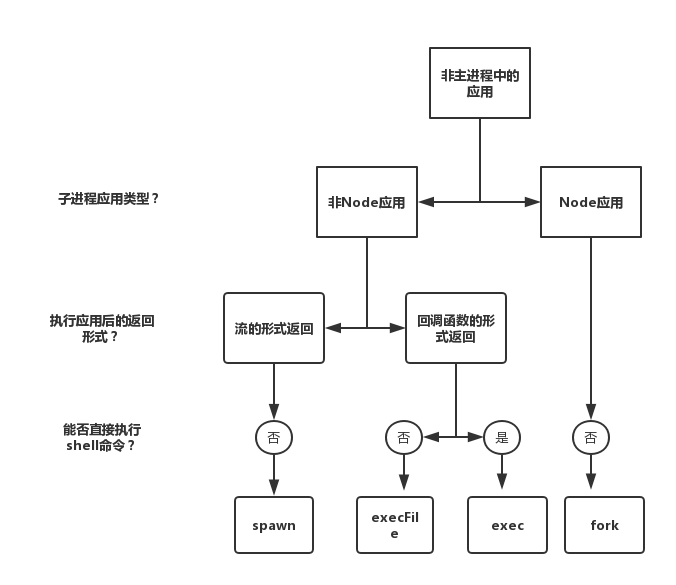

## mock数据

* 请求转发，例如`webpack devServer`
* easy-mock
* 静态资源服务器
* 抓包工具代理本地JSON文件
* 第三方模块，例如json-server
* postman

## 加密

`crypto`模块提供了加密和哈希算法。

所谓哈希算法，又称散列算法，用来把任意长度的输入变换成固定长度的输出，具有如下特点：

* 相同的输入会产生相同的输出
* 不同的输入会产生不同的输出
* 任意的输入长度会有相同的输出长度
* 无法从输出推导输入

常见的哈希算法有`md5`，`sha1`等。

例如使用`md5`对密码进行加密：

```js
const crypto = require('crypto')

// 密钥
const SECRET_KEY = 'Sh1bG0jk_ds3V#'

// md5
const md5 = content => {
  const md5 = crypto.createHash('md5')
  return md5.update(content).digest('hex')
}

const genPassword = password => {
  const pwStr = `password=${password}&key=${SECRET_KEY}`
  return md5(pwStr)
}

module.exports = {
  genPassword
}
```

加密算法实际上分为对称加密和非对称加密，具体区别如下：

* 对称加密：加密和解密使用同一个密钥
* 非对称加密：有两个密钥，分别是公钥和私钥。如果用公钥对数据进行加密，只有用对应的私钥才能解密,如果私钥加密，只能公钥解密 

## 编码

### 字节

8bit（位）等于1byte（字节）。

### ASCII

起初，计算机只在美国使用。而8位的字节可以组合出256种状态，其中0~32规定了特殊用途。例如：

* 0x10：终端会换行
* 0x07：终端会发出声音

而后面连续的状态分别用来表示空格、标点符号、数字以及大小写字母，一直编到127号。这样就可以用来表示英文单词和句子了。

这128个符号其实只占用了8位的后7位，最前面1位规定为0。这种编码称为ASCII编码。

### GB2312

但是像非英文为母语的国家，在ASCII编码中就无法表示。因此，不同的国家会继续使用127号之后的编号来表示他们的自然语言，一直到255。

而中国为了表示汉字，把127号之后的符号取消了，具体如下：

* 一个小于127的字符的意义与原来相同，但两个大于 127 的字符连在一起时，就表示一个汉字
* 前面的一个字节（高字节）从`0xA1`用到`0xF7`，后面一个字节（低字节）从 `0xA1` 到 `0xFE`
* 把数学符号、日文假名和ASCII里原来就有的数字、标点和字母都重新编成两个字长的编码。这就是全角字符，127以下那些就叫半角字符

这种编码方案称为GB2312，是对ASCII的一种扩展。

### GBK

为了继续表示繁体字，而原先的GB2312编码方案容量不够，因此对其进行了修改。不再要求低字节一定是127号之后的内码，只要第一个字节是大于127就固定表示这是一个汉字的开始。这种编码方案称为GBK。

### Unicode

后来，每个国家都有自己的一套基于ASCII的扩展编码，并且互不支持。于是，国际化标准组织重新规定一套编码方案——Unicode，它囊括了地球上所有语言符号。

规范中使用16位两个字节来统一表示所有的字符，对于ASCII里的那些半角字符，Unicode保持编码不变，只是长度由原来的8位变为16位。而其他语言符号全部重新编码。

> 如果需要用到非常偏僻的字符，Unicode就需要用到4个字节。

### UTF-8

实际上，Unicode在很长一段时间上无法推广。这是因为虽然统一成了Unicode编码，乱码问题解决了，但是Unicode编码比ASCII编码需要多一倍的存储空间，在存储和传输上十分不划算。

直到互联网的出现，为了解决Unicode编码传输问题，面向传输的UTF-8标准出现了。UTF-8编码把一个Unicode字符根据不同的数字大小编码成1-6个字节，常用的英文字母被编码成1个字节，汉字通常是3个字节，只有很生僻的字符才会被编码成4-6个字节。如果你要传输的文本包含大量英文字符，用UTF-8编码就能节省空间。

* UTF-8是使用最广的一种Unicode实现方式
* UTF-8是每次以8位作为单位进行传输，而UTF-16就是每次16位
* Unicode中一个中文字符占两个字节，UTF-8一个中文字符占3个字符

因此，在计算机内存中，统一使用Unicode编码，当需要保存到硬盘或者需要传输的时候，就需要转换为UTF-8编码。

## 登录/注册

http是无状态协议，所以要通过一些手段来判断用户身份。

### cookie和session

cookie是由服务器端生成，发送给浏览器，浏览器会自动将cookie以key-value的形式保存到某个文件内。下次再次请求该网站时，会自动将这段cookie添加到请求头中发送给服务器。

cookie具有如下特点：

* 时间限制：服务器可以通过设置`expires`或`max-age`来设置过期时间，不设置的话默认是临时存储，关闭浏览器就消失
* 同源策略：也就是跨域不共享，每次请求只会把请求域的cookie发送给出去
* 容量限制：cookie有个数和大小的限制，大小一般是4kb，而个数不同浏览器有所不同
* 安全限制：默认浏览器端是可以通过`document.cookie`去修改cookie，所以敏感数据不要存在在cookie中。当然你也可以通过设置`http-only`来限制客户端修改cookie

```js
document.cookie = 'k1=10;'		// 会进行累加
```

当使用cookie做登录验证时，由于用户信息是敏感数据，所以你需要在cookie中存储一个无关用户信息的sessionID，然后再到服务器端做验证。

```js
const express = require("express");
const path = require("path");
const bodyParser = require("body-parser");
const cookieParser = require("cookie-parser");

const app = express();

app.use(express.static(path.join(__dirname, "./public")));
app.use(bodyParser.urlencoded({ extended: true }));
app.use(cookieParser());

/**
 * 模拟已经注册的用户，一般来说是要存在数据库中
 */
const userList = [
  {
    username: "ugu",
    password: "123"
  },
  {
    username: "admin",
    password: "234"
  }
];

// 记录sessonId和用户的对应关系，一般来说是要存在redis中
const session = {};

app.post("/api/login", (req, res) => {
  const { username, password } = req.body;
  const user = userList.find(
    user => user.username === username && user.password === password
  );
  if (user) {
    // 登录时要给定会话ID，并且绑定用户
    const sessionId = Math.random() + Date.now();
    session[sessionId] = {
      user
    };
    res.cookie("SESSON_ID", sessionId, { httpOnly: true });
    res.json({
      code: 0,
      msg: ""
    });
  } else {
    res.json({
      code: -1,
      msg: "用户不存在"
    });
  }
});

app.listen(3000);

```

注意：客户端进行登录时要使用`encodeURIComponent`对中文进行编码。另外，对客户端密码加密可以使用`cryto-js`库。

### JWT

```js
const jwt = require('jsonwebtoken')

token = jwt.sign({name: 'ugu'}, 'secret')	// 签名

jwt.verify(token, 'secret')					// 验证
```

### oAuth2

### 总结

* 相较于jwt，cookie/session的形式的优势在于sesson保存在服务器相对安全，并且可以主动请求session。而jwt令牌是存储在客户端，只要没过期就可以一直使用
* 但是cookie/session在跨域场景下表现并不好，因为cookie不可跨域，默认只有domain域名下生效。并且查询session信息可能会有数据库操作，会有一点性能损耗

## 爬虫

### 反爬虫

* User-Agent，Referer，验证码
* 单位时间访问次数，访问量
* 关键信息图片混淆
* 异步加载

## 缓存

缓存分为强缓存和协商缓存，两者的主要区别是使用本地缓存的时候，是否需要向服务器验证本地缓存是否依旧有效。顾名思义，协商缓存，就是需要和服务器进行协商，最终确定是否使用本地缓存。 

### 意义

* 减轻服务器压力
* 减少HTTP请求
* 用户体验更佳

### 强缓存

通过HTTP头信息`Cache-Control`和`Expires`来设置。其中`Expires`属于`HTTP1.0`标准下的字段，这里不做介绍。

通过设置`Cache-Control`的值为`public, max-age=1000`，表示内容在1000s之内再次访问该内容均使用缓存，不必再发送请求。

除了`public`这个`Cache-Control`指令之外，还有如下指令：

* `no-cache`：缓存前必须确认其有效性

* `no-store`：任何内容不可以缓存
* `private`： 仅仅客户端单个用户可以缓存，不能作为共享缓存
* `public`：客户端和代理服务器等任何对象都可以缓存

### 协商缓存

对于上面的强制缓存，如果缓存过期，就会重新将内容读取后发送给客户端，并更新过期时间。这就带来一个缺点——如果内容没有改变，实际上没必要重新将内容再次读取后发送，你只需要询问服务器内容是否过期，如果内容没过期那么就可以直接使用缓存；如果过期，那么就会重新读取内容返回给客户端，并且替换原来的缓存。

> 如果仅仅是缓存过期了，那么并不意味着原始服务器上的内容一定相较于缓存内容有变动，这只是意味着要进行核对缓存时间。

通过HTTP头信息`ETag`和`Last-Modified`两个字段控制协商缓存。

其中服务器设置`Last-Modified`响应头标识内容最后修改时间，客户端设置请求头` If-Modified-Since `，它的值等于上一次请求的`Last-modified`。服务器会比较两者时间差别。如果一致，则返回304，表示可以继续使用缓存；如果不一致，那么就会重新读取内容返回给客户端，并且替换原有的缓存。

这种方式有一个缺点：`Last-Modified`只能精确到秒，也就是如果1s之内内容改变，无法生效。于是就有了`ETag`响应头，它可以理解未内容的唯一ID，客户端每次请求也会设置`If-None-Match`。 服务器收到浏览器的If-Modified-Since和Etag，发现有If-None-Match，则比较 If-None-Match 和 a.js 的 Etag 值，忽略If-Modified-Since的比较。 如果两者一致，则返回304，表示可以继续使用缓存，否则和`Last-Modified`一样会返回新的缓存，并更新原有缓存。

 协商缓存最大的问题就是每次都要向服务器验证一下缓存的有效性，似乎看起来很省事，不管那么多，你都要问一下我是否有效。但是，每次都要请求一次服务器，是否会带来性能上的问题？

### 最佳实践

对于缓存来说，如果在有效期内，服务器内容发生改变，而客户端不强制刷新的话，返回的还是旧内容。也就是说说，客户端无法主动得知服务器的上内容是否发生改变。

为了解决这个问题以及尽可能地命中强缓存，一般会在文件名后面加上hash戳。

所以，下面是一个合理的解决方案：

* html文件使用协商缓存
* css，js以及图片使用强缓存，并且使用hash

> 如果两种缓存机制同时存在，强制缓存的优先级高于协商缓存。

## 多线程

node遵循的是单线程单进程的模式，node的单线程是指js的引擎只有一个实例，且在nodejs的主线程中执行，同时node以事件驱动的方式处理IO等异步操作。node的单线程模式，只维持一个主线程，大大减少了线程间切换的开销。

但是node的单线程使得在主线程不能进行CPU密集型操作，否则会阻塞主线程。对于CPU密集型操作，在node中通过child_process可以创建独立的子进程，父子进程通过IPC通信，子进程可以是外部应用也可以是node子程序，子进程执行后可以将结果返回给父进程。

此外，node的单线程，以单一进程运行，因此无法利用多核CPU以及其他资源，为了调度多核CPU等资源，node还提供了cluster模块，利用多核CPU的资源，使得可以通过一串node子进程去处理负载任务，同时保证一定的负载均衡型。

### 单线程

提到node，你可能会想到单线程，异步io，事件驱动等。但是实际上，我们说的单线程是指node中只有一个`JavaScript`引擎在主线程上运行。其它异步`IO`和事件驱动相关的线程是通过`libuv`来实现内部的线程池和线程调度。libv中存在了一个Event Loop，通过Event Loop来切换实现类似于多线程的效果。简单的来讲Event Loop就是维持一个执行栈和一个事件队列，当前执行栈中的如果发现异步IO以及定时器等函数，就会把这些异步回调函数放入到事件队列中。当前执行栈执行完成后，从事件队列中，按照一定的顺序执行事件队列中的异步回调函数。此外回调函数执行时，同样会生成一个执行栈，在回调函数里面还有可能嵌套异步的函数，也就是说执行栈存在着嵌套。

也就是说node中的单线程是指js引擎只在唯一的主线程上运行，其他的异步操作，也是有独立的线程去执行，通过libv的Event Loop实现了类似于多线程的上下文切换以及线程池调度。线程是最小的进程，因此node也是单进程的。这样就解释了为什么node是单线程和单进程的。

### Process

全局`process`对象提供了`node.js`进程的相关信息，它有如下属性：

* `version`：版本号
* `versions`：依赖库的版本号
* `platform`：运行平台
* `pid`：进程`ID`

* `arch`：处理器架构

* `env`：操作系统环境信息

  通过`process.env.PATH`可以获取系统环境变量。

  先设置环境变量。打开终端，Windows使用set，Mac使用export。

  ```bash
  set NODE_ENV = dev
  ```

  不同的环境变量使用不同的URL。

  ```js
  let url 
  if(process.env.NODE_ENV === 'dev'){
   url = 'localhost:8080'
  }else{
   url = 'http://www.baidu.com:3000'
  }
  ```

* `argv`：命令行参数

  ```js
  const process = require('process')
  
  const { argv, argv0, execArgv, execPath } = process
  
  console.log(argv, argv0, execArgv, execPath)
  ```

  执行`node --inspect demo1.js --test a=1 b=2`命令时，输出：

  ```js
  [
    'D:\\nodejs\\node.exe',
    'E:\\demo\\node\\node_basic\\demo\\demo1.js',
    '--test',
    'a=1',
    'b=2'
  ] 						// 执行命令时传入的参数
  
  D:\nodejs\node.exe 
  
  [ '--inspect' ] 		// 调用node时传入的参数
  
  D:\nodejs\node.exe
  ```

除了上面常见的属性，还有如下方法：

* `cwd`：获取当前执行脚本的绝对路径

* `memoryUsage`：获取当前应用程序的内存信息，具体包括：

  * rss（resident set size）：所有内存占用，包括指令区和堆栈。
  * heapTotal："堆"占用的内存，包括用到的和没用到的。
  * heapUsed：用到的堆的部分。
  * external： V8 引擎内部的 C++ 对象占用的内存。

* `chdir`：改变当前工作目录

* `exit`：退出当前运行的进程

  ```js
  process.exit(0)
  ```

* `kill`：向进程发送一个信号，若是`SIGINT`信号表示程序终止信号，在用户键入`CTRL+C`发出；若是`SIGTERM`信号表示程序结束信号，通常用来要求程序自己正常退出。默认是后者。

  ```js
  process.kill(pid,[signal]);
  ```

* `uptime`：当前程序的运行时间

除了属性和方法，还有如下事件：

* `exit`事件：当进程退出时触发

  ```js
  process.on('exit', () => {
      console.log('进程退出')
  })
  
  process.exit()
  ```

* `uncaughtException`：当应用程序抛出一个未被捕获的异常会触发

  ```js
  process.on('uncaughtException', () => {
    console.log('错误了')
  })
  
  a()				// a未定义
  ```

* ` SIGINT `：当接收到信号触发

### child_process

通过`child_process`模块可以实现1个主进程，多个子进程的模式，主进程称为master进程，子进程又称工作进程。在子进程中不仅可以调用其他node程序，也可以执行非node程序以及shell命令等等，执行完子进程后，以流或者回调的形式返回。 

它有四个方法用于新建子进程：

* `spawn`
* `execFile`
* `exec`
* `fork`

下图可以诠释这四个方法的区别：



具体如下：

- `spawn`： 子进程中执行的是非node程序，提供一组参数后，执行的结果以流的形式返回

  和`execFile`不同，`spawn`的执行结果是以流的形式返回，不是一次性返回，尤其针对大批量的文件操作，这样可以明显减少内存的占用。例如：将`a.txt`内容去重再排序操作。

  ```js
  let cp=require('child_process');
  let cat=cp.spawn('cat',['a.txt']);
  let sort=cp.spawn('sort');
  let uniq=cp.spawn('uniq');
  
  cat.stdout.pipe(sort.stdin);
  sort.stdout.pipe(uniq.stdin);
  uniq.stdout.pipe(process.stdout);
  console.log(process.stdout);
  ```

- `execFile`：子进程中执行的是非node程序，提供一组参数后，执行的结果以回调的形式返回

  ```js
  const cp = require('child_process')
  
  cp.execFile('echo', ['hello'], function(err, stdout) {
    console.log(stdout)
  })
  ```

- `exec`：子进程执行的是非node程序，传入一串shell命令，执行后结果以回调的形式返回，与execFile
  不同的是exec可以直接执行一串shell命令

  ```js
  const cp = require('child_process')
  
  cp.exec('echo hello', function(err, stdout) {
    console.log(stdout)
  })
  ```

  注意：直接执行一段`shell`是不安全的，例如包含`rm -rf *`。而通过`execFile`方法对参数数组检查，如果发现可疑命令，可以抛出异常

- `fork`：子进程执行的是node程序，提供一组参数后，执行的结果以流的形式返回，与spawn不同，fork生成的子进程只能执行node应用

  在浏览器端你可以通过`web worker`来处理大量计算任务，而`fork`方法就是可以创建单独的进程去执行`node`程序，并且通过父子进程通信，将执行后的结果返回父进程。

  ```js
  // child.js
  process.on('message', msg => {
    console.log(msg)					// 接收父进程消息
    process.send('子进程消息')
  })
  
  // parent.js
  const cp = require('child_process')
  const child = cp.fork('./child')
  child.on('message', msg => {
    console.log(msg)					// 接收子进程消息
  })
  
  child.send('父进程消息')
  ```

  你可以通过`child.disconnect()`方法断开父子进程之间的`IPC`通信。

### cluster

为了利用多核CPU，允许你通过`cluster`模块来创建子进程。`cluster`意为集成，集成了两个方面，第一个方面就是集成了`child_process.fork`方法创建子进程的方式，第二个方面就是集成了根据多核CPU创建子进程后，自动控制负载均衡的方式。

下面是官网的例子：

``` js
const cluster = require('cluster');
const http = require('http');
const numCPUs = require('os').cpus().length;

if (cluster.isMaster) {
  console.log(`主进程 ${process.pid} 正在运行`);

  // 衍生工作进程。
  for (let i = 0; i < numCPUs; i++) {
    cluster.fork();
  }

  cluster.on('exit', (worker, code, signal) => {
    console.log(`工作进程 ${worker.process.pid} 已退出`);
  });
} else {
  // 工作进程可以共享任何 TCP 连接。
  // 在本例子中，共享的是一个 HTTP 服务器。
  http.createServer((req, res) => {
    res.writeHead(200);
    res.end('你好世界\n');
  }).listen(8000);

  console.log(`工作进程 ${process.pid} 已启动`);
}
```

最后输出的结果是：

```js
主进程 6156 正在运行
工作进程 14424 已启动
工作进程 14344 已启动
工作进程 14420 已启动
工作进程 14524 已启动
工作进程 14536 已启动
工作进程 2972 已启动
工作进程 14892 已启动
工作进程 13512 已启动
```

 我们将master称为主进程，而worker进程称为工作进程，利用cluster模块，使用node封装好的API、IPC通道和调度机可以非常简单的创建包括一个master进程下HTTP代理服务器 + 多个worker进程多个HTTP应用服务器的架构。 

## 进程守护

* `node index.js &`

* 通过第三方包`nohup`
* 通过第三方包`forever`
* 通过第三方包`pm2`

## PM2

pm2最大的用处是进程守护，pm2遇到进程奔溃会自动重启。原理就是遇到错误就重启。

常用命令如下：

* pm2 start：启动应用（可以加参数）
* pm2 list：列出当前运行的所有应用
* pm2 stop id：停止某个应用
* pm2 stop all：停止所有应用
* pm2 restart id：重启应用
* pm2 restart all：重启所有应用
* pm2 info id/appname：查看具体信息
* pm2 log id/appname：查看日志
* pm2 monit appname/id：查看监控信息
* pm2 show id/appname：查看具体信息

注意：PM2会自动将`console.log`和`console.error`的内容写入app-out.log和app-in.log文件中。通过pm2 log可以查看具体log信息。

当然，你也可以通过`pm2 start pm2.conf.json`来指定配置文件来启动。

```json
// pm2.conf.json
{
    "apps": {
        "name": "node-blog",		
        "script": "app.js",							// 一般是bin/www
        "watch": true,								// 文件变动自动重启
        "ignore_watch": {							// 忽略的文件
            "node_modules",
            "logs"
        },
        “instances”: 4,								// 设置进程数
        "error_file": "logs/err.log",				// 错误日志 console.error
        "out_file": "logs/out.log",					// 自定义日志 console.log
        "log_date-format": "YYYY-MM-DD HH:mm:ss",	// 输出时间，
        "exec_mode": "cluster",						// 执行模式为cluster
    },
    
}
```

配置文件可以是YAML或者JSON格式。

## 部署上线

### 服务器

服务器就是一台带有外网的电脑，你可以通过`ssh root@公网ip`来登录远程服务器，或者通过SSH客户端（类似xshell）来登录。

当然，还是更建议配置私钥验证，来进行SSH无密码登录。

```bash
# vim /etc/ssh/sshd_config
PasswordAuthentication yes		# 关闭密码登录，有了密钥匹配就不需要密码登录了
```

另外，为了安全起见，你应该禁用root账户以及关闭SSH的默认端口。所以，你需要做如下步骤

* 增加用户，并配置权限。并且关闭root登录

  ```bash
  # vim /etc/ssh/sshd_config
  PermitRootLogin no				# 关闭root登录
  ```

* 修改SSH的默认端口22。端口范围是0~65535，前1023端口为系统端口，不建议使用。

  配置结束后，需要使用`systemctl restart sshd.service`重启SSH服务
  
* 关闭服务器除了80之外的端口，使用Nginx转发部署其他端口的Node应用

> centos7下是使用systemctl来启动服务，而不是通过之前版本的service。

### 环境准备

通过SSH进入远程服务器，首先`sudo yum update && sudo yum upgrade`来更新升级系统。

接着就需要配置软件防火墙`iptables`，并配置开机启动。

> 注意：CentOS7下默认的是firewall防火墙，如果使用iptables，为了防止冲突，你需要禁止firewall启动。

### 软件准备

* nvm
* node
* nginx（http和https）
* 数据库
* docker

对于数据库来说，为了安全起见，建议关闭默认端口和管理员账户，并且要做数据备份。

> centos7默认使用mariadb数据库。

## 持续集成

免费的持续集成工具：

* travis ci
* Jenkins
* gitlab ci

当然，你也可以实现`github`的`webhook`自己的`CI/CD`工具。

## 服务监控

服务的性能分为两部分：服务的吞吐量和服务对资源的占用量。

其中，服务器的资源主要包括CPU、内存、磁盘和网络等，其中CPU和内存的信息可以直接通过process对象来获取

```js
let previousCpuUsage = process.cpuUsage()			//记录上一次的usage
let previousHrTime = process.hrtime()				//记录上一次hrtime
setInterval(() => {									// 定时采集
    const currentCpuUsage = process.cpuUsage(previousCpuUsage)	// 根据上次信息采集本次
    const currentHrTime = process.hrtime(previousHrTime)		// 得到本次的hrtime
    const duration = currentHrTime[0]*1e6 + currentHrTime[1] / 1e3	// 根据hrtime计算时间
    previousTime = currentHrTime				// 保存本地hrtime
    previousCpuUsage = currentCpuUsage			// 保存本次usage
    const cpuPercent = {
        user: currentCpuUsage.user / duration,		// CPU用户资源占比
        system: currentCpuUsage.system / duration	// CPU系统资源占比
    }
    console.log(cpuPercent)
}, 1000)
```

上面代理每秒定时采集CPU的相关数据，但是由于JavaScript中的定时器是基于回调队列实现的，回调函数并非准确地每秒执行一次。

实际上，你可以通过操作系统提供的shell命令来更准确的获取CPU性能数据。当然，可以使用第三方模块——`pidusage`。

注意：采样频率一般为1s一次，如果频率过高，会响应服务的性能；过低，则不准确。

### HTTP服务

HTTP服务采用 QPS和TPS来衡量服务的性能，具体如下：

* QPS：查询量/秒，是对一个特定的查询服务在规定时间内所处理流量多少的衡量标准
* TPS：事务/秒，一个事务是指客户端向服务器发起请求后服务器做出反应的过程 

我们会将采样的数据通过Kafka消息队列上报到Influxdb（分布式时序数据库）中存储，最后通过Grafana可视化图标展示出来。

### 日志分析系统

我们一般是将日志记录在服务器，而服务器资源是由运维掌握，开发人员无法进入。另外，直接通过shell命令检索数据效率不是很高，因此就需要一个日志分析系统。

ELK（Elasticsearch Logstash Kibana）是开源免费的日志管理系统，它基于：

* Elasticsearch：开源分布式搜索引擎
* Logstash：用来处理日志的搜索，分析和过滤等操作
* Kibana：提供一个Web页面供用户操作

> 当然，你也可以通过Filebeat来采集日志，相较于Logstash，Filebbeat对服务器的资源占用量更低。

### 监控云服务

我们将采集到的Node.js性能指标数据输入特定的系统进行分析，而搭建这样一个系统需要一定成本，所以PM2官方提供了一个Keymetrics来进行性能数据的分析和展示。

具体使用看官网。

## 内网穿透

* 花生壳
* ngrok

## Node调试

### vscode调试

直接打断点，然后按下`f5`进行调试。

```js
const http = require("http");

const add = (a, b) => {
  return a + b;
};

const server = http.createServer((req, res) => {
  const result = add(1, 2);
  console.log(result);			// 这里断点
  res.end(result.toString());
});

server.listen(3000);
```

之后，便可以在浏览器中请求`localhost:3000`来进行调试了。当然你也可以在调试控制台输出你想要查看的变量信息或者鼠标悬浮进行查看。

调试原理是基于websocket服务，详细过程请查看这篇[文章]( https://fed.taobao.org/blog/2019/08/15/vscode-debug-source-analyse/ )。

### 命令行调试

你也可以直接通过`node --inspect index.js`命令来进行调试，Chrome开发者工具会自动捕获到。当然你也可以手动通过`DevTools`上的绿色小圈或者` chrome://inspect/#devices `来捕获调试。

注意：建议开启http服务来调试，否则同步代码执行完就直接结束了。或者通过`--inspect-brk`从第一行就进行调试。

> 其实，你还可以通过源信息复制` devtoolsFrontendUrl`属性值直接复制到浏览器地址栏进行调试。而源信息需要从你开启的ws（websocket）服务中获取，即将`ws://127.0.0.1:9229/5202260b-d27d-4ddc-8cf9-81c1ad74823f`写成`127.0.0.1:9229/json`，然后复制到浏览器地址栏进行获取。

另外，通过Chrome调试的好处是有有Profile面板，可以查看任务运行时间，便于性能优化。

关于调试相关的其他命令行参数如下：

* `--inspect=[host:port]`：指定主机和端口
* `--inspect-brk`：某些情况下，JavaScript代码运行非常快，快到调试功能还没有附加到，所以使用该参数在第一行打断点
* `--inspect-brk=[host:port]`
* `inspect`：`node inspect index.js`直接在命令行中调试，不建议使用

> 更多调试技巧查看Node.js官网。
>

## ServerLess

云计算的发展从基础架构即服务（Infrastructure as a Service， IaaS），平台即服务（Platform as a Service，PaaS），软件即服务（Software as a Service，SaaS），慢慢开始演变到函数即服务（Function as a Service，FaaS）以及后台即服务（Backend as a Service，BaaS），Serverless 无服务化。 

目前业界的各类 Serverless 实现按功能而言，主要为应用服务提供了两个方面的支持：函数即服务（Function as a Service，FaaS）以及后台即服务（Backend as a Service，BaaS）。 

FaaS（Function-as-a-Service）即为函数运行平台，用户无需搭建庞大的服务系统，只需要上传自己的逻辑函数如一些定时任务、数据处理任务等到云函数平台，配置执行条件触发器、路由等等，完成基础函数的注册。

BaaS（Backend-as-a-Service）包含了后端服务组件，它是基于 API 的第三方服务，用于实现应用程序中的核心功能，包含常用的数据库、对象存储、消息队列、日志服务等等。

* lean cloud
* AWS Lamada