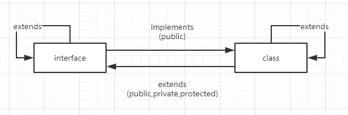

## 编程语言

按照强弱类型可以将编程语言分为：

* 强类型：不允许改变变量的数据类型，除非进行强制类型转换

* 弱类型：变量可以被赋予不同的数据类型

按照静态类型可以将编程语言分为：

* 静态语言：在编译阶段确定所有变量的类型
* 动态语言：在执行阶段确定所有变量的类型

而相较于`JavaScript`这种动态弱类型语言，`TypeScript`具有如下优点：

* 类型约束，让代码易于维护和调试
* 模块，命名空间和面向对象的全面支持，更容易组织代码开发复杂程序
* 在编译阶段检查类型错误

虽然它是一门新的语言，但是它可以：

* 与现存`JavaScript`代码兼容
* 生成`JavaScript`代码，没有运行时开销
* 遵循未来的`ES`规范

## 命令行工具

首先通过`npm i -g typescript`全局安装`typescript`，然后就可以通过`tsc --watch`来监听`.ts`文件变化，实现自动编译。

除了`--watch`参数，`tsc`还有如下参数：

* `--watch`或`-w`：监听编译
* `--version`或`-v`：查看编译器的版本
* `--target=""`：指定编译的`ES`版本，默认是`ES3`
* `--strict`：启用所有严格类型检查
* `--sourceMap`：生成对应的`.map`文件
* `--outFile`：输出到单个文件
* `--outDir`：输出到目录
* `--module`或`-m`：指定使用哪种模块标准来输出代码
* `--lib`：要包含在编译中的库文件列表，比如`Promise`
* `--jsx`：在`.tsx`中支持`JSX`

* `tsc *.ts`：编译所有`ts`文件
* `tsc a.ts b.ts`：同时编译多个`ts`文件

> 注意：通过`tsc`命令直接编译`ts`文件会默认生成`ES3`代码，而通过配置文件编译`ts`文件会默认生成`ES5`代码。

## 配置文件

通过`npx tsc --init`可以生成`TypeScript`配置文件`tsconfig.json`，该文件的使用规则如下：

* 如果直接运行`tsc`，此时编译器会从目录开始搜索该配置文件
* 如果直接运行`tsc -p folder`，folder目录下必须存在该配置文件
* 如果直接运行`tsc index.ts`，编译器将忽略该配置文件

## 声明文件

编译`ts`文件加上`-d`选项，用于生成声明文件，该文件记录了原来`ts`文件中所有声明。

> 编辑器是通过声明文件来进行代码提示的。

对于第三方库，你需要安装对应的声明文件包。如果没有对应的声明文件包，你就需要手动编写声明文件。

## 类型注解

`ts`中的类型注解是一种轻量级的为函数或变量添加约束的方式。

```typescript
const sayMsg = (msg: string) => console.log(msg)

sayMsg(1)
```

这样在`tsc`执行编译的时候会报错。

> 注意：尽管会报错，但是还是会生成`JavaScript`文件，只是用来提示你的代码可能不会按照预期执行。

## 基础类型

### 定义变量

使用let来定义变量，使用const来定义常量。

```typescript
let d = new Demo()

const PI = 123
```

当然你也可以使用var关键字来定义变量，但是不建议。

### 声明类型

通过`:`来对声明的变量进行类型描述。

```typescript
let a: string = '123'
```

变量类型可以是：

* number

  ```typescript
  let a:number = 1
  let b:number = 2.1	
  ```

* string

* `type[]`或`Array<type>`

  ```typescript
  const a: number[] = new Array(10)
  const b: Array<number> = [1, 2]				// 数组泛型定义方式
  const c: boolean[] = new Array(true, false, false)
  
  interface NumberArray {
      [index: number]: number
  }
  const f: NumberArray = [1, 2, 3]			// 用接口表示数组
  /*
  	类数组都有自己的接口定义，如IArguments,NodeList,HTMLCollectio等
  */
  ```

* boolean

* tuple（元组类型）

  元组是一种特殊的数组，它限定了元素的个数和数据类型。

  ```typescript
  let x: [string, number] = ['hi', 1]		// 类型要对应一致
  let y: [string, number]					// 单独赋值
  y[0] = 'hi'
  y[1] = 12
  
  x.push(true)					// 不会报错
  x[2]							// 报错，虽然允许超出个数限制，但是不建议这样做，因为获取的时候就会报错
  ```

* any（任意类型）

  如果在变量声明中不指定任何类型，那么就是any类型。当然你也可以手动声明any类型。

  ```typescript
  let a: any = 1
  a = '1'						// 不会报错
  
  let a: string | number;		// 联合类型
  a = '1'
  a = 1
  console.log(a)				// 1
  /*
  	1. 如果数据类型不止一种，不推荐使用any，而是使用联合类型
  	2. any没有语法提示
  	3. 联合类型的变量只能访问它们共有的属性或方法
  */
  ```

* void（空类型）

  ```typescript
  let a: void = null	// 声明一个void的类型没有意义，因为你只能赋值成undefind或null
  ```

* undefined和null

  ```typescript
  const a: undefined = undefined		// 声明为undefined的变量无法赋值其它类型，只能是其自身
  const a: null = null		// null，只能是其自身
  ```

  默认情况下，`null`和`undefined`是其它类型的子类型，可以赋值给其它类型。但是如果你开启了`strictNullChecks`，那么就无法赋值。除非你使用联合类型，才能通过类型检查：

  ```tsx
  const a: number | undefined | null = null
  ```

* enum（枚举类型）

  ```typescript
  enum SEASON {
    SPR,
    SUM,
    AUT,
    WIN
  };
  
  console.log(SEASON.SPR);					// 1
  
  // 你还可以设置初始值
  enum SEASON {
    SPR=2,
    SUM,
    AUT,
    WIN
  }
  
  console.log(SEASON.SPR, SEASON.AUT);		// 2 4
  
  // 字符串枚举
  enum Messag {
      Success = '成功',
      fail = '失败'
  }
  
  Message.Success = '成功了'		// 报错，枚举类型定义后是不能修改的
  
  // 异构枚举，字符串和数字混合，不建议使用
  enum Answer {
      N,
      Y = 'yes'
  }
  
  /*
  	1. 枚举类型的变量一般是大写
  	2. 结果一般也用大写，用逗号隔开
  	3. 可以自定义赋值，默认是0
  */
  
  ```

  > 对于角色判断的场景，可以使用枚举类型。

  枚举类型分为常量枚举和计算枚举：

  ```tsx
  enum Demo {
      // 常量枚举
      a,
      b = 1+3,
      // 计算枚举
      c = '123'.lenght
  }
  ```

  常量枚举会在编译阶段就执行，而计算枚举会被保留到运行时计算。

  当然，你也可以通过`const`来声明常量枚举：

  ```tsx
  const enum Demo {
      A,
      B
  }
  ```

  常量枚举会减少运行时代码。

  当然，枚举成员和枚举类型都可以作为类型：

  ```tsx
  // 枚举类型作为类型
  enum CHOOSE { WIFE = 2, MOTHER = 3 }
  
  function question(choose: CHOOSE): void {
    console.log(choose)
  }
  
  question(CHOOSE.WIFE)						// 2
  
  // 枚举成员作为类型
  enum E { a=1 }
  enum F { a=1 }
  
  const v1:E.a = 2
  const v2:F.a = 2
  console.log(v1 === v2)			// 报错
  ```

  注意：不同枚举类型是不能进行比较的

* never

  never表示永远不会有返回值的类型，例如死循环和抛出异常
  
  ```typescript
  function err(msg: string): never {
      throw new Error(msg)
  }
  /*
  	1. never类型表示那些永不存在的值的类型，例如总是会抛出异常
  	或根本就不会有返回值的函数表达式或箭头函数表达式的返回值类型
  	2. never类型是任何类型的子类型，可以赋值给任何类型。但是没有
  	类型是never的子类型或可以赋值给never类型（除了自身），即使是any类型
  */
  ```
  
* symbol

  ```js
  const s1: symbol = Symbol()
  ```

如果省略类型声明，TypeScript会从代码中自动推断出来。

### 类型转换

```typescript
let a: any = 1;
let b: string = <string>a;

console.log(b)

// 第二种写法
let msg: any = '123';
let len: number = (msg as string).length;
console.log(len)
```

转换的前提是待转换的变量是any类型。 

前面提到，当使用联合类型的时候，只能访问它们共有的属性或方法。

```typescript
function demo(v: number | string): number {
  return v.length						// 报错
}

// 将变量断言成string后类型后
function demo(v: number | string): number {
  if(<string>v.length) {
      return v.length
  }
  return v.toString().length
}
```

注意：当你在TypeScript里使用JSX时，只有as语法断言才被允许。

### 变量解构

```typescript
let [a,b] = [1,2]
console.log(a, b)			// 1 2

let [, , b] = [1,2,3]		
console.log(b)				// 3

let [a, ...b] = [1, 2, 3]
console.log(a, b)			// 1 [2, 3]

let {a, ...b} = {a: '1', b: '2', c: '3'}
console.log(a, b)			// '1' {b: '2', c: '3'}

let {a: x, ...b} = {a: '1', b: '2', c: '3'}
console.log(x, b)			// '1' {b: '2', c: '3'}
```

你还可以放到函数中去，当做函数的默认值：

```typescript
function fn({a: x, ...b} = {a: '1', b: '2', c: '3'}) {
	console.log(x)
    console.log(b)
}
```

或者调用的时候再传参：

```typescript
function fn({a: x, ...b}) {
	console.log(x)
    console.log(b)
}

fn({a: '1', b: '2', c: '3'})
```

### 类型别名

类型别名用来给一个类型起个新名字。

```typescript
type Name = string;
type NameResolver = () => string;
type NameOrResolver = Name | NameResolver;
function getName(n: NameOrResolver): Name {
    if (typeof n === 'string') {
        return n;
    } else {
        return n();
    }
}
```

### 字符串字面量类型

字符串字面量类型用来约束取值只能是某几个字符串中的一个。

```typescript
type EventNames = 'click' | 'scroll' | 'mousemove';
function handleEvent(ele: Element, event: EventNames) {
    // do something
}

handleEvent(document.getElementById('hello'), 'scroll');  	// ok
handleEvent(document.getElementById('world'), 'dbclick'); 	// 报错
```

### 声明合并

如果定义了两个相同名字的函数、接口或类，那么它们会合并成一个类型：

```typescript
// 函数合并
function reverse(x: number): number;
function reverse(x: string): string;
function reverse(x: number | string): number | string {
    if (typeof x === 'number') {
        return Number(x.toString().split('').reverse().join(''));
    } else if (typeof x === 'string') {
        return x.split('').reverse().join('');
    }
}

// 接口合并
interface Alarm {
    price: number;
}
interface Alarm {
    weight: number;
}
```

注意：合并的属性的类型必须是唯一的，重复并不会报错。

## 函数定义

返回值可有可无，若没有，返回类型为void。

```typescript
function add(a: number, b: number): number {
    return a+b
}

add(1, 2)			// 参数个数和类型必须一致，否则报错

function add(a: number, b?:number): number {
  if(b) {
      return a+b
  }
    return a
}

add(1)				// 可选参数，可选参数必须在必选参数之后

function add(a: number, b:number = 0): number {
  if(b) {
      return a+b
  }
    return a
}

add(1)				// 默认参数


function add(...foo: number[]): number {
  let sum: number = 0;
  
  foo.forEach((ele: number) => sum += ele)

  return sum
}

add(1, 2, 3, 4)		// 剩余参数


const add = function(a: number, b: number): number {
    return a+b
}

add(1, 2)			// 函数表达式定义

const add = (a: number, b: number): number => a+b

add(1, 2)			// 箭头函数，多用于回调函数中

const add: (n1: number, n2: number) = function(n1: number, n2: number): number {
    return n1 + n2
}

add()				// 匿名函数赋值给add变量，并且添加类型说明符

const add: (n1: number, n2: number) = (n1: number, n2: number): number => n1 + n2

add()				// 箭头函数赋值给add变量，并且添加类型说明符

let compute = (x: number, y: number) => number		// 先定义
compute = (a,b) => a+b								// 后实现，参数名可以不一样
```

通过接口以及类型别名同样可以定义函数类型。

```tsx
const add: (x: number, y: number) => number

interface Add {
    (x: number,y:number): number
}

type Add = (x: number, y: number) => number

// 三者等价
```

当然ts还支持函数重载。

```tsx
function add(...rest: number[]): number			// 容易匹配的类型写在前面
function add(...rest: string[]): string
function add(...rest: any[]): any {
    if(typeof rest[0] === 'string') {
        return rest.join(' ')
    }
    if(typeof rest[0] === 'number') {
        return rest.reduce((pre, cur) => pre + cur)
    }
}
```

## 面向对象

### 类

类是对属性和方法的封装，在类中有一个特殊的方法：构造函数。它是对类中分装的属性进行赋值的。

```typescript
class Person {
  name: string
  age: number

  constructor(name: string) {
    this.name = name;
  }

  sayName(): void {
    console.log(this.name)
  }
}

const a: Person = new Person('ugu')
a.sayName()
```

对于对象字面量，你可以这样定义：

```js
const obj: {x: number} = {x:1}
```

### 抽象类

抽象类做为其它派生类的基类使用，它们一般不能直接被实例化，不同于接口，抽象类可以包含成员的实现细节，`abstract`关键字是用于定义抽象类和在抽象类内部定义抽象方法。

```typescript
abstract class Animal {
    abstract makeSound(): void;
    move(): void {
        console.log('roaming the earch...');
    }
}
```

抽象类中的抽象方法不包含具体实现并且必须在派生类中实现，抽象方法的语法与接口方法相似，两者都是定义方法签名但不包含方法体，然而，抽象方法必须包含 `abstract`关键字并且可以包含访问修饰符。

### 访问修饰符

如果希望对类中的属性和方法对外进行访问限制，此时需要借助访问修饰符。

* public：公有修饰符，可以在类内或者类外使用public修饰的属性或者行为，默认修饰符
* protected：受保护的修饰符，可以本类和子类中使用protected修饰的属性和行为，不能在实例中访问
* private：私有修饰符，只可以在类内使用private修饰的属性和行为，类的实例和字类无法访问

> * 构造函数也可以加上`private`，表示该类不能被实例化也不能被继承
> * 构造函数也可以加上`protected`，表示该类只能作为基类被继承，不能被实例化

```typescript
class Person {
  private name: string
  protected age: number
  public isMan: boolean

  constructor(name: string, age: number, isMan: boolean) {
    this.name = name;
    this.age = age
    this.isMan = isMan
  }

  sayName(): void {
    console.log(this.name)
  }
}

const a: Person = new Person('ugu', 20, true)
console.log(a.name)					// 报错
console.log(a.age)					// 报错
console.log(a.isMan)				// 正确

// 当使用private时，可以使用参数属性来简化初始化操作
class Person {
  constructor(private name: string) {}
  /*
  	等价于
  	private name: string
  	constructor(name: string) {
  		this.name = name
  	}
  */

  sayName(): void {
    console.log(this.name)
  }
}

const p: Person = new Person('ugu')
p.sayName()

// getter和setter
class Person {
  private _name: string

  constructor(name: string) {
    this._name = name;
  }

  public get name(): string {
    return this._name
  }

  public set name(newName: string) {
    this._name = newName;
  }
}

const a: Person = new Person('ugu')

console.log(a.name)				// 'ugu'
a.name = 'hello'					
console.log(a.name)				// 'hello'
/*
	编译的时候可能会报错，可以指定编译到较高版本
	tsc demo.ts -t es5
*/

// 只读属性修饰符
class Person {
  readonly name: string = 'ugu'

  constructor(name: string) {
    this.name = name;
  }
}

const a: Person = new Person('hi');
console.log(a.name)					// 'hi'
a.name = 'world'					// 报错

interface Person {
    readonly name: string;
}
/*
	1. 修饰的属性只能在声明的时候赋值，或者在构造函数中赋值
	2. 只读修饰符还可以修饰接口
*/
```

通过`readonly`修饰的属性不能够被修改，并且定义的时候就要初始化。

```tsx
class Person { 
    readonly name = 'ugu'

    age: number
    constructor(age: number) { 
        this.age = age
    }
}

const p = new Person(1)
console.log(p.name)			// 'ugu'
```

除了类成员可以添加修饰符之外，构造函数的参数也可以添加修饰符，这样可以省略定义。

```tsx
class Person { 
    constructor(public age: number) { 
    }
}

const p = new Person(1)
console.log(p.age)

// 等价于
class Person { 
    public age: number
    constructor(age: number) { 
    	this.age = age
    }
}

const p = new Person(1)
console.log(p.age)
```

### static修饰符

当程序运行时，系统会在内存中开辟一块空间分配给这个程序，然后将这块空间划分成常量区，全局静态区，栈区，堆区。

- 常量区，存储常量和程序转变成的二进制数据
- 全局静态区，存储全局变量和静态变量
- 栈区，存储局部变量
- 堆区，存储对象

这些区在分配和回收上不同：

- 常量区，有系统分配，程序结束之后回收
- 全局静态区，当创建一个全局变量或者 static 变量，系统会在全局静态区为其开辟一块空间，该空间直到程序结束之后回收
- 栈区，当调用函数时，会在栈区为函数中的局部变量开辟一块空间，当函数调用结束之后，该空间被销毁
- 堆区，程序员通过 new 关键字创建对象，然后在堆区为该对象开辟空间，最后由程序员手动释放

因此，static修饰的变量存储在全局静态区，一旦创建就一直存在知道程序调用结束。

通过static修饰的属性和方法，称为静态属性和静态方法（或者类属性或类方法）。静态属性和静态方法可以直接通过类名访问。

```typescript
class Person {
  static msg: string = 'hello world'
}

console.log(Person.msg);
```

static 修饰符在开发中主要用于：

- 工具类的封装
- 项目数据的封装
- 单例设计模式

### 继承

继承就是用来扩展已有的类，它允许创建一个类的子类，从已有的类上继承所有的属性和方法，并且子类可以包含父类中没有的属性和方法。

```typescript
class Person {
  name: string;
  age: number;

  constructor(name: string, age: number) {
    this.name = name
    this.age = age
  }

  sayName(): void {
    console.log(this.name);
  }
}

class Student extends Person {
  email: string;

  constructor(name: string, age: number, email: string) {
    super(name, age);
    this.email = email;
  }

  sayEmail(): void {
    console.log(this.email);
  }
}

const s: Student = new Student('ugu', 20, 'yinyun957@gmail.com');
s.sayName();			// 'ugu'
s.sayEmail();			// 'yinyun957@gmail.com'


// case2
class Person {
  name: string;
  age: number;

  constructor(name: string, age: number) {
    this.name = name
    this.age = age
  }

  sayName(): void {
    console.log(this.name);
  }
}

class Student extends Person {
  email: string = 'yinyun957@gmail.com';
  // 默认已经实现了constructor
  sayEmail(): void {
    console.log(this.email);
  }
}

const s: Student = new Student('ugu', 20);
s.sayName();
s.sayEmail();
```

TypeScript不支持多重继承。

### 重写

```typescript
class Person {
  name: string;
  age: number;

  constructor(name: string, age: number) {
    this.name = name
    this.age = age
  }

  sayName(): void {
    console.log(this.name);
  }
}

class Student extends Person {
  email: string;

  constructor(name: string, age: number, email: string) {
    super(name, age);
    this.email = email;
  }
  // 重写sayName方法
  sayName(): void {								
    super.sayName();							// 调用父类的方法，可以不调用 
    console.log(this.name, 'class Student');
  }
}

const s: Student = new Student('ugu', 20, 'yinyun957@gmail.com');
s.sayName();
```

### 接口

接口的作用就是去描述结构的形态，用关键字interface定义。

```typescript
interface Point {
  x: number;
  y?: number;				// 可选
}

let pt: Point = {
  x: 1,
  y: 1
}

console.log(pt)					// {x: 1, y: 1}

// 或者使用类型断言，明确告诉编译器知道变量类型
let pt = {
    x: 1,
    y: 1
} as Point

// 或者第二种方式类型断言,建议使用这种
let point = <Point>{
    x: 1,
    y: 1
}

function fn({ x = 1, y = 1 }: Point) {
  console.log(x, y)
}

fn({x: 2, y: 2})				// 2 2
/*
	1. 类和类之间共有的特性用接口来定义
	2. 一个类可以实现多个接口
*/

// 继承
interface Point3d extends Point {
  z: number;
}

const p: Point3d = {
  x: 1,
  z: 2
}
console.log(p.x, p.z);			// 1 2
```

如果新增了未定义的属性就会报错，除非做了一些设置。

```typescript
interface Point {
  x: number;
  y: number;
}

let p: Point = {			// 报错
  x: 1,
  y: 1,
  z: 1
}

interface Point {
  x: number;
  y: number;
  [propName: string]: number;		// 任意属性
}

let p: Point = {			// 正确
  x: 1,
  y: 1,
  z: 1
}
```

注意：一旦定义了任意属性，那么确定属性和可选属性的类型都必须是它类型的子集。

接口也可以用于描述函数的类型，规定函数的参数和返回值。

```typescript
interface Add {
  (a: number, b: number): number
}

// 类型必须一致，也就是说只约束类型不约束变量名
let add: Add = function (m: number, n: number): number {
  return m + n;
}

console.log(add(1, 2))
```

接口也可以用来描述类的类型。

```typescript
interface Person {
  name: string;
  sayAge(): void;
}
// 实现类接口的关键字是implements，必须实现接口中定义的所有属性
class Student implements Person {
  name: string;
  age: number;

  constructor(age: number) {
    this.age = age;
  }

  sayAge(): void {
    console.log(this.age);
  }
}

const s: Student = new Student(12)
s.sayAge();				// 12


// 接口也可以进行继承
interface Man {
    run(): void
}

interface Woman {
    cry(): void
}
    
interface Person extends Man, Woman {}
    
class boy implements Person {
    
}
    
// 接口也可以继承类
class Auto {
    state = 1			// 可以通过this.state来访问
}
    
interface AutoInterface extends Auto {}
```

当然，接口中的属性也是可以通过`readonly`修饰符来限制属性的访问。

```tsx
interface Names {
  [x: string]: string
  [prop: number]: string
}
```

表示`Names`接口既可以通过字符串进行索引，也可以通过数字进行索引。注意：第二个索引签名的返回值必须是第一个索引签名的子类型，因为`JavaScript`会做隐式类型转换。

总之，类和接口的关系如下：



### 命名空间

命名空间，又称内部模块，被用于组织一些具有内在联系的特性和对象。命名空间能够使代码更加清晰，可以使用 namespace 和 export 关键字。

```typescript
namespace myStudent {
  interface Person {
    name: string;
    sayAge(): void;
  }

  export class Student implements Person {
    name: string;
    age: number;

    constructor(age: number) {
      this.age = age;
    }

    sayAge(): void {
      console.log(this.age);
    }
  }
}

const s: myStudent.Student = new myStudent.Student(12)
s.sayAge()				// 12 
```

命名空间主要用于组织代码。如果在写一个大型应用，在代码量增加的同时引入第三方库为了避免命名冲突的问题，可以使用命名空间解决。

当声明一个命名空间的时候，所有实体部分默认是私有的，可以使用 export 关键字导出公共部分。在一个命名空间中还可以嵌套另一个命名空间。

### 模块

> 在 TypeScript 中，“内部模块”现在称作“命名空间”，“外部模块”现在则简称为“模块”

模块在其自身的作用域里执行，而不是在全局作用域里。这意味着定义在一个模块里的变量、函数、类等等在模块外部是不可见的，除非明确地使用 `export` 形式之一导出它们。 相反，如果想使用其它模块导出的变量、函数、类、接口等的时候，必须要导入它们，可以使用 `import` 形式之一。

```typescript
// demo1.ts
export const a: number = 2;

// demo2.ts
import { a } from './demo1'

console.log(a);
```

## 异步

### async/await

```typescript
const p: Promise<number> = new Promise<number>(resolve => resolve(1));

async function fn() {
  const a = await p;
  console.log(a);
}

fn()
```

## 泛型

如果你想要一个函数同时接收多个参数，你可能会想到函数重载，联合类型以及any类型。

而泛型是解决这类问题的好方法。泛型是指不预先确定的数据类型，具体的类型在使用的时候才能确定。

```typescript
function log<T>(value: T): T {
    return value
}

// 这样定义的函数就保证输入和输出是同一种数据类型

// 调用的时候在确定类型
log<string[]>(['a'])

// 或者使用ts的类型推断，省略前面的类型定义，这种方式比较推荐
log(['a'])

// 或者使用类型别名来定义泛型
type Log = <T>(value: T) => T;
const myLog: Log = log;
    
// 上面还可以通过接口还定义
interface Log {
    <T>(value: T): T
}

const myLog: Log = log;
myLog(1)

// 你可以将`<T>`提前来表示接口中的每个属性都是泛型
interface Log<T> {
    (value: T): T
}

// 当使用提前这种形式石，需要执行类型
const myLog: Log<number> = log;
myLog(1)

// 或者在定义的时候定义初始类型
interface Log<T = number> {
    (value: T): T
}

// 泛型数组
function demo<T>(a: T[]): T {			// 或者 a: Array<T>
  return a[0]
}

console.log(demo([1, 2, 3]));			// 1

// 泛型类
class Log<T> {
    // 泛型不能约束static类型
    run(value: T) {
        return value
    }
}

const l = new Log<number>()			// 不指定`number`，
1.run(1)							// 则可以传入任意值

// 当然，你还可以进行泛型约束
interface Length {
    length: number
}

function log<T extends Length>(value: T): T {
    console.log(value.lenght)
}

log([1])			// 传入的值必须有length属性，且length属性值必须是数字
```

泛型的优点：

* 函数和类可以轻松地支持多种类型，增强程序的扩展性
* 不必写多条函数重载，冗长的联合类型声明，增强代码可读性
* 灵活控制类型之间的约束

## 声明文件

当使用第三方库时，我们需要引用它的声明文件，才能获得对应的代码补全、接口提示等功能。

例如：当使用jQuery的时候，TS编译器并不知道`$`或者`jQuery`是什么，此时需要使用`declare var`来定义它的类型。

```typescript
declare const jQuery: (select: string) => any;
```

> 注意：声明语句并没有真的定义一个变量，只是定义了全局变量 `jQuery` 的类型，仅仅会用于编译时的检查，在编译结果中会被删除。

通常会把声明语句放到一个单独的文件（`*.d.ts`）中，这个文件就是声明文件，必须以`.d.ts`结尾。

目前更推荐的是使用`@types`统一管理第三方库的声明文件。

```bash
npm i @types/jquery -D
```

如果第三方库没有提供声明文件时，就需要自己写声明文件了。具体点击[这里](<https://ts.xcatliu.com/basics/declaration-files>)。

如何编写声明文件呢？

* 全局类库
* 模块类库
* umd库

## 内置对象

对于ES、BOM和DOM的内置对象，TS已经包含，但是Node不是内置对象的一部分，所以如果你用TS写Node.js，需要下载第三方声明文件。

```bash
npm i @types/node -D
```

## 类型检查机制

所谓类型检查机制，是指ts编译器在做类型检查时，所秉承的一些原则，以及表现出的一些行为。

作用：辅助开发，提高开发效率。

### 类型推断

不需要指定变量的类型（函数的返回值类型），ts可以根据某些规则自动地为其推断出一个类型。

**基础类型推断**

```typescript
const a			// 推断为any
const a = 1			// 推断为number
const a = []			// 推断为any[]
const a	= [1]		// 推断为number[]


// 函数
const a = (x = 1) => x+1			// x参数推断为number，返回值推断为number
```

**最佳通用类型推断**

```typescript
const a = [1, null]			// 被推断为number和null的联合类型
// 但是如果你关闭了`strictNullChecks`，那么null和number就可以兼容，推断为number[]
```

**上下文类型推断**

上面两种类型推断都是从右向左推断，而上下文类型推断是从左到右。

```typescript
window.onkeydown = e => {		// e会根据左边绑定的事件推断为键盘事件对象类型
    
}
```

一般来说，开发者是对代码更加熟悉的，所以你可以覆盖ts编译器的类型推断，也就是说你可以显式地类型声明。

```typescript
interface Foo {
    bar: number
}

let foo:Foo = {
    bar: 1
}
console.log(foo.bar)
```

### 类型兼容性

当一个类型Y可以被赋值给另一个类型X时，就可以说类型X兼容类型Y。其中X称为目标类型，Y称为原类型。

```js
const s: string = '1'
s = null					// 正确

// 接口兼容性
interface X {
    a: any,
    b: any
}

interface Y {
    a: any,
    b: any,
    c: any
}

let x: X = {a:1,b:2}
let y: Y = {a:1,b:2,c:3}
x = y						// 正确赋值

// 函数兼容性
/*
	条件：
	对于函数参数来说
	如果参数固定，原类型参数必须大于目标类型参数
	如果参数不固定，那么，固定参数是可以兼容可选参数和剩余参数
	而可选参数是不兼容固定参数和剩余参数的。当然你可以关闭`strictFunctionTypes`来开启兼容
	
	对于参数类型来说
	参数类型必须匹配
	
	对于返回值类型来说
	参数类型返回值必须相同，或者是其子类型
*/

// 枚举兼容性
enum Color {Red,Yellow}
const c: Color.Red = 2			// 数字兼容是完全兼容枚举类型，而枚举类型之间是互相不兼容的

// 类兼容性
// 类兼容性会比较两个类的成员，注意：对于static属性和构造函数是不参与比较的

// 泛型兼容性

```

总结：

* 结构之间进行比较，成员少的兼容成员多的
* 函数之间兼容，参数多的兼容参数少的

### 类型保护

TypeScript能够在特定的区块中保证变量属于某种确定的类型。这样你就可以在此区块中放心地引用此类型的属性，或者调用此类型的方法。

* `instanceof`
* `in`
* `typeof`

当然，你也可以自定义类型保护函数。

## ts-node

ts-node可以直接运行ts文件。

## 模块化

ts支持commonjs和es6模块化等主流模块化规范，可以通过配置文件来修改。

注意：es6和commonjs模块化规范不要混用，否则会加default。

## 高级类型

### 交叉类型

```typescript
interface Dog {
    run() : void
}

interface Cat {
    jump(): void
}
 // 取所有类型的并集
 const pet: Dog & Cat {
     run() {}
     jump() {}
 }
```

### 联合类型

表示声明的类型不确定，可以是其中一个。

```typescript
const a: 'a'|'b'			// a变量只能是字符串a或者字符串b
const a: number | string		
```

### 索引类型

### 映射类型

### 条件类型

## 声明合并

```typescript
interface A {
    a: number
}
interface A {
    b: number
}

const a: A = {
    a: 1,
    b: 1
}
```

如果有函数则合并成函数重载。

命名空间之间也可以声明合并。除了和自身合并之外，命名空间还可以和枚举，类进行合并。

## ts-loader

ts-loader底层还是调用tsc编译器来进行编译，所以它和tsc共用一个配置文件。当然ts-loader还支持自己的配置，可以在文档中查看。

有时我们需要为了打包速度会把`ts-loader`的类型检查关闭后进行编译，这时我们就需要使用第三方插件fork-ts-checker-webpack-plugin将类型检查放到独立的进程来进行类型检查

还有一个loader用来编译ts文件——awesome-typescript-loader，它们之间的区别：

* 更适合和babel集成，使用babel的转义和缓存
* 不需要安装额外的插件（自身就实现了这个插件），就可以把类型检查放在独立进程中进行。

> 建议使用ts-loader，第二种有类型检查遗漏。

## babel

可能你会想到为什么有tsc了，还有使用babel呢？因为babel有丰富的插件。

在babel7之前，你可能需要使用tsc将ts编译成js，然后再将编译后的js通过babel再编译一次。很是麻烦。但是babel7之后，你可以直接通过`babel`来编译typescript，你只需要通过`preset-typescript`插件即可。

注意：babel是没有类型检查的，要安装typescript来进行代码检查，并且开启tsconfig的`noemit`表示typescript仅仅用来检查类型。此时你可以配置两个script，一个是开发环境：tsc --watch用来在开发环境检查类型。在生产环境通过babel7来编译代码。

## 代码lint

tslint因为架构问题已经被官方放弃，从而转向eslint。

## ts in js

* 配置文件allowjs
* vscode中安装对应的types包也会得到代码提示
* 在js中也可以获得自动提示和静态检查。只要在vscode的setting中勾上check js即可

## React

你可以自己搭建一个`react`，`webpack`以及`ts`的工程化项目。

